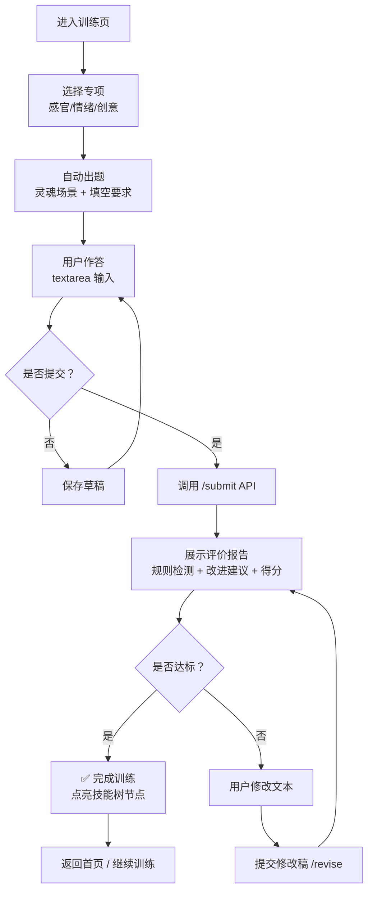

> **文档版本**：1.0
> **日期**：2026-07-21
> **产品名称**：WriteTrainer
> **技术栈**：Vue 3 + Vite + TypeScript + Pinia + Element Plus


## 一、文档概述

### 1.1 设计目标

本文档为 **WriteTrainer**（写作训练 AI 助手）V1.0 MVP 版本提供完整的前端原型设计方案。核心目标是交付一套 **可直接用于开发** 的 UI/UX 规格说明，覆盖从“获取题目”到“完成训练”的完整闭环。

### 1.2 设计原则

| 原则 | 说明 | 体现 |
| :--- | :--- | :--- |
| **宁静专注** | 写作训练需要高度专注，界面应克制、不干扰 | 大面积留白，减少装饰性元素 |
| **清晰反馈** | 用户每一步操作都能获得确定性回应 | 规则检测结果用「通过/不通过」明确展示，避免模糊打分 |
| **进步可视化** | 让用户感知到成长，建立长期留存 | 技能树、段位、黑历史对比（V1.5） |
| **移动友好** | 支持碎片化训练场景 | 响应式布局，适配平板与手机 |

### 1.3 设计交付物

| 交付物 | 说明 |
| :--- | :--- |
| 页面原型（本文件） | 完整页面布局、组件规格、交互说明 |
| 视觉规范 | 色彩、字体、间距、图标体系 |
| 组件库指引 | Element Plus 定制主题方案 |
| 交互原型图 | 用户操作流程图（附 Mermaid 图） |


## 二、技术栈

| 类别 | 技术 | 版本 | 说明 |
| :--- | :--- | :--- | :--- |
| 框架 | Vue | 3.4.x | Composition API + `<script setup>` |
| 构建工具 | Vite | 5.x | 快速启动，HMR 支持 |
| 语言 | TypeScript | 5.x | 全栈类型安全，与后端 DTO 共享类型 |
| 路由 | Vue Router | 4.x | 懒加载、路由守卫 |
| 状态管理 | Pinia | 2.x | 模块化 Store，持久化插件 |
| UI 组件库 | Element Plus | 2.7.x | 按需加载，定制主题 |
| 样式方案 | Tailwind CSS | 3.4.x | 原子化 CSS + SCSS 变量 |
| HTTP 请求 | Axios | 1.6.x | 拦截器、请求取消 |
| 可视化 | ECharts | 5.4.x | 雷达图、进度图表 |
| 富文本编辑 | 原生 textarea | — | V1.0 轻量需求，V2.0 引入 Markdown |


## 三、设计系统（Design System）

### 3.1 品牌标识

```
WRITETRAINER
品牌色：#2563EB（信任蓝）+ #F97316（进步橙）
品牌口号：Train Your Writing. Not Write For You.
```

### 3.2 色彩体系

| 色彩角色 | 色值 | 用途 |
| :--- | :--- | :--- |
| **主色（Primary）** | `#2563EB` | 按钮、链接、活跃状态 |
| **主色悬浮** | `#1D4ED8` | Hover 状态 |
| **成功（Success）** | `#10B981` | 规则通过、完成状态 |
| **警告（Warning）** | `#F59E0B` | 需改进、提醒 |
| **危险（Danger）** | `#EF4444` | 违规、错误 |
| **背景（Bg）** | `#F8FAFC` | 页面主背景 |
| **卡片（Card）** | `#FFFFFF` | 内容区域 |
| **文字主色** | `#1E293B` | 标题、正文 |
| **文字辅助** | `#64748B` | 提示、辅助信息 |

### 3.3 字体与排版

| 层级 | 字号 | 行高 | 字重 | 用途 |
| :--- | :--- | :--- | :--- | :--- |
| H1 | 28px | 36px | 700 | 页面标题 |
| H2 | 22px | 30px | 600 | 区块标题 |
| H3 | 18px | 26px | 600 | 卡片标题 |
| Body | 16px | 24px | 400 | 正文 |
| Small | 14px | 20px | 400 | 辅助信息、标签 |
| Caption | 12px | 16px | 400 | 极小的标注 |

**字体栈**：`Inter, -apple-system, BlinkMacSystemFont, 'Segoe UI', Roboto, 'Helvetica Neue', sans-serif`

### 3.4 间距系统

基于 4px 网格：`4, 8, 12, 16, 20, 24, 32, 40, 48, 64, 80`


## 四、信息架构与路由

### 4.1 路由映射

| 路径 | 页面 | 权限 | 说明 |
| :--- | :--- | :--- | :--- |
| `/login` | 登录页 | 公开 | 邮箱/密码登录 |
| `/register` | 注册页 | 公开 | 新用户注册 |
| `/` | 首页 | 需登录 | 仪表盘、进度概览 |
| `/training` | 训练核心页 | 需登录 | 题目→作答→评价闭环 |
| `/progress` | 进度页 | 需登录 | 技能树、历史记录、段位 |
| `/knowledge` | 知识库 | 需登录 | 观察提示卡检索 |
| `/profile` | 个人设置 | 需登录 | 个人信息、账号设置 |
| `/community` | 共修训练营 | 需登录（V1.5） | 作品匿名分享（V1.0 预留路由） |

### 4.2 布局结构（登录后）

```
┌──────────────────────────────────────────────────────────────┐
│  🖊️ WriteTrainer  技能树  训练  知识库  社区(预留)  👤头像  │  ← 顶部导航
├──────────────────────────────────────────────────────────────┤
│                                                              │
│                     页面内容区域                              │  ← Router View
│                                                              │
│                                                              │
└──────────────────────────────────────────────────────────────┘
```

> **V1.0 采用顶部导航方案**（而非侧边栏），更适配写作场景的宽幅阅读区。


## 五、交互流程设计

### 5.1 核心闭环：训练流程



### 5.2 用户操作状态机

| 状态 | 界面表现 | 可用操作 |
| :--- | :--- | :--- |
| **空闲（待出题）** | 显示专项选择卡片 | 点击选择专项 |
| **答题中** | 显示题目 + 可编辑文本框 | 输入、保存草稿、提交 |
| **评价中** | 遮罩 + Loading 动画 | 等待（不可操作） |
| **评价完成（达标）** | 显示评价报告 + ✅ 完成按钮 | 完成、查看提示 |
| **评价完成（未达标）** | 显示评价报告 + ✏️ 修改按钮 | 修改文本、再次提交 |


## 六、页面详细设计

### 6.1 首页（Home）

**功能**：进度总览 + 快捷入口 + 推荐任务

```
┌────────────────────────────────────────────────────────────────┐
│  👋 欢迎回来，张三                   今日训练：2/5 已完成    │
│  段位：见习写手  ·  累计训练：12 次  ·  连训：5 天         │
├────────────────────────────────────────────────────────────────┤
│                                                                │
│  ┌──────────────┐  ┌──────────────┐  ┌──────────────┐       │
│  │  📊 能力雷达  │  │  🎯 今日推荐  │  │  🌱 快速开始  │       │
│  │  (五力维度图) │  │  情绪传递力   │  │  [继续训练]  │       │
│  │              │  │  Lv.0-1      │  │  [新训练]    │       │
│  │              │  │  进度 60%    │  │              │       │
│  └──────────────┘  └──────────────┘  └──────────────┘       │
│                                                                │
│  ─── 技能树（个人进度） ─────────────────────────────────────  │
│  ┌─────────────────────────────────────────────────────────┐ │
│  │  基础层         结构层         技巧层                │ │
│  │  ✅ 完整故事    ⬜ 起承转合    ⬜ 行为折射情绪      │ │
│  │  ✅ 情绪识别    ⬜ 因果链      ⬜ 环境烘托          │ │
│  └─────────────────────────────────────────────────────────┘ │
│                                                                │
│  📈 近期待办：感官编码力专项训练 · 完成 3/5                  │
└────────────────────────────────────────────────────────────────┘
```

### 6.2 训练核心页（Training）- **最核心页面**

**功能**：完整的“出题→作答→评价→修改”闭环

```
┌────────────────────────────────────────────────────────────────┐
│  ← 返回         感官编码力 · Lv.0-1              进度: 2/5   │
├────────────────────────────────────────────────────────────────┤
│  ┌─────────────────────────────────────────────────────────┐ │
│  │ 📝 题目                                                │ │
│  │ ─────────────────────────────────────────────────────── │ │
│  │ 【灵魂场景】                                            │ │
│  │ 深夜便利店，一个穿西装的中年男人在买烟。                │ │
│  │ 他刚被公司辞退，不想让任何人知道。                     │ │
│  │ 收银员认出了他，说：“王总，好久不见啊。”              │ │
│  │                                                        │ │
│  │ 【训练要求】                                            │ │
│  │ 请完成以下填空：                                        │ │
│  │ 他得知落选的消息，感觉心里________（具体感觉）          │ │
│  │ 他________（具体动作），然后________（具体动作）。      │ │
│  │                                                        │ │
│  │ [💡 查看观察提示]  [📖 查看范例]                      │ │
│  └─────────────────────────────────────────────────────────┘ │
│                                                                │
│  ✍️ 你的回答                                                  │
│  ┌─────────────────────────────────────────────────────────┐ │
│  │ 他得知落选的消息，感觉心里像塞了一团湿棉花，          │ │
│  │ 把手机屏幕朝下扣在桌上，然后盯着窗外的雨发了很久的呆。│ │
│  │                                                        │ │
│  │                                    字数：32/200         │ │
│  └─────────────────────────────────────────────────────────┘ │
│                                                                │
│       [💾 保存草稿]         [📤 提交训练]                    │
│                                                                │
│  ─── 📊 评价反馈 ─────────────────────────────────────────── │
│  ┌─────────────────────────────────────────────────────────┐ │
│  │  ✅ 规则检测：通过  │  行为词：3 个  │  通顺度：良好  │ │
│  │                                                        │ │
│  │  💬 改进建议：                                         │ │
│  │  1. “目光偏移”和“喉结滑动”都在传递“回避”，          │ │
│  │     建议合二为一，用一个更具体的动作。                 │ │
│  │  2. 尝试加入一个触觉细节，让场景更立体。               │ │
│  │                                                        │ │
│  │  📚 观察提示：人在羞耻时，肩膀和呼吸节奏会有什么变化？ │ │
│  │                                                        │ │
│  │  ✨ 你已经能做到在不用心理词的情况下传递情绪，很棒！   │ │
│  │                                                        │ │
│  │  综合评分：7/10  (达标线: 7/10)                        │ │
│  │                                                        │ │
│  │   [✏️ 修改再提交]     [✅ 完成训练]                    │ │
│  └─────────────────────────────────────────────────────────┘ │
└────────────────────────────────────────────────────────────────┘
```

### 6.3 进度页（Progress）

**功能**：技能树可视化 + 训练历史 + 成就展示

```
┌────────────────────────────────────────────────────────────────┐
│  📈 我的写作成长之路                                          │
├────────────────────────────────────────────────────────────────┤
│  段位：入门作者  ·  累计训练：12 次  ·  完成微故事：3 个    │
│                                                                │
│  ─── 🌱 技能树 ────────────────────────────────────────────── │
│  ┌─────────────────────────────────────────────────────────┐ │
│  │  [基础层]        [结构层]        [技巧层]           │ │
│  │  ① 完整故事 ✅    ④ 起承转合 ⬜    ⑦ 行为折射 ⬜     │ │
│  │  ② 情绪识别 ✅    ⑤ 因果链 ⬜      ⑧ 环境烘托 ⬜     │ │
│  │  ③ 感官观察 ✅    ⑥ 八步法 ⬜      ⑨ 潜台词 ⬜       │ │
│  └─────────────────────────────────────────────────────────┘ │
│                                                                │
│  ─── 📋 训练历史 ──────────────────────────────────────────── │
│  ┌─────────────────────────────────────────────────────────┐ │
│  │  7/20  情绪传递力 · 羞耻场景  评分 8/10  ✅ 完成     │ │
│  │  7/18  感官编码力 · 视觉描写  评分 6/10  🔄 修改中   │ │
│  │  7/15  创意生成力 · LOCK填空  评分 9/10  ✅ 完成     │ │
│  └─────────────────────────────────────────────────────────┘ │
│                                                                │
│  🏆 成就墙                                                   │
│  [🎖️ 初次完成] [🎖️ 三连击] [🎖️ 见习写手] [🔒 专业作者]    │
└────────────────────────────────────────────────────────────────┘
```

### 6.4 知识库页（Knowledge）

**功能**：观察提示卡检索与浏览

```
┌────────────────────────────────────────────────────────────────┐
│  📚 知识库 · 观察提示卡                                       │
├────────────────────────────────────────────────────────────────┤
│  [🔍 搜索...]  专项：全部 ▼  等级：全部 ▼                    │
│                                                                │
│  ┌─────────────────────────────────────────────────────────┐ │
│  │ 📌 观察提示：羞耻时的身体反应                        │ │
│  │ 人在羞耻时，除了喉部和手部，肩膀和呼吸节奏会有什么变化？│ │
│  │ 标签：行为观察 · 羞耻 · Lv.0-1                       │ │
│  └─────────────────────────────────────────────────────────┘ │
│  ┌─────────────────────────────────────────────────────────┐ │
│  │ 📌 观察提示：紧张时的下意识动作                      │ │
│  │ 人在紧张时，手部会有什么不自觉的动作？目光会看向哪里？│ │
│  │ 标签：行为观察 · 紧张 · Lv.0-1                       │ │
│  └─────────────────────────────────────────────────────────┘ │
│  ┌─────────────────────────────────────────────────────────┐ │
│  │ 📌 范例赏析：海明威《白象似的群山》对话场景          │ │
│  │ 分析：情绪如何隐藏在对话和动作之间？                 │ │
│  │ 标签：情绪传递 · 对话 · Lv.2-3                       │ │
│  └─────────────────────────────────────────────────────────┘ │
└────────────────────────────────────────────────────────────────┘
```


## 七、核心组件规格（TypeScript）

### 7.1 训练核心组件

**QuestionCard.vue**
```typescript
// Props
interface Props {
  question: {
    id: string
    skill: string          // 专项名称：'感官编码力' | '情绪传递力' | '创意生成力'
    level: string          // 'Lv.0-1'
    category: string       // 情绪分类或感官分类
    scene: string          // 灵魂场景
    requirements: string   // 训练要求
    knowledgeHints: string[] // 观察提示列表
  }
  loading?: boolean
}

// Events
interface Emits {
  (e: 'viewHint', hint: string): void
  (e: 'viewExample'): void
}
```

**AnswerArea.vue**
```typescript
// Props
interface Props {
  modelValue: string
  placeholder?: string
  minLength?: number
  maxLength?: number   // Lv.0-1 微故事 200-500 字
  disabled?: boolean
}

// Events
interface Emits {
  (e: 'update:modelValue', value: string): void
  (e: 'submit'): void
  (e: 'saveDraft'): void
}

// Expose (供父组件调用)
interface Expose {
  focus(): void
  clear(): void
}
```

**EvaluationReport.vue**
```typescript
// Props
interface Props {
  evaluation: {
    rulePass: boolean
    psychWordCount: number
    actionWordCount: number
    readability: '良好' | '一般' | '待改进'
    suggestions: string[]
    hint?: string
    encouragement: string
    score: number        // 0-10
    passed: boolean      // score >= 7.0
  }
  allowRevise?: boolean
}

// Events
interface Emits {
  (e: 'revise'): void
  (e: 'complete'): void
  (e: 'viewKnowledge', hintId: string): void
}
```

### 7.2 进度组件

**SkillTree.vue**
```typescript
// Props
interface Props {
  levels: Array<{
    name: string
    skills: Array<{
      id: string
      label: string
      unlocked: boolean
      progress?: number   // 0-100, 用于“点亮中”状态
    }>
  }>
}

// 示例数据
const skillTreeData: Props['levels'] = [
  {
    name: '基础层',
    skills: [
      { id: 'story', label: '能写出完整故事', unlocked: true },
      { id: 'emotion', label: '情绪可被识别', unlocked: true },
      { id: 'sensory', label: '感官观察入门', unlocked: false, progress: 60 }
    ]
  },
  // ...
]
```

**RadarChart.vue**（基于 ECharts）
```typescript
// Props
interface Props {
  data: {
    sensory: number    // 0-100
    emotion: number
    logic: number
    expression: number
    creativity: number
  }
  showLegend?: boolean
}
```

### 7.3 通用组件

**AppHeader.vue**
```typescript
// Props
interface Props {
  username: string
  level: string
  avatar?: string
}

// Events
interface Emits {
  (e: 'logout'): void
}
```

**LoadingOverlay.vue**
```typescript
// Props
interface Props {
  loading: boolean
  text?: string   // 如 "AI 正在评价中..."
}
```


## 八、状态管理（Pinia Store）

### 8.1 训练 Store

```typescript
// stores/training.ts
import { defineStore } from 'pinia'
import { getQuestion, submitAnswer, reviseAnswer } from '@/api/training'

interface TrainingState {
  currentQuestion: Question | null
  sessionId: string | null
  currentSkill: string
  currentLevel: string
  history: Array<{
    answer: string
    evaluation: Evaluation
    timestamp: Date
  }>
  isSubmitting: boolean
}

export const useTrainingStore = defineStore('training', {
  state: (): TrainingState => ({
    currentQuestion: null,
    sessionId: null,
    currentSkill: '感官编码力',
    currentLevel: 'Lv.0-1',
    history: [],
    isSubmitting: false
  }),
  getters: {
    isTrainingActive: (state) => state.currentQuestion !== null,
    hasHistory: (state) => state.history.length > 0
  },
  actions: {
    async fetchQuestion(skill: string, level: string = 'Lv.0-1') {
      const res = await getQuestion({ skill, level })
      this.currentQuestion = res.data
      this.sessionId = res.sessionId
      this.currentSkill = skill
      this.currentLevel = level
    },
    async submitAnswer(answer: string) {
      this.isSubmitting = true
      try {
        const res = await submitAnswer({
          sessionId: this.sessionId!,
          answer
        })
        this.history.push({
          answer,
          evaluation: res.evaluation,
          timestamp: new Date()
        })
        return res.evaluation
      } finally {
        this.isSubmitting = false
      }
    },
    async reviseAnswer(answer: string) {
      // 类似 submit，但调用 /revise 接口
    },
    reset() {
      this.currentQuestion = null
      this.sessionId = null
      this.history = []
    }
  }
})
```

### 8.2 用户 Store

```typescript
// stores/user.ts
import { defineStore } from 'pinia'

interface UserState {
  id: string
  username: string
  email: string
  level: string      // 'Lv.0-1' | 'Lv.2-3' | ...
  rank: string       // '见习写手' | '入门作者' | ...
  profile: {
    sensoryScore: number
    emotionScore: number
    logicScore: number
    expressionScore: number
    creativityScore: number
  }
  skillTree: any     // 技能树数据
  stats: {
    totalSessions: number
    completedStories: number
    consecutiveDays: number
  }
}

export const useUserStore = defineStore('user', {
  state: (): UserState => ({
    id: '',
    username: '',
    email: '',
    level: 'Lv.0-1',
    rank: '见习写手',
    profile: { sensoryScore: 0, emotionScore: 0, logicScore: 0, expressionScore: 0, creativityScore: 0 },
    skillTree: null,
    stats: { totalSessions: 0, completedStories: 0, consecutiveDays: 0 }
  }),
  actions: {
    async fetchProfile() {
      // 调用 /user/profile
    },
    async updateProgress() {
      // 训练完成后刷新
    }
  }
})
```


## 九、API 服务层

### 9.1 Axios 配置

```typescript
// api/index.ts
import axios, { AxiosInstance, AxiosRequestConfig } from 'axios'
import { ElMessage } from 'element-plus'

const service: AxiosInstance = axios.create({
  baseURL: import.meta.env.VITE_API_BASE_URL || '/api/v1',
  timeout: 15000,
  headers: { 'Content-Type': 'application/json' }
})

// 请求拦截器
service.interceptors.request.use(
  config => {
    const token = localStorage.getItem('token')
    if (token) config.headers.Authorization = `Bearer ${token}`
    return config
  },
  error => Promise.reject(error)
)

// 响应拦截器
service.interceptors.response.use(
  response => {
    const res = response.data
    if (res.code !== 0) {
      ElMessage.error(res.message || '请求失败')
      return Promise.reject(res)
    }
    return res.data
  },
  error => {
    if (error.response?.status === 401) {
      // 跳转登录
    }
    ElMessage.error(error.message || '网络错误')
    return Promise.reject(error)
  }
)

export default service
```

### 9.2 类型定义（与后端共享）

```typescript
// api/types.ts
export interface Question {
  id: string
  skill: '感官编码力' | '情绪传递力' | '创意生成力'
  level: 'Lv.0-1' | 'Lv.2-3' | 'Lv.4-5'
  category: string
  scene: string
  requirements: string
  knowledgeHints: string[]
}

export interface Evaluation {
  rulePass: boolean
  psychWordCount: number
  actionWordCount: number
  readability: '良好' | '一般' | '待改进'
  suggestions: string[]
  hint?: string
  encouragement: string
  score: number
  passed: boolean
}

export interface SubmitResponse {
  sessionId: string
  evaluation: Evaluation
}

export interface UserProfile {
  id: string
  username: string
  email: string
  level: string
  rank: string
  profile: {
    sensoryScore: number
    emotionScore: number
    logicScore: number
    expressionScore: number
    creativityScore: number
  }
  stats: {
    totalSessions: number
    completedStories: number
    consecutiveDays: number
  }
}
```

### 9.3 API 接口

```typescript
// api/training.ts
import service from './index'
import type { Question, SubmitResponse, Evaluation } from './types'

// 获取题目
export const getQuestion = (params: { skill: string; level?: string }) =>
  service.get<{ sessionId: string; data: Question }>('/training/question', { params })

// 提交答案
export const submitAnswer = (data: { sessionId: string; answer: string }) =>
  service.post<SubmitResponse>('/training/submit', data)

// 提交修改稿
export const reviseAnswer = (data: { sessionId: string; answer: string }) =>
  service.post<SubmitResponse>('/training/revise', data)

// 获取评价（用于恢复状态）
export const getEvaluation = (sessionId: string) =>
  service.get<Evaluation>(`/training/evaluation/${sessionId}`)
```

```typescript
// api/user.ts
import service from './index'
import type { UserProfile } from './types'

export const getProfile = () => service.get<UserProfile>('/user/profile')
export const getProgress = () => service.get('/user/progress')
export const updateProfile = (data: Partial<UserProfile>) =>
  service.patch('/user/profile', data)
```

```typescript
// api/knowledge.ts
import service from './index'

export const searchKnowledge = (params: { keyword?: string; skill?: string; level?: string }) =>
  service.get('/knowledge/search', { params })
```


## 十、开发环境配置

### 10.1 `.env.development`

```env
VITE_API_BASE_URL=http://localhost:8080/api/v1
VITE_WS_URL=ws://localhost:8080/ws
```

### 10.2 `vite.config.ts`

```typescript
import { defineConfig } from 'vite'
import vue from '@vitejs/plugin-vue'
import path from 'path'

export default defineConfig({
  plugins: [vue()],
  resolve: {
    alias: {
      '@': path.resolve(__dirname, 'src')
    }
  },
  server: {
    port: 5173,
    proxy: {
      '/api': {
        target: 'http://localhost:8080',
        changeOrigin: true
      }
    }
  },
  css: {
    preprocessorOptions: {
      scss: {
        additionalData: `@use "@/styles/variables.scss" as *;`
      }
    }
  }
})
```

### 10.3 `package.json` 主要脚本

```json
{
  "scripts": {
    "dev": "vite",
    "build": "vue-tsc --noEmit && vite build",
    "preview": "vite preview",
    "lint": "eslint . --ext .vue,.ts"
  }
}
```


## 十一、响应式策略

| 断点 | 宽度 | 布局策略 |
| :--- | :--- | :--- |
| 桌面端 | ≥1024px | 完整布局，顶部导航 + 宽幅内容区 |
| 平板端 | 768-1023px | 导航折叠为汉堡菜单，卡片两列布局 |
| 移动端 | <768px | 全屏沉浸式训练模式，单列卡片，字体保持 16px 以上 |

**移动端训练页特别优化**：
- 题目和回答区垂直堆叠，全屏宽度
- 评价报告可收起/展开
- 底部固定操作栏（提交/修改按钮）


## 十二、性能优化策略

| 优化项 | 方案 |
| :--- | :--- |
| **路由懒加载** | `() => import('@/views/Training.vue')` |
| **组件按需加载** | Element Plus 按需导入（`unplugin-vue-components`） |
| **图表按需加载** | ECharts 按需导入，避免全量包 |
| **防抖/节流** | 提交按钮防抖（`lodash-es/debounce`） |
| **虚拟滚动** | V1.0 训练历史数量有限，V2.0 引入 `vue-virtual-scroller` |
| **缓存策略** | Pinia 持久化（`pinia-plugin-persistedstate`） |


## 十三、后续版本迭代规划

| 版本 | 前端新增功能 |
| :--- | :--- |
| **V1.5** | WebSocket 流式评价推送、黑历史对比、共修训练营（基础版） |
| **V2.0** | Markdown 富文本编辑器（支持格式化）、作品集展示、七要素自检清单交互 |
| **V2.5** | 社区评论互动、自定义训练计划、多语言支持 |


## 十四、附录：UI 原型参考图（文字描述）

由于无法直接生成图片，以下为关键页面的视觉描述供 UI 设计师参考：

| 页面 | 视觉风格描述 |
| :--- | :--- |
| **首页** | 顶部为欢迎横幅+段位徽章；中间三列卡片（雷达图/推荐/快捷入口）；底部为横向技能树（卡片式节点，已解锁显示渐变蓝勾，解锁中显示进度环）。 |
| **训练页** | 卡片式布局，题目卡带浅灰底纹边框，回答区为白底大文本框（圆角12px，带字数统计）；评价报告带彩色状态标签（绿色通过/橙色待改进），建议列表带序号圆点。 |
| **进度页** | 顶部段位进度条；技能树采用“从左到右”的流程图风格，用虚线连接节点；历史记录表格化，带评分星级。 |


## 十五、总结

本前端原型设计文档覆盖了 WriteTrainer V1.0 MVP 的 **完整开发规格**，包括：

| 维度 | 交付物 |
| :--- | :--- |
| **设计系统** | 色彩、字体、间距、品牌规范 |
| **信息架构** | 5 个核心页面 + 路由映射 |
| **交互流程** | 训练闭环状态机 + Mermaid 流程图 |
| **组件规格** | 7 个核心组件的 TypeScript 接口定义 |
| **状态管理** | 2 个 Pinia Store（training + user）完整实现 |
| **API 层** | Axios 配置 + 完整类型定义 + 接口封装 |
| **工程化** | Vite 配置、环境变量、响应式断点、性能优化 |

前端团队可依据本文档直接启动开发，无需额外设计猜测。所有类型定义与后端接口契约对齐，确保前后端联调的顺畅性。

