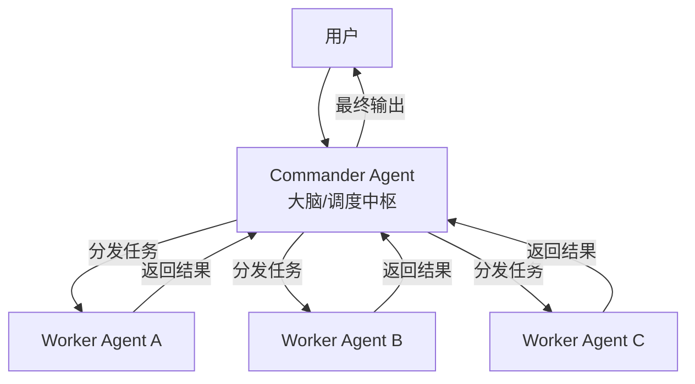

> 本文以费曼学习法（复杂概念→简化讲解→复述输出→简化迭代）为方法论，以第一性原理（回归事物本源、从根本原理出发推演）为思维框架，系统解析AI Agent多智能体技术栈。目标：帮助读者从“会用”到“懂其所以然”，达到专家级认知水平。
>
> ⚠️ **时效性提醒**：本文基于Spring AI Alibaba v1.1.2.0（2026年2月发布）及v1.1.2.2（2026年3月），A2A协议1.0规范。相关技术和API仍在快速演进，请以官方文档和源代码仓库的最新内容为准。建议定期查阅Spring AI Alibaba GitHub Releases（https://github.com/alibaba/spring-ai-alibaba）以及A2A Java SDK（https://github.com/lf-ai-data/a2a-java-sdk）。如需术语速查，可使用浏览器页面搜索功能。

## 一、从“全能上帝”到“专家团队”：AI Agent的核心演进逻辑

### 1.1 第一性原理：为什么需要多智能体？

回到最根本的问题：**我们想要AI解决什么问题？** —— 现实世界的问题很少由单一智能体独立完成。大型软件系统由团队构建，科学发现源自协作，企业靠专业部门围绕共同目标协调运作。AI的下一个重要转变遵循同样的组织原则：**智能通过协调扩展比单纯依靠集中化更有效**。

在AI Agent发展的早期，我们倾向于构建一个全能的“上帝智能体”，给它挂载无数工具、塞入海量上下文。但工程实践中暴露了著名的 **“能力崩塌效应”** ：当一个Agent被要求同时扮演程序员、产品经理和测试人员时，表现往往不如三个独立Agent各司其职。

用费曼学习法理解：
- **单体Agent** → 就像一个拿着瑞士军刀的通才，什么都能干一点，但遇到复杂手术就束手无策
- **多智能体系统** → 就像一个配备了主刀医生、麻醉师和护士的手术团队，通过精密协作完成高难度任务

### 1.2 架构演进三阶段

AI从静态响应到协作系统的跃迁经历了三个阶段：
1. **静态响应**：单一大模型根据输入生成文本
2. **自动执行**：Agent可调用工具、插件、外部API
3. **协作系统**：多Agent通过统一框架协同完成复杂任务

### 1.3 核心架构设计元素

设计多智能体系统，本质上是在设计数字化组织的管理模式，需要解决三个核心问题：

**角色定义（Role）** ：每一个Agent应有极其狭窄但深度的System Prompt。常见的专门化角色包括：
- **Planner（规划者）** ：不直接执行，只负责将模糊的用户需求拆解为结构化任务列表
- **Executor（执行者）** ：专注于特定领域任务，如PythonCoder、WebSearcher
- **Critic（审查者）** ：负责质量保证，不生产内容只挑刺

**沟通拓扑结构**：Agent之间如何通信？常见三种模式：
- **流水线模式**：A → B → C，适用于确定性极强的任务
- **中心化模式（Hub-and-Spoke）** ：以Manager Agent为中心分发任务，适用于复杂全局统筹
- **去中心化模式（Mesh/Swarm）** ：Agent之间自由广播消息，谁能解决谁响应

**共享记忆（Shared Memory）** ：多个Agent如何同步信息？仅靠对话历史容易超出Token限制。工程解法是引入 **“黑板模式”** ——建立一个全局共享的数据库或状态机，所有Agent从黑板上读取当前进度，并将产出写回黑板。**分布式环境下的实现**：可使用Redis、MySQL或内存网格（如Hazelcast）作为共享存储；Spring AI Alibaba未内置分布式黑板，需自行集成。

**分布式黑板实现示例（Redis）**：
```java
@Component
public class RedisSaver implements Saver {  // Saver为Spring AI Alibaba的持久化接口
    private final RedisTemplate<String, Object> redis;
    @Override
    public void save(String key, Object value) {
        redis.opsForValue().set(key, value, Duration.ofHours(1));
    }
    @Override
    public Object load(String key) {
        return redis.opsForValue().get(key);
    }
}
// 在Agent中使用
agent.setSaver(redisSaver);
```

## 二、A2A协议：Agent之间的“TCP/IP”

> **说明**：本章整合了原第八章MCP关系内容，避免重复。

### 2.1 第一性原理：Agent之间为什么需要统一协议？

如果说多智能体系统是“组织架构”设计，那么A2A协议就是智能体之间的**通信标准**。

想象一个场景：支付Agent（支付团队开发）需要调用搜索Agent（搜索团队开发），它们可能使用不同框架、不同编程语言、部署在不同服务器上。如果没有统一协议，每个接口都需要定制，协作成本随Agent数量指数级增长。

A2A（Agent2Agent）协议正是为解决这个问题而生。**溯源**：该协议由Google于2025年4月首次推出，随后于2025年6月捐赠给了Linux Foundation的LF AI & Data，以确保供应商中立治理。2025年8月，IBM的Agent Communication Protocol（ACP）正式并入A2A，原ACP负责人加入A2A技术指导委员会（TSC），ATC由Google、Microsoft、AWS、Cisco、Salesforce、ServiceNow、SAP和IBM八家企业代表组成。ACP的开发已逐步停止，新项目应直接使用A2A。A2A目前已有超过150家科技公司参与和支持。A2A为Agent提供标准化的通信基础：互发现、任务委派、状态同步和协作。

### 2.2 A2A协议核心概念

用费曼学习法理解A2A的核心组件：

| 概念 | 类比 | 说明 |
|------|------|------|
| **Agent Card** | 名片/商品说明书 | JSON格式的元数据文件，描述Agent的能力、技能、端点URL。客户端通过它发现Agent。在A2A 1.0规范中，AgentCard使用`supportedInterfaces`列表替代0.x版本的独立字段，使协议绑定更加灵活 |
| **A2A Server** | 对外服务窗口 | 暴露HTTP端点的Agent，接收请求并管理任务执行 |
| **A2A Client** | 服务调用方 | 使用A2A服务的应用程序或其他Agent |
| **Task** | 工作任务单 | 核心工作单元，有唯一ID和生命周期状态（submitted→working→completed→failed），支持长时间运行的异步任务 |
| **Message** | 对话消息 | 客户端（role:"user"）和Agent（role:"agent"）之间的通信轮次 |

> **补充**：AgentCard是协议的中立实体，被IETF作为独立的Internet-Draft进行标准化讨论，与A2A协议分离，体现了两者正交的设计理念。

### 2.3 A2A设计五原则

1. **拥抱代理能力**：即使不共享内存、工具和上下文，也能自然协作
2. **基于现有标准**：基于HTTP、SSE、JSON-RPC等流行标准，便于与现有IT栈集成。A2A 1.0规范采用Protocol Buffer至JSON的严格序列化规则，所有字段名必须使用驼峰命名法（如`context_id`→`contextId`）
3. **默认安全**：支持企业级身份认证（如OAuth 2.1）和授权。A2A 1.0引入了Agent Card的JWS签名机制，防止卡片被篡改或伪造
4. **支持长时间运行的任务**：从快速任务到可能需要数小时的研究任务
5. **与模态无关**：支持文本、音频、视频等流媒体

### 2.4 A2A与MCP的关系：垂直与水平的分工

这是初学者最容易混淆的概念。用第一性原理区分：
- **MCP（Model Context Protocol）** ：解决的是**垂直问题**——Agent与工具之间的通信。标准化了AI模型连接到外部工具、API和数据资源
- **A2A**：解决的是**水平问题**——Agent与Agent之间的通信。标准化了异构Agent如何发现、委派任务、交换信息

二者不是竞争关系，而是**互补协议**：**A2A专注于Agent间的水平协作，MCP专注于Agent与工具的垂直交互**。复杂的Agent系统中，Agent使用A2A协调其他Agent，同时使用MCP与其工具交互。

MCP于2025年12月被Anthropic捐赠给Linux Foundation，成立Agentic AI Foundation（AAIF）作为治理主体。至2026年4月时已超过10,000个公开服务器和每月9,700万SDK下载量。MCP与A2A在Linux Foundation的LF AI & Data下统一管理。

MCP与A2A的详细对比见下表：

| 维度 | MCP | A2A |
|------|-----|-----|
| **目的** | 模型↔工具接口 | 代理↔代理接口 |
| **关注焦点** | 工具访问、上下文连接 | 发现、委派、协作 |
| **标准化主体** | Anthropic → Linux Foundation（2025年12月） | Google → Linux Foundation（2025年6月） |
| **关键概念** | Tool、Resource、Server | AgentCard、Task、AgentSkill |
| **通信方式** | JSON-RPC over HTTP/WebSocket | HTTP/SSE、JSON-RPC |

> **关于ACP**：IBM的Agent Communication Protocol（ACP）已正式并入A2A协议，ACP的开发已逐步停止，新项目应直接使用A2A。

## 三、Spring AI Alibaba：Java生态的Agentic AI Framework

### 3.1 框架定位

Spring AI Alibaba是构建Agent智能体应用的最简方式，只需不到10行代码即可构建智能体应用。Spring AI Alibaba基于Spring AI构建，在1.1.2.0版本中已实现与DashScope深度集成、Agent Framework + Graph + Multi-agent + A2A + MCP + 可视化调试的一整套框架体系。1.1.2.0正式版发布于2026年2月，底层Spring AI升级至1.1.2。

> **注**：Spring AI Alibaba的ReactAgent运行在Graph Runtime之上，主要用于工作流和多智能体编排。如果寻找更先进的ReAct范式实现，可关注`agentscope-java`项目。

### 3.2 三层架构（第一性原理分析）

Spring AI Alibaba从架构上分为三层：

- **Augmented LLM层**：以Spring AI框架底层原子抽象为基础，提供Model、Tool、MCP、Message、Vector Store等基础抽象——**让Java开发者能用统一接口对接各种大模型**
- **Graph层**：低级别的工作流和多代理协调框架，具备丰富的预置节点和简化的图状态定义，是Agent Framework的底层运行时基座——**解决“如何让多个Agent协作”的编排层**
- **Agent Framework层**：以**多智能体协作模式与上下文工程**为理念核心，包含ReactAgent、SequentialAgent、ParallelAgent、LlmRoutingAgent、LoopAgent等预置Multi-agent模式，叠加**工具调用**（tool-calling）与**交接**（handoffs）两种核心Agent协作模式——**解决“如何定义和执行Agent”的应用层**

### 3.3 ReactAgent：ReAct范式执行体

ReactAgent遵循 **ReAct（推理+行动）范式**，用于迭代解决问题：

```
Thought（思考）：我现在需要做什么？
Action（行动）：调用某个工具/API/函数
Observation（观察）：工具返回了什么结果？
→ 继续思考 → 继续行动 → 直到目标达成
```

**ReactAgent与Graph的关系**：ReactAgent内部构建了一个包含`think`、`act`、`observe`节点的子图。当调用`agent.call(input)`时，Graph运行时反复执行该子图直到输出最终结果或达到最大迭代次数。这使得ReAct循环可以被Graph的调试、状态持久化、条件分支等能力增强。

### 3.4 内置多智能体编排模式

Spring AI Alibaba预置了多种Multi-agent基础工作流模式：

| 模式 | 工作原理 | 适用场景 | ⚠️ 不适用场景 |
|------|---------|---------|-------------|
| **SequentialAgent** | Agent链式执行，输出作为下一个输入 | 代码写作→审查→文档生成的流水线 | 步骤间有复杂依赖或条件分支 |
| **ParallelAgent** | 多个Agent并发执行后合并结果 | 从不同角度分析同一问题 | 任务间有状态依赖 |
| **LlmRoutingAgent** | 根据输入动态路由到相应Agent，可一次选择多个子智能体并行执行 | 意图识别后的任务分发、多领域并行查询 | 路由决策需要精确规则而非LLM判断 |
| **LoopAgent** | 循环执行直到条件满足 | 多轮迭代优化 | 循环次数不可预测且无终止条件 |

> **关于SupervisorAgent**：在1.1.2.1版本中已被弃用。官方推荐使用**指挥官模式**自行构建（详见第五章），或结合`LlmRoutingAgent`与`Handoffs`实现监督式路由。

### 3.5 Graph工作流核心能力

Spring AI Alibaba的Graph层来源于LangGraph设计理念，在Java生态中进行了深度优化，提供了精细的多智能体工作流协调机制：

- **并行节点与并行边**：Graph支持并行条件边（`addParallelConditionalEdges`）
- **并行聚合策略**：支持**AllOf**（等待所有并行任务完成后再合并）和**AnyOf**（任一任务完成即合并）两种策略汇总结果。**异常处理**：AllOf策略下，若任一子任务抛出异常，整体工作流默认快速失败，可通过自定义`merge`函数实现部分成功（例如跳过失败任务）。
- **异步工具执行**：Graph的`AgentToolNode`支持异步工具执行，避免耗时操作阻塞工作流
- **StateGraph"先定义后执行"模式**
- **三种边类型**：普通边（固定顺序）、条件边（动态路由）、并行边（多节点同时执行）

### 3.6 Agent Skills：渐进式知识调度

Spring AI Alibaba 1.1.2.0中，ReactAgent集成了Agent Skills能力——让Agent以「技能」为单位的渐进式知识调度，支持**可复用指令与上下文的渐进式披露**，在相关任务时由智能体自动发现并按需加载，从而降低Token消耗、扩展能力规模。

**Skill与Tool的区别**：
- **Tool**：可被Agent调用的函数/API，有明确的输入输出schema，执行后返回结果。例如：`getWeather(city)`。
- **Skill**：一个Markdown文件（SKILL.md），描述一组**指导性的流程、最佳实践或上下文**，可绑定零个或多个Tool。Agent通过`read_skill(skill_name)`加载Skill的完整说明，然后按照说明调用相应的Tool。Skill本身不执行代码。

**渐进式披露三阶段**：
- 系统提示中先只注入技能列表（name、description、skillPath）
- 模型需要时调用`read_skill(skill_name)`加载完整SKILL.md
- 按需访问技能目录下的资源或使用与该技能绑定的工具

SKILL.md格式规范要求YAML头中提供`name`和`description`，正文为功能说明和使用方法。框架提供`FileSystemSkillRegistry`和`ClasspathSkillRegistry`两种技能注册表，支持项目级与用户级技能目录的优先级覆盖机制。更高级的用法包含生产环境自动重载、自定义系统提示模板等，详见官方文档。

### 3.7 多智能体的两种核心协作模式

1. **工具调用模式（Tool Calling）** ：Supervisor Agent将其他Agent作为工具调用。被调用的Agent不直接与用户对话，只执行任务返回结果——适用于需要集中式任务编排的结构化工作流

2. **Handoffs交接模式**：当前Agent决定将控制权转移给另一个Agent。用户可以与新的Agent直接交互——适用于跨领域对话、专家接管的场景

在同一系统中可以混合使用两种模式：使用交接进行Agent切换，并让每个Agent将子Agent作为工具调用来执行专门任务。

### 3.8 上下文工程：占位符机制与记忆分层

**第一性原理**：多Agent设计的核心是上下文工程——**决定每个Agent看到什么信息**。

Spring AI Alibaba在Multi-agent系统中提供细粒度的上下文控制，关键机制是**占位符**，在Agent的instruction中使用占位符实现自动上下文注入，从当前状态中查找并自动替换对应值。

| 占位符 | 说明 | 使用场景 |
|--------|------|---------|
| `{input}` | 用户输入的原始内容 | 第一个Agent或需要用户输入的Agent |
| `{outputKey}` | 引用其他Agent通过outputKey存储的输出 | 顺序执行中，后续Agent引用前面Agent的输出 |
| `{stateKey}` | 引用状态中的任意键值 | 访问状态中的任何数据 |

系统质量在很大程度上取决于上下文工程的质量，目标确保每个Agent都能访问执行任务所需的正确数据。

## 四、A2A分布式智能体：从单机到集群的跨越

### 4.1 为什么需要分布式演进？

在第一性原理层面，A2A要解决的核心问题是：**当Agent数量增多，单进程部署会面临怎样的根本性限制？**

- **组织协同困难**：交易Agent和搜索Agent应由支付团队和搜索团队独立维护，但单进程模式下需共仓协同
- **可用性难保证**：一个Agent崩溃可能导致所有Agent不可用，无法按Agent维度水平扩缩容和限流
- **安全风险**：内存与上下文共享导致权限边界模糊

### 4.2 Spring AI Alibaba的A2A三层核心组件

Spring AI Alibaba的A2A实现包含三个核心组件：
- **A2A Server**：将本地ReactAgent暴露为A2A服务，提供`/.well-known/agent.json`（AgentCard元数据）和`/a2a/message`（调用端点）
- **A2A Registry**：Agent注册中心（支持Nacos）
- **A2A Discovery**：Agent发现机制（支持Nacos）

### 4.3 注册与发现流程

```
Agent Provider (本地Agent) ────▶ Nacos Registry ◀──── Agent Consumer (远程调用)
        │                              │                        │
        │ 1. 注册 AgentCard           │                        │
        │─────────────────────────────▶│                        │
        │                              │ 2. 查询 AgentCard      │
        │                              │◀───────────────────────│
        │                              │ 返回 AgentCard 列表    │
        │                              │───────────────────────▶│
        │                              │                        │
        │ 3. 远程调用（A2A协议）                                │
        │◀─────────────────────────────────────────────────────│
```

### 4.4 A2A客户端与服务器代码示例

**服务端：暴露ReactAgent为A2A服务**
```java
@Configuration
public class A2AServerConfig {
    @Bean
    public ReactAgent weatherAgent(ChatModel chatModel, WeatherTool weatherTool) {
        return ReactAgent.builder()
            .name("weather-agent")
            .model(chatModel)
            .tools(weatherTool)
            .instruction("你是天气助手，可以查询天气。")
            .build();
    }
    
    @Bean
    public A2AServer a2aServer(ReactAgent weatherAgent, NacosRegistry registry) {
        // 构建AgentCard
        AgentCard card = AgentCard.builder()
            .name("weather-agent")
            .description("提供天气查询服务")
            .url("http://localhost:8080/a2a/message")
            .build();
        // 注册到Nacos
        registry.register(card);
        // 启动A2A Server（以下为示意，实际API请参考官方）
        return new A2AServer(weatherAgent, card);
    }
}
```

**客户端：通过A2A调用远程Agent**
```java
@Service
public class WeatherClientService {
    @Autowired
    private NacosDiscovery discovery;
    
    public String callRemoteWeatherAgent(String city) {
        // 发现远程Agent
        AgentCard remoteCard = discovery.discover("weather-agent");
        // 创建A2A客户端
        A2AClient client = new A2AClient(remoteCard.getUrl());
        // 发送任务
        Task task = client.sendTask(new Message("user", "查询" + city + "天气"));
        // 轮询任务状态（异步任务场景）
        while (task.getStatus() != TaskStatus.COMPLETED) {
            Thread.sleep(1000);
            task = client.getTask(task.getId());
        }
        return task.getResult();
    }
}
```

### 4.5 分布式一致性考量

A2A协议中的Task状态管理在多节点场景下需注意：
- **Task ID幂等性**：客户端应生成唯一ID（如UUID），服务端需按ID去重，防止重复执行。
- **状态同步**：若Task由Agent A创建，Agent B查询状态，需共享存储（Redis/DB）。Spring AI Alibaba未内置，可自行实现`TaskStateRepository`接口。
- **网络分区处理**：建议设置合理的超时（如30s）和重试策略（指数退避）。
- **A2A任务结果获取模式**：A2A协议支持两种模式——①**Poll模式**：客户端创建Task后定期调用`getTask(taskId)`轮询状态；②**Push模式**：客户端提供Webhook URL，服务端任务完成后主动回调。生产环境推荐Push模式以降低延迟和轮询开销。

## 五、指挥官模式：从无序协作到有序调度

### 5.1 问题的第一性分析

在多Agent协作中，去中心化模式会遇到三大痛点：
- **死循环**：Agent A和B互相客套推诿，消耗Token无产出
- **意图漂移**：对话轮次增加，子Agent忘记最初用户核心诉求
- **不可控性**：缺乏统一验收标准，难以保证输出格式

**根本原因**：没有明确的责任边界和调度逻辑。

### 5.2 指挥官架构设计

指挥官模式将拓扑结构从“网状”变为 **“星型”** ：



- **Commander（大脑）** ：核心调度中枢，维护全局状态，拥有上帝视角，不负责具体搬砖，只负责“拆解任务、指派工单、验收结果”
- **Worker（工具）** ：具备特定技能的Agent
- **User**：发起自然语言指令

**工作流五步走**：
1. 感知：Commander接收用户指令
2. 规划：利用LLM推理能力，将指令拆解为步骤
3. 分发：判断需要的Worker并生成调用参数
4. 执行与反馈：Worker执行任务，返回结果给Commander
5. 决策：检查结果是否满足目标？满足则输出，不满足则修正计划继续分发

## 六、生产级问题分类与解决方案

### 6.1 问题分类矩阵

| 分类 | 典型问题 | 根因 | 解决方案 |
|------|---------|------|---------|
| **上下文爆炸** | Agent输出不稳定、交互逻辑混乱 | 历史对话积累导致Token超限，关键信息被截断 | 动态记忆窗口、短期/长期记忆分层、上下文压缩、关键信息优先级管理 |
| **工具调用不稳定** | Agent反复调用同一工具、陷入工具循环 | 缺乏递归调用控制、工具响应设计不当 | 工具契约Schema严格校验、工具调用熔断和降级、Graph异步执行模式 |
| **成本失控** | 单个任务烧掉几十万Token | 不必要的重复推理、缺乏预算控制 | Token/调用次数/延迟级预算控制、超时熔断、限流熔断 |
| **协作冲突** | 两个Agent同时尝试关闭同一工单 | 角色分工不明确 | 显式角色定义 + 任务锁机制 |
| **可观测性盲区** | 最终结果正确但中间过程一片黑盒 | 缺乏Agent专用追踪 | Agent全链路追踪、决策日志记录、工具调用明细、成本记账 |
| **故障隔离不足** | 一个Agent失败导致整条链路崩溃 | 无熔断、级联失败 | 熔断器、服务降级、状态回滚 |
| **工具接入门槛** | 接入新工具需改十几处胶水代码 | 工具接口缺乏抽象 | MCP标准化工具接入 |
| **预期管理模糊** | 开发者对Agent能力边界定义模糊 | 缺少量化评估标准 | 定义可量化SLA指标（响应时间<15s、工具调用成功率>99%） |

### 6.2 上下文化优化策略

**策略1：预期量化管理框架**
将业务目标拆解为可测量的技术指标：平均响应时间 < 15s、首次解决率 > 85%、工具调用成功率 > 99%

**策略2：结构化上下文分层**
- 全局上下文：用户画像、历史交互等长期稳定信息
- 会话上下文：当前对话短期记忆，设置TTL自动清理
- 任务上下文：动态生成的JSON格式任务分解树，明确子任务依赖关系

**策略3：分层记忆架构**
- 短期记忆：当前会话对话上下文
- 长期记忆：跨会话持久化知识（用户偏好、历史知识等）

### 6.3 生产环境必须的Harness能力

一个生产级Multi-Agent Harness需要具备：
- **编排调度**：管理Agent执行顺序、并发和依赖
- **状态与记忆管理**：确保多轮对话的上下文一致性
- **预算与熔断控制**：限制Token消耗和API调用成本、快速失败
- **可观测性**：完整的Agent调用链追踪、决策时序、工具执行明细、成本记账
- **工具治理**：标准化工具接入（MCP）、熔断降级机制
- **安全边界**：权限隔离、数据脱敏

**预算与熔断配置示例**（注意：以下API可能随版本变化，请以官方文档为准）：
```java
ReactAgent agent = ReactAgent.builder()
    .name("safe-agent")
    .model(chatModel)
    .costBudget(CostBudget.builder()
        .maxTotalToken(5000)      // 单次调用最多5000 token
        .maxToolCalls(10)         // 最多调用10次工具
        .build())
    .circuitBreaker(CircuitBreaker.ofDefaults("agent-cb"))  // 使用Resilience4j
    .build();
```

**可观测性集成示例**（Micrometer Tracing）：
```java
// 在Agent执行时自动创建Span
Observation observation = Observation.createNotStarted("agent.call", registry)
    .lowCardinalityKeyValue("agent.name", agent.getName())
    .start();
try {
    result = agent.call(input);
} finally {
    observation.stop();
}
// 导出到Jaeger或Zipkin
```

## 七、调优与最佳实践

### 7.1 架构选型决策树

| 场景 | 推荐模式 | 理由 | 反模式 |
|------|---------|------|--------|
| 简单任务、工具数量少 | 单ReactAgent | 开销最小，响应最快 | 强行拆分为多Agent增加复杂度 |
| 任务步骤明确、确定性高 | SequentialAgent | 流水线串行，简单可控 | 步骤间有循环依赖 |
| 需要多角度评估、结果融合 | ParallelAgent | 并发执行，效率高 | 任务间需顺序依赖 |
| 意图多样、需动态路由 | LlmRoutingAgent | 按需分发，灵活适配 | 路由规则需精确而非LLM判断 |
| 需要全局统筹、避免失控 | 指挥官模式 | 中心化控制，可控可审计 | Agent数量过多（>10）导致Commander成为瓶颈 |
| Agent数量多、跨团队 | A2A分布式 | 服务化治理，按域独立部署 | 任务间强一致性要求极高 |

### 7.2 上下文工程最佳实践

- **明确命名**：使用有意义的`outputKey`，便于后续Agent引用
- **占位符格式**：使用`{keyName}`格式，确保与实际一致
- **精简上下文传递**：只传递Agent真正需要的信息，避免上下文污染
- **定期清理会话历史**：避免Token超限导致截断

### 7.3 Spring AI Alibaba Admin：可观测性与评估平台

Spring AI Alibaba Admin提供Prompt管理、数据集管理、评估器管理、实验管理、可观测性、模型配置等六大核心功能。可通过Docker快速部署调试广场，提供预置智能体模板和实时日志系统。

### 7.4 性能优化建议

- **缓存**：对于相同或相似输入，缓存Agent响应
- **批处理**：将多个独立请求合并，减少调用次数
- **超时控制**：为每次Agent调用设置合理超时，避免长时间阻塞
- **并发控制**：控制ParallelAgent的并发度，避免资源耗尽
- **模型选择**：简单任务用小模型，复杂任务用大模型，平衡效果与成本

### 7.5 安全与合规

- **数据脱敏**：敏感信息在进入Agent前脱敏。示例：使用自定义`SensitiveDataFilter`。
- **审计日志**：记录Agent调用的完整操作历史。
- **权限隔离**：通过A2A分布式部署实现Agent间的数据隔离。
- **输入输出验证**：对大模型输出进行格式验证和内容过滤。
- **A2A通信安全**：除JWS签名外，建议启用TLS（HTTPS）传输加密，并使用JWE对消息负载进行端到端加密。实现RBAC可基于OAuth 2.1 Client Credentials流程，在A2A请求头中携带Bearer Token。

**A2A通信安全示例**：
- **TLS配置**：在Spring Boot中设置`server.ssl.enabled=true`并配置证书。
- **JWE加密**：使用Nimbus JOSE + JWT库对A2A消息负载加密。
- **OAuth 2.1客户端凭证**：
```java
// A2A客户端添加Bearer Token
webClient.post()
    .uri(agentUrl)
    .header("Authorization", "Bearer " + accessToken)
    .bodyValue(taskRequest);
```

## 八、A2A协议与MCP的关系再深化

（本章已合并至第二章2.4节）

> 详见第二章第2.4节。

## 九、Spring AI Alibaba 1.1.2.0核心特性总览

Spring AI Alibaba 1.1.2.0正式版（2026年2月发布）核心升级方向：

1. **Agent Skills**：渐进式知识调度，Agent按需加载技能
2. **多智能体并行执行增强**：LlmRouting支持一次选择多个子智能体并行执行
3. **Graph并行增强**：并行条件边、并行聚合策略（AllOf/AnyOf）、异步工具执行与returnDirect增强
4. **Flow Agent统一Hooks与streamMessages API**
5. **Sandbox & Studio**：安全沙箱模块与内置RenderTemplate
6. **Admin/UI与文档更新**

**后续版本信息**：GitHub最后发布版本为v1.1.2.2（2026年3月10日），持续迭代中。**请用户自行查阅最新版本**。

## 十、总结：核心技术图谱

以费曼学习法复盘整个知识体系：

```
第一层：为什么 → 单Agent能力崩塌 → 需要多智能体协作
第二层：怎么做 → MAS架构设计 → 角色定义、通信拓扑、共享记忆
第三层：怎么通 → A2A协议 → 标准化跨Agent通信，Agent的"TCP/IP"
第四层：怎么建 → Spring AI Alibaba → 三层架构：Augmented LLM + Graph + Agent Framework
第五层：怎么控 → 指挥官模式 → 中心化调度，解决乱序失控
第六层：怎么稳 → Harness + Admin Platform + 调优 → 生产级能力保障
```

**一句话核心记忆**：多智能体技术栈 = **MAS架构（组织设计） + A2A协议（通信标准） + Agent Skills（知识调度） + MCP（工具标准化） + Spring AI Alibaba（工程实现） + 生产Harness（运维保障）** ，六者有机协同，构成从理论到生产落地的完整路径。

## 十一、时效性与版本提醒

本文基于以下版本和背景撰写：
- **Spring AI Alibaba**：基于**1.1.2.0正式版**（2026年2月发布），最后发布版本为v1.1.2.2（2026年3月）。**截至2026年6月中旬，请访问GitHub确认是否有1.2.x或更高版本**。GitHub: https://github.com/alibaba/spring-ai-alibaba
- **A2A协议**：基于Linux Foundation统一技术路线，A2A 1.0规范已发布，A2A Java SDK 1.0.0.Alpha1于2026年1月发布。**正式版状态请查阅A2A GitHub**: https://github.com/lf-ai-data/a2a-java-sdk
- **MCP**：2025年12月捐赠给Linux Foundation Agentic AI Foundation（AAIF）
- **ACP**：2025年8月并入A2A

相关技术和API仍在快速演进，请以官方文档和源代码仓库的最新内容为准。

## 附录：交互实践快速参考

### A1. 单Agent最小实践（含超时与重试）

```java
@Configuration
public class MinimalAgentConfig {
    @Bean
    public ReactAgent assistantAgent(ChatModel chatModel) {
        return ReactAgent.builder()
            .name("assistant")
            .model(chatModel)
            .instruction("你是一个乐于助人的AI助手，请用中文回答问题。")
            .build();
    }
}

// 调用时添加超时和重试
ReactorResult result = agent.call(input)
    .timeout(Duration.ofSeconds(30))
    .retryWhen(Retry.backoff(3, Duration.ofSeconds(1)))
    .block();
```

### A2. 工具集成实践

```java
@Component
public class WeatherService {
    @Tool(description = "获取指定城市的当前天气信息")
    public String getWeather(String city) {
        return city + "今日天气晴朗，温度22°C";
    }
}
```

### A3. Skills集成实践

```java
SkillRegistry registry = FileSystemSkillRegistry.builder()
    .projectSkillsDirectory(System.getProperty("user.dir") + "/skills")
    .build();
SkillsAgentHook hook = SkillsAgentHook.builder()
    .skillRegistry(registry)
    .build();
ReactAgent agent = ReactAgent.builder()
    .name("skills-agent")
    .model(chatModel)
    .saver(new MemorySaver())
    .hooks(List.of(hook))
    .build();
// Agent会在需要时自动调用read_skill，无需手动调用
agent.call("请介绍你有哪些技能");
```

### A4. A2A客户端完整示例（见第四章4.4节）

### A5. 环境变量清单

| 变量名                    | 用途              | 必填    |
| ---------------------- | --------------- | ----- |
| `AI_DASHSCOPE_API_KEY` | DashScope API密钥 | ✅     |
| `NACOS_SERVER_ADDR`    | Nacos服务地址       | A2A时✅ |
