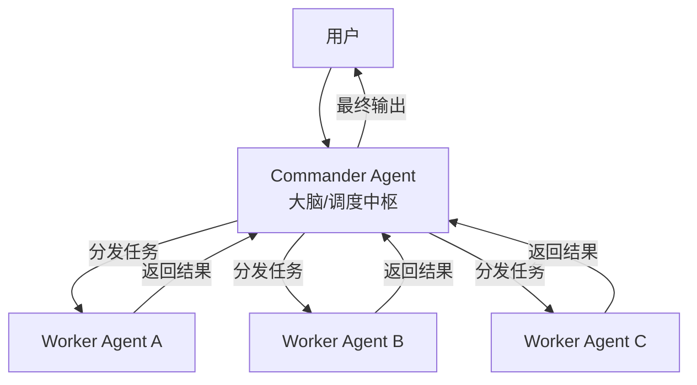

> 本文以费曼学习法（复杂概念→简化讲解→复述输出→简化迭代）为方法论，以第一性原理（回归事物本源、从根本原理出发推演）为思维框架，系统解析AI Agent多智能体技术栈。目标：帮助读者从“会用”到“懂其所以然”，达到专家级认知水平。
>
> ⚠️ **时效性提醒**：本文基于Spring AI Alibaba v1.1.2.2（2026年3月发布），A2A协议1.0规范。相关技术和API仍在快速演进，请以官方文档和源代码仓库的最新内容为准。建议定期查阅Spring AI Alibaba GitHub Releases（https://github.com/alibaba/spring-ai-alibaba）以及A2A Java SDK（https://github.com/lf-ai-data/a2a-java-sdk）。如需术语速查，可使用浏览器页面搜索功能。
>
> ⚠️ **版本兼容性说明**：本文各章节中的代码示例和功能特性标注了最低支持版本。使用较低版本时可能出现API不兼容，请核对您的实际版本。
>
> ⚠️ **代码示例说明**：本文档中的代码示例基于Spring AI Alibaba v1.1.2.2编写，部分API可能在后续版本中变更。生产环境使用时，请以官方GitHub仓库中的最新示例代码为准。

## 一、从“全能上帝”到“专家团队”：AI Agent的核心演进逻辑

### 1.1 第一性原理：为什么需要多智能体？

回到最根本的问题：**我们想要AI解决什么问题？** —— 现实世界的问题很少由单一智能体独立完成。大型软件系统由团队构建，科学发现源自协作，企业靠专业部门围绕共同目标协调运作。AI的下一个重要转变遵循同样的组织原则：**智能通过协调扩展比单纯依靠集中化更有效**。

在AI Agent发展的早期，我们倾向于构建一个全能的“上帝智能体”，给它挂载无数工具、塞入海量上下文。但工程实践中暴露了著名的 **“能力崩塌效应”** ：当一个Agent被要求同时扮演程序员、产品经理和测试人员时，表现往往不如三个独立Agent各司其职。

用费曼学习法理解：
- **单体Agent** → 就像一个拿着瑞士军刀的通才，什么都能干一点，但遇到复杂手术就束手无策
- **多智能体系统** → 就像一个配备了主刀医生、麻醉师和护士的手术团队，通过精密协作完成高难度任务

### 1.2 架构演进三阶段

AI从静态响应到协作系统的跃迁经历了三个阶段：
1. **静态响应**：单一大模型根据输入生成文本
2. **自动执行**：Agent可调用工具、插件、外部API
3. **协作系统**：多Agent通过统一框架协同完成复杂任务

### 1.3 核心架构设计元素

设计多智能体系统，本质上是在设计数字化组织的管理模式，需要解决三个核心问题：

**角色定义（Role）** ：每一个Agent应有极其狭窄但深度的System Prompt。常见的专门化角色包括：
- **Planner（规划者）** ：不直接执行，只负责将模糊的用户需求拆解为结构化任务列表
- **Executor（执行者）** ：专注于特定领域任务，如PythonCoder、WebSearcher
- **Critic（审查者）** ：负责质量保证，不生产内容只挑刺

**沟通拓扑结构**：Agent之间如何通信？常见三种模式：
- **流水线模式**：A → B → C，适用于确定性极强的任务
- **中心化模式（Hub-and-Spoke）** ：以Manager Agent为中心分发任务，适用于复杂全局统筹
- **去中心化模式（Mesh/Swarm）** ：Agent之间自由广播消息，谁能解决谁响应

**共享记忆（Shared Memory）** ：多个Agent如何同步信息？仅靠对话历史容易超出Token限制。工程解法是引入 **“黑板模式”** ——建立一个全局共享的数据库或状态机，所有Agent从黑板上读取当前进度，并将产出写回黑板。**分布式环境下的实现**：可使用Redis、MySQL或内存网格（如Hazelcast）作为共享存储，Spring AI Alibaba未内置分布式黑板，需自行集成。

### 1.4 分布式黑板模式实现指南

Spring AI Alibaba中，会话记忆通过`Saver`接口实现。**`Saver`用于会话级记忆持久化**，而非全局黑板状态。若需实现多个Agent间的全局黑板共享，可基于Redis自行封装。

**方案：使用`RedisSaver`实现分布式会话记忆（≥v1.1.0）**

Spring AI Alibaba提供了开箱即用的`RedisSaver`，用于实现会话状态的Redis持久化存储，适合多节点共享会话上下文：

```java
// 导入正确的包（来自 spring-ai-core）
import org.springframework.ai.chat.memory.MemorySaver;
import org.springframework.ai.chat.memory.RedisSaver;
import org.springframework.data.redis.connection.RedisConnectionFactory;

@Configuration
public class SessionPersistenceConfig {
    
    @Bean
    public RedisSaver redisSaver(RedisConnectionFactory redisConnectionFactory) {
        return RedisSaver.builder()
            .redisConnectionFactory(redisConnectionFactory)
            .build();
    }
    
    @Bean
    public ReactAgent weatherAgent(ChatModel chatModel, WeatherTool weatherTool, RedisSaver redisSaver) {
        return ReactAgent.builder()
            .name("weather-agent")
            .model(chatModel)
            .tools(weatherTool)
            .saver(redisSaver)  // ✅ 正确方式：通过 saver() 注入
            .instruction("你是天气助手，可以查询天气。")
            .build();
    }
}
```

## 二、A2A协议：Agent之间的“TCP/IP”

> **说明**：本章整合了原第八章MCP关系内容，避免重复。

### 2.1 第一性原理：Agent之间为什么需要统一协议？

如果说多智能体系统是“组织架构”设计，那么A2A协议就是智能体之间的**通信标准**。

想象一个场景：支付Agent（支付团队开发）需要调用搜索Agent（搜索团队开发），它们可能使用不同框架、不同编程语言、部署在不同服务器上。如果没有统一协议，每个接口都需要定制，协作成本随Agent数量指数级增长。

A2A（Agent2Agent）协议正是为解决这个问题而生。**溯源**：该协议由Google于2025年4月首次推出，随后于2025年6月捐赠给了Linux Foundation的LF AI & Data，以确保供应商中立治理。2025年8月，IBM的Agent Communication Protocol（ACP）正式并入A2A，原ACP负责人加入A2A技术指导委员会（TSC），ATC由Google、Microsoft、AWS、Cisco、Salesforce、ServiceNow、SAP和IBM八家企业代表组成。ACP的开发已逐步停止，新项目应直接使用A2A。A2A目前已有超过150家科技公司参与和支持。A2A为Agent提供标准化的通信基础：互发现、任务委派、状态同步和协作。

### 2.2 A2A协议核心概念

用费曼学习法理解A2A的核心组件：

| 概念 | 类比 | 说明 |
|------|------|------|
| **Agent Card** | 名片/商品说明书 | JSON格式的元数据文件，描述Agent的能力、技能、端点URL。客户端通过它发现Agent。在A2A 1.0规范中，AgentCard使用`signedInterfaces`列表替代0.x版本的独立字段，使协议绑定更加灵活 |
| **A2A Server** | 对外服务窗口 | 暴露HTTP端点的Agent，接收请求并管理任务执行 |
| **A2A Client** | 服务调用方 | 使用A2A服务的应用程序或其他Agent |
| **Task** | 工作任务单 | 核心工作单元，有唯一ID和生命周期状态（submitted→working→completed→failed），支持长时间运行的异步任务 |
| **Message** | 对话消息 | 客户端（role:"user"）和Agent（role:"agent"）之间的通信轮次 |

> **补充**：AgentCard是协议的中立实体，被IETF作为独立的Internet-Draft进行标准化讨论，与A2A协议分离，体现了两者正交的设计理念。

### 2.3 A2A设计五原则

1. **拥抱代理能力**：即使不共享内存、工具和上下文，也能自然协作
2. **基于现有标准**：基于HTTP、SSE、JSON-RPC等流行标准，便于与现有IT栈集成
3. **默认安全**：支持企业级身份认证（如OAuth 2.1）和授权。A2A 1.0规范引入了Agent Card的可选签名机制
4. **支持长时间运行的任务**：从快速任务到可能需要数小时的研究任务
5. **与模态无关**：支持文本、音频、视频等流媒体

### 2.4 A2A与MCP的关系：垂直与水平的分工

这是初学者最容易混淆的概念。用第一性原理区分：
- **MCP（Model Context Protocol）** ：解决的是**垂直问题**——Agent与工具之间的通信。标准化了AI模型连接到外部工具、API和数据资源
- **A2A**：解决的是**水平问题**——Agent与Agent之间的通信。标准化了异构Agent如何发现、委派任务、交换信息

二者不是竞争关系，而是**互补协议**：**A2A专注于Agent间的水平协作，MCP专注于Agent与工具的垂直交互**。复杂的Agent系统中，Agent使用A2A协调其他Agent，同时使用MCP与其工具交互。

MCP于2025年12月被Anthropic捐赠给Linux Foundation，成立Agentic AI Foundation（AAIF）作为治理主体。至2026年4月时已超过10,000个公开服务器和每月9,700万SDK下载量。MCP与A2A在Linux Foundation的LF AI & Data下统一管理。

MCP与A2A的详细对比见下表：

| 维度 | MCP | A2A |
|------|-----|------|
| **目的** | 模型↔工具接口 | 代理↔代理接口 |
| **关注焦点** | 工具访问、上下文连接 | 发现、委派、协作 |
| **标准化主体** | Anthropic → Linux Foundation（2025年12月） | Google → Linux Foundation（2025年6月） |
| **关键概念** | Tool、Resource、Server | AgentCard、Task、AgentSkill |
| **通信方式** | JSON-RPC over HTTP/WebSocket | HTTP/SSE、JSON-RPC |

> **关于ACP**：IBM的Agent Communication Protocol（ACP）已正式并入A2A协议，ACP的开发已逐步停止，新项目应直接使用A2A。

## 三、Spring AI Alibaba：Java生态的Agentic AI Framework

### 3.1 框架定位

Spring AI Alibaba是构建Agent智能体应用的最简方式，只需不到10行代码即可构建智能体应用。Spring AI Alibaba基于Spring AI构建，在1.1.2.2版本中已实现与DashScope深度集成、Agent Framework + Graph + Multi-agent + A2A + MCP + 可视化调试的一整套框架体系。1.1.2.0正式版发布于2026年2月，底层Spring AI升级至1.1.2；v1.1.2.2于2026年3月发布。

> **注**：Spring AI Alibaba的ReactAgent运行在Graph Runtime之上，主要用于工作流和多智能体编排。如果寻找更先进的ReAct范式实现，可关注`agentscope-java`项目。

### 3.2 三层架构（第一性原理分析）

Spring AI Alibaba从架构上分为三层：

- **Augmented LLM层**：以Spring AI框架底层原子抽象为基础，提供Model、Tool、MCP、Message、Vector Store等基础抽象——**让Java开发者能用统一接口对接各种大模型**
- **Graph层**：低级别的工作流和多代理协调框架，具备丰富的预置节点和简化的图状态定义，是Agent Framework的底层运行时基座——**解决“如何让多个Agent协作”的编排层**
- **Agent Framework层**：以**多智能体协作模式与上下文工程**为理念核心，包含ReactAgent、SequentialAgent、ParallelAgent、LlmRoutingAgent、LoopAgent等预置Multi-agent模式，叠加**工具调用**（tool-calling）与**交接**（handoffs）两种核心Agent协作模式——**解决“如何定义和执行Agent”的应用层**

### 3.3 ReactAgent：ReAct范式执行体

ReactAgent遵循 **ReAct（推理+行动）范式**，用于迭代解决问题：

```
Thought（思考）：我现在需要做什么？
Action（行动）：调用某个工具/API/函数
Observation（观察）：工具返回了什么结果？
→ 继续思考 → 继续行动 → 直到目标达成
```

**ReactAgent与Graph的关系**：ReactAgent基于Graph运行时实现ReAct循环，框架自动编排推理-行动-观察步骤。当调用`agent.call(input)`时，Graph运行时反复执行该循环直到输出最终结果或达到最大迭代次数。这使得ReAct循环可以被Graph的调试、状态持久化、条件分支等能力增强。

### 3.4 内置多智能体编排模式

Spring AI Alibaba预置了多种Multi-agent基础工作流模式：

| 模式 | 工作原理 | 适用场景 | ⚠️ 不适用场景 |
|------|---------|---------|-------------|
| **SequentialAgent** | Agent链式执行，输出作为下一个输入 | 代码写作→审查→文档生成的流水线 | 步骤间有复杂依赖或条件分支 |
| **ParallelAgent** | 多个Agent并发执行后合并结果 | 从不同角度分析同一问题 | 任务间有状态依赖 |
| **LlmRoutingAgent** ≥1.1.2.0 | 根据输入动态路由到相应Agent，可一次选择多个子智能体并行执行 | 意图识别后的任务分发、多领域并行查询 | 路由决策需要精确规则而非LLM判断 |
| **LoopAgent** | 循环执行直到条件满足 | 多轮迭代优化 | ⚠️ **必须设置终止条件**：使用前明确定义最大迭代次数或结果稳定阈值，否则可能无限循环消耗Token |

> **关于SupervisorAgent**：在v1.1.2.0中已被弃用。官方推荐使用**指挥官模式**自行构建（详见第五章），或结合`LlmRoutingAgent`与`Handoffs`实现监督式路由。

### 3.5 Graph工作流核心能力

Spring AI Alibaba的Graph层来源于LangGraph设计理念，在Java生态中进行了深度优化，提供了精细的多智能体工作流协调机制：

- **并行节点与并行边**：Graph在编译过程中自动检测多个边从同一源节点指向不同目标节点，将其合并为`ParallelNode`进行并发执行控制
- **并行聚合策略**：支持**AllOf**（等待所有并行任务完成后再合并）和**AnyOf**（任一任务完成即合并）两种策略汇总结果
- **异常处理**：AllOf策略下，若任一子任务抛出异常，整体工作流默认快速失败，可通过自定义`merge`函数实现部分成功（例如跳过失败任务）
- **异步工具执行**：Graph的`AgentToolNode`支持异步工具执行，避免耗时操作阻塞工作流
- **StateGraph“先定义后执行”模式**
- **三种边类型**：普通边（固定顺序）、条件边（动态路由）、并行边（多个节点同时执行）

> ⚠️ **生产提示**：Spring AI Alibaba的Graph工作流虽然功能丰富，但在复杂场景下（如深度嵌套、长时运行状态）建议先在简单场景验证，逐步增加复杂度。框架支持预编译子图、持久化层和可观测性集成，满足生产级要求。

### 3.6 Agent Skills：渐进式知识调度

Spring AI Alibaba 1.1.2.0+中，ReactAgent集成了Agent Skills能力——让Agent以「技能」为单位的渐进式知识调度，支持**可复用指令与上下文的渐进式披露**，在相关任务时由智能体自动发现并按需加载，从而降低Token消耗、扩展能力规模。

**Skill与Tool的区别**：
- **Tool**：可被Agent调用的函数/API，有明确的输入输出schema，执行后返回结果。例如：`getWeather(city)`。
- **Skill**：一个Markdown文件（SKILL.md），描述一组**指导性的流程、最佳实践或上下文**，可绑定零个或多个Tool。Agent通过`read_skill(skill_name)`加载Skill的完整说明，然后按照说明调用相应的Tool。Skill本身不执行代码。

**渐进式披露三阶段**：
- 系统提示中先只注入技能列表（name、description、skillPath）
- 模型需要时调用`read_skill(skill_name)`加载完整SKILL.md
- 按需访问技能目录下的资源或使用与该技能绑定的工具

**SKILL.md格式规范与Tool绑定**：

Skill支持**渐进式工具披露**——将工具与Skill绑定后，仅当模型读取了该技能后，对应工具才会加入上下文，实现按需暴露：

```markdown
---
name: weather-query
description: 查询天气的技能，支持城市和日期查询
tools:
  - get_weather
  - get_forecast
---

## 使用说明
调用 get_weather(city, date) 获取指定日期的天气信息。
如果用户询问未来天气，请使用 get_forecast(city, days)。
```

```java
// 技能注册与使用示例
import com.alibaba.cloud.ai.agent.skill.SkillRegistry;
import com.alibaba.cloud.ai.agent.skill.FileSystemSkillRegistry;
import com.alibaba.cloud.ai.agent.hook.SkillsAgentHook;

SkillRegistry registry = FileSystemSkillRegistry.builder()
    .projectSkillsDirectory(System.getProperty("user.dir") + "/skills")
    .build();

SkillsAgentHook hook = SkillsAgentHook.builder()
    .skillRegistry(registry)
    .build();

ReactAgent agent = ReactAgent.builder()
    .name("skills-agent")
    .model(chatModel)
    .hooks(List.of(hook))  // 注册Skills Hook
    .build();

// Agent会在需要时自动调用read_skill加载技能，对应工具自动可用
agent.call("能告诉我今天北京的天气吗？");
```

框架提供`FileSystemSkillRegistry`和`ClasspathSkillRegistry`两种技能注册表，支持项目级与用户级技能目录的优先级覆盖机制。更高级的用法包含生产环境自动重载、自定义系统提示模板等，详见官方文档。

### 3.7 多智能体的两种核心协作模式

1. **工具调用模式（Tool Calling）** ：Supervisor Agent将其他Agent作为工具调用。被调用的Agent不直接与用户对话，只执行任务返回结果——适用于需要集中式任务编排的结构化工作流

2. **Handoffs交接模式**：当前Agent决定将控制权转移给另一个Agent。用户可以与新的Agent直接交互——适用于跨领域对话、专家接管的场景

在同一系统中可以混合使用两种模式：使用交接进行Agent切换，并让每个Agent将子Agent作为工具调用来执行专门任务。

### 3.8 上下文工程：占位符机制与记忆分层

**第一性原理**：多Agent设计的核心是上下文工程——**决定每个Agent看到什么信息**。

Spring AI Alibaba在Multi-agent系统中提供细粒度的上下文控制，关键机制是**占位符**，在Agent的instruction中使用占位符实现自动上下文注入，从当前状态中查找并自动替换对应值。

| 占位符 | 说明 | 使用场景 |
|--------|------|---------|
| `{input}` | 用户输入的原始内容 | 第一个Agent或需要用户输入的Agent |
| `{outputKey}` | 引用其他Agent通过outputKey存储的输出 | 顺序执行中，后续Agent引用前面Agent的输出 |
| `{stateKey}` | 引用状态中的任意键值 | 访问状态中的任何数据 |

系统质量在很大程度上取决于上下文工程的质量，目标确保每个Agent都能访问执行任务所需的正确数据。

### 3.9 LlmRoutingAgent + Handoffs：智能体路由与交接

本节详细展开3.4节中的`LlmRoutingAgent`和3.7节中的`Handoffs`交接模式，提供完整的设计原理和可运行代码示例。

#### 3.9.1 第一性原理：为什么需要路由 + 交接？

在指挥官模式（中心化调度）之外，去中心化场景下有两类需求需要额外的机制支撑：

1. **意图路由**：用户一次性输入可能涉及多个领域（“帮我查一下订单状态，顺便看下账单”），需要系统自动识别并**分发**到对应的专家Agent
2. **动态交接**：用户与订单Agent A对话时，话题自然转向账单支付问题，需要活动Agent主动将控制权**交接**给账单Agent B，用户无感知地继续对话

**`LlmRoutingAgent` + `Handoffs`的组合**在路由与交接之间架起桥梁：
- **LlmRoutingAgent负责“第一次选择”** ：分析用户输入，从多个子Agent中选出一个（或多个）最合适的进行初始化处理
- **Handoffs负责“后续转移”** ：在处理过程中，Agent可主动将任务或对话权交接给其他专业Agent

#### 3.9.2 LlmRoutingAgent：LLM驱动的智能路由

`LlmRoutingAgent`是一个基于LLM的动态路由智能体，它利用大语言模型分析用户输入和子Agent的描述（`description`），自动决定将请求路由到最合适的子Agent。

**关键API**（≥v1.1.2.0）：

| 组件 | 说明 |
|------|------|
| `.subAgents(List<ReactAgent>)` | 注册可路由的子智能体列表 |
| `.description(String)` | 子Agent的描述文本，LLM据此判断路由目标 |
| `.systemPrompt(String)` | 自定义路由决策的系统提示，覆盖默认路由规则 |
| `.instruction(String)` | 追加的路由请求级别指导 |
| `.fallbackAgentName(String)` | 路由失败时的备用Agent名称 |

**并行路由能力**（≥v1.1.2.0）：`LlmRoutingAgent`支持一次选择多个子智能体并行执行，常用于多领域并行查询。

**路由准确性最佳实践**：
1. **提供清晰明确的Agent描述**：给每一个子Agent编写具体、无歧义的`description`，明确当前Agent擅长的业务范围和适用场景
2. **明确Agent的职责边界**：严格划定每个Agent的权责范围，限制其不跨业务、跨职能处理问题
3. **使用不同领域的Agent**：按垂直领域拆分子Agent，每个Agent只聚焦单一专业领域，杜绝能力重叠

**自定义系统提示词**：当需要精细控制路由逻辑时，可使用`systemPrompt`覆盖默认路由提示：

```java
LlmRoutingAgent routingAgent = LlmRoutingAgent.builder()
    .name("secure-router")
    .model(chatModel)
    .subAgents(List.of(securityAgent, generalAgent))
    .systemPrompt("""
        你是一个安全优先的路由器。路由决策规则（按优先级）：
        1. 如果用户查询包含任何个人敏感信息（身份证号、手机号、银行卡号），
           必须路由到 'security_agent'。
        2. 其他查询路由到 'general_agent'。
        """)
    .build();
```

#### 3.9.3 Handoffs：智能体交接模式

**核心原理**：Handoffs是一种**去中心化**协作模式——当前活跃的Agent自主判断业务边界，主动将会话控制权和全局状态移交给目标专业Agent，交接完成后用户直接与新Agent持续交互，无需重新发起会话。

**与Tool Calling的关键区别**：

| 特性 | Tool Calling | Handoffs |
|------|-------------|----------|
| **控制流** | 集中式，所有路由通过调用Agent | 去中心化，Agent可改变活跃身份 |
| **用户交互** | 子Agent不与用户直接对话，只返回结果 | 新Agent直接与用户交互 |
| **适用场景** | 任务编排、结构化工作流 | 跨领域对话、专家接管 |
| **是否切换活动Agent** | ❌ 否 | ✅ 是 |
| **对话连续性** | 用户无感知 | 用户感知到“专家”身份变化 |

**在LlmRoutingAgent中集成Handoffs**：在实际应用中，LlmRoutingAgent与Handoffs通常结合使用——LlmRoutingAgent完成**初始路由**后，子Agent在执行过程中可根据需要**交接**给其他专业Agent。典型的混合方案如下：

```
用户输入 → LlmRoutingAgent（识别意图，路由到Agent A）→ Agent A执行部分任务
                    ↓
            判断需要专家B介入
                    ↓
            Agent A执行Handoffs → Agent B接管，继续与用户交互
```

#### 3.9.4 完整可运行示例：智能客服系统

以下示例构建一个智能客服系统，用户输入不同意图的问题时，系统自动路由到相应的专家Agent，并支持在对话过程中的动态交接。

**Maven依赖**：

```xml
<dependency>
    <groupId>com.alibaba.cloud.ai</groupId>
    <artifactId>spring-ai-alibaba-starter</artifactId>
    <version>1.1.2.2</version>
</dependency>
<dependency>
    <groupId>com.alibaba.cloud.ai</groupId>
    <artifactId>spring-ai-alibaba-starter-dashscope</artifactId>
    <version>1.1.2.2</version>
</dependency>
```

**步骤一：定义业务专家Agent**

```java
import com.alibaba.cloud.ai.graph.agent.ReactAgent;
import org.springframework.ai.chat.model.ChatModel;
import org.springframework.ai.chat.memory.MemorySaver;
import org.springframework.context.annotation.Bean;
import org.springframework.context.annotation.Configuration;

@Configuration
public class CustomerServiceAgents {
    
    @Bean(name = "orderAgent")
    public ReactAgent orderAgent(ChatModel chatModel) {
        return ReactAgent.builder()
            .name("order_agent")
            .model(chatModel)
            .description("专门处理订单相关问题，包括订单状态查询、退换货申请、订单修改等。适用于用户询问订单状态、物流信息、退货流程等场景。")
            .instruction(""" 
                你是订单客服专家。你的职责：
                1. 帮助用户查询订单状态、物流信息
                2. 协助用户申请退换货
                3. 提供订单修改建议
                
                如果用户询问的是账单金额、支付问题，请交接给 billing_agent。
                交接方式：输出交接标记 [HANDOFF:billing_agent]，并在其后附上交接上下文。
                """)
            .saver(new MemorySaver())
            .outputKey("order_result")
            .build();
    }
    
    @Bean(name = "billingAgent")
    public ReactAgent billingAgent(ChatModel chatModel) {
        return ReactAgent.builder()
            .name("billing_agent")
            .model(chatModel)
            .description("专门处理账单和支付相关问题，包括账单查询、支付问题、发票申请、费用明细等。适用于用户询问账单金额、支付失败原因、发票开具等场景。")
            .instruction("""
                你是账单支付专家。你的职责：
                4. 帮助用户查询账单明细和费用构成
                5. 协助处理支付失败、支付方式变更
                6. 办理发票申请
                
                如果用户询问的是退换货或订单物流问题，请交接给 order_agent。
                交接方式：输出交接标记 [HANDOFF:order_agent]，并在其后附上交接上下文。
                """)
            .saver(new MemorySaver())
            .outputKey("billing_result")
            .build();
    }
    
    @Bean(name = "complaintAgent")
    public ReactAgent complaintAgent(ChatModel chatModel) {
        return ReactAgent.builder()
            .name("complaint_agent")
            .model(chatModel)
            .description("专门处理用户投诉、售后问题升级、服务建议等复杂情绪场景。适用于用户表达不满、投诉客服、请求上级处理等场景。")
            .instruction("""
                你是高级售后专员。你的职责：
                7. 倾听用户诉求，识别真实问题
                8. 记录投诉要点并给出安抚方案
                9. 协调相关部门解决升级问题
                
                保持专业、共情，优先解决用户核心诉求。
                """)
            .saver(new MemorySaver())
            .outputKey("complaint_result")
            .build();
    }
}
```

**步骤二：构建LlmRoutingAgent**

```java
import com.alibaba.cloud.ai.graph.agent.flow.agent.LlmRoutingAgent;

@Configuration
public class SmartRouter {
    
    @Bean
    public ReactAgent customerServiceRouter(
            ChatModel chatModel,
            @Qualifier("orderAgent") ReactAgent orderAgent,
            @Qualifier("billingAgent") ReactAgent billingAgent,
            @Qualifier("complaintAgent") ReactAgent complaintAgent) {
        LlmRoutingAgent router = LlmRoutingAgent.builder()
            .name("customer_service_router")
            .model(chatModel)
            .subAgents(List.of(orderAgent, billingAgent, complaintAgent))
            .systemPrompt("""
                你是一个智能客服路由器。根据用户输入，选择最合适的专家Agent：
                1. 订单相关问题（订单状态、物流、退换货）→ order_agent
                2. 账单支付问题（账单查询、支付失败、发票）→ billing_agent
                3. 投诉与售后升级（表达不满、投诉客服）→ complaint_agent
                
                只选择一个最合适的Agent，将用户请求完整转发给该Agent。
                """)
            .fallbackAgentName("order_agent")
            .saver(new MemorySaver())
            .build();
        
        return router;
    }
}
```

**步骤三：调用与测试代码**

```java
import org.springframework.boot.CommandLineRunner;
import org.springframework.stereotype.Component;

@Component
public class CustomerServiceRunner implements CommandLineRunner {
    
    private final ReactAgent router;
    
    public CustomerServiceRunner(@Qualifier("customerServiceRouter") ReactAgent router) {
        this.router = router;
    }
    
    @Override
    public void run(String... args) throws Exception {
        // 测试用例1：订单问题 → 路由到 order_agent
        System.out.println("=== 用户1 ===");
        router.invoke("我的订单号 12345 昨天就显示发货了，但物流一直没更新，怎么办？")
            .ifPresent(result -> {
                System.out.println("客服回复：" + result.value("messages").orElse("无回复"));
            });
        
        // 测试用例2：账单问题 → 路由到 billing_agent
        System.out.println("\n=== 用户2 ===");
        router.invoke("为什么我的本月账单比上个月多了 200 元？请帮我查一下明细")
            .ifPresent(result -> {
                System.out.println("客服回复：" + result.value("messages").orElse("无回复"));
            });
        
        // 测试用例3：Handoffs演示 - 订单Agent主动交接给账单Agent
        System.out.println("\n=== 用户3（Handoffs演示） ===");
        router.invoke("我收到了货但不满意想退货，另外我的信用卡好像被多扣了一笔钱，请帮我查一下")
            .ifPresent(result -> {
                System.out.println("客服回复：" + result.value("messages").orElse("无回复"));
            });
        // 预期流程：LlmRoutingAgent识别为复合意图，路由到order_agent
        // order_agent在处理退货后，通过 [HANDOFF:billing_agent] 将支付问题交接给billing_agent
    }
}
```

**Handoffs交接格式的最佳实践**：
- 交接标记格式：`[HANDOFF:agent_name] {交接上下文信息}`
- 上下文信息建议使用结构化格式（如JSON），便于接收方Agent解析

#### 3.9.5 最佳实践建议

1. **路由时优先处理复合意图**：LlmRoutingAgent默认每次选一个Agent，若需处理复合意图（同时涉及多个领域），可升级到≥v1.1.2.0的**并行路由模式**
2. **Handoffs交接信息的结构化**：建议使用标准格式，如`[HANDOFF:agent_name] {context_json}`，便于系统解析
3. **避免循环交接**：通过ThreadLocal或State记录交接链，检测并防止A→B→A循环
4. **结合上下文工程**：交接时明确传递必要的上下文信息，避免信息丢失
5. **监控路由准确性**：借助Spring AI Alibaba Admin平台（详见第六章）记录路由决策日志，定期分析路由准确率并优化Agent描述

## 四、A2A分布式智能体：从单机到集群的跨越

### 4.1 为什么需要分布式演进？

在第一性原理层面，A2A要解决的核心问题是：**当Agent数量增多，单进程部署会面临怎样的根本性限制？**

- **组织协同困难**：交易Agent和搜索Agent应由支付团队和搜索团队独立维护，但单进程模式下需共仓协同
- **可用性难保证**：一个Agent崩溃可能导致所有Agent不可用，无法按Agent维度水平扩缩容和限流
- **安全风险**：内存与上下文共享导致权限边界模糊

### 4.2 Spring AI Alibaba的A2A三层核心组件

Spring AI Alibaba的A2A实现包含三个核心组件：
- **A2A Server**：将本地ReactAgent暴露为A2A服务
- **A2A Registry**：Agent注册中心（支持Nacos）
- **A2A Discovery**：Agent发现机制（支持Nacos）

### 4.3 注册与发现流程

```
Agent Provider (本地Agent) ────▶ Nacos Registry ◀──── Agent Consumer (远程调用)
        │                              │                        │
        │ 1. 注册 AgentCard           │                        │
        │─────────────────────────────▶│                        │
        │                              │ 2. 查询 AgentCard      │
        │                              │◀───────────────────────│
        │                              │ 返回 AgentCard 列表    │
        │                              │───────────────────────▶│
        │                              │                        │
        │ 3. 远程调用（A2A协议）                                │
        │◀─────────────────────────────────────────────────────│
```

### 4.4 A2A客户端与服务器代码示例

Spring AI Alibaba的A2A集成通过`spring-ai-alibaba-starter-a2a-nacos`模块实现，核心组件为`A2aRemoteAgent`和自动配置的Nacos Registry。

> **⚠️ 组件说明**：以下代码基于`spring-ai-alibaba-starter-a2a-nacos`模块，该模块提供A2A与Nacos的集成能力。具体API请以官方GitHub仓库的最新示例为准。

**服务端：暴露ReactAgent为A2A服务（通过配置自动暴露）**

```yaml
# application.yml
spring:
  ai:
    alibaba:
      a2a:
        server:
          enabled: true
          version: 1.0.0
          card:
            name: weather-agent
            description: "提供天气查询服务"
            provider:
              name: "My Team"
              organization: "My Company"
  cloud:
    nacos:
      discovery:
        server-addr: ${NACOS_SERVER_ADDR:localhost:8848}
```

```java
import com.alibaba.cloud.ai.graph.agent.ReactAgent;

@Configuration
public class A2AServerConfig {
    @Bean(name = "weatherAgent")
    public ReactAgent weatherAgent(ChatModel chatModel, WeatherTool weatherTool) {
        return ReactAgent.builder()
            .name("weather-agent")
            .model(chatModel)
            .tools(weatherTool)
            .instruction("你是天气助手，可以查询天气。")
            .saver(new MemorySaver())
            .build();
    }
}
```

启动应用后，A2A Server会自动：
- 根据ReactAgent Bean生成AgentCard
- 暴露REST API端点：`/.well-known/agent.json`（AgentCard元数据）和`/a2a/message`（Agent调用端点）

**客户端：通过A2A调用远程Agent**

Spring AI Alibaba支持通过`AgentCardProvider`从注册中心（如Nacos）发现远程Agent。以下为具体实现示例，完整代码请参考官方GitHub仓库中的`A2AExample.java`：

```java
import com.alibaba.cloud.ai.graph.agent.a2a.A2aRemoteAgent;
import com.alibaba.cloud.ai.graph.agent.AgentCardProvider;

@Service
public class WeatherClientService {
    @Autowired
    private AgentCardProvider agentCardProvider;  // 自动注入，从Nacos获取AgentCard
    
    public String callRemoteWeatherAgent(String city) throws Exception {
        // 发现远程Agent（支持负载均衡）
        AgentCard remoteCard = agentCardProvider.getAgentCard("weather-agent");
        
        // 创建远程代理Agent
        ReactAgent remoteAgent = A2aRemoteAgent.builder()
            .name("remote-weather-agent")
            .agentCard(remoteCard)
            .build();
        
        // 调用远程Agent
        Optional<OverAllState> result = remoteAgent.invoke("查询" + city + "天气");
        return result.map(state -> state.value("messages").toString()).orElse("查询失败");
    }
}
```

### 4.5 分布式一致性考量

A2A协议中的Task状态管理在多节点场景下需注意：
- **Task ID幂等性**：客户端应生成唯一ID（如UUID），服务端需按ID去重，防止重复执行
- **状态访问**：A2A协议中，Task状态由创建该Task的A2A Server负责维护。其他Agent若需查询状态，应通过A2A Client向原Server发起`getTask`请求，而不是绕过协议直接共享存储
- **网络分区处理**：建议设置合理的超时（如30s）和重试策略（指数退避）
- **A2A任务结果获取模式**：
    - **Poll模式**（默认）：客户端创建Task后定期调用`getTask(taskId)`轮询状态。主流生产部署推荐此模式，配合合理的轮询间隔（如1-5秒）
    - **Push模式**（实验性/部分支持）：服务端任务完成后主动回调Webhook。该模式在A2A 1.0规范中已定义`pushNotificationConfig`，但在Spring AI Alibaba 1.1.2.x的A2A实现中仍处于实验阶段。生产环境建议优先使用Poll模式

## 五、指挥官模式：从无序协作到有序调度

### 5.1 问题的第一性分析

在多Agent协作中，去中心化模式会遇到三大痛点：
- **死循环**：Agent A和B互相客套推诿，消耗Token无产出
- **意图漂移**：对话轮次增加，子Agent忘记最初用户核心诉求
- **不可控性**：缺乏统一验收标准，难以保证输出格式

**根本原因**：没有明确的责任边界和调度逻辑。

### 5.2 指挥官架构设计

指挥官模式将拓扑结构从“网状”变为 **“星型”** ：



- **Commander（大脑）** ：核心调度中枢，维护全局状态，拥有上帝视角，不负责具体搬砖，只负责“拆解任务、指派工单、验收结果”
- **Worker（工具）** ：具备特定技能的Agent
- **User**：发起自然语言指令

**工作流五步走**：
1. 感知：Commander接收用户指令
2. 规划：利用LLM推理能力，将指令拆解为步骤
3. 分发：判断需要的Worker并生成调用参数
4. 执行与反馈：Worker执行任务，返回结果给Commander
5. 决策：检查结果是否满足目标？满足则输出，不满足则修正计划继续分发

## 六、生产级问题分类与解决方案

### 6.1 问题分类矩阵

| 分类 | 典型问题 | 根因 | 解决方案 |
|------|---------|------|---------|
| **上下文爆炸** | Agent输出不稳定、交互逻辑混乱 | 历史对话积累导致Token超限，关键信息被截断 | 动态记忆窗口、短期/长期记忆分层、上下文压缩、关键信息优先级管理 |
| **工具调用不稳定** | Agent反复调用同一工具、陷入工具循环 | 缺乏递归调用控制、工具响应设计不当 | 工具契约Schema校验（参考6.2节）、工具调用熔断和降级、Graph异步执行模式 |
| **成本失控** | 单个任务烧掉几十万Token | 不必要的重复推理、缺乏预算控制 | Token/调用次数/延迟级预算控制、超时熔断、限流熔断（参考6.3节） |
| **协作冲突** | 两个Agent同时尝试关闭同一工单 | 角色分工不明确 | 显式角色定义 + 任务锁机制 |
| **可观测性盲区** | 最终结果正确但中间过程一片黑盒 | 缺乏Agent专用追踪 | Agent全链路追踪、决策日志记录、工具调用明细、成本记账（参考6.4节） |
| **故障隔离不足** | 一个Agent失败导致整条链路崩溃 | 无熔断、级联失败 | 熔断器、服务降级、状态回滚 |
| **工具接入门槛** | 接入新工具需改十几处胶水代码 | 工具接口缺乏抽象 | MCP标准化工具接入 |
| **预期管理模糊** | 开发者对Agent能力边界定义模糊 | 缺少量化评估标准 | 定义可量化SLA指标（响应时间<15s、工具调用成功率>99%） |

### 6.2 工具契约Schema校验

针对工具调用不稳定问题，Spring AI Alibaba的`@Tool`注解支持参数类型自动生成JSON Schema。建议结合Spring Validation或Hibernate Validator进行运行时校验，防止非法参数导致工具调用异常：

```java
import org.springframework.ai.tool.annotation.Tool;
import org.springframework.ai.tool.annotation.ToolParam;

@Component
public class ValidatedWeatherService {
    
    @Tool(description = "获取指定城市的天气信息")
    public String getWeather(
            @ToolParam(description = "城市名称，如北京、上海") String city,
            @ToolParam(description = "日期，格式yyyy-MM-dd，默认为今天") String date) {
        
        // 参数校验：城市名称不能为空且必须由中文字符组成
        if (city == null || city.trim().isEmpty()) {
            return "错误：城市名称不能为空";
        }
        if (!city.matches("[\u4e00-\u9fa5]+")) {
            return "错误：城市名称必须为有效的中文城市名";
        }
        
        return city + "今日天气晴朗，温度22°C";
    }
}
```

### 6.3 预算与熔断控制

Spring AI Alibaba 1.x中**不存在内置的预算控制类**，`ReactAgent.builder()`也**未提供**预算或熔断配置方法。生产环境需手动封装：

```java
import io.github.resilience4j.circuitbreaker.CircuitBreaker;
import io.github.resilience4j.circuitbreaker.CircuitBreakerConfig;
import io.github.resilience4j.retry.Retry;
import io.github.resilience4j.retry.RetryConfig;
import java.time.Duration;

@Service
public class AgentBudgetService {
    private final ReactAgent agent;
    private final CircuitBreaker circuitBreaker;
    private final Retry retry;
    
    public AgentBudgetService(ReactAgent agent) {
        this.agent = agent;
        
        // 配置熔断器
        CircuitBreakerConfig cbConfig = CircuitBreakerConfig.custom()
            .failureRateThreshold(50)
            .waitDurationInOpenState(Duration.ofSeconds(60))
            .slidingWindowSize(10)
            .build();
        this.circuitBreaker = CircuitBreaker.of("agent-cb", cbConfig);
        
        // 配置重试（指数退避）
        RetryConfig retryConfig = RetryConfig.custom()
            .maxAttempts(3)
            .waitDuration(Duration.ofSeconds(1))
            .retryExceptions(Exception.class)
            .build();
        this.retry = Retry.of("agent-retry", retryConfig);
    }
    
    public Optional<OverAllState> callWithSafety(String input) {
        // 包装Retry和CircuitBreaker
        Supplier<Optional<OverAllState>> decoratedSupplier = 
            CircuitBreaker.decorateSupplier(circuitBreaker, () -> {
                return retry.executeSupplier(() -> {
                    return Mono.fromSupplier(() -> agent.invoke(input).block())
                        .timeout(Duration.ofSeconds(30))
                        .blockOptional();
                });
            });
        
        return decoratedSupplier.get();
    }
}
```

### 6.4 可观测性集成

**方案一：Spring AI Alibaba Admin Platform（推荐）**

Spring AI Alibaba Admin提供了完整的Agent生命周期管理和可观测性能力，包括推理日志（AgentLlmNode的Debug日志）、执行日志（AgentToolNode的工具调用细节）等。可通过以下方式使用：

- 自行编译部署：从GitHub获取源码并构建
- 访问官方文档：查阅部署指南，按说明启动Admin服务

Admin Platform核心功能包括：
- Prompt管理、数据集管理、评估器管理、实验管理
- 可视化调试广场，提供预置智能体模板
- 实时Agent调用链路追踪和决策日志记录
- 成本记账和Token用量统计

**方案二：手动集成Micrometer Tracing（≥Spring Boot 3.x）**

Spring Cloud Sleuth已停止维护，新项目应使用Micrometer Tracing + OpenTelemetry。

```xml
<dependency>
    <groupId>io.micrometer</groupId>
    <artifactId>micrometer-tracing-bridge-otel</artifactId>
</dependency>
<dependency>
    <groupId>io.opentelemetry</groupId>
    <artifactId>opentelemetry-exporter-zipkin</artifactId>
</dependency>
```

```java
import io.micrometer.observation.Observation;
import io.micrometer.observation.ObservationRegistry;

@Service
public class ObservableAgentService {
    
    private final ReactAgent agent;
    private final ObservationRegistry observationRegistry;
    
    public ObservableAgentService(ReactAgent agent, ObservationRegistry observationRegistry) {
        this.agent = agent;
        this.observationRegistry = observationRegistry;
    }
    
    public Optional<OverAllState> callWithObservability(String input) {
        Observation observation = Observation.createNotStarted("agent.call", observationRegistry)
            .lowCardinalityKeyValue("agent.name", agent.getName())
            .highCardinalityKeyValue("input.length", String.valueOf(input.length()))
            .start();
        
        try {
            long startTime = System.currentTimeMillis();
            Optional<OverAllState> result = agent.invoke(input).blockOptional();
            observation.highCardinalityKeyValue("duration.ms", 
                String.valueOf(System.currentTimeMillis() - startTime));
            return result;
        } catch (Exception e) {
            observation.error(e);
            throw e;
        } finally {
            observation.stop();
        }
    }
}
```

### 6.5 日志级别配置

开发调试阶段，开启Spring AI Alibaba的详细日志：

```yaml
# application.yml
logging:
  level:
    com.alibaba.cloud.ai: DEBUG
    com.alibaba.cloud.ai.graph: TRACE
    org.springframework.ai: DEBUG
```

## 七、调优与最佳实践

### 7.1 架构选型决策树

| 场景 | 推荐模式 | 理由 | 反模式 |
|------|---------|------|--------|
| 简单任务、工具数量少 | 单ReactAgent | 开销最小，响应最快 | 强行拆分为多Agent增加复杂度 |
| 任务步骤明确、确定性高 | SequentialAgent | 流水线串行，简单可控 | 步骤间有循环依赖 |
| 需要多角度评估、结果融合 | ParallelAgent | 并发执行，效率高 | 任务间需顺序依赖 |
| 意图多样、需动态路由 | LlmRoutingAgent | 按需分发，灵活适配 | 路由规则需精确而非LLM判断 |
| 需要全局统筹、避免失控 | 指挥官模式 | 中心化控制，可控可审计 | Agent数量过多（>10）导致Commander成为瓶颈 |
| Agent数量多、跨团队 | A2A分布式 | 服务化治理，按域独立部署 | 任务间强一致性要求极高 |

### 7.2 上下文工程最佳实践

- **明确命名**：使用有意义的`outputKey`，便于后续Agent引用
- **占位符格式**：使用`{keyName}`格式，确保与实际一致
- **精简上下文传递**：只传递Agent真正需要的信息，避免上下文污染
- **定期清理会话历史**：避免Token超限导致截断。可通过自定义Hook实现消息修剪

### 7.3 性能优化建议

- **缓存**：对于相同或相似输入，缓存Agent响应
- **批处理**：将多个独立请求合并，减少调用次数
- **超时控制**：为每次Agent调用设置合理超时，避免长时间阻塞
- **并发控制**：控制ParallelAgent的并发度，避免资源耗尽
- **模型选择**：简单任务用小模型，复杂任务用大模型，平衡效果与成本

### 7.4 安全与合规

- **数据脱敏**：敏感信息在进入Agent前脱敏。示例：使用自定义`SensitiveDataFilter`
- **审计日志**：记录Agent调用的完整操作历史。可通过Spring AI Alibaba Admin平台的决策日志能力实现
- **权限隔离**：通过A2A分布式部署实现Agent间的数据隔离
- **输入输出验证**：对大模型输出进行格式验证和内容过滤
- **A2A通信安全**：建议启用TLS（HTTPS）传输加密。A2A 1.0规范支持Agent Card的签名机制。实现RBAC可基于OAuth 2.1 Client Credentials流程，在A2A请求头中携带Bearer Token

## 八、总结：核心技术图谱

以费曼学习法复盘整个知识体系：

```
第一层：为什么 → 单Agent能力崩塌 → 需要多智能体协作
第二层：怎么做 → MAS架构设计 → 角色定义、通信拓扑、共享记忆
第三层：怎么通 → A2A协议 → 标准化跨Agent通信，Agent的"TCP/IP"
第四层：怎么建 → Spring AI Alibaba → 三层架构：Augmented LLM + Graph + Agent Framework
第五层：怎么分 → LlmRoutingAgent → LLM驱动的智能路由，动态分发任务
第六层：怎么转 → Handoffs → 去中心化交接，Agent主动转移会话控制权
第七层：怎么控 → 指挥官模式 → 中心化调度，解决乱序失控
第八层：怎么稳 → Harness + Admin Platform + 调优 → 生产级能力保障
```

**一句话核心记忆**：多智能体技术栈 = **MAS架构（组织设计） + A2A协议（通信标准） + Agent Skills（知识调度） + LlmRoutingAgent（路由分发） + Handoffs（动态交接） + MCP（工具标准化） + Spring AI Alibaba（工程实现） + 生产Harness（运维保障）** ，八者有机协同，构成从理论到生产落地的完整路径。

## 九、时效性与版本提醒

本文基于以下版本和背景撰写：
- **Spring AI Alibaba**：基于**v1.1.2.2**（2026年3月发布）。**截至2026年6月中旬，请访问GitHub确认是否有1.2.x或更高版本**。GitHub: https://github.com/alibaba/spring-ai-alibaba
- **A2A协议**：基于Linux Foundation统一技术路线，A2A 1.0规范已发布，A2A Java SDK 1.0.0.Alpha1于2026年1月发布。**正式版状态请查阅A2A GitHub**: https://github.com/lf-ai-data/a2a-java-sdk
- **MCP**：2025年12月捐赠给Linux Foundation Agentic AI Foundation（AAIF）
- **ACP**：2025年8月并入A2A

相关技术和API仍在快速演进，请以官方文档和源代码仓库的最新内容为准。

## 附录：交互实践快速参考

### A1. 单Agent最小实践（含超时控制）

```java
import com.alibaba.cloud.ai.graph.agent.ReactAgent;

@Configuration
public class MinimalAgentConfig {
    @Bean
    public ReactAgent assistantAgent(ChatModel chatModel) {
        return ReactAgent.builder()
            .name("assistant")
            .model(chatModel)
            .instruction("你是一个乐于助人的AI助手，请用中文回答问题。")
            .saver(new MemorySaver())
            .build();
    }
}

// 调用时添加超时和重试（使用Reactor或手动包装）
Optional<OverAllState> result = agent.invoke(input)
    .timeout(Duration.ofSeconds(30))
    .blockOptional();
```

### A2. 工具集成实践

```java
import org.springframework.ai.tool.annotation.Tool;
import org.springframework.ai.tool.annotation.ToolParam;

@Component
public class WeatherService {
    @Tool(description = "获取指定城市的当前天气信息")
    public String getWeather(@ToolParam(description = "城市名称") String city) {
        return city + "今日天气晴朗，温度22°C";
    }
}
```

### A3. Skills集成实践

```java
import com.alibaba.cloud.ai.agent.skill.SkillRegistry;
import com.alibaba.cloud.ai.agent.skill.FileSystemSkillRegistry;
import com.alibaba.cloud.ai.agent.hook.SkillsAgentHook;

SkillRegistry registry = FileSystemSkillRegistry.builder()
    .projectSkillsDirectory(System.getProperty("user.dir") + "/skills")
    .build();
SkillsAgentHook hook = SkillsAgentHook.builder()
    .skillRegistry(registry)
    .build();
ReactAgent agent = ReactAgent.builder()
    .name("skills-agent")
    .model(chatModel)
    .hooks(List.of(hook))
    .build();
// Agent会在需要时自动调用read_skill，无需手动调用
agent.call("请介绍你有哪些技能");
```

### A4. 环境变量清单

| 变量名 | 用途 | 必填 |
| ------ | ---- | ---- |
| `AI_DASHSCOPE_API_KEY` | DashScope API密钥 | ✅ |
| `NACOS_SERVER_ADDR` | Nacos服务地址 | A2A时✅ 