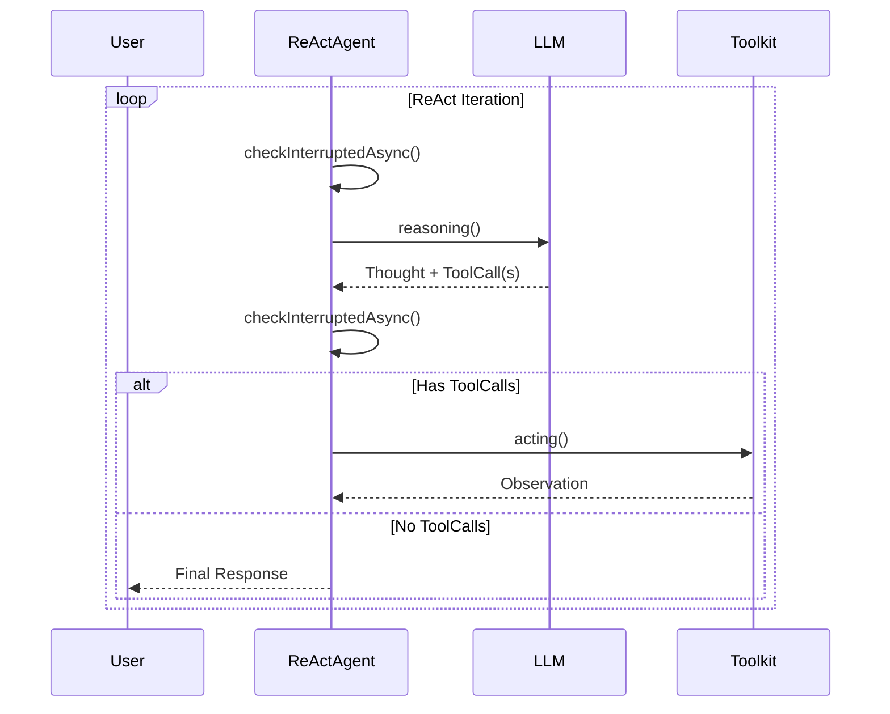
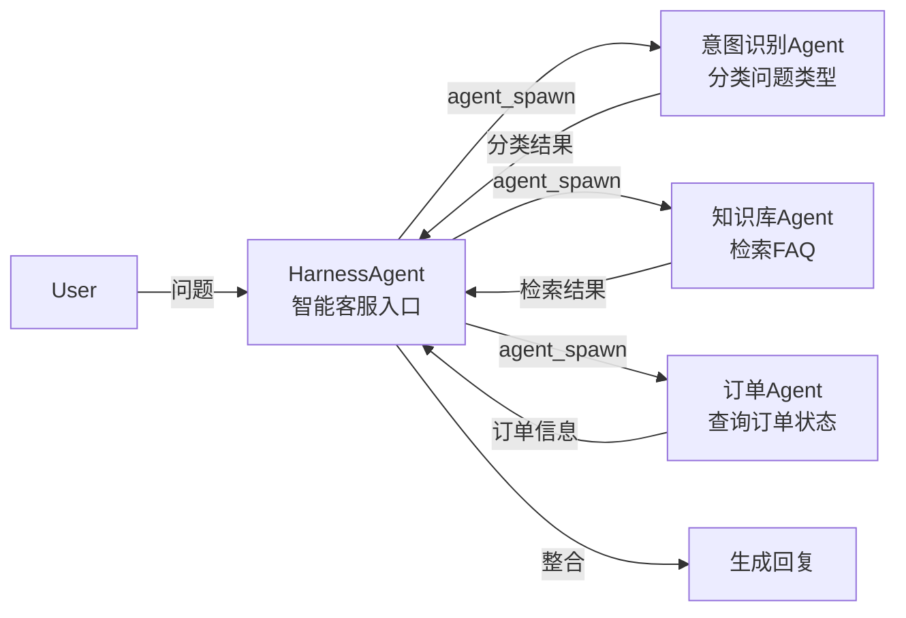

> **核心目标**：掌握 AgentScope Java 的设计哲学、核心算法、组件使用与生产部署，达到独立开发与运维多智能体系统的能力

---
## 目录

1. [第一性原理与设计哲学](#1-第一性原理与设计哲学)
2. [架构分层](#2-架构分层)
3. [核心算法范式：ReAct 循环](#3-核心算法范式react-循环)
4. [核心组件详解](#4-核心组件详解)
5. [生产问题分类与解决方案](#5-生产问题分类与解决方案)
6. [性能调优指南](#6-性能调优指南)
7. [最佳实践（Do/Don’t）](#7-最佳实践-dodont)
8. [完整案例：智能客服多智能体系统](#8-完整案例智能客服多智能体系统)
9. [费曼自测](#9-费曼自测)


## 1. 第一性原理与设计哲学

**核心一句话**：AgentScope Java 是一个**透明的多智能体编程框架**，将智能体应用拆解为**智能体、消息、工具**三要素，并坚持“无隐式魔法”的设计公理。

### 费曼解释：像搭积木一样构建智能体

想象你有一盒乐高积木。每块积木都是一个独立单元（智能体），积木之间通过标准的凸点（消息）连接，而积木可以接上轮子或灯（工具）。AgentScope Java 不提供任何预装的“城堡”模型，它只给你积木、连接规范和工具接口。你可以自由搭建任何结构，并且随时可以看到每一块积木的状态——这就是**透明性**。

### 第一性原则：透明度

AgentScope 的首要设计目标是对开发者透明。许多 Agent 框架将底层的调度进行了深度封装，简化了概念却也带来了排查问题的复杂度。AgentScope 不同：

- **提示词工程**：用户可以自己修改所有提示词相关内容
- **API 调用**：每一次 API 调用都能够被定位
- **Agent 构建**：所有 Agent 的配置都来自用户确定性的配置
- **决策过程**：Agent 的推理、执行过程都可以通过 Hook 或 Middleware 对外暴露

### 从最小要素推导设计公理

多智能体系统的最小不可分要素只有三个：
- **智能体**：具有感知、决策、执行能力的单元
- **消息**：信息的标准化载体
- **工具**：智能体与外部世界交互的能力接口

AgentScope Java 基于此提出了四条**设计公理**：

| 公理 | 推导来源 | 工程体现 |
|------|----------|----------|
| **透明性优先** | 调试复杂系统的唯一方法是完全可观测 | 所有提示词、模型调用、Agent 配置均显式暴露，通过 Middleware 对外暴露决策过程 |
| **模块独立** | 三要素本质正交，不应耦合 | 消息/模型/工具/状态四大组件可独立替换 |
| **生产级就绪** | 真实系统需要高可用、安全、可观测 | 原生支持分布式部署、多租户隔离、沙箱、状态持久化 |
| **模型无关** | 避免供应商锁定 | 内置 OpenAI 协议、DashScope、Anthropic、Gemini 等多种模型，一键切换 |

AgentScope Java 延续“透明开发”理念，把“让智能体在企业环境中可靠运行”做成框架内生能力，进一步聚焦真实场景下的稳定运行、安全控制、分布式部署与接入需求。

### 工程折衷

为了透明性，AgentScope Java 没有提供 AutoGen 那样的自动对话管理高级封装，而是通过 **子 Agent 编排系统** 让开发者手动控制 Agent 之间的委派关系。同时，2.0 版本将 1.x 的“模块大杂烩”拆解为清晰的核心 + 扩展结构。


## 2. 架构分层

**核心一句话**：AgentScope Java 采用 **ReActAgent + HarnessAgent** 双层 Agent 体系，核心、扩展、运行时三圈分离，分布式部署是一等公民。

### 费曼解释

这就像一家餐厅：
- **ReActAgent** = 后厨的炉灶（只负责炒菜，即推理-行动循环）
- **HarnessAgent** = 餐厅经理（在前厅统一接待、管理客人、处理订单、收拾桌面，并可与各后厨协调）

### 架构总览（mermaid）

```mermaid
graph TB
    subgraph Application [应用层]
        A[HarnessAgent<br/>生产级入口/工作区/状态]
    end

    subgraph Core [核心层 - agentscope-core]
        B[ReActAgent<br/>推理-行动引擎]
        C[Model<br/>模型抽象]
        D[Tool<br/>@Tool 方法]
        E[Middleware<br/>中间件链]
    end

    subgraph Extension [扩展层 - agentscope-extensions]
        F[Subagent 编排<br/>子Agent委派]
        G[AgentStateStore<br/>Redis / MySQL / File]
        H[MCP 协议集成<br/>远程工具]
    end

    subgraph Runtime [运行时层 - agentscope-harness]
        I[Workspace<br/>工作区管理]
        J[Sandbox<br/>沙箱隔离]
        K[Session<br/>会话恢复]
    end

    A --> B
    B --> C
    B --> D
    B --> E
    A --> F
    A --> G
    F --> I
    A --> J
    A --> K
    I --> K
    E -.-> H
```

### 架构原则

AgentScope Java 建立在四个基础原则之上：

| 原则 | 说明 | 实现 |
|------|------|------|
| **响应式优先** | 所有操作返回 `Mono`/`Flux` | 基于 Project Reactor，支持非阻塞执行和背压 |
| **分层模块化** | 关注点分离 | 多模块 Maven 结构：core → extensions → harness |
| **扩展点** | 无需修改核心代码即可定制 | Hooks、Tool 注册、Skill Repositories |
| **类型安全** | 强类型消息传递、工具 Schema、结构化输出 | 保障生产级可靠性 |

### 双层 Agent 体系

AgentScope Java 2.0 中，ReActAgent 和 HarnessAgent 各自承担不同职责，共同支撑生产级应用：

#### ReActAgent：核心推理引擎

ReActAgent 是实现 ReAct（推理-行动）迭代循环的核心类，封装了完整的状态和执行逻辑。它直接继承自 AgentBase，使用 Project Reactor 实现非阻塞执行，能够流式处理模型返回内容并实时触发 Hook。

```java
// ReActAgent：轻量级、单一任务
ReActAgent agent = ReActAgent.builder()
    .name("Assistant")
    .sysPrompt("你是一个乐于助人的助手")
    .model(chatModel)
    .maxIterations(10)
    .build();
```

#### HarnessAgent：生产级工程入口（推荐）

HarnessAgent 在 ReActAgent 之上包装了**工作区、Session、记忆、子 Agent、沙箱、技能、Plan Mode**等工程能力。它遵循“薄包装”原则，将核心推理委托给 ReActAgent，同时通过中间件系统管理工程化能力，实现“一次开发，随处部署”。

```java
// HarnessAgent：生产环境推荐入口
HarnessAgent agent = HarnessAgent.builder()
    .name("MyApp")
    .sysPrompt("你是智能助理")
    .model(chatModel)
    .workspace(Path.of("./workspace"))   // 工作区目录
    .stateStore(redisStore)             // 分布式状态存储
    .build();
```


## 3. 核心算法范式：ReAct 循环

**核心一句话**：AgentScope Java 将智能体行为建模为 **Reasoning → Acting → Observation** 的闭环迭代，基于 Project Reactor 响应式编程，支持流式输出和优雅中断。

### 费曼解释

想象你在做数学题：
1. **Reasoning**：思考“这题要用勾股定理”（推理）
2. **Acting**：拿起计算器算平方和（调用工具）
3. **Observation**：看到结果是 25，开方得 5（观察）
4. 循环直到得到最终答案

ReAct（Reasoning and Acting）正是将思考和执行分离，通过迭代循环解决问题的模式。

### ReAct 循环的执行流程

AgentScope Java 的 ReAct 循环采用响应式内核，使用 `Mono.then()` 链式调用保证执行顺序，并在关键节点支持安全中断：



### 核心执行代码

```java
// ReActAgent 核心执行循环（简化示意）
private Mono<Msg> executeIteration(int iter, ConversationHandler handler) {
    // 检查是否达到最大迭代次数
    if (iter >= maxIters) {
        return summarizing(handler);
    }
    // 检查是否被外部中断
    return checkInterruptedAsync()
        // 推理阶段：调用 LLM 思考，生成 Thought 和 ToolCall
        .then(reasoning(handler))
        // 推理耗时较长，再次检查中断
        .then(Mono.defer(this::checkInterruptedAsync))
        // 行动阶段：执行工具调用或返回最终答案
        .then(Mono.defer(() -> actingOrFinish(iter, handler)));
}
```

### 关键技术点

- **响应式编程**：使用 `Mono.then()` 链式调用，保证执行顺序
- **流式处理**：推理阶段使用 `Flux<AgentEvent>` 进行流式处理，模型返回的内容实时分块到达，触发相应事件，让开发者能够实时看到智能体的“思考过程”
- **优雅中断**：在关键节点检查中断标志，支持安全中断，任务可中断后恢复执行

### 代码示例：创建最简 ReActAgent

```java
import io.agentscope.core.ReActAgent;
import io.agentscope.core.message.Msg;
import io.agentscope.core.model.OpenAIChatModel;

public class BasicAgentExample {
    public static void main(String[] args) {
        // 创建模型（接入 DeepSeek）
        OpenAIChatModel model = OpenAIChatModel.builder()
                .apiKey(System.getenv("DEEPSEEK_API_KEY"))
                .modelName("deepseek-chat")
                .baseUrl("https://api.deepseek.com")
                .build();

        // 创建 ReActAgent
        ReActAgent agent = ReActAgent.builder()
                .name("Assistant")
                .sysPrompt("你是一个乐于助人的AI助手，请友好简洁地回答问题。")
                .model(model)
                .build();

        // 调用 Agent
        Msg userMsg = Msg.user("你好，请介绍一下自己");
        String reply = agent.call(userMsg).block().getTextContent();
        System.out.println(reply);
    }
}
```


## 4. 核心组件详解

### 4.1 统一模型接入（Model）

支持 OpenAI 协议（DeepSeek、GLM、Ollama 等）、DashScope（通义千问）、Anthropic Claude、Google Gemini 等。

```java
import io.agentscope.core.model.OpenAIChatModel;
import io.agentscope.core.model.DashScopeChatModel;

// 使用 DeepSeek
OpenAIChatModel model = OpenAIChatModel.builder()
        .apiKey(System.getenv("DEEPSEEK_API_KEY"))
        .modelName("deepseek-chat")
        .baseUrl("https://api.deepseek.com")
        .stream(true)           // 启用流式输出
        .enableThinking(true)   // 启用思考模式（DeepSeek 特有）
        .build();

// 切换至通义千问
DashScopeChatModel qwenModel = DashScopeChatModel.builder()
        .apiKey(System.getenv("DASHSCOPE_API_KEY"))
        .modelName("qwen-max")
        .build();
```

### 4.2 消息模型（Msg）

AgentScope Java 2.0 的核心消息类是 `Msg`，是一个不可变对象，推荐使用静态工厂方法创建：

```java
import io.agentscope.core.message.Msg;

// 用户消息
Msg userMsg = Msg.user("今天天气如何？");

// 系统消息（提示）
Msg sysMsg = Msg.system("你是一个天气助手。");

// 助手回复消息
Msg assistantMsg = Msg.assistant("北京今天晴天，25°C。");
```

### 4.3 HarnessAgent——生产级推荐入口

```java
import io.agentscope.harness.HarnessAgent;
import io.agentscope.core.state.RedisAgentStateStore;
import io.agentscope.core.agent.RuntimeContext;
import java.nio.file.Path;

RedisAgentStateStore store = RedisAgentStateStore.builder()
        .host(System.getenv("REDIS_HOST"))
        .port(Integer.parseInt(System.getenv("REDIS_PORT")))
        .build();

HarnessAgent agent = HarnessAgent.builder()
        .name("MyAgent")
        .sysPrompt("你是一个智能助理，能够根据用户需求调用工具。")
        .model(model)
        .workspace(Path.of("./workspace"))  // 工作区目录
        .stateStore(store)                 // 状态存储
        .build();

RuntimeContext ctx = RuntimeContext.builder()
        .sessionId("user_123_session_01")
        .userId("user_123")
        .build();

agent.call(Msg.user("帮我查天气"), ctx)
        .subscribe(response -> System.out.println(response.getTextContent()));
```

### 4.4 @Tool 注解——工具定义

通过 `@Tool` 注解将任意 Java 方法注册为 Agent 可调用的工具：

```java
import io.agentscope.core.tool.Tool;
import io.agentscope.core.tool.ToolParam;
import io.agentscope.core.tool.Toolkit;
import java.time.LocalDateTime;
import java.time.ZoneId;

public class MyTools {
    @Tool(name = "get_current_time", 
          description = "获取指定时区的当前时间")
    public String getCurrentTime(
            @ToolParam(name = "timezone", description = "时区名称，例如 'Asia/Shanghai'") 
            String timezone) {
        LocalDateTime now = LocalDateTime.now(ZoneId.of(timezone));
        return "当前时间 (" + timezone + "): " + now.toString();
    }
}

// 注册工具到 Agent
Toolkit toolkit = new Toolkit();
toolkit.registerTool(new MyTools());

ReActAgent agent = ReActAgent.builder()
        .name("TimeAgent")
        .toolkit(toolkit)
        // ... 其他配置
        .build();
```

### 4.5 AgentStateStore——状态持久化

AgentScope Java 2.0 用 `AgentState + AgentStateStore` 取代了 1.x 的 Memory 体系，实现跨进程、跨机器、跨副本的状态恢复。

| 实现类 | 适用场景 | 特点 |
|--------|----------|------|
| `RedisAgentStateStore` | 生产环境 | 高性能、分布式、支持过期时间 |
| `MysqlAgentStateStore` | 生产环境（强一致性） | ACID 保证，支持事务，适合金融/审计场景 |
| `JsonFileAgentStateStore` | 开发/单机 | 无依赖，状态落地为 JSON 文件 |
| `InMemoryAgentStateStore` | 单元测试 | 内存存储，进程级 |

#### 双钥匙机制

实现跨调用的记忆需要两样东西：

| 钥匙 | 作用 | 在哪配 |
|------|------|--------|
| `AgentStateStore` | 决定状态存哪里（内存/文件/Redis/MySQL） | `HarnessAgent.builder().stateStore(...)` |
| `RuntimeContext.sessionId` | 决定「这是哪场会话」——Store 查询的主键 | 每次 `agent.call(msg, rt)` 时传入 |

```java
// 配置状态存储（钥匙一）
JsonFileAgentStateStore store = new JsonFileAgentStateStore(Path.of("./workspace", "state"));
HarnessAgent agent = HarnessAgent.builder()
        .stateStore(store)
        .build();

// 传入 sessionId（钥匙二）
RuntimeContext ctx = RuntimeContext.builder()
        .sessionId("user_123_session_001")
        .userId("user_123")
        .build();

// 第一轮：Agent 记住对话
String reply1 = agent.call(Msg.user("杭州今天天气如何？"), ctx)
        .block().getTextContent();

// 第二轮：通过相同的 sessionId 恢复上下文
String reply2 = agent.call(Msg.user("那上海呢？"), ctx)
        .block().getTextContent();
```

### 4.6 中间件（Middleware）系统

Middleware 在 Agent 的生命周期中提供灵活拦截机制，遵循**洋葱模式**——中间件像洋葱一样层层包裹核心执行逻辑。

| Hook | 模式 | 执行点 |
|------|------|--------|
| `on_reply` | 洋葱 | Agent 回复入口 |
| `on_reasoning` | 洋葱 | 推理阶段（思考+模型调用） |
| `on_acting` | 洋葱 | 工具执行层 |
| `on_model_call` | 洋葱 | 模型 API 交互 |
| `on_system_prompt` | 转换器 | 系统提示词生成 |

```java
import io.agentscope.core.middleware.MiddlewareBase;

public class LoggingMiddleware extends MiddlewareBase {
    @Override
    public Mono<AgentEvent> onReasoning(ReasoningContext ctx) {
        System.out.println("[推理阶段] 正在调用模型");
        return super.onReasoning(ctx);
    }
    
    @Override
    public Mono<AgentEvent> onActing(ActingContext ctx) {
        System.out.println("[行动阶段] 正在执行工具: " + ctx.getToolName());
        return super.onActing(ctx);
    }
}

// 注入中间件
ReActAgent agent = ReActAgent.builder()
        .middleware(new LoggingMiddleware())
        .build();
```

### 4.7 子 Agent 编排

AgentScope Java 2.0 通过 **SubagentDeclaration** 声明子 Agent，主 Agent 通过 `agent_spawn` 工具委派任务，支持同步委派（`timeout_seconds > 0`）和后台委派（=0）。

```markdown
# workspace/subagents/analyst.md
---
name: analyst
sys_prompt: 你是数据分析师，擅长处理销售数据
model: deepseek-chat
---
```

工作区中，`AGENTS.md` 定义 Agent 人格，`MEMORY.md` 沉淀长期事实，`subagents/<id>.md` 声明子 Agent，**文件即配置**。

### 4.8 MCP 协议集成

AgentScope Java 集成 MCP（Model Context Protocol），支持 Agent 通过标准化协议调用外部工具和服务。

```yaml
# workspace/mcp/servers.yaml
servers:
  - name: filesystem
    command: npx
    args: ["-y", "@modelcontextprotocol/server-filesystem", "/tmp"]
  - name: github
    url: https://mcp.github.com/sse
```

在 Agent 提示词中，MCP 工具与本地 `@Tool` 方法具有相同的调用方式。

### 4.9 Runtime 部署——分布式与沙箱

AgentScope Java 2.0 把分布式部署做成了一等公民，**同一份业务代码**可以按需切换到分布式形态。

- **单机开发**：会话状态默认落到 `workspace` 目录，零配置开箱即用
- **生产部署**：替换状态后端为分布式存储（Redis/MySQL），所有运行时信息（对话历史、上下文摘要、任务计划、待办事项、权限规则）被完全外部化，任意副本节点都能拉取完整状态快照并继续执行

在沙箱模式下，执行环境的状态每次会话结束后被捕获为快照写入对象存储或 Redis 缓存；当容器迁移到其他服务器节点时，下一次执行从最后的状态快照重建完全相同的 workspace，对用户而言无停机感知。


## 5. 生产问题分类与解决方案

### 5.1 模型 API 类问题

#### 问题 1：API 限流（Rate Limit）

- **症状**：调用 `agent.call()` 时返回 `429 Too Many Requests`
- **解决方案**：实现带重试的调用

```java
String result = agent.call(userMsg)
        .retryWhen(Retry.backoff(3, Duration.ofSeconds(1))
                .maxBackoff(Duration.ofSeconds(30))
                .doBeforeRetry(rs -> System.err.println("重试第 " + rs.totalRetries() + " 次")))
        .block()
        .getTextContent();
```

#### 问题 2：Token 超限（Context Overflow）

- **症状**：模型返回 `maximum context length exceeded`
- **解决方案**：启用上下文压缩（通过 CompactionMiddleware）

```java
// 在 HarnessAgent 中配置上下文压缩中间件
HarnessAgent agent = HarnessAgent.builder()
        .middleware(new CompactionMiddleware())  // 自动上下文压缩
        // ...
        .build();
```

### 5.2 智能体行为类问题

#### 问题 3：循环推理（Loop in Reasoning）

- **症状**：Agent 反复生成相同或相似的推理步骤
- **解决方案**：设置最大迭代步数

```java
ReActAgent agent = ReActAgent.builder()
        .maxIterations(10)  // 最大推理步数
        // ...
        .build();
```

#### 问题 4：工具调用参数解析错误

- **症状**：模型生成的工具调用参数格式不正确
- **解决方案**：增强 `@ToolParam` 的 `description` 描述

```java
@Tool(name = "search_products", description = "根据关键词搜索商品")
public List<Product> searchProducts(
    @ToolParam(name = "keyword", description = "搜索关键词，例如 '手机'、'电脑'") String keyword,
    @ToolParam(name = "minPrice", description = "最低价格，例如 1000") double minPrice
) { /* ... */ }
```

### 5.3 状态与记忆类问题

#### 问题 5：多轮对话丢失上下文

- **症状**：上一轮刚问过的问题，下一轮 Agent 就不记得了
- **诊断**：检查是否配置了 `AgentStateStore` 以及每次调用是否传递相同的 `sessionId`
- **解决方案**：确保双钥匙机制完整

```java
// 钥匙一：stateStore 已配置
HarnessAgent agent = HarnessAgent.builder()
        .stateStore(new RedisAgentStateStore(...))
        .build();

// 钥匙二：每次调用传递相同 sessionId
RuntimeContext ctx = RuntimeContext.builder()
        .sessionId(sessionId)  // 必须是相同的
        .build();
```

### 5.4 基础设施类问题

#### 问题 6：沙箱环境无法启动

- **症状**：Agent 调用工具时返回沙箱连接错误
- **诊断**：检查 Docker 容器状态和网络连通性
- **解决方案**：验证沙箱配置，确保沙箱后端服务正常运行

### 5.5 故障排查通用流程

| 步骤 | 操作 | 关键检查点 |
|------|------|------------|
| 1 | 查看日志 | 搜索 ERROR/WARN 级别日志，定位异常堆栈 |
| 2 | 检查模型配置 | 验证 API Key、Base URL、模型名称是否正确 |
| 3 | 检查状态存储 | 确认 `AgentStateStore` 后端可正常读写 |
| 4 | 检查沙箱 | 验证 Docker 容器运行状态 |
| 5 | 简化复现 | 剔除工具、精简提示词，用最简单案例重现场景 |


## 6. 性能调优指南

**核心一句话**：从**响应式并发**、**状态后端**、**中间件开销**、**资源配额**四个维度进行调优。

### 调优参数速查表

| 维度 | 配置项 | 推荐值 | 说明 |
|------|--------|--------|------|
| 响应式 | `maxIterations` | 10-15 | ReAct 循环最大步数 |
| 响应式 | Scheduler 线程数 | CPU 核心数×2 | 响应式线程池 |
| 状态存储 | Redis 后端 | 高并发生产首选 | 支持水平扩展 |
| 状态存储 | MySQL 后端 | 强一致需求首选 | 支持事务 |
| 状态存储 | JsonFile 后端 | 仅开发/单机 | 不适合多副本 |
| 中间件 | 生产环境 Middleware | 精简必要拦截器 | 每个 Middleware 增加开销 |
| 部署 | K8s 副本数 | 3-10 | 根据 QPS 动态扩缩 |
| 部署 | CPU/Memory 配额 | 1核/2GB+ | 保障稳定运行 |

### 响应式线程池配置

```java
@Configuration
public class ReactiveConfig {
    @Bean
    public Scheduler boundedElasticScheduler() {
        return Schedulers.newBoundedElastic(
            10,    // 线程数
            100,   // 队列容量
            "agent-worker"
        );
    }
}
```

### 状态存储连接池配置

Redis 客户端（Lettuce）配置：

```yaml
spring:
  redis:
    lettuce:
      pool:
        max-active: 8
        max-idle: 8
        min-idle: 2
```

### 中间件优化

生产环境中，仅启用必要的中间件（日志、监控），避免不必要的拦截开销：

```java
// 开发阶段：启用调试中间件
agent = ReActAgent.builder()
        .middleware(new LoggingMiddleware())
        .middleware(new MetricsMiddleware())
        .build();

// 生产阶段：仅保留必要中间件
agent = ReActAgent.builder()
        .middleware(new MetricsMiddleware())  // 只保留监控
        // .middleware(new LoggingMiddleware())  // 移除调试日志
        .build();
```


## 7. 最佳实践（Do/Don‘t）

| 领域 | ✅ Do | ❌ Don‘t |
|------|-------|----------|
| **Agent 构建** | 生产环境使用 `HarnessAgent`，开发调试用 `ReActAgent` | 直接使用原始 `ReActAgent` 处理复杂业务 |
| **工具定义** | 为每个 `@Tool` 方法写详细的 `name` 和 `description` | 写缺少注释的工具方法 |
| **状态管理** | 生产环境使用 `RedisAgentStateStore`，开发用 `JsonFileAgentStateStore` | 不使用 `AgentStateStore`，每次调用都是新会话 |
| **会话隔离** | 用 `RuntimeContext.sessionId` + `userId` 实现多租户隔离 | 所有用户共享同一个 `sessionId` |
| **中间件** | 使用 `MiddlewareBase` 实现日志、监控、权限控制 | 在 Agent 代码中硬编码横切逻辑 |
| **部署** | 生产环境使用分布式状态后端 + 沙箱快照 | 单机文件存储状态下部署多副本 |
| **响应式编程** | 使用 `.subscribe()` 异步处理，始终提供错误处理 | 在主线程使用 `.block()`（仅限测试） |
| **配置管理** | 使用 `@ConfigurationProperties` 集中管理配置 | 硬编码 API Key 和连接参数 |


## 8. 完整案例：智能客服多智能体系统

### 场景描述

构建一个自动化的智能客服系统：用户输入咨询问题，系统通过多 Agent 协作，实现意图识别 → 业务查询 → 分析 → 反馈的完整流程。

### 架构图



### 核心实现

#### Step 1: 工具定义

```java
import io.agentscope.core.tool.Tool;
import io.agentscope.core.tool.ToolParam;

public class CustomerServiceTools {
    @Tool(name = "search_knowledge_base", description = "从知识库检索常见问题答案")
    public String searchKnowledgeBase(
            @ToolParam(name = "query", description = "用户问题关键词") String query) {
        // 调用知识库 API
        return "根据知识库，该问题的答案是...";
    }
    
    @Tool(name = "query_order", description = "查询订单状态")
    public String queryOrder(
            @ToolParam(name = "orderId", description = "订单号") String orderId) {
        // 调用订单系统
        return "订单状态为：已发货，物流单号 SF123456";
    }
}
```

#### Step 2: 子 Agent 声明（工作区）

```markdown
# workspace/subagents/intent_classifier.md
---
name: intent_classifier
sys_prompt: |
  你是意图识别专家，分析用户输入的分类：
  - 售前咨询
  - 售后服务
  - 投诉建议
  - 其他
model: deepseek-chat
---
```

#### Step 3: 主 Agent 实现

```java
import io.agentscope.harness.HarnessAgent;
import io.agentscope.core.message.Msg;
import io.agentscope.core.agent.RuntimeContext;
import java.nio.file.Path;

public class CustomerServiceAgent {
    public static void main(String[] args) {
        // 创建工具
        Toolkit toolkit = new Toolkit();
        toolkit.registerTool(new CustomerServiceTools());
        
        // 创建 HarnessAgent（自动加载 workspace/subagents）
        HarnessAgent agent = HarnessAgent.builder()
                .name("customer_service")
                .sysPrompt("""
                    你是智能客服助手，根据用户问题类别调用对应的子Agent：
                    - 售前咨询：调用售前知识库
                    - 售后服务：调用订单查询和售后政策
                    - 投诉建议：记录并升级处理
                    """)
                .model(model)
                .toolkit(toolkit)
                .workspace(Path.of("./workspace"))
                .build();
        
        // 运行客服系统
        RuntimeContext ctx = RuntimeContext.builder()
                .sessionId("user_123_session_001")
                .build();
        
        Msg userMsg = Msg.user("我的订单多久能到？");
        String reply = agent.call(userMsg, ctx)
                .timeout(Duration.ofSeconds(30))
                .onErrorResume(e -> {
                    System.err.println("处理失败: " + e.getMessage());
                    return Mono.just(Msg.assistant("系统繁忙，请稍后再试"));
                })
                .block()
                .getTextContent();
        
        System.out.println(reply);
    }
}
```

#### Step 4: 生产部署配置

```yaml
# application-prod.yml
agentscope:
  state:
    store:
      type: redis
      redis:
        host: ${REDIS_HOST}
        port: ${REDIS_PORT}
  agent:
    max-iterations: 10
    timeout: 30s
spring:
  profiles:
    active: prod
```

```dockerfile
# Dockerfile
FROM openjdk:17-jdk-slim
COPY target/customer-service.jar app.jar
ENTRYPOINT ["java", "-jar", "app.jar"]
```


## 9. 费曼自测

完成本文档学习后，请尝试用自己的话解释以下三个概念（不要回头看文档）：

1. **什么是 AgentScope Java 的“透明度”第一性原则？它为什么重要？**
   - 提示：提示词、API 调用、Agent 配置都显式暴露，没有隐式魔法。

2. **ReAct 循环中 HarnessAgent 和 ReActAgent 的职责分别是什么？**
   - 提示：ReActAgent 是推理-行动引擎（炉灶），HarnessAgent 是工程化入口（餐厅经理）。

3. **为什么 2.0 用 AgentStateStore 替代 1.x 的 Memory？**
   - 提示：职责单一——存储与持久化分离；HarnessAgent 工作区天然不适合塞进一个 Java 对象。

如果能流利回答，恭喜你已掌握 AgentScope Java 的核心知识！


## 附录：关键资源

| 资源 | 地址 |
|------|------|
| GitHub 仓库 | https://github.com/agentscope-ai/agentscope-java |
| 官方文档（中文） | https://doc.agentscope.io/zh_CN |
| DeepWiki 架构文档 | https://deepwiki.com/agentscope-ai/agentscope-java |
| 新手村系列 | 阿里云开发者社区 |
| 企业级部署实践 | 阿里云官网博客 |

---

## 1. 引言

### 1.1 文档目的

本文档提供 AgentScope Java 框架的完整技术说明，包括架构设计、核心概念、API 使用及生产部署最佳实践。

### 1.2 适用范围

使用 AgentScope Java 框架进行多智能体应用开发的软件工程师与技术架构师。

---

## 2. 环境准备与依赖配置

### 2.1 Maven 依赖

```xml
<dependencies>
    <!-- 核心框架（ReActAgent、HarnessAgent、工具、状态存储） -->
    <dependency>
        <groupId>io.agentscope</groupId>
        <artifactId>agentscope-core</artifactId>
        <version>2.0.0</version>
    </dependency>

    <!-- HarnessAgent（生产级入口，含工作区、子Agent编排） -->
    <dependency>
        <groupId>io.agentscope</groupId>
        <artifactId>agentscope-harness</artifactId>
        <version>2.0.0</version>
    </dependency>

    <!-- Spring Boot 自动配置（可选） -->
    <dependency>
        <groupId>io.agentscope</groupId>
        <artifactId>agentscope-spring-boot-starter</artifactId>
        <version>2.0.0</version>
    </dependency>
</dependencies>
```

### 2.2 环境变量配置

```bash
# OpenAI 协议（DeepSeek、GLM、Ollama 等）
OPENAI_API_KEY=your_api_key
OPENAI_BASE_URL=https://api.deepseek.com

# 阿里云 DashScope（通义千问）
DASHSCOPE_API_KEY=your_dashscope_key

# Redis 状态存储（生产推荐）
REDIS_HOST=localhost
REDIS_PORT=6379
REDIS_PASSWORD=
```

---

## 3. 核心架构设计

### 3.1 响应式编程模型

AgentScope Java 完全基于 **Project Reactor** 构建，所有 Agent 调用、工具执行、状态读写均返回 `Mono` 或 `Flux`。**严禁在主线程中使用 `.block()`**（仅限测试或非响应式入口）。

### 3.2 系统架构图

```mermaid
graph TB
    subgraph Application
        A[HarnessAgent<br/>入口/工作区/状态]
    end

    subgraph Core
        B[ReActAgent<br/>推理-行动引擎]
        C[Model<br/>模型抽象]
        D[Tool<br/>@Tool 方法]
        E[Middleware<br/>中间件链]
    end

    subgraph Extension
        F[Subagent 编排]
        G[AgentStateStore<br/>Redis / MySQL / File]
        H[MCP 协议集成]
    end

    subgraph Runtime
        I[沙箱执行环境]
        J[分布式状态同步]
        K[Studio 链路追踪]
    end

    A --> B
    B --> C
    B --> D
    B --> E
    A --> F
    A --> G
    F --> I
    G --> J
    E --> K
```

---

## 4. 核心组件详解

### 4.1 Agent 核心接口与实现

AgentScope Java 2.0 提供两种 Agent：

| 类型 | 职责 | 适用场景 |
|------|------|----------|
| `ReActAgent` | 独立的 ReAct 循环引擎，封装状态、模型、工具、中间件 | 单一任务、低延迟、轻量级 |
| `HarnessAgent` | 在 `ReActAgent` 之上包装工作区、会话、子Agent 编排 | 生产系统、多轮对话、状态持久化 |

#### 4.1.1 ReActAgent 示例

```java
import io.agentscope.core.ReActAgent;
import io.agentscope.core.message.Msg;
import io.agentscope.core.model.OpenAIChatModel;

OpenAIChatModel model = OpenAIChatModel.builder()
        .apiKey(System.getenv("OPENAI_API_KEY"))
        .modelName("deepseek-chat")
        .baseUrl(System.getenv("OPENAI_BASE_URL"))
        .build();

ReActAgent agent = ReActAgent.builder()
        .name("Assistant")
        .sysPrompt("你是一个乐于助人的助手。")
        .model(model)
        .maxIterations(10)
        .build();

Mono<String> reply = agent.call(Msg.user("你好"))
        .map(response -> response.getTextContent());

reply.subscribe(System.out::println);
```

#### 4.1.2 HarnessAgent 示例（生产推荐）

```java
import io.agentscope.harness.HarnessAgent;
import io.agentscope.core.state.RedisAgentStateStore;
import java.nio.file.Path;

RedisAgentStateStore store = RedisAgentStateStore.builder()
        .host(System.getenv("REDIS_HOST"))
        .port(Integer.parseInt(System.getenv("REDIS_PORT")))
        .build();

HarnessAgent agent = HarnessAgent.builder()
        .name("MyApp")
        .sysPrompt("你是智能助理。")
        .model(model)
        .workspace(Path.of("./workspace"))
        .stateStore(store)
        .build();

RuntimeContext ctx = RuntimeContext.builder()
        .sessionId("user_123_session_01")
        .userId("user_123")
        .build();

agent.call(Msg.user("帮我查天气"), ctx)
        .subscribe(response -> System.out.println(response.getTextContent()));
```

### 4.2 消息模型

AgentScope Java 2.0 的核心消息类是 `Msg`（位于 `io.agentscope.core.message.Msg`）。它是一个不可变对象，封装了消息角色（`role`）、内容（`content`）及元数据。推荐使用静态工厂方法创建：

```java
import io.agentscope.core.message.Msg;

// 用户消息
Msg userMsg = Msg.user("今天天气如何？");

// 系统消息（提示）
Msg sysMsg = Msg.system("你是一个天气助手。");

// 助手回复消息
Msg assistantMsg = Msg.assistant("北京今天晴天，25°C。");

// 携带自定义元数据
Msg msgWithMeta = Msg.user("搜索")
        .withMetadata(Map.of("user_id", "123"));
```

### 4.3 工具集成机制

#### 4.3.1 @Tool 与 @ToolParam 注解

```java
import io.agentscope.core.tool.Tool;
import io.agentscope.core.tool.ToolParam;

public class WeatherTools {
    @Tool(name = "get_weather", description = "获取指定城市的天气")
    public String getWeather(
            @ToolParam(name = "city", description = "城市名称，例如 'Beijing'") String city,
            @ToolParam(name = "unit", description = "温度单位，celsius 或 fahrenheit") String unit) {
        // 模拟调用
        return city + " 当前温度 22°C";
    }
}
```

#### 4.3.2 工具注册方式

**推荐：在 HarnessAgent 中自动扫描工作区**

将工具类放在 `workspace/tools` 目录，或通过 `Toolkit` 手动注册：

```java
Toolkit toolkit = new Toolkit();
toolkit.registerTool(new WeatherTools());

ReActAgent agent = ReActAgent.builder()
        .toolkit(toolkit)
        // ...
        .build();
```

#### 4.3.3 MCP 协议集成

AgentScope Java 2.0 内置对 **Model Context Protocol (MCP)** 的支持，允许 Agent 通过标准化协议调用外部 MCP Server 提供的工具。

启用 MCP 集成只需在 `HarnessAgent` 的工作区中声明 MCP Server 配置（例如 `workspace/mcp/servers.yaml`），Agent 会自动发现并加载远程工具。

```yaml
# workspace/mcp/servers.yaml
servers:
  - name: filesystem
    command: npx
    args: ["-y", "@modelcontextprotocol/server-filesystem", "/tmp"]
  - name: github
    url: https://mcp.github.com/sse
```

在 Agent 提示词中，MCP 工具与本地 `@Tool` 方法具有相同的调用方式。

### 4.4 状态管理（AgentStateStore）

AgentScope Java 2.0 内置多种状态存储后端，均实现 `AgentStateStore` 接口。

| 实现类 | 适用场景 | 特点 |
|--------|----------|------|
| `RedisAgentStateStore` | 生产环境 | 高性能、分布式、支持过期时间 |
| `MysqlAgentStateStore` | 生产环境（强一致性） | ACID 保证，支持事务，适合金融/审计场景 |
| `JsonFileAgentStateStore` | 开发/单机 | 无依赖，状态落地为 JSON 文件 |
| `InMemoryAgentStateStore` | 单元测试 | 内存存储，进程级 |

**使用示例（MySQL）：**

```java
MysqlAgentStateStore store = MysqlAgentStateStore.builder()
        .jdbcUrl("jdbc:mysql://localhost:3306/agentscope")
        .username("root")
        .password("secret")
        .tableName("agent_state")
        .build();
```

**使用示例（Redis）：**

```java
RedisAgentStateStore store = RedisAgentStateStore.builder()
        .host("localhost")
        .port(6379)
        .database(0)
        .keyPrefix("agentscope:state:")
        .ttl(Duration.ofHours(24))
        .build();
```

注入 `HarnessAgent`：

```java
HarnessAgent agent = HarnessAgent.builder()
        .stateStore(store)
        // ...
        .build();
```

### 4.5 中间件（Middleware）

```java
import io.agentscope.core.middleware.MiddlewareBase;

public class LoggingMiddleware extends MiddlewareBase {
    @Override
    public Mono<AgentEvent> onReasoning(ReasoningContext ctx) {
        System.out.println("推理阶段，消息数: " + ctx.getMessages().size());
        return super.onReasoning(ctx);
    }
}

agent = ReActAgent.builder()
        .middleware(new LoggingMiddleware())
        .build();
```

---

## 5. 异常处理

AgentScope Java 2.0 未定义固定的异常类型体系，所有错误均通过 Reactor 的 `onError` 传播。建议在应用层统一处理：

```java
agent.call(message)
    .timeout(Duration.ofSeconds(30))
    .onErrorResume(TimeoutException.class, e -> Mono.just(AgentResponse.error("请求超时")))
    .onErrorResume(e -> {
        log.error("Agent 执行失败", e);
        return Mono.just(AgentResponse.error("内部错误"));
    })
    .subscribe();
```

---

## 6. 安全配置

### 6.1 API 密钥管理

使用环境变量或 Spring Cloud Config 注入，**禁止硬编码**。

```java
@Value("${agentscope.openai.api-key}")
private String openaiApiKey;
```

### 6.2 敏感信息加密（推荐方案）

使用 Jasypt 或云厂商 KMS 对配置中的密钥加密。

---

## 7. 性能优化

### 7.1 响应式线程池配置

```java
@Configuration
public class ReactiveConfig {
    @Bean
    public Scheduler boundedElasticScheduler() {
        return Schedulers.newBoundedElastic(10, 100, "agent-worker");
    }
}
```

### 7.2 状态存储连接池

Redis 客户端（Lettuce）默认支持连接池，配置参考：

```yaml
spring:
  redis:
    lettuce:
      pool:
        max-active: 8
        max-idle: 8
        min-idle: 2
```

MySQL 连接池推荐 HikariCP。

---

## 8. 监控与日志

AgentScope Java 不内置 Micrometer 集成，但可以通过中间件自行埋点：

```java
public class MetricsMiddleware extends MiddlewareBase {
    private final MeterRegistry registry;
    @Override
    public Mono<AgentEvent> onModelCall(ModelCallContext ctx) {
        long start = System.nanoTime();
        return super.onModelCall(ctx)
                .doOnSuccess(r -> recordDuration(start));
    }
}
```

结构化日志推荐使用 SLF4J + MDC。

---

## 9. 测试策略

### 9.1 单元测试（使用 StepVerifier）

```java
@Test
void testAgentReply() {
    ReActAgent agent = ReActAgent.builder()
            .model(new MockModel("test response"))
            .build();
    StepVerifier.create(agent.call(Msg.user("hi")))
            .expectNextMatches(r -> r.getTextContent().equals("test response"))
            .verifyComplete();
}
```

### 9.2 集成测试

使用 `@SpringBootTest` 配合 `TestRestTemplate`。

---

## 10. 部署指南

### 10.1 生产环境配置（application.yml）

```yaml
agentscope:
  state:
    store:
      type: redis   # 或 mysql
      redis:
        host: ${REDIS_HOST}
        port: ${REDIS_PORT}
      mysql:
        jdbc-url: ${MYSQL_JDBC_URL}
        username: ${MYSQL_USER}
        password: ${MYSQL_PASSWORD}
  agent:
    max-iterations: 10
    timeout: 30s
spring:
  profiles:
    active: prod
```

### 10.2 Docker 部署

```dockerfile
FROM openjdk:17-jdk-slim
COPY target/app.jar app.jar
ENTRYPOINT ["java", "-jar", "app.jar"]
```

### 10.3 Kubernetes 部署

```yaml
apiVersion: apps/v1
kind: Deployment
metadata:
  name: agentscope
spec:
  replicas: 3
  template:
    spec:
      containers:
      - name: agent
        image: agentscope/java:2.0.0
        env:
        - name: REDIS_HOST
          value: redis-service
        resources:
          requests:
            memory: "512Mi"
            cpu: "250m"
```

---

## 11. 最佳实践

### 11.1 响应式编程

**❌ 错误示例：**

```java
String result = agent.call(msg).block();  // 阻塞主线程
```

**✅ 正确示例：**

```java
agent.call(msg)
    .subscribeOn(Schedulers.boundedElastic())
    .subscribe(result -> handle(result));
```

### 11.2 配置管理

使用 `@ConfigurationProperties` 集中管理。

### 11.3 错误处理

始终在订阅链上提供 `onErrorResume` 或 `onErrorMap`。

### 11.4 状态存储选择

- **开发/测试**：`JsonFileAgentStateStore` 或 `InMemoryAgentStateStore`
- **高并发生产**：`RedisAgentStateStore`（低延迟、水平扩展）
- **强一致性生产**：`MysqlAgentStateStore`（事务、审计）

---

## 12. 常见问题解答

**Q：Agent 响应慢，如何定位？**  
A：检查 Redis/MySQL 延迟、模型 API 耗时，启用中间件记录各阶段耗时。

**Q：状态存储如何从文件切换到 Redis/MySQL？**  
A：修改配置 `agentscope.state.store.type=redis` 或 `mysql`，并提供对应连接参数。

**Q：是否支持 Java 8？**  
A：AgentScope Java 2.0 要求 Java 11+，推荐 Java 17。

**Q：如何调用 MCP Server 提供的工具？**  
A：在 `workspace/mcp/servers.yaml` 中声明 MCP Server，Agent 会自动发现工具并在提示词中可用。

**Q：消息对象应该使用 `Msg` 还是自定义类？**  
A：统一使用 `Msg`，它是框架的标准消息载体，支持多模态内容块（`ContentBlock`）和元数据。

**Q：生产环境多副本部署时状态如何同步？**  
A：使用 Redis 或 MySQL 作为共享状态存储后端，所有副本共享同一数据源。
