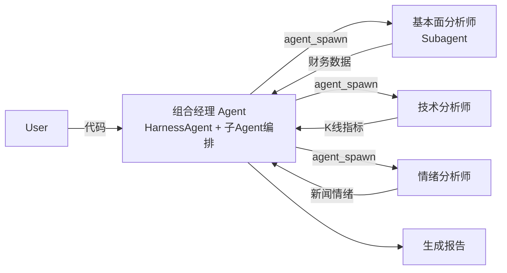

> **核心目标**：掌握 AgentScope Java 的设计哲学、核心机制、生产问题解决与调优，达到独立开发与部署多智能体系统的能力。

---
## 目录

1. [第一性原理与设计哲学](#1-第一性原理与设计哲学)
2. [架构分层](#2-架构分层)
3. [核心算法范式：ReAct 与响应式中断](#3-核心算法范式react-与响应式中断)
4. [主要功能详解](#4-主要功能详解)
5. [生产问题分类与解决方案](#5-生产问题分类与解决方案)
6. [性能调优指南](#6-性能调优指南)
7. [最佳实践（Do/Don't）](#7-最佳实践-dodont)
8. [完整案例：金融分析多智能体系统](#8-完整案例金融分析多智能体系统)
9. [费曼自测](#9-费曼自测)

## 1. 第一性原理与设计哲学

**核心一句话**：AgentScope Java 是一个**透明的多智能体编程框架**，它将智能体应用拆解为**智能体、消息、工具**三要素，并坚持“无隐式魔法”的设计公理。

### 费曼解释：像搭积木一样构建智能体

想象你有一盒乐高积木。每块积木都是一个独立单元（智能体），积木之间通过标准的凸点（消息）连接，而积木可以接上轮子或灯（工具）。AgentScope Java 不提供任何预装的“城堡”模型，它只给你积木、连接规范和工具接口。你可以自由搭建任何结构，并且随时可以看到每一块积木的状态——这就是“透明性”。

### 从最小要素推导设计公理

多智能体系统的最小不可分要素只有三个：
- **智能体**：具有感知、决策、执行能力的单元
- **消息**：信息的标准化载体
- **工具**：智能体与外部世界交互的能力接口

AgentScope Java 基于此提出了四条**设计公理**（必然推导）：

| 公理 | 推导来源 | 工程体现 |
|------|----------|----------|
| **透明性优先** | 调试复杂系统的唯一方法是完全可观测 | 所有提示词、模型调用、Agent 配置均显式暴露，通过 Hook/Middleware 对外暴露决策过程 |
| **模块独立** | 三要素本质正交，不应耦合 | 消息/模型/工具/状态四大组件可独立替换 |
| **生产级就绪** | 现实系统需要高可用、安全、可观测 | 2.0 原生支持分布式部署、多租户隔离、沙箱、状态持久化 |
| **模型无关** | 避免供应商锁定 | 内置 OpenAI 协议、DashScope、Anthropic、Gemini 等，一键切换 |

**工程折衷**：为了透明性，AgentScope Java 没有提供 AutoGen 那样的自动对话管理高级封装，而是通过**子 Agent 编排系统**让开发者手动控制 Agent 之间的委派关系。

## 2. 架构分层

**核心一句话**：AgentScope Java 采用“**Harness + ReActAgent**”双层 Agent 体系，核心、扩展、运行时三圈分离。

### 费曼解释

这就像一家餐厅：
- **ReActAgent** = 后厨的炉灶（只负责炒菜，即推理-行动循环）
- **HarnessAgent** = 餐厅经理（在前厅统一接待、管理客人、处理订单、收拾桌面，并可与各后厨协调）
- 两者协同工作，提供完整服务体验

### 架构总览（mermaid）

```mermaid
graph TB
    subgraph Application[应用层]
        A[HarnessAgent<br/>统一入口/工作区/状态]
    end

    subgraph Core[核心层]
        B[ReActAgent<br/>推理-行动核心]
        C[Model<br/>模型调用]
        D[Tool<br/>@Tool 工具]
        E[Middleware<br/>钩子/监控]
    end

    subgraph Extension[扩展层]
        F[Subagent 子Agent编排]
        G[AgentStateStore<br/>状态持久化]
        H[MCP 协议集成]
    end

    subgraph Runtime[运行时层]
        I[沙箱隔离]
        J[分布式部署]
        K[Studio 可视监控]
    end

    A --> B
    B --> C
    B --> D
    B --> E
    A --> F
    A --> G
    A --> H
    F --> I
    G --> J
    E --> K
```

### 核心模块详解

| 层次 | 核心类/接口 | 职责 |
|------|-------------|------|
| **Agent 体系** | `ReActAgent` | 独立 ReAct 引擎，封装状态、执行逻辑和生命周期 |
| | `HarnessAgent` | 在 ReActAgent 之上包装工作区、Session、记忆、子Agent 等工程能力 |
| **模型层** | `OpenAIChatModel`/`DashScopeChatModel` | 统一 API，支持流式与思考模式 |
| **工具层** | `@Tool` 注解 | 将任意 Java 方法注册为 Agent 可调用工具 |
| **状态管理** | `AgentStateStore` | 取代 1.x Memory，支持 InMemory/JsonFile/Redis/MySQL 后端 |
| **中间件** | `MiddlewareBase` | 5 个钩子位置（onAgent/onReasoning/onActing/onModelCall/onSystemPrompt） |

### Maven 依赖

```xml
<dependency>
    <groupId>io.agentscope</groupId>
    <artifactId>agentscope-core</artifactId>
    <version>2.0.0</version>
</dependency>

<!-- 若使用 HarnessAgent -->
<dependency>
    <groupId>io.agentscope</groupId>
    <artifactId>agentscope-harness</artifactId>
    <version>2.0.0</version>
</dependency>
```

## 3. 核心算法范式：ReAct 与响应式中断

**核心一句话**：AgentScope Java 将智能体行为建模为 **Reasoning → Acting → Observation** 的闭环迭代，基于 **Project Reactor** 响应式编程，并在每一步支持实时中断。

### 费曼解释

想象你在做数学题：
1. **Reasoning**：思考“这题要用勾股定理”（推理）
2. **Acting**：拿起计算器算平方和（调用工具）
3. **Observation**：看到结果是 25，开方得 5（观察）
4. 循环直到得到最终答案

AgentScope Java 的 ReAct 循环就是这个过程的代码化。**关键特性**：在任何时候你可以喊“停！让我检查一下”，框架会通过响应式流的 `interrupt()` 方法优雅地中断当前执行，保存状态后后续可恢复。

### ReAct 循环的实现原理

AgentScope Java 基于 **Project Reactor** 构建，核心执行循环是一个 `Mono` 链：

```
checkInterrupted → reasoning → checkInterrupted → acting → 循环 / 终止
```

### 代码示例：创建最简 ReActAgent

```java
import io.agentscope.core.ReActAgent;
import io.agentscope.core.message.UserMessage;
import io.agentscope.core.model.OpenAIChatModel;

public class BasicAgentExample {
    public static void main(String[] args) {
        // 创建模型（接入 DeepSeek）
        OpenAIChatModel model = OpenAIChatModel.builder()
                .apiKey(System.getenv("DEEPSEEK_API_KEY"))
                .modelName("deepseek-chat")
                .baseUrl("https://api.deepseek.com")
                .build();

        // 方式 A：纯 ReActAgent（最轻量，仅一个推理循环）
        ReActAgent agent = ReActAgent.builder()
                .name("Assistant")
                .sysPrompt("你是一个乐于助人的AI助手，请友好简洁地回答问题。")
                .model(model)
                .build();

        // 调用 Agent
        UserMessage userMsg = new UserMessage("你好，请介绍一下自己");
        String reply = agent.call(userMsg).block().getTextContent();
        System.out.println(reply);
    }
}
```

### 中断机制示例

```java
import reactor.core.publisher.Mono;

// 设置超时中断
Disposable disposable = agent.call(userMsg)
    .timeout(Duration.ofSeconds(30))
    .subscribe(
        response -> System.out.println(response.getTextContent()),
        error -> System.err.println("任务超时或被中断: " + error)
    );

// 手动中断
disposable.dispose();
```

## 4. 主要功能详解

### 4.1 统一模型接入（Model）

支持 OpenAI 协议（DeepSeek、GLM、Ollama 等）、DashScope（通义千问）、Anthropic Claude、Google Gemini 等。

```java
import io.agentscope.core.model.OpenAIChatModel;
import io.agentscope.core.model.DashScopeChatModel;

// 使用 DeepSeek
OpenAIChatModel model = OpenAIChatModel.builder()
        .apiKey(System.getenv("DEEPSEEK_API_KEY"))
        .modelName("deepseek-chat")
        .baseUrl("https://api.deepseek.com")
        .stream(true)           // 启用流式输出
        .enableThinking(true)   // 启用思考模式（DeepSeek 特有）
        .build();

// 切换至通义千问（改模型类和 API Key 即可）
DashScopeChatModel qwenModel = DashScopeChatModel.builder()
        .apiKey(System.getenv("DASHSCOPE_API_KEY"))
        .modelName("qwen-max")
        .build();
```

### 4.2 HarnessAgent——生产级推荐入口

`HarnessAgent` 在 `ReActAgent` 之上包装了工作区、Session、记忆、子Agent 等工程能力，是生产环境的推荐入口。

```java
import io.agentscope.harness.HarnessAgent;
import java.nio.file.Path;

HarnessAgent agent = HarnessAgent.builder()
        .name("MyAgent")
        .sysPrompt("你是一个智能助理，能够根据用户需求调用工具。")
        .model(model)
        .workspace(Path.of("./workspace"))  // 工作区目录
        .build();
```

### 4.3 @Tool 注解——工具定义

通过 `@Tool` 注解将任意 Java 方法注册为 Agent 可调用的工具。

```java
import io.agentscope.core.tool.Tool;
import io.agentscope.core.tool.ToolParam;
import io.agentscope.core.tool.Toolkit;
import java.time.LocalDateTime;
import java.time.ZoneId;

public class MyTools {
    @Tool(name = "get_current_time", 
          description = "获取指定时区的当前时间")
    public String getCurrentTime(
            @ToolParam(name = "timezone", description = "时区名称，例如 'Asia/Shanghai'") 
            String timezone) {
        LocalDateTime now = LocalDateTime.now(ZoneId.of(timezone));
        return "当前时间 (" + timezone + "): " + now.toString();
    }
}

// 注册工具到 Agent
Toolkit toolkit = new Toolkit();
toolkit.registerTool(new MyTools());

ReActAgent agent = ReActAgent.builder()
        .name("TimeAgent")
        .sysPrompt("你是一个可以获取时间的助手。")
        .model(model)
        .toolkit(toolkit)
        .build();
```

### 4.4 AgentStateStore——状态持久化（替代 Memory）

AgentScope Java 2.0 用 `AgentState + AgentStateStore` 取代了 1.x 的 Memory 体系。`AgentStateStore` 负责跨进程、跨机器、跨副本的状态持久化。

```java
import io.agentscope.core.RuntimeContext;
import io.agentscope.core.state.JsonFileAgentStateStore;
import io.agentscope.core.message.UserMessage;
import io.agentscope.harness.HarnessAgent;
import java.nio.file.Path;

// 配置 JsonFile 存储后端（钥匙一）
JsonFileAgentStateStore store = new JsonFileAgentStateStore(
    Path.of("./workspace", "state")
);

HarnessAgent agent = HarnessAgent.builder()
        .name("weather_bot")
        .sysPrompt("你是一个中文天气助手，每次回答不超过 50 字。")
        .model(model)
        .workspace(Path.of("./workspace"))
        .stateStore(store)     // 注入状态存储
        .build();

// 传入 sessionId（钥匙二），决定这是一场独立会话
String sessionId = "user_123_session_001";
RuntimeContext ctx = RuntimeContext.builder()
        .sessionId(sessionId)
        .userId("user_123")
        .build();

// 第一轮：Agent 记住对话
String reply1 = agent.call(new UserMessage("杭州今天天气如何？"), ctx)
        .block().getTextContent();

// 第二轮：Agent 通过 sessionId 恢复上下文，记得“杭州”
String reply2 = agent.call(new UserMessage("那上海呢？"), ctx)
        .block().getTextContent();
```

### 4.5 子 Agent 编排——替代 Pipeline/MsgHub

AgentScope Java 2.0 通过 `SubagentDeclaration` 声明子 Agent，主 Agent 通过 `agent_spawn` 工具委派任务。

```java
// 声明一个子 Agent（通过工作区文件声明）
// workspace/subagents/analyst.md
// ---
// name: analyst
// sys_prompt: 你是数据分析师，擅长处理销售数据
// model: deepseek-chat
// ---

// 主 Agent 自动识别并调用 agent_spawn 工具
// 支持同步委派（timeout_seconds > 0）和后台委派（= 0）
```

### 4.6 Middleware 中间件——替代 Hook

`MiddlewareBase` 在 ReAct 循环中暴露 5 个钩子位置。

```java
import io.agentscope.core.middleware.MiddlewareBase;

public class LoggingMiddleware extends MiddlewareBase {
    @Override
    public Mono<AgentEvent> onReasoning(ReasoningContext ctx) {
        System.out.println("[推理阶段] 正在调用模型，当前消息: " + ctx.getMessages());
        return super.onReasoning(ctx);
    }
    
    @Override
    public Mono<AgentEvent> onActing(ActingContext ctx) {
        System.out.println("[行动阶段] 正在执行工具: " + ctx.getToolName());
        return super.onActing(ctx);
    }
}

// 注入中间件
agent = ReActAgent.builder()
        .middleware(new LoggingMiddleware())
        // ...
        .build();
```

### 4.7 Runtime 部署——沙箱与分布式

```java
// AgentScope Java 2.0 分布式部署配置
// 单机开发阶段：状态默认落 workspace 目录，零配置开箱即用
// 生产部署：替换状态后端为分布式存储（Redis/MySQL）
// 详细部署示例见第 8 章
```

## 5. 生产问题分类与解决方案

### 5.1 模型 API 类问题

#### 问题 1：API 限流（Rate Limit）

- **症状**：调用 `agent.call()` 时返回 `429 Too Many Requests`
- **诊断**：检查日志，或统计 API 调用频率
- **解决方案**：实现带重试的调用（AgentScope Java 内置重试机制需手动封装或使用 `RetryOperator`）

```java
import reactor.util.retry.Retry;
import java.time.Duration;

String result = agent.call(userMsg)
        .retryWhen(Retry.backoff(3, Duration.ofSeconds(1))
                .maxBackoff(Duration.ofSeconds(30))
                .doBeforeRetry(rs -> System.err.println("重试第 " + rs.totalRetries() + " 次")))
        .block()
        .getTextContent();
```

#### 问题 2：Token 超限（Context Overflow）

- **症状**：模型返回 `maximum context length exceeded`
- **诊断**：启用 Memory 扩展的 `AutoContextMemory` 或 `CompactionMiddleware` 进行上下文压缩
- **解决方案**：使用上下文压缩中间件

```java
import io.agentscope.memory.autocontext.AutoContextMemory;

// 配置 AutoContextMemory 自动压缩
AutoContextMemory memory = AutoContextMemory.builder()
        .maxTokens(6000)
        .triggerThreshold(0.8)    // 达到 80% 即触发压缩
        .summarizerModel("qwen-max")
        .build();
```

### 5.2 智能体行为类问题

#### 问题 3：循环推理（Loop in Reasoning）

- **症状**：Agent 反复生成相同或相似的推理步骤
- **诊断**：检查 `agent.call()` 的日志，发现重复的工具调用模式
- **解决方案**：设置最大迭代步数 + 通过中间件检测重复

```java
// 在 Builder 中直接限制最大迭代步数
ReActAgent agent = ReActAgent.builder()
        .name("Assistant")
        .model(model)
        .maxIterations(10)  // 最大推理步数
        .build();
```

#### 问题 4：工具调用参数解析错误

- **症状**：模型生成的工具调用参数格式不正确
- **诊断**：打印模型原始输出，验证 JSON Schema 是否匹配 `@ToolParam` 定义
- **解决方案**：增强 `@ToolParam` 的 `description` 描述，同时在提示词中加入示例

```java
@Tool(name = "search_products",
      description = "根据关键词和价格区间搜索商品。示例：关键词 '手机'，价格区间 [1000, 5000]")
public List<Product> searchProducts(
    @ToolParam(name = "keyword", description = "搜索关键词，例如 '手机'、'电脑'") String keyword,
    @ToolParam(name = "minPrice", description = "最低价格，例如 1000") double minPrice,
    @ToolParam(name = "maxPrice", description = "最高价格，例如 5000") double maxPrice
) { /* ... */ }
```

### 5.3 状态与记忆类问题

#### 问题 5：多轮对话丢失上下文

- **症状**：上一轮刚问过的问题，下一轮 Agent 就不记得了
- **诊断**：检查是否配置了 `AgentStateStore` 以及每次调用是否传递相同的 `sessionId`
- **解决方案**：确保双钥匙机制完整

```java
// 确保两把钥匙齐全：
// 钥匙一：stateStore 已配置
HarnessAgent agent = HarnessAgent.builder()
        .stateStore(new JsonFileAgentStateStore(Path.of("./workspace/state")))
        .build();

// 钥匙二：每次调用传递相同 sessionId
RuntimeContext ctx = RuntimeContext.builder()
        .sessionId(sessionId)  // 必须是相同的
        .userId(userId)
        .build();
```

### 5.4 基础设施类问题

#### 问题 6：沙箱环境无法启动

- **症状**：Agent 调用工具时返回沙箱连接错误
- **诊断**：
  ```bash
  # 检查 Docker 容器状态
  docker ps -a | grep agentscope
  docker logs <sandbox-container-id>
  ```
- **解决方案**：检查 AgentScope Java 沙箱配置，确保沙箱后端服务正常运行。在生产环境中，沙箱状态会打包成快照落到对象存储或 Redis。

### 5.5 故障排查通用流程

| 步骤 | 操作 | 关键检查点 |
|------|------|------------|
| 1 | 查看日志 | 搜索 ERROR/WARN 级别日志，定位异常堆栈 |
| 2 | 检查模型配置 | 验证 API Key、Base URL、模型名称是否正确 |
| 3 | 检查状态存储 | 确认 `AgentStateStore` 后端可正常读写 |
| 4 | 检查沙箱 | 验证 Docker 容器运行状态，检查网络连通性 |
| 5 | 简化复现 | 剔除工具、精简提示词，用最简单案例重现场景 |

## 6. 性能调优指南

**核心一句话**：从**响应式并发**、**状态后端**、**沙箱快照**、**中间件开销**四个维度进行调优。

### 调优参数速查表

| 维度 | 配置项 | 推荐值 | 说明 |
|------|--------|--------|------|
| 响应式 | `maxIterations` | 10-15 | ReAct 循环最大步数 |
| 响应式 | 工具调用超时 | 根据实际 API 设置 | 在 `@Tool` 方法上配置 |
| 状态存储 | Redis 后端 | 高并发生产首选 | 支持水平扩展 |
| 状态存储 | MySQL 后端 | 强一致需求首选 | 支持事务 |
| 状态存储 | JsonFile 后端 | 仅开发/单机 | 不适合多副本 |
| 上下文 | `AutoContextMemory` 触发阈值 | 0.7-0.8 | 达到比例即压缩 |
| 沙箱 | 快照存储 | Redis/OSS | 保证容器漂移时可恢复 |
| 监控 | Studio 调试模式 | 开发/测试 | 生产环境关闭以减少开销 |

### 代码调优示例

```java
// 1. 限制迭代步数
ReActAgent agent = ReActAgent.builder()
        .maxIterations(10)
        // ...
        .build();

// 2. 使用 Redis 状态后端（支持分布式）
import io.agentscope.core.state.RedisAgentStateStore;

RedisAgentStateStore store = RedisAgentStateStore.builder()
        .host("localhost")
        .port(6379)
        .password("your-password")
        .database(0)
        .build();

HarnessAgent agent = HarnessAgent.builder()
        .stateStore(store)
        // ...
        .build();
```

## 7. 最佳实践（Do/Don't）

| 领域 | ✅ Do | ❌ Don't |
|------|-------|----------|
| **Agent 构建** | 生产环境使用 `HarnessAgent`（自带工作区/状态管理），开发调试用 `ReActAgent` | 直接使用原始 `ReActAgent` 处理复杂业务，需要手动管理状态 |
| **工具定义** | 为每个 `@Tool` 方法写详细的 `name` 和 `description`，参数用 `@ToolParam` 标注含义 | 写缺少注释的工具方法，Agent 无法理解何时调用 |
| **状态管理** | 生产环境使用 `RedisAgentStateStore`，开发用 `JsonFileAgentStateStore` | 不使用 `AgentStateStore`，每次调用都是新会话 |
| **会话隔离** | 用 `RuntimeContext.sessionId()` + `userId()` 实现多租户隔离 | 所有用户共享同一个 `sessionId`，导致数据混乱 |
| **中间件** | 使用 `MiddlewareBase` 实现日志、监控、权限控制 | 在 Agent 代码中硬编码横切逻辑 |
| **部署** | 生产环境使用分布式状态后端 + 沙箱快照 | 单机文件存储状态下部署多副本 |
| **沙箱** | 对不信任的工具执行启用沙箱隔离 | 直接在 Agent 线程中执行危险代码 |

## 8. 完整案例：金融分析多智能体系统

### 场景描述

构建一个自动化的股票分析系统：输入股票代码，系统输出包含基本面、技术面、情绪分析的综合报告。

### 架构图（mermaid）



### 关键实现

#### Step 1: 定义分析师工具类

```java
import io.agentscope.core.tool.Tool;
import io.agentscope.core.tool.ToolParam;

public class FinancialTools {
    @Tool(name = "get_financials", description = "获取公司利润表")
    public Map<String, Object> getFinancials(
            @ToolParam(name = "ticker", description = "股票代码，例如 'AAPL'") String ticker) {
        // 调用真实金融 API（示例返回固定值）
        Map<String, Object> data = new HashMap<>();
        data.put("revenue", 100_000_000_000.0);
        data.put("net_income", 25_000_000_000.0);
        data.put("pe_ratio", 28.5);
        return data;
    }
    
    @Tool(name = "get_technical", description = "获取技术指标")
    public Map<String, Object> getTechnical(
            @ToolParam(name = "ticker", description = "股票代码") String ticker) {
        // RSI、MACD、移动平均线等
        Map<String, Object> indicators = new HashMap<>();
        indicators.put("rsi", 62.3);
        indicators.put("ma_50", 175.2);
        indicators.put("ma_200", 168.7);
        return indicators;
    }
}
```

#### Step 2: 创建分析师子 Agent（工作区声明）

```
# workspace/subagents/fundamental.md
---
name: fundamental_analyst
sys_prompt: |
  你是一名基本面分析师。你的任务是根据财务数据给出评价。
  调用 get_financials(ticker) 获取数据，分析公司的收入、净利润、PE 比率。
  给出“买入/持有/卖出”建议和理由。
model: deepseek-chat
tools: [get_financials]
---

# workspace/subagents/technical.md
---
name: technical_analyst
sys_prompt: |
  你是一名技术分析师。你的任务是根据技术指标给出评价。
  调用 get_technical(ticker) 获取 RSI、移动平均线等指标。
  给出“看涨/看跌/震荡”判断和止损建议。
model: deepseek-chat
tools: [get_technical]
---
```

#### Step 3: 组合经理实现

```java
import io.agentscope.harness.HarnessAgent;
import io.agentscope.core.message.UserMessage;
import io.agentscope.core.agent.RuntimeContext;
import java.nio.file.Path;

public class PortfolioManager {
    public static void main(String[] args) {
        // 创建模型
        OpenAIChatModel model = OpenAIChatModel.builder()
                .apiKey(System.getenv("DEEPSEEK_API_KEY"))
                .modelName("deepseek-chat")
                .build();
        
        // 创建组合经理（HarnessAgent 自动识别子 Agent）
        HarnessAgent manager = HarnessAgent.builder()
                .name("portfolio_manager")
                .sysPrompt("""
                    你是一名投资组合经理。你的任务是：
                    1. 并行调用 fundamental_analyst 和 technical_analyst 子 Agent
                    2. 综合两者的分析结果
                    3. 生成最终投资报告，包含建议仓位比例
                    """)
                .model(model)
                .workspace(Path.of("./workspace"))  // 自动加载 workspace/subagents
                .build();
        
        // 运行分析
        String ticker = "AAPL";
        RuntimeContext ctx = RuntimeContext.builder()
                .sessionId("analysis_" + ticker)
                .build();
        
        String report = manager.call(new UserMessage("分析股票 " + ticker), ctx)
                .block()
                .getTextContent();
        
        System.out.println(report);
    }
}
```

#### Step 4: 生产部署配置

```java
// 生产环境：切换到 Redis 状态后端
import io.agentscope.core.state.RedisAgentStateStore;

RedisAgentStateStore store = RedisAgentStateStore.builder()
        .host(System.getenv("REDIS_HOST"))
        .port(6379)
        .database(0)
        .build();

HarnessAgent manager = HarnessAgent.builder()
        .stateStore(store)  // 分布式状态存储
        // ... 其他配置
        .build();
```

## 9. 费曼自测

完成本文档学习后，请尝试用自己的话解释以下三个概念：

1. **什么是 AgentScope Java 的“透明性优先”公理？它为什么重要？** （提示：提示词、API 调用、配置都显式暴露）
2. **ReAct 循环中 HarnessAgent 与 ReActAgent 的职责分别是什么？** （提示：ReActAgent 是引擎，HarnessAgent 是工程化入口）
3. **为什么 AgentScope Java 2.0 要用 AgentStateStore 替代 Memory？** （提示：职责单一、持久化解耦、与工作区体系一致）

---
## 附录：关键资源

| 资源 | 地址 |
|------|------|
| GitHub 仓库 | https://github.com/agentscope-ai/agentscope-java |
| 官方文档（中文） | https://doc.agentscope.io/zh_CN |
| 新手村系列 | 阿里云开发者社区（已发表的系列连载） |
| 示例代码 | `agentscope-examples` Maven 模块，20+ 示例 |