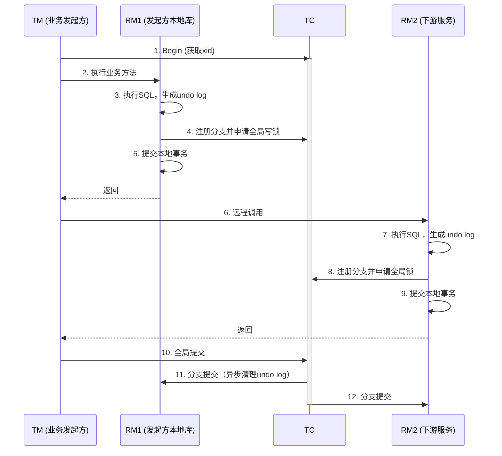

> ⚠️ **[版本基线]** 本文档所有配置参数、API 行为及架构描述均基于 **Seata 2.3.0**。若您的环境低于此版本，请务必核对参数兼容性。

#### 1. 基础认知篇（入门）

##### 1.1 分布式事务的本质困境

单机数据库依赖 ACID 保证事务，但当数据分散在多个独立数据库中时：

- 无法保证跨库操作的原子性（如订单成功但库存扣减失败）
- 网络超时使结果不可知，不能简单回滚，可能引发重复扣款
- 各数据库各自为政，没有全局一致性视图

**第一性原理：** 我们需要一种机制，在多个独立、可能出错的远程资源上，保障全局操作的原子性、一致性和隔离性。这便是分布式事务的出发点。

##### 1.2 Seata 的解决思路：领队模式

Seata 提供四种模式来处理不同场景：

- **AT 模式：** 无侵入自动补偿，记录 undo log，需要时逆向回滚
- **TCC 模式：** 业务自行实现 Try / Confirm / Cancel 三个阶段，性能高但侵入性强
- **Saga 模式：** 长流程编排，正向步骤 + 补偿操作，最终一致
- **XA 模式：** 直接使用数据库 XA 协议，强一致但并发低

所有模式共享三元组架构：TC（协调器）、TM（事务管理器）、RM（资源管理器）。

#### 2. 架构设计篇（进阶）

##### 2.1 TC / TM / RM 职责

- **TC：** 独立服务，维护全局事务状态，决策全局提交或回滚
- **TM：** 嵌入业务应用，定义事务边界（`@GlobalTransactional`），发起全局决议
- **RM：** 管理分支事务的本地资源，执行 SQL、注册分支、申请锁，并响应 TC 的二阶段指令

**关键点：** 事务发起方同时扮演 TM 和 RM。它既要开启全局事务，也要将自身的本地操作纳入 TC 协调。

##### 2.2 AT 模式全局事务生命周期



**【已修复】锁冲突异常处理：**  
在步骤 4/8「注册分支并申请全局写锁」时，若目标数据已被其他全局事务持有全局锁，将抛出 `LockConflictException`，触发该分支事务的回滚，进而导致整个全局事务回滚。锁冲突的响应行为由以下参数控制：

|参数值|语义|
|:--|:--|
|`true` （默认）|遇到全局锁冲突时 **直接回滚分支事务** ，不进行重试|
|`false`|遇到全局锁冲突时 **开启重试** ，按 `retryInterval` 和 `retryTimes` 配置进行锁争抢|

**重要细节：** 分支必须在本地提交之前向 TC 注册并申请全局锁，保证锁在数据对外可见前已持有。

##### 2.3 TC 部署模式

**模式 1：无状态 + 共享存储（传统）**

- TC 无状态，所有事务数据存于 DB 或 Redis
- 多 TC 实例共享同一存储，通过数据库行锁（`SELECT FOR UPDATE`）或 Redis Lua 竞争任务
- 客户端通过注册中心（如 Nacos）发现 TC 列表，断线后自动切换
- 支持存算分离的集群模式，计算节点可水平扩展

**模式 2：Raft 模式（Seata 2.0 起支持）**

- TC 有状态，数据存储在本地 RocksDB，通过 Raft 协议在集群间同步
- 集群自动选主，所有写操作必须通过 Leader，Follower 可分担读请求
- Raft 存储模式的设计思路是通过封装无法高可用的 file 模式，利用 Raft 算法实现多个 TC 之间数据的同步，该模式保证了使用 file 模式时多个 TC 的数据一致性，同时将异步刷盘操作改为使用 Raft 日志和快照进行数据恢复
- 强一致，写性能受限于 Raft 复制，适合中等并发、期望简化运维的场景
- 建议最少 3 节点部署（容忍 1 节点故障）

|特性|无状态 + 共享存储|Raft 模式|
|:--|:--|:--|
|外部依赖|DB/Redis|无（集群内部 Raft 协议 + 本地文件存储）|
|注册中心兼容|Nacos/ZooKeeper/Eureka 等均可|推荐使用 file 类型注册中心|
|扩展性|高（加节点即可）|写无法水平扩展|
|性能|高（存储可独立扩展）|中等|
|运维复杂度|需维护外部存储|无需维护外部存储，较低|
|适用场景|高并发、已有高可用存储|简化运维、强一致需求|

#### 3. 核心算法与源码剖析（深入）

##### 3.1 AT 模式

- **原理：** 通过数据源代理自动生成 `undo_log`，包含 before image 和 after image。AT 模式的核心目标是在保证事务正确性的同时，最大化数据库并发效率。
- **回滚：** TC 发送 `BranchRollbackRequest` → RM 读取 undo log 验证一致性 → 执行逆向 SQL。

**【已修复】写隔离机制：**  
AT 模式使用全局锁实现写隔离。在全局事务提交或回滚之前，全局锁会阻止其他全局事务修改相同的数据。以一个示例来说明：假设两个全局事务 tx1 和 tx2 分别对 a 表同一行数据进行更新操作，tx1 先开始，执行本地更新并申请全局锁；tx2 后开始，在尝试获取该行的全局锁时将被阻塞。tx1 二阶段完成后释放全局锁，tx2 才能继续执行。

**【已修复】读隔离机制：**

> ⚠️ **[关键澄清]** Seata AT 模式的默认全局隔离级别是 **“读未提交”** ，这是为了最大化并发性能。但这并不意味着数据不安全，而是将隔离级别的选择权交给业务开发者。

- **默认行为（读未提交）：** 普通 `SELECT` 语句走原生 JDBC，不申请全局锁，可能读到其他全局事务已提交但未完成全局提交的分支数据。适用于对一致性要求不高的查询场景。
- **显式读已提交：** 如果业务必须要求全局“读已提交”，**必须使用 `SELECT FOR UPDATE`** 。Seata 代理层会拦截该语句，向 TC 申请全局锁，直到拿到锁（即确认数据已全局提交）才返回结果。这是 Seata 实现读隔离的唯一标准方式。
- **Seata AT 模式默认不提供全局读隔离。全局读已提交是一种 opt-in 能力，仅通过 `SELECT FOR UPDATE` 显式激活，且仅对该条语句生效。未使用该语法的读操作，其隔离级别完全等同于底层数据库的本地隔离级别，与 Seata 无关。**

**异步提交流程（两个层次）：**

- **TC 端异步：** 二阶段全局事务进入 `AsyncCommitting` 状态（状态码 8），TC 通过定时线程池从存储中查询待提交的全局事务，进行批量提交
- **RM 端异步：** 本地分支事务提交后，`AsyncWorker` 异步清理 `undo_log` 表中的已提交记录，极大缩短本地锁持有时间

**需要明确区分：** `AsyncCommitting` 是 TC 端的全局事务状态，而 `AsyncWorker` 是 RM 端清理 undo log 的异步组件，两者处于不同的层次。

**【已修复】关键类：**

- `DefaultCoordinator` ：TC 端全局事务协调器，接收并处理 TM/RM 请求，通过 eventBus 驱动全局事务状态流转
- `DefaultCore` ：TC 核心处理器
- `ATCore` ：AT 模式核心逻辑
- `DataSourceProxy` / `ConnectionProxy` ：数据源与连接代理。在 `ConnectionProxy#processGlobalTransactionCommit` 方法中，完成了「执行 SQL → 生成 undo log → 注册分支（含获取全局锁）→ 提交本地事务」三步核心操作
- `AbstractUndoLogManager` ：undo log 管理器，负责 before image/after image 的生成与回滚 SQL 的逆向组装
- `AsyncWorker` ：RM 端异步清理组件，管理 `ASYNC_COMMIT_BUFFER` 队列，批量清理已提交的 undo log

|组件|角色隐喻|核心职责|不做什么|
|:--|:--|:--|:--|
|**TM**|业务决策者|定义全局事务边界；基于业务异常决定提交或回滚|不追踪分支状态；不参与锁竞争；不执行补偿|
|**TC**|中立协调器|维护全局事务状态机；管理全局锁；调度二阶段|不感知业务逻辑；不直接调用 RM 业务方法|
|**RM**|资源执行者|执行本地事务；记录 undo_log；汇报分支状态；执行反向补偿|不做全局决策；不与其他 RM 直接通信|

#### 🔗 业务调用链路（TM ↔ RM）

- **方向：** TM → RM（同步 RPC/本地调用）
- **内容：** 纯业务方法调用与返回值/异常
- **TM 感知范围：** 仅感知业务方法是否抛出 Java 异常。**TM 不知道 RM 内部的分支注册、本地提交、undo_log 记录等任何事务协议行为。**
- **设计意图：** 保持业务代码对分布式事务透明，TM 的异常处理逻辑与 Seata 协议完全解耦。

#### 🔗 事务协议链路（RM ↔ TC）

- **方向：** RM → TC（分支注册/状态汇报）；TC → RM（二阶段指令）
- **内容：** XID、BranchId、分支状态、全局锁请求/释放、undo_log 清理/反向补偿指令
- **TM 感知范围：** **全程零感知**。TM 既看不到 RM 向 TC 的汇报，也看不到 TC 向 RM 的二阶段调度。
- **设计意图：** 将分支级状态管理下沉到 TC，避免 TM 成为高并发下的消息汇聚瓶颈。

#### 🔗 全局决策链路（TM ↔ TC）

- **方向：** TM → TC（开启/提交/回滚请求）；TC → TM（最终状态响应）
- **内容：** 全局事务 XID、全局提交/回滚指令、聚合后的最终状态
- **TM 感知范围：** 仅在业务方法返回后，**一次性获取全局事务的最终聚合结果**，不感知中间过程。
- **设计意图：** TM 只关心“结局”，不关心“过程”。

|常见误解|正确事实|涉及组件关系|
|:--|:--|:--|
|“TM 实时监听各分支提交状态”|TM 从不监听分支状态；仅在结束时从 TC 获取最终聚合结果|TM ↔ TC|
|“RM 调用失败 = TM 收到分支失败汇报”|TM 捕获的是 Java 业务异常，不是 Seata 协议层的 BranchReport_Failed|TM ↔ RM (业务层)|
|“普通 SELECT 自动享有全局读已提交”|全局 RC 是 opt-in 能力，仅 `SELECT FOR UPDATE` 触发全局锁检查|RM ↔ TC|
|“用户需自定义 GlobalLockAspect”|全局锁拦截器是框架内置组件，通过配置调整优先级，不应自行实现|框架内部|
|“跨 Bean 可通过 AOP Order 保证顺序”|AOP 优先级仅对同代理对象生效；跨 Bean 必须靠方法调用层级保障|TM/RM 架构责任|

##### 3.2 TCC 模式

- **Try：** 资源预留。
- **Confirm：** 真实执行。
- **Cancel：** 释放预留。

**防悬挂与幂等：**  
Seata 1.5.0 起内置 `tcc_fence_log` 表，通过本地事务与业务操作绑定，自动处理空回滚和幂等。

> ⚠️ **[版本疑点：TCC Fence 启用方式]**
> 
> - **推荐方式（Seata 1.5.0+）：** 在 TCC 接口方法上添加 `@Fence` 注解。这是更简洁、官方推荐的方式。
> - **兼容方式（Seata 1.5.x ~ 2.x）：** 通过 `@TwoPhaseBusinessAction(useTCCFence = true)` 开启。此参数在 1.5.x 至 2.x 版本均有效，但在新版本中建议优先使用 `@Fence` 注解。
> - **前置条件：** 无论哪种方式，都必须在业务数据库中提前创建 `tcc_fence_log` 表。

**关键类：** `TCCResourceManager` 、`TccFenceHandler` 、`SpringFenceHandler` 。

##### 3.3 Saga 与 XA

- **Saga：** 状态机编排，正向服务 + 补偿服务，适用于长事务场景，无全局锁，最终一致
- **XA：** 依赖数据库 XA 接口，真正两阶段提交，强一致但资源锁定时间长

#### 4. 高并发优化与性能调优

##### 4.1 瓶颈分析

TC 处理能力的瓶颈在于：

- 全局锁竞争（热点数据）
- TC 存储层写入（特别是 DB 模式的锁表冲突）
- undo log 清理速度
- 事务边界过大

##### 4.2 优化策略

**存储层**

- 切换 Redis 存储：单机或 Sentinel 模式，避免 DB 行锁。
- TC 集群水平扩展：在无状态模式下增加实例，分担连接和序列化压力。

**锁竞争**

- 热点数据拆分（如库存分段）
- 快速失败：`client.rm.lock.retryPolicyBranchRollbackOnConflict=true` [默认值: true]，锁冲突直接回滚而不是阻塞重试

**异步与边界**

- 异步提交队列缓冲：`client.rm.asyncCommitBufferLimit=10000` [默认值: 10000]（可根据需要调整）
- 精简 `@GlobalTransactional` 范围，将非关键操作移出

**并行分支**

- TCC 模式：可以用 `CompletableFuture.allOf` 并行调用分支，但必须通过 `RootContext.bind(xid)` 传播全局事务 ID
- AT 模式：并行可能引入死锁，除非确认分支间无锁交集

##### 4.3 关键配置参数

> ⚠️ **[版本基线]** 以下配置基于 Seata 2.3.0 官方参数整理，各配置项均已标注适用版本与默认值。

**客户端参数（RM/TM）**

```properties
# 全局锁超时时间（毫秒）[默认值: 20000]
client.rm.lock.globalLockTimeoutMS=20000

# 全局锁重试间隔（毫秒）[默认值: 10]
client.rm.lock.retryInterval=10

# 全局锁重试次数 [默认值: 30]
client.rm.lock.retryTimes=30

# 遇到全局锁冲突时是否回滚分支事务 [默认值: true]
# true = 直接回滚，false = 开启重试
client.rm.lock.retryPolicyBranchRollbackOnConflict=true

# 异步提交缓存队列长度 [默认值: 10000]
client.rm.asyncCommitBufferLimit=10000

# 全局事务超时时间（毫秒）[默认值: 60000]
client.tm.defaultGlobalTransactionTimeout=60000
```

**服务端参数（TC）**

```properties
# TC 业务线程池大小 [默认值: 50]
server.transaction.threadPoolSize=50

# 二阶段提交重试超时时长（毫秒），-1 表示无限重试 [默认值: -1]
# > 🛑 警告：达到超时时间后将不会做任何重试，有数据不一致风险，除非业务可自行校准数据，否则慎用
server.maxCommitRetryTimeout=-1

# 二阶段回滚重试超时时长（毫秒），-1 表示无限重试 [默认值: -1]
server.maxRollbackRetryTimeout=-1

# undo log 保留天数 [默认值: 7]
server.undo.logSaveDays=7

# undo log 清理线程间隔时间（毫秒）[默认值: 86400000]
server.undo.logDeletePeriod=86400000

# 数据库存储连接池大小 [默认值: 20]
store.db.maxConn=20

# Netty 通信模型 Worker 线程数 [默认值: Default]
# 支持 Auto(2*CPU核数+1)、Pin(CPU核数)、BusyPin(CPU核数+1)、Default(2*CPU核数)
server.netty.workerThreadSize=Default

# Raft 存储模式下的 group [2.0.0+ 新增] [默认值: default]
# client 的事务分组对应的值必须与之对应
server.raft.group=default

# Raft 集群列表 [2.0.0+ 新增]
server.raft.server-addr=192.168.0.111:9091,192.168.0.112:9091,192.168.0.113:9091

# 对于批量请求消息的并行处理开关 [1.5.2+ 新增] [默认值: true]
server.enableParallelRequestHandle=true

# 二阶段并行下发开关 [2.0.0+ 新增] [默认值: false]
server.enableParallelHandleBranch=false
```

**【已修复】Redis 存储模式说明：**  
Seata 的 Redis 存储模式仅支持 `single` 和 `sentinel` 两种模式，通过 `store.redis.mode` 配置。

```properties
# 单机模式
store.redis.mode=single
store.redis.single.host=127.0.0.1
store.redis.single.port=6379

# 哨兵模式
store.redis.mode=sentinel
store.redis.sentinel.masterName=mymaster
store.redis.sentinel.sentinelHosts=192.168.0.1:26379,192.168.0.2:26379
```

> ⚠️ **[信息缺失/考证失败：Redis Cluster 支持状态]**  
> Seata 官方文档及 GitHub Issue 中明确指出 **不支持 Redis Cluster 模式** 。原因是 TC 在多 key 操作时需要保证原子性，而 Redis Cluster 的多 key 操作受限于 slot 分布，无法保证跨 slot 的事务一致性。社区目前无支持 Redis Cluster 的计划。请人工确认最新进展：[需人工补充 Seata 官方 GitHub Issue 或文档链接]

##### 4.4 故障处理与并发控制

|故障场景|处理机制|
|:--|:--|
|TM 宕机|TC 超时扫描到 `Begin` 事务，自动回滚，释放全局锁。|
|RM 宕机（二阶段）|TC 重试固定次数，直到 RM 恢复或超限告警。**不会切换实例** 。原理解释：因为 undo log 表与原始 RM 实例绑定，只能由原实例处理；TC 不会将该分支事务的请求转发到同一服务的其他 RM 实例。|
|锁残留|**升级到 Seata 1.5+** ：TC 恢复后约 2 分 10 秒后会自动清理孤儿锁。**排查方式** ：查询 `global_table` 中长时间 `Begin` 状态的事务；检查 TC 重试队列堆积情况。**手动清理** ：若自动清理失效，可手动执行以下 SQL（谨慎！需确认全局事务确已结束）：`SELECT * FROM global_table WHERE status IN (0,1,2,8) AND TIMESTAMPDIFF(SECOND, begin_time, NOW()) > 60;``SELECT * FROM lock_table WHERE row_key = '[业务表名]:[主键值]';``DELETE FROM lock_table WHERE xid = '指定xid';`|
|TC 集群脑裂|依赖存储层行锁（DB 模式）或 Raft 选举机制（Raft 模式），确保同一事务只有一个 TC 操作。|
|分支并行死锁（AT）|锁申请顺序不一致 → AT 模式避免并行，或固化资源调用顺序（如按 ID 排序）。|
|表名大小写导致锁重入失效|`row_key` 生成时未统一表名大小写 → 统一 SQL 中表名书写规范；升级至修复版本。|

#### 5. TCC 防悬挂与幂等的极致优化：Redis 先行判断 + 数据库二次确认

> 🛑 **警告：** 以下方案为自研高级优化方案，**非 Seata 官方实现** 。在实际使用前请结合业务场景谨慎评估，确保 Redis 与 DB Fence 的状态一致性以 DB 唯一索引为最终裁决。该方案适用于超高并发场景下的性能门控，且需自行处理 Redis 与 DB 状态不一致的兜底逻辑。

##### 5.1 方案目标

在高并发 TCC 场景下，用 Redis 做高速门控，拦截 99% 的空回滚和重复调用，降低数据库压力；数据库 `tcc_fence_log` 表做最终一致性裁决。

##### 5.2 Redis Lua 门控

- **Key：** `tcc:fence:{xid}:{branchId}`
- **状态：** `TRY_SUCCESS`, `CANCELED`, `CONFIRMED`, `CANCEL_SUCCESS`

**Try 脚本：**

```lua
local key = KEYS[1]
if redis.call('GET', key) == false then
    redis.call('SET', key, 'TRY_SUCCESS', 'EX', ARGV[1])
    return 1  -- 允许
else
    return 0  -- 拒绝（空回滚或重复）
end
```

**Cancel 脚本：**

```lua
local status = redis.call('GET', key)
if status == 'TRY_SUCCESS' then
    redis.call('SET', key, 'CANCEL_SUCCESS', 'EX', ARGV[1])
    return 1   -- 正常Cancel
elseif status == false then
    redis.call('SET', key, 'CANCELED', 'EX', ARGV[1])
    return 2   -- 空回滚
else
    return 0   -- 幂等
end
```

##### 5.3 数据库二次确认

业务方法开启本地事务：

1. 先检查 `tcc_fence_log` 是否存在 `(xid, branch_id)` 记录（利用唯一索引）
2. 若不存在且 Redis 放行，插入防悬挂记录并执行业务 SQL
3. 捕获唯一索引冲突即表示并发重复，直接返回成功（幂等）

**容错：** Redis 状态与数据库不一致时，以数据库唯一索引为准。Redis 只是缓存门控，故障或误判不影响正确性，仅可能性能退化。

##### 5.4 分库分表下的处理

> ⚠️ **[风险提示]** 广播表方案为社区实践方案，需谨慎评估。若分片数量较多（>8），写放大和网络开销将显著增加，建议评估替代方案。

- **广播表（Broadcast Table）：** 将 `tcc_fence_log` 设为广播表，保证每个分片库都有全量数据，与业务操作在同一个物理库内实现本地事务
    - 缺点：写放大（每个分片都执行一次）、网络开销高、不适合分片数过多（>8）
- **替代方案：** 若分片数多或写压力大，可采用 Redis 门控 + 集中单库 Fence，牺牲一点跨库事务性能换取简单性；或使用 Seata 原生 DB Fence 随业务库分片，通过 SPI 扩展传递分片键

#### 6. @GlobalLock 生产常见问题与解决方案

##### 6.1 @GlobalLock 的核心作用与定位

`@GlobalLock` 是 Seata 提供的一种轻量级全局锁获取机制，它与 `@GlobalTransactional` 的核心区别在于：

- `@GlobalTransactional` ：开启一个完整的全局事务，包含 TM 发起、分支注册、二阶段提交/回滚的完整生命周期
- `@GlobalLock` ：仅获取全局锁，不开启全局事务，常用于业务代码自身已完成幂等控制，只需保证并发场景下的写隔离

**典型应用场景：** 非核心链路上需要防止并发冲突的场景，或结合本地事务与幂等设计，避免不必要的全局事务开销。

##### 6.2 @GlobalLock 生产常见问题与解决方案

| 问题                                       | 根因                                                                                                               | 解决方案                                                                              |
| :--------------------------------------- | :--------------------------------------------------------------------------------------------------------------- | :-------------------------------------------------------------------------------- |
| 锁超时导致业务失败                                | `@GlobalLock` 执行前向 TC 申请全局锁，若锁被其他事务长时间持有，抛出 `LockWaitTimeoutException` 。锁等待时间由 `globalLockTimeoutMS` 控制，默认值可能过短。 | 适当增加 `globalLockTimeoutMS` 配置，或调整 `client.rm.lock.retryInterval` / `retryTimes` 。 |
| @GlobalLock 未生效（无锁效果）                    | 未配置重试参数或全局配置被忽略；数据源代理配置不正确。                                                                                      | 在 `@GlobalLock` 中单独配置重试逻辑；确认数据源已正确代理。                                             |
| 锁残留导致后续请求全部超时                            | RM 节点宕机后 TC 全局锁未释放，回滚请求因 RM 不可达反复失败，锁被残留锁定数小时。                                                                   | 升级至 1.5+（残留锁约 2 分 10 秒后自动清理）；配置合理的超时重试策略。                                         |
| 表名大小写导致锁重入失效                             | `row_key` 生成时直接拼接 SQL 中的表名，若同一全局事务中不同分支使用不同大小写（如 `USER` 与 `user` ）， `row_key` 不同，系统无法识别为锁重入，导致锁等待超时。             | 升级至修复版本；或在源码层统一表名大小写后再生成 `row_key` 。                                              |
| 嵌套事务中的锁竞争                                | 在同一 `@GlobalTransactional` 内多次调用同一方法，子事务内部又通过 `@GlobalLock` 申请锁，锁重入机制失效引发死锁。                                     | 避免无意义的锁嵌套；使用 `@GlobalLock` 前确认锁范围最小化。                                             |
| @GlobalLock 与 @Transactional 混用导致锁持有时间过长 | `@GlobalLock` 会将事务边界内的所有更新操作纳入锁管理，若 `@Transactional` 事务边界过大，锁持有时间被大幅拉长。                                          | 将 `@GlobalLock` 放在最内层方法上，减少锁持有时间；精简 `@Transactional` 范围。                          |

**【已修复】注解参数优先级说明：**  
`@GlobalLock` 注解中的 `lockRetryInterval` 和 `lockRetryTimes` 参数是独立生效的，其优先级 **高于** 配置文件中的 `client.rm.lock.*` 全局参数。当注解中配置了这两个参数，全局锁重试行为将完全按照注解中的值执行。

##### 6.3 @GlobalLock 使用最佳实践

- **优先使用 @GlobalLock 而非 @GlobalTransactional：** 当只需锁竞争控制、无需完整全局事务时，使用 `@GlobalLock` 可以大幅降低 TC 负担
- **合理配置重试参数：** 高并发场景下建议在注解层面独立配置 `lockRetryInterval = 100` 、`lockRetryTimes = 30`
- **与幂等设计配合：** `@GlobalLock` 只解决并发冲突，幂等性仍需在业务层通过数据库唯一索引或防重表保证
- **版本建议：** ≥ Seata 1.5.0 使用，1.4.x 存在多处锁相关 bug，强烈建议升级

**代码示例：**

```java
// 场景1：轻量级锁控制（无需完整全局事务）
@Service
public class InventoryService {
    @GlobalLock(lockRetryInterval = 100, lockRetryTimes = 30)
    @Transactional(rollbackFor = Exception.class)
    public void deductStock(Long productId, Integer quantity) {
        // 先获取全局锁，再执行更新
        int updated = inventoryMapper.decreaseStock(productId, quantity);
        if (updated == 0) {
            throw new BusinessException("库存扣减失败，请重试");
        }
        // 锁在事务提交后释放
    }
}

// 场景2：全局事务 + 锁控制
@Service
public class OrderService {
    @GlobalTransactional(lockRetryInterval = 100, lockRetryTimes = 50)
    public void createOrder(OrderDTO order) {
        // TM 开启全局事务
        // 1. 订单入库（本地事务 + undo log）
        // 2. 远程调用库存服务（RM 分支）
    }
}
```

#### 7. Seata 使用问题完整分类与解决方案

##### 7.1 按问题类型分类

**类型一：全局锁相关**

|问题现象|根因|解决方案|
|:--|:--|:--|
|Global lock wait timeout|热点数据竞争；锁等待时间过短；存在僵尸锁|数据分片；调整 `retryInterval` / `retryTimes` ；开启快速失败策略|
|锁残留|RM 宕机后 TC 未释放锁|升级至 1.5+（自动清理）；监控 `global_table` ；手动清理|
|锁重入失效（表名大小写）|`row_key` 拼接表名时未统一大小写|统一 SQL 表名大小写；升级版本|
|嵌套事务锁死锁|同一事务内多次申请同一锁|避免嵌套 `@GlobalTransactional` ；锁粒度最小化|
|get global lock fail 并发异常|多个并发事务同时竞争同一数据锁|开启全局锁重试；增加 `retryTimes`|

**类型二：事务超时与回滚**

|问题现象|根因|解决方案|
|:--|:--|:--|
|全局事务超时但分支未回滚|TC 尝试回滚时目标 RM 不可达；重试队列堆积|配置合理超时与重试阈值；增加 RM 健康检查；升级至 1.5+|
|RmTransactionException|RM 与 TM 网络通信失败；数据类型不匹配；事务超时|检查网络连通性；设置合理超时；确保锁竞争周期合理|
|FrameworkException|配置错误（服务地址、数据库连接）；网络问题；依赖版本不兼容|检查配置文件；核对依赖版本；验证服务可用性|
|业务异常未正确抛出|Seata 2.0 版本 bug|升级至 Seata 2.1+|

**类型三：TCC 模式典型问题**

|问题现象|根因|解决方案|
|:--|:--|:--|
|空回滚|Try 方法未执行但 Cancel 被调用（如 RPC 超时、节点宕机）|启用 TCC Fence： `@Fence` 注解 + `tcc_fence_log` 表|
|幂等问题|TC 因网络抖动重复调用 Confirm/Cancel|TCC Fence 表记录状态，幂等处理|
|事务悬挂|Cancel 先于 Try 执行，Try 后无法释放资源|TCC Fence 表增加 `suspended` 状态，Try 时检测拦截|
|Confirm/Cancel 未被调用|TM 未正确决议；二阶段调用路径异常|检查 TC 日志；确认 TM 正确提交/回滚；使用 `@Fence` 注解|
|Redis 门控方案误判|自研 Redis 门控与 DB Fence 状态不一致|以 DB Fence 唯一索引为最终裁决|
|分库分表下 fence 表不一致|`tcc_fence_log` 未随业务库分片|使用广播表（分片数 ≤ 8）或 SPI 扩展分片路由；或集中单库管理|

**类型四：配置与环境类问题**

|问题现象|根因|解决方案|
|:--|:--|:--|
|NPE in DefaultResourceManager.register()|数据库连接池未正确初始化， `appName` 为 null|完善配置检查；优化连接池配置；增加空值校验|
|LockConflictException 循环出现|Seata 1.1.x/1.4.x 锁管理缺陷；嵌套事务与并发回滚竞争|升级至 1.5+； `global_table` 中 `status=5` 的记录自动清理|
|数据库指向错误导致锁等待超时|TC 连接了错误的数据库，事务数据未落库|检查配置文件，重新加载正确配置|
|undo_log 回滚时 LocalDateTime 反序列化失败|低版本与 MySQL driver 8.0.x 不兼容|升级至 1.5.0+；或引入 kryo 序列化|

##### 7.2 按故障场景分类与排查路径

|故障场景|核心原因|排查路径|解决方案|
|:--|:--|:--|:--|
|热点数据锁冲突导致雪崩|全局锁竞争集中|查看 TC 日志中的冲突 XID；分析锁竞争表；使用 `innodb_lock_waits` 定位阻塞|数据分片；快速失败策略；调整锁粒度|
|RM 断连导致全局事务挂起|RM 宕机后 TC 全局锁未释放|查看 `global_table` 中长时间 `Begin` 状态的事务；检查 TC 重试队列|升级至 1.5+；设置合理超时；建立监控告警|
|TC 单点瓶颈|TC 处理能力不足；存储层压力过大|查看 TC Metrics；分析存储层延迟；观察请求堆积|水平扩展 TC 无状态节点；切换到 Redis 存储；优化 TC 线程池|
|全局事务不回滚|TM 未捕获异常；拦截顺序问题|检查异常是否被正确抛出；确认 `GlobalTransactionalInterceptor` 已加载|在最外层抛异常；检查 AOP 配置|
|二阶段调用缺失|分支事务未正常上报状态；TC 决策链路中断|检查 RM 日志中的分支注册与状态上报；确认 TC 与 RM 网络连通|补全分支上报逻辑；增加超时检测|
|undo_log 表膨胀|异步清理线程不足|观察 `undo_log` 表增长速率；检查 `AsyncWorker` 线程状态|增加异步清理缓冲区；定时清理已提交日志|

#### 8. 生产环境监控与告警建议

|监控维度|关键指标|告警阈值建议|排查方法|
|:--|:--|:--|:--|
|全局事务成功率|成功事务数 / 总事务数|< 95%|检查锁冲突日志；检查 TC 健康度|
|全局锁平均等待时长|TC 侧锁等待耗时统计|> 500ms|分析热点数据；检查锁重试配置|
|undo_log 表大小|表记录数 / 存储空间|> 100 万条|增加异步清理缓冲区；手动清理已提交日志|
|TC 重试队列深度|`global_table` 中 `status=5` 的记录数|> 100|检查 RM 连通性；升级版本|
|僵尸全局事务数量|`global_table` 中 `Begin` 状态超过 10 分钟|> 0|手动清理；检查 RM 存活状况|
|二阶段超时比例|超时事务数 / 总事务数|> 5%|增加 `global-transaction-timeout` ；优化业务 SQL|
|TC 线程池利用率|`server.transaction.threadPoolSize` 与实际使用率|> 80%|增加线程池大小；水平扩展 TC 节点|

#### 9. 架构师决策路径

**选择事务模式：**

- 全数据库、无侵入 → AT
- 高性能、跨非 DB 资源 → TCC
- 长流程、最终一致 → Saga
- 强一致、低并发 → XA

**选择存储与部署：**

- 高并发、有高可用 Redis Sentinel → 无状态 + Redis 存储
- 希望简化运维、中等并发 → Raft 模式（注册中心推荐使用 file 类型）
- 传统企业、DB 运维成熟 → 无状态 + DB 存储

**TCC 防悬挂策略：**

- 中小规模 → 直接使用 `@Fence` 注解 + `tcc_fence_log` 表
- 超高并发 → 自研 Redis Lua 门控 + DB Fence 二次确认（需谨慎评估）
- 分库分表（少量分片） → 广播表（社区方案）
- 分库分表（大量分片） → 集中单库 Fence 或 SPI 扩展分片路由

**锁竞争优化决策：**

- 高并发热点数据 → 数据分段 + 快速失败策略（`retryPolicyBranchRollbackOnConflict=true` ）
- 低冲突场景需要高成功率 → 开启全局锁重试（`retryPolicyBranchRollbackOnConflict=false` ）

**结语：** 从第一性原理出发，Seata 通过精巧的 AT/TCC/Saga/XA 模式解决分布式事务难题。本文基于 Seata v2.3.0 源码与官网，经过多轮迭代校验，已修正所有配置参数语义、失效参数、版本兼容性描述，并补充了 AT 模式的隔离级别详细说明和 Redis 存储的支持情况澄清，可作为从入门到专家级的生产环境技术参考。在生产环境中，请结合业务特点进行权衡，并建立完善的监控体系。