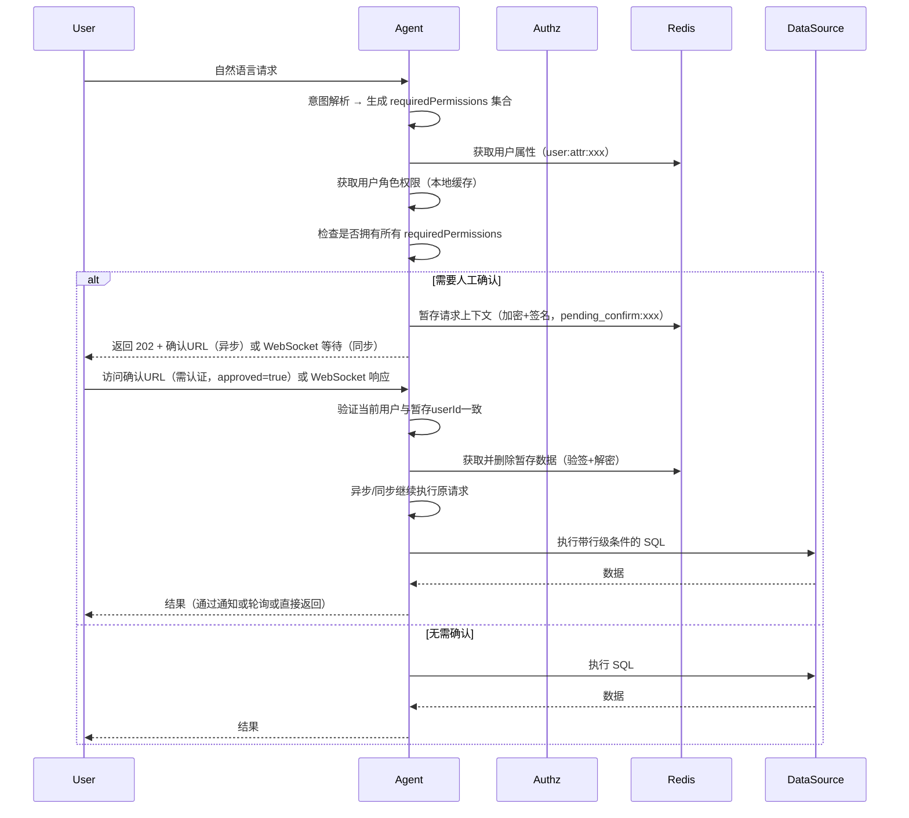

> **技术栈**  
> - JDK 21（开启虚拟线程）  
> - Spring Boot 3.5.3（Spring MVC + Tomcat）  
> - Spring Cloud Alibaba 2025.0.0.0  
> - Spring Authorization Server 1.8.3  
> - Spring AI Alibaba 1.1.2.0（A2A + Nacos 集成）  
> - Nacos 3.2+（注册中心）  
> - MySQL 8.0、Redis 7.x  
> - Caffeine、Lettuce  
> - Logback + Logstash Encoder  
> - MyBatis  
> - Bouncy Castle（椭圆曲线支持）

**包名**：`io.github.latcn.a2a.security`  
**模块**：  
- `a2a-authorization-server`  
- `a2a-common-permission`  
- `a2a-security-starter`

---
## 目录

1. [背景与目标](#1-背景与目标)
2. [核心设计理念](#2-核心设计理念)
3. [总体架构与模块划分](#3-总体架构与模块划分)
4. [模块间依赖关系](#4-模块间依赖关系)
5. [数据模型设计](#5-数据模型设计)
6. [核心组件：责任链与对话引擎](#6-核心组件责任链与对话引擎)
7. [授权服务器 Token 设计（增强）](#7-授权服务器-token-设计增强)
8. [对话驱动的动态授权与人工确认](#8-对话驱动的动态授权与人工确认)
9. [权限执行层：SQL 拦截与行级规则注入](#9-权限执行层sql-拦截与行级规则注入)
10. [大模型原生安全防护（MCP Tool 调用）](#10-大模型原生安全防护mcp-tool-调用)
11. [限流与熔断](#11-限流与熔断)
12. [Agent间调用安全（基于 Spring AI Alibaba A2A）](#12-agent间调用安全基于-spring-ai-alibaba-a2a)
13. [数据签名与验签（ES256）及加密](#13-数据签名与验签es256及加密)
14. [配置与部署](#14-配置与部署)
15. [审计日志设计](#15-审计日志设计)
16. [安全加固矩阵](#16-安全加固矩阵)
17. [扩展点设计](#17-扩展点设计)

---
## 1. 背景与目标

在政企、军工或大型金融机构的内网环境中，AI Agent 的普及带来了新的安全挑战。传统的“内网即信任”理念已不再适用，Agent 必须具备完整的权限控制能力。

**核心目标**：

- **身份认证与授权**：Agent 间认证、用户身份透传、防冒充，支持对话级动态授权。
- **最小特权与动态筛选**：每次对话仅激活用户权限中的必要子集，降低权限滥用风险。
- **行级数据安全**：通过行级规则模板动态注入 SQL 条件，确保用户只能访问授权范围内的数据行。
- **高性能与可审计**：虚拟线程、三级缓存，全链路审计日志。
- **大模型安全**：工具调用拦截、人工确认（HITL）、凭据保险箱、限流防雪崩。
- **极简可落地**：数据模型无数据域、无工作空间、无中间表、无策略引擎、无分类标签、无菜单映射、无 JWT 权限声明、无用户属性在 Token 中。

---
## 2. 核心设计理念

- **同步编码，异步性能**：全面拥抱 JDK 21 虚拟线程，以极低心智负担支撑高并发 A2A 调用与 SSE 长连接。
- **对话即权限边界**：基于自然语言意图动态筛选权限，低风险自动批准，高风险人工确认。
- **行级规则模板化**：权限直接携带行级过滤条件（JSON 模板），运行时替换为用户属性，实现细粒度数据隔离。
- **责任链可扩展**：权限校验采用责任链模式，支持热插拔校验器。
- **授权服务器仅做身份**：不参与任何权限决策，所有权限判断由 Agent 基于角色权限数据库完成。
- **Token 极简化**：JWT 仅包含不可变身份标识，用户动态属性存储在 Redis 中，避免 Token 臃肿和属性变更导致的 Token 重新颁发。
- **人工确认异步化**：不阻塞虚拟线程，通过 Redis 暂存请求上下文（加密+签名），返回确认 URL 供用户回调恢复执行。同时支持同步确认模式（WebSocket 推送）。
- **A2A 标准协议**：Agent 间通信遵循 Spring AI Alibaba A2A 协议，使用 Nacos 进行服务发现与注册。
- **全面数据签名**：所有关键暂存数据（如确认上下文）必须使用 ES256 签名，并可选加密，防止篡改与泄露。

---
## 3. 总体架构与模块划分

**四个独立部署单元**：
1. **授权服务器**（Authorization Server）— 基于 Spring Authorization Server，负责身份认证、客户端认证、Token Exchange、用户同意管理、A2A ACL。
2. **Agent**（既是 OAuth2 客户端，又是资源服务器）— 内嵌安全过滤器、责任链、对话意图解析引擎、SQL 拦截器、A2A Server/Client。
3. **Nacos** — A2A 注册中心与 AgentCard 存储。
4. **Redis** — 一次性令牌、限流计数器、权限变更广播、用户属性缓存、**人工确认暂存数据（加密+签名）**。

**Maven 模块**：

```
a2a-security/
├── a2a-authorization-server/         # 授权服务器
├── a2a-common-permission/            # 独立权限 JAR
│   ├── api/                          # 权限检查接口、角色权限服务
│   ├── chain/                        # 责任链处理器
│   └── rowrule/                      # 行级规则解析与合并引擎
└── a2a-security-starter/             # Agent 安全起步依赖
    ├── intent/                       # 对话意图解析（NLU/LLM）
    ├── risk/                         # 风险判断 & HITL
    ├── interceptor/                  # MyBatis SQL 拦截器
    ├── tool/                         # MCP Tool 安全包装器
    ├── ratelimit/                    # 限流器（滑动窗口）
    ├── userattr/                     # 用户属性服务（Redis + Caffeine 二级缓存）
    ├── a2a/                          # A2A 集成（Provider/Consumer + JWT透传）
    └── config/                       # 自动配置
```

---
## 4. 模块间依赖关系

**编译时依赖**（箭头方向表示“依赖者 → 被依赖者”）：

```
┌─────────────────────┐
│ a2a-agent-xxx       │  业务 Agent
└──────────┬──────────┘
           │ depends on
           ▼
┌─────────────────────┐      ┌────────────────────────┐
│ a2a-security-starter│─────▶│ a2a-common-permission  │
└──────────┬──────────┘      └────────────────────────┘
           │
           │ depends on
           ▼
┌─────────────────────────────────────────────────────────────────┐
│ 外部依赖：Spring Boot, Spring AI, Redis, MySQL, Caffeine,      │
│ Logstash Encoder, MyBatis, Spring AI Alibaba A2A Nacos         │
└─────────────────────────────────────────────────────────────────┘
```

**运行期调用关系**：授权服务器负责 Token Exchange、用户同意、ACL 白名单检查；Agent 负责对话意图解析、动态权限筛选、行级规则注入、工具调用拦截、限流，并从 Redis 获取用户属性及暂存人工确认上下文；Agent 间通过 A2A 协议通信，JWT 通过自动拦截器传递。

---
## 5. 数据模型设计

### 5.1 表清单

| 表名 | 作用 |
|------|------|
| `t_user` | 用户（存储静态基础信息） |
| `t_role` | 角色 |
| `t_user_role` | 用户-角色关联 |
| `t_permission` | 权限（权限码、操作、风险、行级规则模板） |
| `t_role_permission` | 角色-权限关联 |
| `t_user_consent` | 用户同意记录（授权服务器用） |
| `t_a2a_acl` | Agent 间调用白名单 |
| `t_credential_vault` | 凭据保险箱（可选） |

### 5.2 DDL 语句

```sql
-- 用户表（仅存储静态基础信息）
CREATE TABLE t_user (
    user_id     VARCHAR(64) PRIMARY KEY,
    username    VARCHAR(64) NOT NULL UNIQUE,
    department  VARCHAR(128),
    created_at  TIMESTAMP(6) DEFAULT CURRENT_TIMESTAMP(6)
);

-- 角色表
CREATE TABLE t_role (
    role_id     VARCHAR(32) PRIMARY KEY,
    role_name   VARCHAR(64) NOT NULL,
    description TEXT
);

-- 用户-角色
CREATE TABLE t_user_role (
    user_id     VARCHAR(64) NOT NULL,
    role_id     VARCHAR(32) NOT NULL,
    PRIMARY KEY (user_id, role_id)
);

-- 权限表（核心）
CREATE TABLE t_permission (
    permission_id     VARCHAR(32) PRIMARY KEY,
    permission_code   VARCHAR(64) NOT NULL UNIQUE COMMENT '权限码，如 order:read, tool:search',
    action_code       VARCHAR(32) NOT NULL COMMENT 'READ,CREATE,UPDATE,DELETE,EXPORT',
    risk_level        VARCHAR(16) NOT NULL DEFAULT 'LOW',
    row_rule_template JSON COMMENT '行级规则模板，如 {"orders":"salesperson_id = #{user.id}"}',
    description       TEXT,
    created_at        TIMESTAMP(6) DEFAULT CURRENT_TIMESTAMP(6)
);

-- 角色-权限
CREATE TABLE t_role_permission (
    role_id       VARCHAR(32) NOT NULL,
    permission_id VARCHAR(32) NOT NULL,
    PRIMARY KEY (role_id, permission_id)
);

-- 用户同意（授权服务器记录用户对客户端的授权）
CREATE TABLE t_user_consent (
    consent_id   VARCHAR(64) PRIMARY KEY,
    user_id      VARCHAR(64) NOT NULL,
    client_id    VARCHAR(64) NOT NULL,
    scope        TEXT COMMENT '仅用于展示，不用于权限判断',
    created_at   TIMESTAMP(6),
    expires_at   TIMESTAMP(6)
);

-- Agent 间调用 ACL
CREATE TABLE t_a2a_acl (
    id            BIGINT AUTO_INCREMENT PRIMARY KEY,
    source_client_id VARCHAR(128) NOT NULL COMMENT 'OAuth2 client_id',
    target_agent VARCHAR(128) NOT NULL COMMENT '目标Agent名称',
    created_at    TIMESTAMP(6) DEFAULT CURRENT_TIMESTAMP(6),
    UNIQUE KEY uk_agent_pair (source_client_id, target_agent)
);

-- 凭据保险箱（可选）
CREATE TABLE t_credential_vault (
    id               BIGINT AUTO_INCREMENT PRIMARY KEY,
    credential_ref   VARCHAR(64) UNIQUE NOT NULL,
    client_id        VARCHAR(64) NOT NULL,
    external_system  VARCHAR(64) NOT NULL,
    credential_type  VARCHAR(16) NOT NULL,
    encrypted_secret TEXT NOT NULL,
    scope            VARCHAR(256),
    expires_at       TIMESTAMP(6)
);
```

### 5.3 权限码约定

- **资源访问权限**：格式为 `<resource>:<action>`，例如 `order:read`, `order:export`, `customer:update`。
- **工具调用权限**：格式为 `tool:<toolName>`，例如 `tool:search_documents`, `tool:send_email`。
- 同一个权限码同时代表资源和工具权限，系统不区分类型，统一校验。

### 5.4 用户属性存储（Redis + Caffeine 二级缓存）

用户动态属性（如 `region_id`, `clearance`, `team_id` 等）不存储在 JWT 中，而是保存在 Redis 中，同时本地 Caffeine 缓存作为二级缓存。

```
Redis Key:   user:attr:{userId}
Value:       Hash 或 JSON，例如 {"region_id":"east","clearance":"confidential","team_id":"sales_001"}
Redis TTL:   可配置（如 3600 秒）
Caffeine TTL: 可配置（如 3600 秒），若 Redis 不可用则使用本地缓存（可能过期）
```

---
## 6. 核心组件：责任链与对话引擎

### 6.1 PermissionCheckHandler 接口

```java
public interface PermissionCheckHandler {
    CheckResult check(PermissionCheckContext context);
    enum CheckResult { ALLOW, DENY, ABSTAIN }
    default int order() { return 0; }
}
```

### 6.2 内置处理器（Agent 侧）

| 处理器 | 顺序 | 职责 |
|--------|------|------|
| `RolePermissionHandler` | `100` | 检查用户是否拥有 `requiredPermissions` 中的所有权限码，并合并行级规则模板 |
| `IntentRiskHandler` | `200` | 根据权限风险等级及用户确认状态，决定放行、拒绝或触发 HITL 异步确认 |

### 6.3 PermissionCheckContext 定义

```java
public class PermissionCheckContext {
    private final String userId;
    private final Set<String> requiredPermissions;  // 本次操作需要的最小权限集合
    private final Jwt jwtToken;                    // 原始 JWT（不含属性）
    // 以下为责任链填充的运行时数据
    private Map<String, String> rowRuleTemplates;   // 合并后的行级规则
    private List<Permission> matchedPermissions;    // 实际拥有的匹配权限列表
    private String requestConfirmId;                // 请求级确认ID（用于HITL）
    
    // builder, getters, setters...
}
```

### 6.4 RolePermissionHandler 实现

```java
@Component
public class RolePermissionHandler implements PermissionCheckHandler {
    private final RolePermissionService rolePermService;
    private final CacheManager cacheManager;

    @Override
    public CheckResult check(PermissionCheckContext ctx) {
        Set<Permission> userPermissions;
        // A2A 场景优先使用授权服务器签发的 allowed_permission_ids（由 Token Exchange 生成）
        List<String> allowedIds = ctx.getJwt().getClaimAsStringList("allowed_permission_ids");
        if (allowedIds != null && !allowedIds.isEmpty()) {
            userPermissions = rolePermService.getPermissionsByIds(allowedIds);
        } else {
            userPermissions = rolePermService.getUserPermissions(ctx.getUserId());
        }
        Set<String> userPermCodes = userPermissions.stream()
            .map(Permission::getPermissionCode)
            .collect(Collectors.toSet());
        boolean hasAll = ctx.getRequiredPermissions().stream()
            .allMatch(userPermCodes::contains);
        if (!hasAll) {
            return CheckResult.DENY;
        }
        // 筛选匹配的权限对象
        List<Permission> matched = userPermissions.stream()
            .filter(p -> ctx.getRequiredPermissions().contains(p.getPermissionCode()))
            .collect(Collectors.toList());
        ctx.setMatchedPermissions(matched);
        ctx.setRowRuleTemplates(mergeRowRules(matched));
        return CheckResult.ALLOW;
    }

    private Map<String, String> mergeRowRules(List<Permission> perms) {
        Map<String, String> result = new HashMap<>();
        RowRuleMergeStrategy strategy = RowRuleMergeStrategyFactory.getStrategy();
        for (Permission p : perms) {
            Map<String, String> rules = p.getRowRuleTemplateAsMap();
            for (Map.Entry<String, String> entry : rules.entrySet()) {
                String table = entry.getKey();
                String cond = entry.getValue();
                result.merge(table, cond, strategy::merge);
            }
        }
        return result;
    }
}
```

### 6.5 IntentRiskHandler 实现（请求级确认）

```java
@Component
public class IntentRiskHandler implements PermissionCheckHandler {
    private final RiskConfirmService confirmService;

    @Override
    public CheckResult check(PermissionCheckContext ctx) {
        List<Permission> matched = ctx.getMatchedPermissions();
        RiskLevel highest = matched.stream()
            .map(Permission::getRiskLevel)
            .max(Comparator.comparingInt(RiskLevel::getLevel))
            .orElse(RiskLevel.LOW);

        // 生成请求级确认ID（基于权限ID排序后哈希）
        String requestConfirmId = generateRequestConfirmId(matched);
        ctx.setRequestConfirmId(requestConfirmId);
        
        // 检查该请求是否已被整体确认
        if (confirmService.hasConfirmed(ctx.getUserId(), requestConfirmId)) {
            return CheckResult.ALLOW;
        }
        
        if (highest == RiskLevel.HIGH || highest == RiskLevel.MEDIUM) {
            String confirmUrl = confirmService.requestConfirm(ctx, requestConfirmId, null);
            throw new ConfirmRequiredException(confirmUrl);
        }
        return CheckResult.ALLOW;
    }
    
    private String generateRequestConfirmId(List<Permission> permissions) {
        String ids = permissions.stream()
            .map(Permission::getPermissionId)
            .sorted()
            .collect(Collectors.joining(","));
        return DigestUtils.sha256Hex(ids);
    }
}
```

### 6.6 责任链装配

```java
@Component
public class AgentPermissionChain {
    private final List<PermissionCheckHandler> handlers;

    public AgentPermissionChain(List<PermissionCheckHandler> handlers) {
        this.handlers = handlers.stream()
            .sorted(Comparator.comparingInt(PermissionCheckHandler::order))
            .collect(Collectors.toList());
    }

    public boolean check(PermissionCheckContext ctx) {
        for (PermissionCheckHandler h : handlers) {
            CheckResult r = h.check(ctx);
            if (r == CheckResult.ALLOW) return true;
            if (r == CheckResult.DENY) return false;
        }
        return false;
    }
}
```

### 6.7 上下文传递（ThreadLocal）

```java
@Component
public class PermissionContextHolder {
    private static final ThreadLocal<PermissionCheckContext> CONTEXT = new ThreadLocal<>();
    public static void set(PermissionCheckContext ctx) { CONTEXT.set(ctx); }
    public static PermissionCheckContext get() { return CONTEXT.get(); }
    public static void clear() { CONTEXT.remove(); }
}
```

### 6.8 权限缓存失效机制

```java
@Component
public class PermissionCacheInvalidator {
    @EventListener
    public void onRolePermissionChanged(RolePermissionChangedEvent event) {
        cacheManager.evictUserPermissions(event.getUserId());
        redisTemplate.convertAndSend("permission:invalidate", event.getUserId());
    }
}

@Component
public class PermissionCacheInvalidationListener {
    @RedisMessageListener(topic = "permission:invalidate")
    public void onMessage(String userId) {
        caffeineCache.evict("user_permissions::" + userId);
        redisTemplate.delete("user_permissions::" + userId);
    }
}
```

---
## 7. 授权服务器 Token 设计（增强）

### 7.1 JWT 声明

| 声明 | 说明 |
|------|------|
| `sub` | 用户唯一标识（user_id） |
| `aud` | 目标 Agent 名称（Token Exchange 时必须） |
| `delegated_by` | 可选，上游 Agent 的 client_id（代理调用场景） |
| `allowed_permission_ids` | 可选，仅在 Token Exchange 场景下由授权服务器填充（权限ID列表） |
| `credential_ref` | 可选，凭据引用（字符串） |
| 其他标准声明 | `iss`, `exp`, `iat`, `jti` 等 |

### 7.2 签名算法与椭圆曲线

**强制要求**：JWT 签名必须使用 **ES256**（ECDSA with P-256 curve and SHA-256）。理由：
- 更高安全性（同等密钥长度下比 RSA 更强）。
- 更小的签名尺寸和计算开销。
- 符合现代安全实践（NIST 推荐）。

Spring Authorization Server 配置示例：

```yaml
spring:
  security:
    oauth2:
      authorizationserver:
        jwt:
          signature-algorithm: ES256
          jwk-set:
            key-id: "a2a-key-1"
            ec-key:
              curve: "P-256"
```

若环境不支持 EC，可回退到 RS256，但强烈建议使用 ES256。

### 7.3 用户属性 Redis 存储（二级缓存 + 降级）

Agent 收到请求后，根据 JWT 中的 `sub` 从 Redis 获取用户属性，本地 Caffeine 作为二级缓存：

```java
@Service
public class UserAttributeService {
    private final RedisTemplate<String, Object> redisTemplate;
    private final Cache<String, Map<String, Object>> localCache; // Caffeine
    
    public Map<String, Object> getUserAttributes(String userId) {
        // 1. 本地缓存
        Map<String, Object> cached = localCache.getIfPresent(userId);
        if (cached != null) return cached;
        
        // 2. Redis
        String key = "user:attr:" + userId;
        Map<Object, Object> entries = redisTemplate.opsForHash().entries(key);
        if (!entries.isEmpty()) {
            Map<String, Object> result = convert(entries);
            localCache.put(userId, result);
            return result;
        }
        
        // 3. 数据库加载
        Map<String, Object> dbAttrs = loadFromDatabase(userId);
        redisTemplate.opsForHash().putAll(key, dbAttrs);
        redisTemplate.expire(key, Duration.ofHours(1));
        localCache.put(userId, dbAttrs);
        return dbAttrs;
    }
    
    // Redis 不可用时降级
    @CircuitBreaker(name = "redis", fallbackMethod = "getFromLocalCacheOnly")
    public Map<String, Object> getUserAttributesWithFallback(String userId) {
        return getUserAttributes(userId);
    }
    
    private Map<String, Object> getFromLocalCacheOnly(String userId, Throwable t) {
        Map<String, Object> local = localCache.getIfPresent(userId);
        if (local != null) {
            log.warn("Redis unavailable, using stale local cache for user {}", userId);
            return local;
        }
        throw new DataAccessException("无法获取用户属性，且无本地缓存");
    }
    
    @EventListener
    public void refreshUserAttributes(UserAttributeChangedEvent event) {
        String key = "user:attr:" + event.getUserId();
        redisTemplate.delete(key);
        localCache.invalidate(event.getUserId());
        redisTemplate.convertAndSend("userattr:invalidate", event.getUserId());
    }
}

@Component
public class UserAttributeInvalidationListener {
    @RedisMessageListener(topic = "userattr:invalidate")
    public void onMessage(String userId) {
        caffeineCache.evict("user_attr::" + userId);
        log.debug("User attributes cache invalidated for {}", userId);
    }
}
```

**JWT 有效期与用户属性 TTL 一致性建议**：
- 建议 JWT 有效期（`exp`） ≤ 用户属性 TTL（默认1小时）。
- 若在 JWT 有效期内用户属性发生变更，可通过 Redis 黑名单机制将原 JWT 加入黑名单（可选，高安全场景实现），强制用户重新获取 Token。

### 7.4 授权服务器职责

- 用户认证
- 客户端认证
- 用户同意管理（记录在 `t_user_consent`，仅用于合规展示）
- **Token Exchange**：支持 `urn:ietf:params:oauth:grant-type:token-exchange`，将上游用户的 JWT 与调用 Agent 的客户端凭证交换为新的 JWT，检查 `t_a2a_acl` 并填充 `allowed_permission_ids` 和 `delegated_by`、`aud`，同时支持 Token 缓存复用（TTL 30秒）以减少授权服务器压力。
- 签发 JWT（不查角色权限，不写用户属性，但 Token Exchange 时会从用户角色中提取权限ID）

---
## 8. 对话驱动的动态授权与人工确认

### 8.1 完整流程



### 8.2 意图解析

使用 NLU 模型或 LLM 从自然语言中提取所需权限码集合：

```json
{
  "requiredPermissions": ["order:read", "order:export"],
  "parameters": {"timeRange": "last_month"}
}
```

### 8.3 人工确认实现（混合模式：异步 + 同步 WebSocket）

采用**混合模式**：默认异步返回确认 URL，同时支持同步 WebSocket 等待以改善对话体验。

#### 8.3.1 暂存数据结构

```java
@Data
public class ConfirmPendingData {
    private PermissionCheckContext ctx;
    private Map<String, Object> originalRequest;   // 原始请求参数（如 SQL 参数、工具输入等）
    private String userId;
    private String requestConfirmId;                // 请求级确认ID
    private String sessionId;
    private long createTime;
    private String callbackUrl;                    // 可选，用于通知结果
}
```

#### 8.3.2 加密与签名服务

```java
@Component
public class DataCryptoSigner {
    private final PrivateKey signingPrivateKey;   // ES256 私钥
    private final PublicKey signingPublicKey;     // ES256 公钥
    private final SecretKey encryptionKey;        // AES-GCM 密钥（从环境变量/KMS注入）
    private final ObjectMapper objectMapper;
    
    public String encryptAndSign(Object data) throws Exception {
        byte[] plainJson = objectMapper.writeValueAsBytes(data);
        // AES-GCM 加密
        Cipher cipher = Cipher.getInstance("AES/GCM/NoPadding");
        cipher.init(Cipher.ENCRYPT_MODE, encryptionKey);
        byte[] iv = cipher.getIV();
        byte[] ciphertext = cipher.doFinal(plainJson);
        EncryptedPayload encrypted = new EncryptedPayload(iv, ciphertext);
        // 对加密后的 payload 签名
        byte[] payloadBytes = objectMapper.writeValueAsBytes(encrypted);
        Signature signer = Signature.getInstance("SHA256withECDSA");
        signer.initSign(signingPrivateKey);
        signer.update(payloadBytes);
        byte[] signature = signer.sign();
        SignedEncryptedData result = new SignedEncryptedData(encrypted, Base64.getEncoder().encodeToString(signature), "auth-server", System.currentTimeMillis());
        return objectMapper.writeValueAsString(result);
    }
    
    public <T> T verifyAndDecrypt(String signedEncryptedJson, Class<T> dataClass) throws Exception {
        SignedEncryptedData signedEncrypted = objectMapper.readValue(signedEncryptedJson, SignedEncryptedData.class);
        // 验签
        byte[] payloadBytes = objectMapper.writeValueAsBytes(signedEncrypted.getEncrypted());
        Signature verifier = Signature.getInstance("SHA256withECDSA");
        verifier.initVerify(signingPublicKey);
        verifier.update(payloadBytes);
        if (!verifier.verify(Base64.getDecoder().decode(signedEncrypted.getSignature()))) {
            throw new SecurityException("签名无效");
        }
        // 解密
        Cipher cipher = Cipher.getInstance("AES/GCM/NoPadding");
        cipher.init(Cipher.DECRYPT_MODE, encryptionKey, new GCMParameterSpec(128, signedEncrypted.getEncrypted().getIv()));
        byte[] plain = cipher.doFinal(signedEncrypted.getEncrypted().getCiphertext());
        return objectMapper.readValue(plain, dataClass);
    }
}
```

#### 8.3.3 核心服务（混合确认）

```java
@Service
public class HybridRiskConfirmService {
    private final RedisTemplate<String, String> redisTemplate;
    private final DataCryptoSigner cryptoSigner;
    private final ExternalNotifier notifier;
    private final AsyncTaskExecutor asyncExecutor;
    private final SimpMessagingTemplate messagingTemplate; // WebSocket
    private final Map<String, CompletableFuture<Boolean>> waitingRequests = new ConcurrentHashMap<>();
    
    private static final Duration PENDING_TTL = Duration.ofMinutes(5);
    private static final int MAX_USER_PENDING = 5;
    
    // 异步模式（原有）
    public String requestConfirmAsync(PermissionCheckContext ctx, String requestConfirmId, Map<String, Object> originalRequest) {
        // 同之前实现，返回 confirmUrl
    }
    
    // 同步模式（新增，WebSocket 等待）
    public void requestConfirmSync(PermissionCheckContext ctx, String requestConfirmId, Map<String, Object> originalRequest, Duration timeout) {
        String userId = ctx.getUserId();
        String confirmId = UUID.randomUUID().toString();
        storePendingData(confirmId, ctx, requestConfirmId, originalRequest);
        // 通过 WebSocket 推送确认卡片
        messagingTemplate.convertAndSendToUser(userId, "/queue/confirm", Map.of("confirmId", confirmId, "message", buildConfirmMessage(ctx)));
        
        CompletableFuture<Boolean> future = new CompletableFuture<>();
        waitingRequests.put(confirmId, future);
        try {
            boolean approved = future.get(timeout.toMillis(), TimeUnit.MILLISECONDS);
            if (approved) {
                cacheConfirm(userId, requestConfirmId);
                return; // 继续执行原请求
            } else {
                throw new ConfirmRejectedException();
            }
        } catch (TimeoutException e) {
            throw new ConfirmTimeoutException();
        } finally {
            waitingRequests.remove(confirmId);
            redisTemplate.delete("pending_confirm:" + confirmId);
        }
    }
    
    // WebSocket 接收确认结果
    @MessageMapping("/confirm")
    public void handleUserConfirm(@Payload ConfirmMessage msg) {
        CompletableFuture<Boolean> future = waitingRequests.get(msg.getConfirmId());
        if (future != null) {
            future.complete(msg.isApproved());
        }
    }
    
    private void storePendingData(String confirmId, PermissionCheckContext ctx, String requestConfirmId, Map<String, Object> originalRequest) {
        ConfirmPendingData data = new ConfirmPendingData(ctx, originalRequest);
        data.setUserId(ctx.getUserId());
        data.setRequestConfirmId(requestConfirmId);
        data.setCreateTime(System.currentTimeMillis());
        String encryptedAndSigned = cryptoSigner.encryptAndSign(data);
        redisTemplate.opsForValue().set("pending_confirm:" + confirmId, encryptedAndSigned, PENDING_TTL);
    }
    
    public boolean hasConfirmed(String userId, String requestConfirmId) {
        String key = "confirm:" + userId + ":" + requestConfirmId;
        return Boolean.TRUE.equals(redisTemplate.hasKey(key));
    }
    
    private void cacheConfirm(String userId, String requestConfirmId) {
        String key = "confirm:" + userId + ":" + requestConfirmId;
        redisTemplate.opsForValue().set(key, "true", Duration.ofMinutes(5));
    }
}
```

#### 8.3.4 确认端点（HTTP 回调，保留异步模式）

```java
@RestController
@RequestMapping("/api")
public class ConfirmController {
    private final HybridRiskConfirmService confirmService;
    
    @PostMapping("/confirm/{confirmId}")
    public ResponseEntity<String> confirm(
            @PathVariable String confirmId,
            @RequestParam boolean approved,
            Authentication authentication) {
        if (authentication == null || !authentication.isAuthenticated()) {
            return ResponseEntity.status(HttpStatus.UNAUTHORIZED).body("需要登录");
        }
        String currentUserId = authentication.getName();
        boolean handled = confirmService.handleConfirm(confirmId, approved, currentUserId);
        if (!handled) {
            return ResponseEntity.status(404).body("确认请求不存在或已过期");
        }
        return ResponseEntity.ok(approved ? "已批准，请求正在处理" : "已拒绝");
    }
}
```

#### 8.3.5 防攻击措施

- 单用户并发限制（Redis 计数器，最多5个未确认）
- 按用户速率限制（每分钟最多3次确认请求）
- 确认链接一次性（消费后删除）
- TTL 自动过期（5分钟）
- 数据加密+签名防止篡改与泄露
- 确认端点强制用户认证并校验身份匹配

### 8.4 确认缓存

用户同意某**请求级权限组合**后，将结果缓存到 Redis：

- Key: `confirm:{userId}:{requestConfirmId}`，Value: `"true"`，TTL 默认 5 分钟。
- 用户角色变更或登出时，通过 Redis Pub/Sub 广播清除该用户的所有确认缓存。

### 8.5 A2A 场景的权限传递（Token Exchange + 可选 JWT 嵌套）

上游 Agent 调用下游 Agent 时，**不得自行传递 `allowed_permission_ids`**。正确流程：

1. 上游 Agent（已认证为 OAuth2 客户端）携带最终用户的 JWT（`subject_token`）和自身客户端凭证，调用授权服务器的 Token Exchange 端点，并在请求中包含 `resource=<target_agent>` 参数。
2. 授权服务器验证：
   - 用户 JWT 有效
   - 上游 Agent 的 `client_id` 在 `t_a2a_acl` 中存在对应的 `(source_client_id, target_agent)` 记录
   - 根据用户角色查询其拥有的权限 ID 集合
   - 可选：上游 Agent 可请求一个权限子集（`desired_permissions`），授权服务器取交集
3. 授权服务器签发新的 JWT，包含：
   - `sub` = 原用户 ID
   - `aud` = 目标 Agent 名称
   - `delegated_by` = 上游 Agent 的 `client_id`
   - `allowed_permission_ids` = 授权服务器确定的权限 ID 列表
4. 下游 Agent 收到请求后，验证 JWT 签名和 `aud` 是否匹配自身名称，检查 `delegated_by` 是否存在且未被吊销，然后使用 `allowed_permission_ids` 进行权限判断（不再查询用户角色）。可选开启 `verify-permissions-vs-db` 进行二次校验。

---
## 9. 权限执行层：SQL 拦截与行级规则注入

### 9.1 MyBatis 拦截器实现（完整参数绑定）

```java
@Intercepts({@Signature(type = StatementHandler.class, method = "prepare", args = {Connection.class, Integer.class})})
public class RowRuleInterceptor implements Interceptor {
    private final UserAttributeService userAttrService;
    private final RowRuleValidator ruleValidator;
    private final String fallbackStrategy; // DENY, LOG_ONLY, SKIP

    @Override
    public Object intercept(Invocation invocation) throws Throwable {
        PermissionCheckContext ctx = PermissionContextHolder.get();
        if (ctx == null || ctx.getRowRuleTemplates().isEmpty()) {
            return invocation.proceed();
        }
        StatementHandler handler = (StatementHandler) invocation.getTarget();
        BoundSql boundSql = handler.getBoundSql();
        String sql = boundSql.getSql();
        Map<String, Object> userAttrs = userAttrService.getUserAttributes(ctx.getUserId());
        
        try {
            // 解析并注入条件，返回新SQL和参数值映射
            SqlInjectionResult result = injectRowConditions(sql, ctx.getRowRuleTemplates(), userAttrs);
            // 使用反射修改 BoundSql 中的 sql 字段
            Field sqlField = boundSql.getClass().getDeclaredField("sql");
            sqlField.setAccessible(true);
            sqlField.set(boundSql, result.getNewSql());
            
            // 将额外参数合并到 BoundSql 的附加参数中（MyBatis 支持）
            Map<String, Object> additionalParams = result.getAdditionalParameters();
            if (additionalParams != null && !additionalParams.isEmpty()) {
                Field additionalParamsField = boundSql.getClass().getDeclaredField("additionalParameters");
                additionalParamsField.setAccessible(true);
                Map<String, Object> existing = (Map<String, Object>) additionalParamsField.get(boundSql);
                existing.putAll(additionalParams);
            }
        } catch (Exception e) {
            if ("DENY".equals(fallbackStrategy)) {
                throw new SecurityException("行级规则解析失败，已拒绝执行", e);
            } else if ("LOG_ONLY".equals(fallbackStrategy)) {
                log.warn("行级规则注入失败，跳过该规则，SQL可能越权", e);
                // 保持原SQL不变
            } // SKIP 不做任何更改
        }
        return invocation.proceed();
    }
    
    private SqlInjectionResult injectRowConditions(String sql, Map<String, String> tableConditions, Map<String, Object> userAttrs) {
        // 使用 JSqlParser 解析，对每个表生成 WHERE 条件
        // 将 #{user.xxx} 替换为 ?，并记录参数名和值到 additionalParameters
        // 返回新 SQL 和 additionalParams
    }
}
```

### 9.2 安全要求与规则校验

- 行级规则模板在权限入库时（`t_permission.row_rule_template`）必须经过校验，禁止包含 `UNION`、`DROP`、`--` 等危险 SQL 关键字。
- `#{user.xxx}` 中的 `xxx` 必须在配置的 `a2a.security.row-rule.allowed-attr-keys` 白名单内（如 `id`, `region_id`, `clearance`），防止 SpEL 注入。
- 所有用户属性值通过 `PreparedStatement` 参数绑定，杜绝字符串拼接。

**行级规则入库校验器**：

```java
@Component
public class RowRuleTemplateValidator {
    private final Set<String> dangerousKeywords = Set.of("UNION", "DROP", "--", ";");
    private final Set<String> allowedAttrKeys;
    
    public void validate(String templateJson) {
        // 解析 JSON，遍历每个表条件
        // 检查是否包含危险关键字
        // 检查 #{user.xxx} 中的 xxx 是否在 allowedAttrKeys 内
    }
}
```

**规则预览与冲突检测**（管理后台功能）：
```java
public interface RowRulePreviewService {
    String previewSql(String originalSql, String userId, List<String> permissionIds);
    List<RuleConflictWarning> detectConflicts(List<Permission> permissions);
}
```

**限制单表规则数量**：配置 `a2a.security.row-rule.max-rules-per-table = 5`。

**用户属性缺失时的降级行为**：
```yaml
a2a:
  security:
    row-rule:
      fallback-on-missing-attr: REJECT   # REJECT, USE_EMPTY, USE_DEFAULT
      default-empty-result: true          # 若 USE_EMPTY，返回空结果集
```

### 9.3 行级规则合并策略（可配置）

```java
public interface RowRuleMergeStrategy {
    String merge(String existing, String newCondition);
}

// 默认 OR 策略
@Component @ConditionalOnMissingBean
public class OrMergeStrategy implements RowRuleMergeStrategy {
    public String merge(String existing, String newCondition) {
        return "(" + existing + " OR " + newCondition + ")";
    }
}

// AND 策略
@Component
public class AndMergeStrategy implements RowRuleMergeStrategy {
    public String merge(String existing, String newCondition) {
        return "(" + existing + " AND " + newCondition + ")";
    }
}
```

配置示例：
```yaml
a2a:
  security:
    row-rule:
      merge-strategy: OR   # OR, AND, custom_bean_name
```

---
## 10. 大模型原生安全防护（MCP Tool 调用）

### 10.1 工具调用统一包装器（设置上下文）

```java
@Component
public class SecurityToolCallbackWrapper implements ToolCallback {
    private final ToolCallback delegate;
    private final AgentPermissionChain permissionChain;
    private final ToolResourceExtractor extractor;
    private final JwtHolder jwtHolder;

    @Override
    public String call(String toolInput) {
        Jwt jwt = jwtHolder.getJwt();
        String userId = jwt.getSubject();
        String toolName = delegate.getToolDefinition().name();
        String requiredPermCode = "tool:" + toolName;
        
        PermissionCheckContext ctx = PermissionCheckContext.builder()
            .userId(userId)
            .requiredPermissions(Set.of(requiredPermCode))
            .jwtToken(jwt)
            .build();
        
        // 设置上下文，以便后续 SQL 拦截器获取
        PermissionContextHolder.set(ctx);
        try {
            if (!permissionChain.check(ctx)) {
                throw new AccessDeniedException("当前用户不允许调用工具: " + toolName);
            }

            List<ResourceRef> resources = extractor.extract(toolInput, delegate.getToolDefinition());
            for (ResourceRef ref : resources) {
                String action = mapOperation(ref.getOperation());
                String resourcePermCode = ref.getResourceType() + ":" + action;
                PermissionCheckContext resCtx = PermissionCheckContext.builder()
                    .userId(userId)
                    .requiredPermissions(Set.of(resourcePermCode))
                    .resourceId(ref.getResourceId())
                    .jwtToken(jwt)
                    .build();
                if (!permissionChain.check(resCtx)) {
                    throw new AccessDeniedException("无权通过工具访问资源: " + ref.getResourceId());
                }
            }

            if (delegate.getClass().isAnnotationPresent(RequireHumanConfirm.class)) {
                // 触发 HITL 异步确认（同上）
            }

            return delegate.call(toolInput);
        } finally {
            PermissionContextHolder.clear();
        }
    }
    
    private String mapOperation(String operation) {
        switch (operation.toLowerCase()) {
            case "read": case "get": case "query": return "READ";
            case "create": case "add": case "insert": return "CREATE";
            case "update": case "modify": case "edit": return "UPDATE";
            case "delete": case "remove": return "DELETE";
            case "export": return "EXPORT";
            default: return operation.toUpperCase();
        }
    }
}
```

### 10.2 凭据保险箱

- 表 `t_credential_vault` 存储加密后的外部系统凭证。
- Agent 启动时加载到本地 Caffeine 缓存，并设置定期刷新（如每10分钟）。
- 调用外部系统时，通过 `credential_ref` 获取解密后的凭证注入请求头。
- 密钥通过环境变量或 KMS 注入，不硬编码。

**加密接口与实现**：

```java
public interface CredentialEncryptor {
    String encrypt(String plaintext);
    String decrypt(String ciphertext);
}

@Component
public class AesGcmCredentialEncryptor implements CredentialEncryptor {
    @Value("${a2a.credential.encryption-key}")
    private String encryptionKeyBase64;
    private SecretKey key;
    
    @PostConstruct
    public void init() {
        byte[] decoded = Base64.getDecoder().decode(encryptionKeyBase64);
        key = new SecretKeySpec(decoded, "AES");
    }
    
    public String encrypt(String plaintext) { ... }
    public String decrypt(String ciphertext) { ... }
}
```

**凭据服务**：

```java
@Component
public class CredentialVaultService {
    private final CredentialEncryptor encryptor;
    private final Cache<String, String> cache;
    
    public String getSecret(String credentialRef) {
        return cache.get(credentialRef, ref -> {
            String encrypted = loadFromDb(ref);
            return encryptor.decrypt(encrypted);
        });
    }
}
```

### 10.3 JwtHolder 实现

```java
@Component
public class JwtHolder {
    public Jwt getJwt() {
        Authentication auth = SecurityContextHolder.getContext().getAuthentication();
        if (auth instanceof JwtAuthenticationToken) {
            return ((JwtAuthenticationToken) auth).getToken();
        }
        throw new IllegalStateException("No JWT in context");
    }
    public String getJwtTokenValue() { return getJwt().getTokenValue(); }
}
```

---
## 11. 限流与熔断

使用 Redis ZSET 实现真正的滑动窗口限流，并防止内存泄漏。

```java
@Component
public class RateLimitService {
    private final RedisTemplate<String, String> redisTemplate;
    
    /**
     * 检查是否超过限流
     * @param key 限流key，遵循规范：agent:{agentId}, user:{userId}, tool:{toolName}
     * @param maxRequests 窗口内最大请求数
     * @param windowSeconds 窗口时间（秒）
     */
    public boolean checkLimit(String key, int maxRequests, long windowSeconds) {
        long now = System.currentTimeMillis();
        long windowStart = now - windowSeconds * 1000;
        String zsetKey = "rate_limit:" + key;
        String luaScript = 
            "redis.call('ZREMRANGEBYSCORE', KEYS[1], 0, ARGV[1]) " +
            "local current = redis.call('ZCARD', KEYS[1]) " +
            "if current < tonumber(ARGV[2]) then " +
            "   redis.call('ZADD', KEYS[1], ARGV[3], ARGV[4]) " +
            "   redis.call('EXPIRE', KEYS[1], ARGV[5]) " +
            "   return 1 " +
            "else " +
            "   return 0 " +
            "end";
        Long result = redisTemplate.execute(
            new DefaultRedisScript<>(luaScript, Long.class),
            Collections.singletonList(zsetKey),
            String.valueOf(windowStart), 
            String.valueOf(maxRequests), 
            String.valueOf(now), 
            UUID.randomUUID().toString(), 
            String.valueOf(windowSeconds + 1)  // 确保 key 在窗口内无新请求时自动清理
        );
        return result == 1;
    }
}
```

**限流 key 命名规范**：
- Agent 级别：`agent:${spring.application.name}`
- 用户级别：`user:${userId}`
- 工具级别：`tool:${toolName}`

调用示例：
```java
rateLimitService.checkLimit("user:" + userId, maxUserQps, windowSeconds);
```

配置示例：

```yaml
a2a:
  rate-limit:
    enabled: true
    agent-qps: 200
    user-qps: 50
    tool-qps: 30
    window-seconds: 1
```

超过限制返回 HTTP 429。

---
## 12. Agent间调用安全（基于 Spring AI Alibaba A2A）

### 12.1 A2A 协议与架构概览

使用 Spring AI Alibaba 框架（版本 1.1.2.0）的 A2A 实现，包含：
- **A2A Server**：将本地 ReactAgent 暴露为 A2A 服务（HTTP）。
- **A2A Registry**：Agent 注册中心（与 Nacos 3.2+ 集成）。
- **A2A Discovery**：从 Nacos 发现其他 Agent。

### 12.2 发布 A2A 智能体（Provider Agent）

**第一步：添加依赖**

```xml
<dependency>
    <groupId>com.alibaba.cloud.ai</groupId>
    <artifactId>spring-ai-alibaba-starter-a2a-nacos</artifactId>
</dependency>
```

**第二步：定义本地 ReactAgent**

```java
@Configuration
public class A2AAgentConfig {
    @Bean(name = "orderAgent")
    public ReactAgent orderAgent(ChatModel chatModel) {
        return ReactAgent.builder()
            .name("order_agent")
            .model(chatModel)
            .description("负责处理订单查询与导出的智能体。执行前会校验调用者是否具备 order:read/order:export 权限。")
            .instruction("你是一个订单处理专家...")
            .outputKey("order_data")
            .build();
    }
}
```

**第三步：配置 A2A Server 与 Nacos 注册（application.yml）**

```yaml
spring:
  application:
    name: order-agent-provider
  ai:
    alibaba:
      a2a:
        server:
          version: 1.0.0
          card:
            name: order_agent
            description: 负责处理订单查询与导出的智能体
            provider:
              name: Agent A
              organization: Finance Dept
        nacos:
          server-addr: nacos.agent.svc.cluster.local:8848
          username: ${NACOS_USER}
          password: ${NACOS_PWD}
          registry:
            enabled: true
  security:
    oauth2:
      resourceserver:
        jwt:
          jwk-set-uri: https://auth.agent.svc.cluster.local/oauth2/jwks
          audiences:   # 当前 Agent 期望的 audience
            - "order_agent"
```

### 12.3 调用 A2A 远程智能体（Consumer Agent）

**第一步：配置发现（application.yml）**

```yaml
spring:
  ai:
    alibaba:
      a2a:
        nacos:
          server-addr: nacos.agent.svc.cluster.local:8848
          discovery:
            enabled: true
```

**第二步：配置 JWT 自动透传的 RestClient**

```java
@Configuration
public class A2AClientConfig {
    @Bean
    public RestClient a2aRestClient(RestClient.Builder builder, JwtHolder jwtHolder) {
        return builder
            .requestInterceptor((request, body, execution) -> {
                String jwt = jwtHolder.getJwtTokenValue();
                if (jwt != null) {
                    request.getHeaders().setBearerAuth(jwt);
                }
                return execution.execute(request, body);
            })
            .build();
    }
}
```

**第三步：使用 Spring Retry 实现重试与降级**

添加依赖：
```xml
<dependency>
    <groupId>org.springframework.retry</groupId>
    <artifactId>spring-retry</artifactId>
</dependency>
```

启用重试：
```java
@Component
public class OrderAnalysisService {
    @Autowired
    private AgentCardProvider agentCardProvider;
    @Autowired
    private RestClient a2aRestClient;
    
    @Retryable(value = {RemoteAccessException.class}, maxAttempts = 3, backoff = @Backoff(delay = 1000, multiplier = 2))
    public String callOrderAgent(String orderQuery) {
        A2aRemoteAgent remoteAgent = A2aRemoteAgent.builder()
            .name("order_agent")
            .agentCardProvider(agentCardProvider)
            .restClient(a2aRestClient)
            .build();
        Optional<OverAllState> result = remoteAgent.invoke(orderQuery);
        return result.map(state -> state.value("output")).orElseThrow(() -> new RemoteAccessException("调用失败"));
    }
    
    @Recover
    public String recover(RemoteAccessException e, String orderQuery) {
        log.error("调用 order_agent 失败，降级处理", e);
        return "{\"error\": \"服务暂时不可用，请稍后重试\"}";
    }
}
```

### 12.4 安全集成与 ACL（Token Exchange 完整流程）

**上游 Agent 请求 Token Exchange**：
```http
POST /oauth2/token
Content-Type: application/x-www-form-urlencoded

grant_type=urn:ietf:params:oauth:grant-type:token-exchange
&subject_token=<user_jwt>
&subject_token_type=urn:ietf:params:oauth:token-type:jwt
&resource=<target_agent_name>   # 关键：指定目标 Agent
&requested_token_type=urn:ietf:params:oauth:token-type:jwt
```

**授权服务器处理逻辑**：
- 提取 `resource` 参数作为 `target_agent`。
- 根据当前客户端认证的 `client_id`（即上游 Agent）和 `target_agent` 查询 `t_a2a_acl`。
- 若允许，从 `subject_token` 中提取用户 ID，查询用户角色权限。
- 生成新 JWT，设置 `sub`（原用户）、`aud = target_agent`、`delegated_by = source_client_id`、`allowed_permission_ids = 用户权限 ∩ 上游请求权限`。
- 可选：缓存 Token 30 秒以减少重复签发。

**下游 Agent 校验 JWT**：
- 验证签名、有效期、`iss`。
- 验证 `aud` 是否包含自身 Agent 名称（通过 `spring.security.oauth2.resourceserver.jwt.audiences` 配置）。
- 可选配置：
  ```yaml
  a2a:
    security:
      token-exchange:
        verify-permissions-vs-db: false   # 高安全场景开启，实时查DB校验权限
        verify-delegated-by-active: true   # 验证代理者客户端是否未禁用
  ```

### 12.5 可选增强：mTLS 与 DPoP

- **mTLS**：在负载均衡或网关层配置客户端证书验证。
- **DPoP**：在应用层实现令牌绑定证明。

配置开关：

```yaml
a2a:
  security:
    agent-to-agent:
      mtls-enabled: true
      dpop-enabled: false
```

---
## 13. 数据签名与验签（ES256）及加密

### 13.1 签名与加密范围

- **人工确认暂存数据**（`pending_confirm:{confirmId}`）：使用 AES-GCM 加密整体对象，再使用 ES256 签名。
- **用户属性**（`user:attr:{userId}`）：可选签名（高安全场景）。
- **JWT 本身**：已通过标准 JWT 签名（ES256）保护。

### 13.2 算法

- 签名：ES256（ECDSA with P-256）
- 加密：AES-GCM（256位密钥）

### 13.3 实现方式

见第 8.3.2 节 `DataCryptoSigner`。

### 13.4 验签与解密位置

- Agent 从 Redis 读取 `pending_confirm:{confirmId}` 时，先验签再解密，最后反序列化。
- 若验签失败或解密失败，拒绝该确认请求。

### 13.5 密钥管理

- 授权服务器私钥（ES256）存储在加密的密钥库中（如 HashiCorp Vault、KMS）。
- Agent 公钥可通过 JWKS 端点（`/oauth2/jwks`）获取，支持动态轮换。
- AES 加密密钥通过环境变量 `A2A_ENCRYPTION_KEY` 注入，或使用 KMS 服务。

### 13.6 加密密钥配置

```yaml
a2a:
  security:
    data-encryption:
      enabled: true
      algorithm: AES/GCM/NoPadding
      key-env-var: A2A_ENCRYPTION_KEY   # 从环境变量读取 Base64 编码的密钥
```

---
## 14. 配置与部署

### 14.1 application.yml 完整示例

```yaml
spring:
  threads:
    virtual:
      enabled: true   # 开启后 Tomcat 自动使用虚拟线程执行器
  datasource:
    url: jdbc:mysql://localhost:3306/a2a_security
    username: ${DB_USER}
    password: ${DB_PASS}
    hikari:
      maximum-pool-size: 200   # 配合虚拟线程调大
  redis:
    host: redis.internal
    port: 6379
    timeout: 2s
    lettuce:
      pool:
        max-active: 50
  security:
    oauth2:
      authorizationserver:
        jwt:
          signature-algorithm: ES256
          jwk-set:
            key-id: "a2a-key-1"
            ec-key:
              curve: "P-256"
      resourceserver:
        jwt:
          jwk-set-uri: https://auth.agent.svc.cluster.local/oauth2/jwks
          audiences:   # 当前 Agent 期望的 audience
            - "order_agent"
  ai:
    alibaba:
      a2a:
        nacos:
          server-addr: nacos.agent.svc.cluster.local:8848
          username: ${NACOS_USER}
          password: ${NACOS_PWD}
        server:
          version: 1.0.0
          card:
            name: order_agent
            description: "订单处理智能体"
            provider:
              name: "Finance Dept"
        client:
          rest-template:
            connect-timeout: 5s
            read-timeout: 30s

a2a:
  security:
    risk:
      low-auto-approve: true
      medium-require-confirm: true
      confirm-ttl-seconds: 300
    cache:
      permission-ttl-seconds: 300
    user-attr:
      ttl-seconds: 3600
      local-cache-ttl-seconds: 3600
      redis-fallback-enabled: true
    row-rule:
      enabled: true
      dangerous-keywords: ["UNION", "DROP", "--"]
      allowed-attr-keys: ["id", "region_id", "clearance", "team_id", "department"]
      merge-strategy: OR
      fallback-on-parse-error: DENY
      fallback-on-missing-attr: REJECT
      max-rules-per-table: 5
    hitl:
      enabled: true
      mode: hybrid
      sync-timeout-seconds: 30
      pending-ttl-seconds: 300
      max-pending-per-user: 5
      rate-limit-per-minute: 3
      encrypt-pending-data: true
      sign-pending-data: true
    acl:
      enabled: true
    agent-to-agent:
      mtls-enabled: false
      dpop-enabled: false
    token-exchange:
      verify-permissions-vs-db: false
      verify-delegated-by-active: true
      cache-ttl-seconds: 30
      enable-jwt-nesting: false
    data-signature:
      enabled: true
      algorithm: ES256
      jwk-set-uri: https://auth.agent.svc.cluster.local/oauth2/jwks
    data-encryption:
      enabled: true
      algorithm: AES/GCM/NoPadding
      key-env-var: A2A_ENCRYPTION_KEY
    credential-vault:
      encryption-key-env: A2A_CREDENTIAL_ENCRYPTION_KEY
    external-notifier:
      type: logging   # 可选 mail, websocket
      mail:
        host: smtp.example.com
        from: a2a@example.com
    rate-limit:
      enabled: true
      agent-qps: 200
      user-qps: 50
      tool-qps: 30
      window-seconds: 1
    audit:
      mode: async-file   # 可选 kafka 或 async-file
      async-file:
        queue-size: 10000
        never-block: false
        discarding-threshold: 0.8
      enable-sensitive-masking: true
      mask-char: "*"
      sensitive-field-annotation: "io.github.latcn.a2a.security.annotation.Sensitive"
```

### 14.2 启动检查清单

- [ ] 执行 DDL 创建所有表。
- [ ] 初始化角色、权限数据，为每个权限配置 `permission_code` 和 `row_rule_template`。
- [ ] 校验所有行级规则模板不含危险 SQL 关键字，且 `#{user.xxx}` 中的属性均在白名单内。
- [ ] 生成 ES256 密钥对，配置授权服务器 JWKS。
- [ ] 生成 AES 密钥，设置环境变量 `A2A_ENCRYPTION_KEY`、`A2A_CREDENTIAL_ENCRYPTION_KEY`。
- [ ] 实现意图解析服务，输出 `requiredPermissions` 集合。
- [ ] 配置 HTTP 确认端点 `/api/confirm/{confirmId}` 及外部通知服务（邮件/钉钉等），确保端点强制认证；若使用同步模式，配置 WebSocket 支持。
- [ ] 注册 MyBatis 拦截器 `RowRuleInterceptor`。
- [ ] 配置审计日志（异步文件或 Kafka），并启用敏感数据脱敏。
- [ ] 实现权限缓存失效监听器（基于 Redis Pub/Sub）。
- [ ] 实现用户属性加载服务（数据库 → Redis + Caffeine），并配置属性变更刷新端点。
- [ ] 配置 Nacos 注册中心及 Agent 服务发现。
- [ ] 添加 `spring-ai-alibaba-starter-a2a-nacos` 依赖，验证 A2A Server 自动注册。
- [ ] 为 Consumer Agent 配置 A2A Discovery 和 JWT 透传 RestClient，配置重试与降级。
- [ ] 实现数据加密+签名工具类，集成到 `RiskConfirmService`。
- [ ] 实现 Token Exchange 端点，支持代理授权并填充 `aud`，配置 Token 缓存。
- [ ] 配置下游 Agent 的 JWT 解码器，验证 `aud` 声明。
- [ ] 可选：配置 mTLS 证书与 DPoP 逻辑。
- [ ] 根据并发量调优 HikariCP 最大连接数（建议 >= 预期虚拟线程并发数）。
- [ ] 验证限流 key 命名不与业务冲突。
- [ ] 测试 A2A 远程调用的重试与降级策略。
- [ ] 验证行级规则预览与冲突检测功能（管理后台）。

---
## 15. 审计日志设计（含敏感信息脱敏）

每条决策记录为 JSON Lines，支持异步写入 Kafka 或文件。

```json
{
  "@timestamp": "2026-06-11T10:00:00Z",
  "trace_id": "abc123",
  "user_id": "zhang.san",
  "delegated_by": "agent_consumer_1",
  "session_id": "sess_456",
  "required_permissions": ["order:read", "order:export"],
  "matched_permissions": ["order:read"],
  "missing_permissions": ["order:export"],
  "decision": "DENY",
  "human_confirmed": false,
  "risk_level": "HIGH",
  "sql_before": "SELECT * FROM orders",
  "sql_after": "SELECT * FROM orders WHERE salesperson_id = ?",
  "deny_reason": "missing permission order:export",
  "eval_duration_ms": 12,
  "rate_limited": false,
  "confirm_id": "abc-123",
  "signature_valid": true,
  "encryption_used": true
}
```

**敏感数据脱敏**：

定义注解：
```java
@Target(ElementType.FIELD)
@Retention(RetentionPolicy.RUNTIME)
public @interface Sensitive {
    String value() default "DEFAULT";
}
```

日志脱敏切面：
```java
@Component
public class SensitiveDataMasker {
    public String mask(Object obj) {
        // 使用 Jackson 遍历字段，若字段有 @Sensitive 注解，替换为 "***"
    }
}
```

在记录审计日志前，对 `originalRequest` 和 SQL 参数进行脱敏处理。

- 使用 `AsyncAppender` 时设置 `queue-size=10000`、`neverBlock=false`、`discardingThreshold=0.8`。
- 若配置 `mode: kafka`，则直接发送到 Kafka 主题，避免阻塞。
- 每天轮转，保留 30 天，自动压缩。

---
## 16. 安全加固矩阵

| 安全机制 | 实现位置 | 必须 |
|---------|----------|------|
| OAuth2 Token Exchange + 缓存复用 | 授权服务器 | ✅ |
| JWT ES256 椭圆曲线签名 | 授权服务器 | ✅ |
| JWT 受众（aud）校验 | 下游 Agent | ✅ |
| 一次性令牌防重放 | Agent+Redis | ✅ |
| A2A ACL（白名单） | 授权服务器 | ✅ |
| 角色权限 + 行级规则 | Agent+SQL拦截器 | ✅ |
| 对话风险自动/人工确认（混合模式） | Agent+HITL | ✅ |
| 请求级确认（权限组合哈希） | Agent+HITL | ✅ |
| 确认端点身份绑定 | Agent+Spring Security | ✅ |
| 暂存数据 AES-GCM 加密 | Agent+Redis | ✅ |
| 暂存数据 ES256 签名 | Agent+Redis | ✅ |
| 工具调用权限（权限码） | Agent+Tool包装器 | ✅ |
| 凭据保险箱 | 授权服务器+Agent | ✅ |
| 用户属性二级缓存 + Redis 降级 | Agent+Redis+Caffeine | ✅ |
| 用户属性变更广播与监听 | Agent+Redis | ✅ |
| A2A 协议 + Nacos 服务发现 | Spring AI Alibaba | ✅ |
| JWT 自动透传 | RestClient 拦截器 | ✅ |
| 行级规则模板白名单防 SpEL 注入 | Agent+校验器 | ✅ |
| 可配置行级规则合并策略 | Agent+策略模式 | ✅ |
| SQL 解析失败降级策略 | Agent+MyBatis拦截器 | ✅ |
| 行级规则预览与冲突检测 | 管理后台 | 推荐 |
| 限流（滑动窗口，防内存泄漏） | Agent+Redis | ✅ |
| 审计日志（非阻塞+脱敏） | Logback/Kafka | ✅ |
| 防 HITL 攻击（并发+限流+TTL+身份绑定） | Agent+Redis | ✅ |
| A2A 调用重试与降级 | Consumer Agent | 推荐 |
| Agent 间 mTLS | 网络层/Agent | 可选 |
| DPoP 令牌绑定 | Agent 应用层 | 可选 |

---
## 17. 扩展点设计

- **自定义 `PermissionCheckHandler`**：实现接口并注册为 Bean，自动加入责任链。  
  `order()` 返回值建议分段：`0-99` 前置校验，`100-199` 核心权限，`200-299` 风险与 HITL，`300+` 后置处理。
- **自定义 `RowRuleRenderer`**：支持从非 Redis 来源（如请求头、ThreadLocal）取值。
- **自定义 `RowRuleMergeStrategy`**：覆盖默认 OR/AND 合并逻辑。
- **自定义 `ToolResourceExtractor`**：支持复杂工具参数的资源 ID 提取。
- **自定义 `RiskAssessor`**：替换默认风险等级判断逻辑（如基于动态规则）。
- **自定义意图解析器**：替换默认 NLU/LLM 实现，支持特定领域模型。
- **自定义 `UserAttributeProvider`**：支持从其他数据源（如 LDAP、数据库）加载用户属性。
- **自定义 `ExternalNotifier`**：替换默认的外部通知实现（邮件、钉钉、短信等）。
- **自定义 `SignatureProvider` / `EncryptionProvider`**：替换默认 ES256 签名或 AES 加密。
- **A2A 协议定制**：扩展 `A2aRemoteAgent` 的调用行为，支持自定义序列化、拦截器等。
- **自定义 `RowRulePreviewService`**：实现规则预览与冲突检测逻辑。
- **自定义 `SensitiveDataMasker`**：定制脱敏规则。