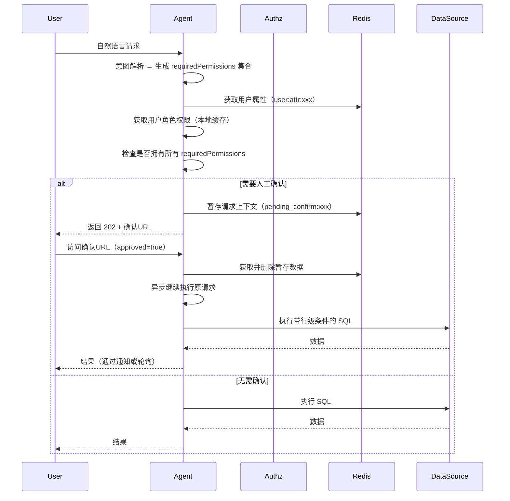

> **技术栈**  
> - JDK 21（开启虚拟线程）  
> - Spring Boot 3.5.3（Spring MVC + Tomcat）  
> - Spring Cloud Alibaba 2025.0.0.0  
> - Spring Authorization Server 1.8.3  
> - Spring AI Alibaba 1.1.2.0（A2A + Nacos 集成）  
> - Nacos 3.2+（注册中心）  
> - MySQL 8.0、Redis 7.x  
> - Caffeine、Lettuce  
> - Logback + Logstash Encoder  
> - MyBatis  
> - Bouncy Castle（椭圆曲线支持）

**包名**：`io.github.latcn.a2a.security`  
**模块**：  
- `a2a-authorization-server`  
- `a2a-common-permission`  
- `a2a-security-starter`

---
## 目录

1. [背景与目标](#1-背景与目标)
2. [核心设计理念](#2-核心设计理念)
3. [总体架构与模块划分](#3-总体架构与模块划分)
4. [模块间依赖关系](#4-模块间依赖关系)
5. [数据模型设计](#5-数据模型设计)
6. [核心组件：责任链与对话引擎](#6-核心组件责任链与对话引擎)
7. [授权服务器 Token 设计（增强）](#7-授权服务器-token-设计增强)
8. [对话驱动的动态授权与人工确认](#8-对话驱动的动态授权与人工确认)
9. [权限执行层：SQL 拦截与行级规则注入](#9-权限执行层sql-拦截与行级规则注入)
10. [大模型原生安全防护（MCP Tool 调用）](#10-大模型原生安全防护mcp-tool-调用)
11. [限流与熔断](#11-限流与熔断)
12. [Agent间调用安全（基于 Spring AI Alibaba A2A）](#12-agent间调用安全基于-spring-ai-alibaba-a2a)
13. [数据签名与验签（ES256）](#13-数据签名与验签es256)
14. [配置与部署](#14-配置与部署)
15. [审计日志设计](#15-审计日志设计)
16. [安全加固矩阵](#16-安全加固矩阵)
17. [扩展点设计](#17-扩展点设计)

---

## 1. 背景与目标

在政企、军工或大型金融机构的内网环境中，AI Agent 的普及带来了新的安全挑战。传统的“内网即信任”理念已不再适用，Agent 必须具备完整的权限控制能力。

**核心目标**：

- **身份认证与授权**：Agent 间认证、用户身份透传、防冒充，支持对话级动态授权。
- **最小特权与动态筛选**：每次对话仅激活用户权限中的必要子集，降低权限滥用风险。
- **行级数据安全**：通过行级规则模板动态注入 SQL 条件，确保用户只能访问授权范围内的数据行。
- **高性能与可审计**：虚拟线程、三级缓存，全链路审计日志。
- **大模型安全**：工具调用拦截、人工确认（HITL）、凭据保险箱、限流防雪崩。
- **极简可落地**：数据模型无数据域、无工作空间、无中间表、无策略引擎、无分类标签、无菜单映射、无 JWT 权限声明、无用户属性在 Token 中。

---

## 2. 核心设计理念

- **同步编码，异步性能**：全面拥抱 JDK 21 虚拟线程，以极低心智负担支撑高并发 A2A 调用与 SSE 长连接。
- **对话即权限边界**：基于自然语言意图动态筛选权限，低风险自动批准，高风险人工确认。
- **行级规则模板化**：权限直接携带行级过滤条件（JSON 模板），运行时替换为用户属性，实现细粒度数据隔离。
- **责任链可扩展**：权限校验采用责任链模式，支持热插拔校验器。
- **授权服务器仅做身份**：不参与任何权限决策，所有权限判断由 Agent 基于角色权限数据库完成。
- **Token 极简化**：JWT 仅包含不可变身份标识，用户动态属性存储在 Redis 中，避免 Token 臃肿和属性变更导致的 Token 重新颁发。
- **人工确认异步化**：不阻塞虚拟线程，通过 Redis 暂存请求上下文，返回确认 URL 供用户回调恢复执行。
- **A2A 标准协议**：Agent 间通信遵循 Spring AI Alibaba A2A 协议，使用 Nacos 进行服务发现与注册。
- **全面数据签名**：所有关键暂存数据（如确认上下文）必须使用 ES256 签名，防止篡改。

---

## 3. 总体架构与模块划分

**四个独立部署单元**：
1. **授权服务器**（Authorization Server）— 基于 Spring Authorization Server，负责颁发身份令牌、管理用户同意、A2A ACL。
2. **Agent**（既是 OAuth2 客户端，又是资源服务器）— 内嵌安全过滤器、责任链、对话意图解析引擎、SQL 拦截器、A2A Server/Client。
3. **Nacos** — A2A 注册中心与 AgentCard 存储。
4. **Redis** — 一次性令牌、限流计数器、权限变更广播、用户属性缓存、**人工确认暂存数据**。

**Maven 模块**：

```
a2a-security/
├── a2a-authorization-server/         # 授权服务器
├── a2a-common-permission/            # 独立权限 JAR
│   ├── api/                          # 权限检查接口、角色权限服务
│   ├── chain/                        # 责任链处理器
│   └── rowrule/                      # 行级规则解析与合并引擎
└── a2a-security-starter/             # Agent 安全起步依赖
    ├── intent/                       # 对话意图解析（NLU/LLM）
    ├── risk/                         # 风险判断 & HITL
    ├── interceptor/                  # MyBatis SQL 拦截器
    ├── tool/                         # MCP Tool 安全包装器
    ├── ratelimit/                    # 限流器（滑动窗口）
    ├── userattr/                     # 用户属性服务（Redis）
    ├── a2a/                          # A2A 集成（Provider/Consumer）
    └── config/                       # 自动配置
```

---

## 4. 模块间依赖关系

**编译时依赖**（箭头方向表示“依赖者 → 被依赖者”）：

```
┌─────────────────────┐
│ a2a-agent-xxx       │  业务 Agent
└──────────┬──────────┘
           │ depends on
           ▼
┌─────────────────────┐      ┌────────────────────────┐
│ a2a-security-starter│─────▶│ a2a-common-permission  │
└──────────┬──────────┘      └────────────────────────┘
           │
           │ depends on
           ▼
┌─────────────────────────────────────────────────────────────────┐
│ 外部依赖：Spring Boot, Spring AI, Redis, MySQL, Caffeine,      │
│ Logstash Encoder, MyBatis, Spring AI Alibaba A2A Nacos         │
└─────────────────────────────────────────────────────────────────┘
```

**运行期调用关系**：授权服务器负责 Token Exchange、用户同意、ACL 白名单检查；Agent 负责对话意图解析、动态权限筛选、行级规则注入、工具调用拦截、限流，并从 Redis 获取用户属性及暂存人工确认上下文；Agent 间通过 A2A 协议通信，JWT 通过 RestClient 拦截器自动传递。

---

## 5. 数据模型设计

### 5.1 表清单

| 表名 | 作用 |
|------|------|
| `t_user` | 用户（存储静态基础信息） |
| `t_role` | 角色 |
| `t_user_role` | 用户-角色关联 |
| `t_permission` | 权限（权限码、操作、风险、行级规则模板） |
| `t_role_permission` | 角色-权限关联 |
| `t_user_consent` | 用户同意记录（授权服务器用） |
| `t_a2a_acl` | Agent 间调用白名单（简化版） |
| `t_credential_vault` | 凭据保险箱（可选） |

### 5.2 DDL 语句

```sql
-- 用户表（仅存储静态基础信息）
CREATE TABLE t_user (
    user_id     VARCHAR(64) PRIMARY KEY,
    username    VARCHAR(64) NOT NULL UNIQUE,
    department  VARCHAR(128),
    created_at  TIMESTAMP(6) DEFAULT CURRENT_TIMESTAMP(6)
);

-- 角色表
CREATE TABLE t_role (
    role_id     VARCHAR(32) PRIMARY KEY,
    role_name   VARCHAR(64) NOT NULL,
    description TEXT
);

-- 用户-角色
CREATE TABLE t_user_role (
    user_id     VARCHAR(64) NOT NULL,
    role_id     VARCHAR(32) NOT NULL,
    PRIMARY KEY (user_id, role_id)
);

-- 权限表（核心）
CREATE TABLE t_permission (
    permission_id     VARCHAR(32) PRIMARY KEY,
    permission_code   VARCHAR(64) NOT NULL UNIQUE COMMENT '权限码，如 order:read, tool:search',
    action_code       VARCHAR(32) NOT NULL COMMENT 'READ,CREATE,UPDATE,DELETE,EXPORT',
    risk_level        VARCHAR(16) NOT NULL DEFAULT 'LOW',
    row_rule_template JSON COMMENT '行级规则模板，如 {"orders":"salesperson_id = #{user.id}"}',
    description       TEXT,
    created_at        TIMESTAMP(6) DEFAULT CURRENT_TIMESTAMP(6)
);

-- 角色-权限
CREATE TABLE t_role_permission (
    role_id       VARCHAR(32) NOT NULL,
    permission_id VARCHAR(32) NOT NULL,
    PRIMARY KEY (role_id, permission_id)
);

-- 用户同意（授权服务器记录用户对客户端的授权）
CREATE TABLE t_user_consent (
    consent_id   VARCHAR(64) PRIMARY KEY,
    user_id      VARCHAR(64) NOT NULL,
    client_id    VARCHAR(64) NOT NULL,
    scope        TEXT COMMENT '仅用于展示，不用于权限判断',
    created_at   TIMESTAMP(6),
    expires_at   TIMESTAMP(6)
);

-- Agent 间调用 ACL（仅存储允许调用）
CREATE TABLE t_a2a_acl (
    id            BIGINT AUTO_INCREMENT PRIMARY KEY,
    source_agent  VARCHAR(128) NOT NULL,
    target_agent  VARCHAR(128) NOT NULL,
    created_at    TIMESTAMP(6) DEFAULT CURRENT_TIMESTAMP(6),
    UNIQUE KEY uk_agent_pair (source_agent, target_agent)
);

-- 凭据保险箱（可选）
CREATE TABLE t_credential_vault (
    id               BIGINT AUTO_INCREMENT PRIMARY KEY,
    credential_ref   VARCHAR(64) UNIQUE NOT NULL,
    client_id        VARCHAR(64) NOT NULL,
    external_system  VARCHAR(64) NOT NULL,
    credential_type  VARCHAR(16) NOT NULL,
    encrypted_secret TEXT NOT NULL,
    scope            VARCHAR(256),
    expires_at       TIMESTAMP(6)
);
```

### 5.3 权限码约定

- **资源访问权限**：格式为 `<resource>:<action>`，例如 `order:read`, `order:export`, `customer:update`。
- **工具调用权限**：格式为 `tool:<toolName>`，例如 `tool:search_documents`, `tool:send_email`。
- 同一个权限码同时代表资源和工具权限，系统不区分类型，统一校验。

### 5.4 用户属性存储（Redis）

用户动态属性（如 `region_id`, `clearance`, `team_id` 等）不存储在 JWT 中，而是保存在 Redis 中，结构：

```
Key:   user:attr:{userId}
Value: Hash 或 JSON，例如 {"region_id":"east","clearance":"confidential","team_id":"sales_001"}
TTL:   可配置（如 3600 秒），属性变更时主动刷新
```

Agent 在需要用户属性时（如 SQL 行级规则注入、风险判断）通过 `UserAttributeService` 从 Redis 获取。授权服务器颁发 Token 时不携带这些属性。

---

## 6. 核心组件：责任链与对话引擎

### 6.1 PermissionCheckHandler 接口

```java
public interface PermissionCheckHandler {
    CheckResult check(PermissionCheckContext context);
    enum CheckResult { ALLOW, DENY, ABSTAIN }
    default int order() { return 0; }
}
```

### 6.2 内置处理器（Agent 侧）

| 处理器 | 顺序 | 职责 |
|--------|------|------|
| `RolePermissionHandler` | `100` | 检查用户是否拥有 `requiredPermissions` 中的所有权限码，并合并行级规则模板 |
| `IntentRiskHandler` | `200` | 根据权限风险等级及用户确认状态，决定放行、拒绝或触发 HITL 异步确认 |

### 6.3 PermissionCheckContext 定义

```java
public class PermissionCheckContext {
    private final String userId;
    private final Set<String> requiredPermissions;  // 本次操作需要的最小权限集合
    private final Jwt jwtToken;                    // 原始 JWT（不含属性）
    // 以下为责任链填充的运行时数据
    private Map<String, String> rowRuleTemplates;   // 合并后的行级规则
    private List<Permission> matchedPermissions;    // 实际拥有的匹配权限列表
    
    // builder, getters, setters...
}
```

### 6.4 RolePermissionHandler 实现

```java
@Component
public class RolePermissionHandler implements PermissionCheckHandler {
    private final RolePermissionService rolePermService;
    private final CacheManager cacheManager;

    @Override
    public CheckResult check(PermissionCheckContext ctx) {
        Set<Permission> userPermissions;
        // 优先使用 JWT 中的 allowed_permission_ids（A2A 场景）
        List<String> allowedIds = ctx.getJwt().getClaimAsStringList("allowed_permission_ids");
        if (allowedIds != null && !allowedIds.isEmpty()) {
            userPermissions = rolePermService.getPermissionsByIds(allowedIds);
        } else {
            userPermissions = rolePermService.getUserPermissions(ctx.getUserId());
        }
        Set<String> userPermCodes = userPermissions.stream()
            .map(Permission::getPermissionCode)
            .collect(Collectors.toSet());
        boolean hasAll = ctx.getRequiredPermissions().stream()
            .allMatch(userPermCodes::contains);
        if (!hasAll) {
            return CheckResult.DENY;
        }
        // 筛选匹配的权限对象
        List<Permission> matched = userPermissions.stream()
            .filter(p -> ctx.getRequiredPermissions().contains(p.getPermissionCode()))
            .collect(Collectors.toList());
        ctx.setMatchedPermissions(matched);
        ctx.setRowRuleTemplates(mergeRowRules(matched));
        return CheckResult.ALLOW;
    }

    private Map<String, String> mergeRowRules(List<Permission> perms) {
        Map<String, String> result = new HashMap<>();
        for (Permission p : perms) {
            Map<String, String> rules = p.getRowRuleTemplateAsMap();
            for (Map.Entry<String, String> entry : rules.entrySet()) {
                String table = entry.getKey();
                String cond = entry.getValue();
                result.merge(table, cond, (oldCond, newCond) -> "(" + oldCond + " OR " + newCond + ")");
            }
        }
        return result;
    }
}
```

### 6.5 IntentRiskHandler 实现（异步确认）

```java
@Component
public class IntentRiskHandler implements PermissionCheckHandler {
    private final RiskConfirmService confirmService;

    @Override
    public CheckResult check(PermissionCheckContext ctx) {
        List<Permission> matched = ctx.getMatchedPermissions();
        RiskLevel highest = matched.stream()
            .map(Permission::getRiskLevel)
            .max(Comparator.comparingInt(RiskLevel::getLevel))
            .orElse(RiskLevel.LOW);

        // 已确认的权限直接放行
        if (confirmService.hasConfirmed(ctx.getUserId(), matched)) {
            return CheckResult.ALLOW;
        }
        
        if (highest == RiskLevel.HIGH || highest == RiskLevel.MEDIUM) {
            // 不阻塞，触发异步确认流程，抛异常返回确认 URL
            String confirmUrl = confirmService.requestConfirm(ctx, null); // 需传入原始请求
            throw new ConfirmRequiredException(confirmUrl);
        }
        return CheckResult.ALLOW;
    }
}
```

### 6.6 责任链装配

```java
@Component
public class AgentPermissionChain {
    private final List<PermissionCheckHandler> handlers;

    public AgentPermissionChain(List<PermissionCheckHandler> handlers) {
        this.handlers = handlers.stream()
            .sorted(Comparator.comparingInt(PermissionCheckHandler::order))
            .collect(Collectors.toList());
    }

    public boolean check(PermissionCheckContext ctx) {
        for (PermissionCheckHandler h : handlers) {
            CheckResult r = h.check(ctx);
            if (r == CheckResult.ALLOW) return true;
            if (r == CheckResult.DENY) return false;
        }
        return false;
    }
}
```

### 6.7 上下文传递（ThreadLocal）

```java
@Component
public class PermissionContextHolder {
    private static final ThreadLocal<PermissionCheckContext> CONTEXT = new ThreadLocal<>();
    public static void set(PermissionCheckContext ctx) { CONTEXT.set(ctx); }
    public static PermissionCheckContext get() { return CONTEXT.get(); }
    public static void clear() { CONTEXT.remove(); }
}
```

### 6.8 权限缓存失效机制

```java
@Component
public class PermissionCacheInvalidator {
    @EventListener
    public void onRolePermissionChanged(RolePermissionChangedEvent event) {
        cacheManager.evictUserPermissions(event.getUserId());
        redis.publish("permission:invalidate", event.getUserId());
    }
}
```

---

## 7. 授权服务器 Token 设计（增强）

授权服务器颁发的 JWT **极简化**，仅包含不可变身份标识和少量控制信息，**不包含任何用户属性**。

### 7.1 JWT 声明

| 声明 | 说明 |
|------|------|
| `sub` | 用户唯一标识（user_id） |
| `allowed_permission_ids` | 可选，A2A 场景下上游传递的权限 ID 列表（字符串数组） |
| `credential_ref` | 可选，凭据引用（字符串） |
| 其他标准声明 | `iss`, `aud`, `exp`, `iat`, `jti` 等 |

### 7.2 签名算法与椭圆曲线

**强制要求**：JWT 签名必须使用 **ES256**（ECDSA with P-256 curve and SHA-256）。理由：
- 更高安全性（同等密钥长度下比 RSA 更强）。
- 更小的签名尺寸和计算开销。
- 符合现代安全实践（NIST 推荐）。

Spring Authorization Server 配置示例：

```yaml
spring:
  security:
    oauth2:
      authorizationserver:
        jwt:
          signature-algorithm: ES256
          jwk-set:
            key-id: "a2a-key-1"
            ec-key:
              curve: "P-256"
```

若环境不支持 EC，可回退到 RS256，但强烈建议使用 ES256。

### 7.3 用户属性 Redis 存储

Agent 收到请求后，根据 JWT 中的 `sub` 从 Redis 获取用户属性：

```java
@Service
public class UserAttributeService {
    private final RedisTemplate<String, Object> redisTemplate;
    
    public Map<String, Object> getUserAttributes(String userId) {
        String key = "user:attr:" + userId;
        Map<Object, Object> entries = redisTemplate.opsForHash().entries(key);
        if (entries.isEmpty()) {
            // 从数据库加载并写入 Redis
            Map<String, Object> dbAttrs = loadFromDatabase(userId);
            redisTemplate.opsForHash().putAll(key, dbAttrs);
            redisTemplate.expire(key, Duration.ofHours(1));
            return dbAttrs;
        }
        return entries.entrySet().stream()
            .collect(Collectors.toMap(e -> (String) e.getKey(), Map.Entry::getValue));
    }
}
```

### 7.4 授权服务器职责

- 用户认证
- 客户端认证
- 用户同意管理（记录在 `t_user_consent`，仅用于合规展示）
- 检查 `t_a2a_acl` 是否允许 A→B 调用（若配置开启）
- 签发 JWT（不查角色权限，不写用户属性）

---

## 8. 对话驱动的动态授权与人工确认

### 8.1 完整流程



### 8.2 意图解析

使用 NLU 模型或 LLM 从自然语言中提取所需权限码集合：

```json
{
  "requiredPermissions": ["order:read", "order:export"],
  "parameters": {"timeRange": "last_month"}
}
```

### 8.3 人工确认实现（HTTP + Redis，异步回调）

采用**异步确认**模式：Agent 遇到需要人工确认的权限时，不阻塞等待，而是将请求上下文暂存到 Redis，返回确认 URL 给用户，用户确认后通过回调恢复执行。

#### 8.3.1 暂存数据结构

```java
@Data
public class ConfirmPendingData {
    private PermissionCheckContext ctx;
    private Map<String, Object> originalRequest;   // 原始请求参数（如 SQL 参数、工具输入等）
    private String userId;
    private String sessionId;
    private long createTime;
    private String callbackUrl;                    // 可选，用于通知结果
}
```

#### 8.3.2 核心服务（RiskConfirmService）

```java
@Service
public class RiskConfirmService {
    private final RedisTemplate<String, String> redisTemplate;
    private final ObjectMapper objectMapper;
    private final ExternalNotifier notifier;
    private final AsyncTaskExecutor asyncExecutor;
    private final BusinessService businessService;
    private final AuditService auditService;
    private final DataSigner dataSigner;  // 签名服务
    
    private static final Duration PENDING_TTL = Duration.ofMinutes(5);
    private static final int MAX_USER_PENDING = 5;
    
    public String requestConfirm(PermissionCheckContext ctx, Map<String, Object> originalRequest) {
        String userId = ctx.getUserId();
        
        // 1. 单用户并发限制（防攻击）
        String userLimitKey = "pending_limit:" + userId;
        Long count = redisTemplate.opsForValue().increment(userLimitKey);
        if (count == 1) redisTemplate.expire(userLimitKey, PENDING_TTL);
        if (count > MAX_USER_PENDING) {
            redisTemplate.decrement(userLimitKey);
            throw new RateLimitException("您有未完成的确认请求，请先处理");
        }
        
        try {
            String confirmId = UUID.randomUUID().toString();
            String key = "pending_confirm:" + confirmId;
            ConfirmPendingData data = new ConfirmPendingData(ctx, originalRequest);
            data.setUserId(userId);
            data.setCreateTime(System.currentTimeMillis());
            // 对数据进行签名
            String signedData = dataSigner.signData(data);
            redisTemplate.opsForValue().set(key, signedData, PENDING_TTL);
            String confirmUrl = generateConfirmUrl(confirmId);
            notifier.send(userId, buildConfirmMessage(ctx, confirmUrl));
            return confirmUrl;
        } finally {
            redisTemplate.decrement(userLimitKey);
        }
    }
    
    public boolean handleConfirm(String confirmId, boolean approved) {
        String key = "pending_confirm:" + confirmId;
        String signedJson = redisTemplate.opsForValue().getAndDelete(key);
        if (signedJson == null) return false;
        // 验签
        ConfirmPendingData data = dataSigner.verifyAndParse(signedJson, ConfirmPendingData.class);
        if (data == null) {
            auditService.logSignatureFailure(confirmId);
            return false;
        }
        if (approved) {
            asyncExecutor.submit(() -> continueRequest(data));
        } else {
            auditService.logDenied(data);
        }
        return true;
    }
    
    private void continueRequest(ConfirmPendingData data) {
        PermissionContextHolder.set(data.getCtx());
        try {
            businessService.execute(data);
        } finally {
            PermissionContextHolder.clear();
        }
    }
    
    public boolean hasConfirmed(String userId, List<Permission> permissions) {
        for (Permission p : permissions) {
            String key = "confirm:" + userId + ":" + p.getPermissionId();
            if (redisTemplate.hasKey(key)) return true;
        }
        return false;
    }
    
    private String generateConfirmUrl(String confirmId) {
        return "/api/confirm/" + confirmId;
    }
}
```

#### 8.3.3 确认端点（ConfirmController）

```java
@RestController
@RequestMapping("/api")
public class ConfirmController {
    private final RiskConfirmService confirmService;
    
    @PostMapping("/confirm/{confirmId}")
    public ResponseEntity<String> confirm(
            @PathVariable String confirmId,
            @RequestParam boolean approved) {
        boolean handled = confirmService.handleConfirm(confirmId, approved);
        if (!handled) {
            return ResponseEntity.status(404).body("确认请求不存在或已过期");
        }
        return ResponseEntity.ok(approved ? "已批准，请求正在处理" : "已拒绝");
    }
}
```

#### 8.3.4 全局异常处理（返回确认 URL）

```java
@ControllerAdvice
public class ConfirmExceptionHandler {
    @ExceptionHandler(ConfirmRequiredException.class)
    public ResponseEntity<Map<String, String>> handleConfirmRequired(ConfirmRequiredException ex) {
        return ResponseEntity.status(HttpStatus.ACCEPTED)
            .body(Map.of("status", "confirm_required", "confirm_url", ex.getConfirmUrl()));
    }
}
```

#### 8.3.5 防攻击措施

- 单用户并发限制（Redis 计数器，最多5个未确认）
- 可选：按用户速率限制（如每分钟最多3次确认请求）
- 确认链接一次性（消费后删除）
- TTL 自动过期（5分钟）
- 数据签名防止篡改

### 8.4 确认缓存

用户同意某权限后，为减少后续重复确认，将确认结果缓存到 Redis：

- Key: `confirm:{userId}:{permId}`，Value: `"true"`，TTL 默认 5 分钟。
- 用户角色变更或登出时，通过 Redis Pub/Sub 广播清除该用户的所有确认缓存。

### 8.5 A2A 场景的权限传递

上游 Agent 调用下游 Agent 时，可以在 JWT 的 `allowed_permission_ids` 中明确列出允许的权限 ID。下游 Agent 的 `RolePermissionHandler` 会优先使用该列表，不再查询用户角色。这样可实现无人值守的自动化 Agent 调用。

同时，Agent 间调用前需检查 `t_a2a_acl` 表：若表中不存在 `(source_agent, target_agent)` 记录，则拒绝调用（默认拒绝）。检查可在授权服务器签发令牌时或 Agent 接收请求时执行。

---

## 9. 权限执行层：SQL 拦截与行级规则注入

### 9.1 MyBatis 拦截器实现

```java
@Intercepts({@Signature(type = StatementHandler.class, method = "prepare", args = {Connection.class, Integer.class})})
public class RowRuleInterceptor implements Interceptor {
    private final UserAttributeService userAttrService;

    @Override
    public Object intercept(Invocation invocation) throws Throwable {
        PermissionCheckContext ctx = PermissionContextHolder.get();
        if (ctx == null || ctx.getRowRuleTemplates().isEmpty()) {
            return invocation.proceed();
        }
        StatementHandler handler = (StatementHandler) invocation.getTarget();
        BoundSql boundSql = handler.getBoundSql();
        String sql = boundSql.getSql();
        Map<String, Object> userAttrs = userAttrService.getUserAttributes(ctx.getUserId());
        String newSql = injectRowConditions(sql, ctx.getRowRuleTemplates(), userAttrs);
        Field field = boundSql.getClass().getDeclaredField("sql");
        field.setAccessible(true);
        field.set(boundSql, newSql);
        return invocation.proceed();
    }

    private String injectRowConditions(String sql, Map<String, String> tableConditions, Map<String, Object> userAttrs) {
        // 使用 JSqlParser 解析 SQL，获取表名
        // 对每张表，如果有条件模板，替换 #{user.xxx} 为 ?，并记录需要绑定的参数值
        // 实际参数通过 MyBatis 的参数处理器在后续绑定
        // 示例简化：将条件拼接到 WHERE 子句后
        StringBuilder builder = new StringBuilder(sql);
        if (sql.toLowerCase().contains("where")) {
            // 追加 AND (...)
        } else {
            // 添加 WHERE (...)
        }
        return builder.toString();
    }
}
```

### 9.2 安全要求

- 行级规则模板在权限入库时（`t_permission.row_rule_template`）必须经过校验，禁止包含 `UNION`、`DROP`、`--` 等危险 SQL 关键字。
- 所有用户属性值通过 `PreparedStatement` 参数绑定，杜绝字符串拼接。

---

## 10. 大模型原生安全防护（MCP Tool 调用）

### 10.1 工具调用统一包装器

```java
@Component
public class SecurityToolCallbackWrapper implements ToolCallback {
    private final ToolCallback delegate;
    private final AgentPermissionChain permissionChain;
    private final ToolResourceExtractor extractor;
    private final JwtHolder jwtHolder;

    @Override
    public String call(String toolInput) {
        Jwt jwt = jwtHolder.getJwt();
        String userId = jwt.getSubject();
        String toolName = delegate.getToolDefinition().name();
        String requiredPermCode = "tool:" + toolName;
        
        // 1. 检查用户是否拥有该工具权限
        PermissionCheckContext ctx = PermissionCheckContext.builder()
            .userId(userId)
            .requiredPermissions(Set.of(requiredPermCode))
            .jwtToken(jwt)
            .build();
        if (!permissionChain.check(ctx)) {
            throw new AccessDeniedException("当前用户不允许调用工具: " + toolName);
        }

        // 2. 提取工具参数中的资源 ID
        List<ResourceRef> resources = extractor.extract(toolInput, delegate.getToolDefinition());
        
        // 3. 对每个资源进行资源权限校验
        for (ResourceRef ref : resources) {
            String action = mapOperation(ref.getOperation());
            String resourcePermCode = ref.getResourceType() + ":" + action;
            PermissionCheckContext resCtx = PermissionCheckContext.builder()
                .userId(userId)
                .requiredPermissions(Set.of(resourcePermCode))
                .resourceId(ref.getResourceId())
                .jwtToken(jwt)
                .build();
            if (!permissionChain.check(resCtx)) {
                throw new AccessDeniedException("无权通过工具访问资源: " + ref.getResourceId());
            }
        }

        // 4. 若工具标记 @RequireHumanConfirm，可触发 HITL（类似 IntentRiskHandler）
        if (delegate.getClass().isAnnotationPresent(RequireHumanConfirm.class)) {
            // 触发异步确认流程
        }

        // 5. 执行原工具
        return delegate.call(toolInput);
    }
    
    private String mapOperation(String operation) {
        // 将工具参数中的操作映射为标准 action
        switch (operation.toLowerCase()) {
            case "read": case "get": case "query": return "READ";
            case "create": case "add": case "insert": return "CREATE";
            case "update": case "modify": case "edit": return "UPDATE";
            case "delete": case "remove": return "DELETE";
            case "export": return "EXPORT";
            default: return operation.toUpperCase();
        }
    }
}
```

### 10.2 凭据保险箱

- 表 `t_credential_vault` 存储加密后的外部系统凭证（API Key / OAuth Token）。
- Agent 持有 `credential_ref`，调用外部系统时动态解密注入。

---

## 11. 限流与熔断

为防止 Agent 失控或恶意调用耗尽资源，实现基于 Redis 滑动窗口的三维限流：

- **按 Agent ID**：限制单个 Agent 的总请求 QPS。
- **按用户 ID**：限制单个用户的请求 QPS。
- **按工具名称**：限制单个工具的调用 QPS。

```java
@Component
public class RateLimitService {
    private final RedisTemplate<String, String> redisTemplate;
    
    public boolean checkLimit(String key, int maxRequests, long windowSeconds) {
        String luaScript = 
            "local current = redis.call('INCR', KEYS[1]) " +
            "if current == 1 then redis.call('EXPIRE', KEYS[1], ARGV[2]) end " +
            "return current";
        Long current = redisTemplate.execute(
            new DefaultRedisScript<>(luaScript, Long.class),
            Collections.singletonList(key),
            String.valueOf(maxRequests), String.valueOf(windowSeconds)
        );
        return current <= maxRequests;
    }
}
```

配置示例：

```yaml
a2a:
  rate-limit:
    enabled: true
    agent-qps: 200
    user-qps: 50
    tool-qps: 30
    window-seconds: 1
```

超过限制返回 HTTP 429。

---

## 12. Agent间调用安全（基于 Spring AI Alibaba A2A）

### 12.1 A2A 协议与架构概览

使用 Spring AI Alibaba 框架（版本 1.1.2.0）的 A2A 实现，包含：
- **A2A Server**：将本地 ReactAgent 暴露为 A2A 服务（HTTP）。
- **A2A Registry**：Agent 注册中心（与 Nacos 3.2+ 集成）。
- **A2A Discovery**：从 Nacos 发现其他 Agent。

### 12.2 发布 A2A 智能体（Provider Agent）

**第一步：添加依赖**

```xml
<dependency>
    <groupId>com.alibaba.cloud.ai</groupId>
    <artifactId>spring-ai-alibaba-starter-a2a-nacos</artifactId>
</dependency>
```

**第二步：定义本地 ReactAgent**

```java
@Configuration
public class A2AAgentConfig {
    @Bean(name = "orderAgent")
    public ReactAgent orderAgent(ChatModel chatModel) {
        return ReactAgent.builder()
            .name("order_agent")
            .model(chatModel)
            .description("负责处理订单查询与导出的智能体。执行前会校验调用者是否具备 order:read/order:export 权限。")
            .instruction("你是一个订单处理专家...")
            .outputKey("order_data")
            .build();
    }
}
```

**第三步：配置 A2A Server 与 Nacos 注册（application.yml）**

```yaml
spring:
  application:
    name: order-agent-provider
  ai:
    alibaba:
      a2a:
        server:
          version: 1.0.0
          card:
            name: order_agent                     # 与 ReactAgent.name 一致
            description: 负责处理订单查询与导出的智能体
            provider:
              name: Agent A
              organization: Finance Dept
        nacos:
          server-addr: nacos.agent.svc.cluster.local:8848
          username: ${NACOS_USER}
          password: ${NACOS_PWD}
          registry:
            enabled: true                         # 关键：开启自动注册
  security:
    oauth2:
      resourceserver:
        jwt:
          jwk-set-uri: https://auth.agent.svc.cluster.local/oauth2/jwks
```

### 12.3 调用 A2A 远程智能体（Consumer Agent）

**第一步：配置发现（application.yml）**

```yaml
spring:
  ai:
    alibaba:
      a2a:
        nacos:
          server-addr: nacos.agent.svc.cluster.local:8848
          discovery:
            enabled: true
```

**第二步：构建 A2aRemoteAgent 并动态传递 JWT**

```java
@Component
public class OrderAnalysisService {
    @Autowired
    private AgentCardProvider agentCardProvider;
    @Autowired
    private RestClient.Builder restClientBuilder;
    
    public void callOrderAgentWithToken(String orderQuery, String jwtToken) {
        // 每次调用动态创建 RestClient，带上当前 JWT
        RestClient restClient = restClientBuilder
            .requestInterceptor((request, body, execution) -> {
                request.getHeaders().setBearerAuth(jwtToken);
                return execution.execute(request, body);
            })
            .build();
        
        A2aRemoteAgent remoteAgent = A2aRemoteAgent.builder()
            .name("order_agent")
            .agentCardProvider(agentCardProvider)
            .restClient(restClient)
            .build();
        
        Optional<OverAllState> result = remoteAgent.invoke(orderQuery);
        result.ifPresent(state -> {
            System.out.println("远程调用成功: " + state.value("output"));
        });
    }
}
```

### 12.4 安全集成与 ACL

- **JWT 透传**：Consumer Agent 通过 RestClient 拦截器自动添加 `Authorization: Bearer <jwt>`。
- **Provider 端校验**：Provider Agent 通过 Spring Security 的 JWT 过滤器验证 Token，并提取用户身份。
- **ACL 前置过滤**：授权服务器在签发 Token 前检查 `t_a2a_acl` 表，若 `(source_agent, target_agent)` 不存在则拒绝签发。

### 12.5 可选增强：mTLS 与 DPoP

- **mTLS**：在负载均衡或网关层配置客户端证书验证。
- **DPoP**：在应用层实现令牌绑定证明。

配置开关：

```yaml
a2a:
  security:
    agent-to-agent:
      mtls-enabled: true
      dpop-enabled: false
```

---

## 13. 数据签名与验签（ES256）

为确保 Redis 中暂存数据（如人工确认上下文、用户属性等）的完整性和防篡改，必须对关键数据进行签名，使用时验签。

### 13.1 签名范围

- **人工确认暂存数据**（`pending_confirm:{confirmId}`）：使用授权服务器私钥对整个 JSON 对象计算签名，与数据一起存储。
- **用户属性**（`user:attr:{userId}`）：可选签名，高安全场景建议签名。
- **JWT 本身**：已通过标准 JWT 签名（ES256）保护，无需额外处理。

### 13.2 签名算法

强制使用 **ES256**（ECDSA with P-256 curve and SHA-256）。

### 13.3 实现方式

**签名数据结构**：

```java
@Data
public class SignedData<T> {
    private T data;
    private String signature;   // Base64 编码的签名
    private String signer;      // 签名者标识，如 "auth-server"
    private long timestamp;
}
```

**代码示例**：

```java
@Component
public class DataSigner {
    private final PrivateKey privateKey;   // 授权服务器私钥
    private final PublicKey publicKey;     // Agent 持有的公钥
    private final ObjectMapper objectMapper;
    
    public <T> String signData(T data) throws Exception {
        String payload = objectMapper.writeValueAsString(data);
        Signature sign = Signature.getInstance("SHA256withECDSA");
        sign.initSign(privateKey);
        sign.update(payload.getBytes(StandardCharsets.UTF_8));
        byte[] signature = sign.sign();
        SignedData<T> signed = new SignedData<>(data, Base64.getEncoder().encodeToString(signature), "auth-server", System.currentTimeMillis());
        return objectMapper.writeValueAsString(signed);
    }
    
    public <T> T verifyAndParse(String signedJson, Class<T> dataClass) throws Exception {
        // 使用构造参数类型避免类型擦除
        JavaType type = objectMapper.getTypeFactory().constructParametricType(SignedData.class, dataClass);
        SignedData<T> signed = objectMapper.readValue(signedJson, type);
        String payload = objectMapper.writeValueAsString(signed.getData());
        Signature verify = Signature.getInstance("SHA256withECDSA");
        verify.initVerify(publicKey);
        verify.update(payload.getBytes(StandardCharsets.UTF_8));
        boolean valid = verify.verify(Base64.getDecoder().decode(signed.getSignature()));
        if (!valid) throw new SecurityException("数据签名无效");
        return signed.getData();
    }
}
```

### 13.4 验签位置

- Agent 从 Redis 读取 `pending_confirm:{confirmId}` 时，先验签再反序列化。
- 若验签失败，拒绝该确认请求（可能遭篡改）。
- 授权服务器生成数据时自动签名。

### 13.5 密钥管理

- 授权服务器私钥存储在加密的密钥库中（如 HashiCorp Vault、KMS）。
- Agent 公钥可通过 JWKS 端点（`/oauth2/jwks`）获取，支持动态轮换。

---

## 14. 配置与部署

### 14.1 application.yml 完整示例

```yaml
spring:
  threads:
    virtual:
      enabled: true
  datasource:
    url: jdbc:mysql://localhost:3306/a2a_security
    username: ${DB_USER}
    password: ${DB_PASS}
    hikari:
      maximum-pool-size: 10
  redis:
    host: redis.internal
    port: 6379
    timeout: 2s
    lettuce:
      pool:
        max-active: 10
  security:
    oauth2:
      authorizationserver:
        jwt:
          signature-algorithm: ES256
          jwk-set:
            key-id: "a2a-key-1"
            ec-key:
              curve: "P-256"
  ai:
    alibaba:
      a2a:
        nacos:
          server-addr: nacos.agent.svc.cluster.local:8848
          username: ${NACOS_USER}
          password: ${NACOS_PWD}
        server:
          version: 1.0.0
          card:
            name: order_agent
            description: "订单处理智能体"
            provider:
              name: "Finance Dept"
        client:
          rest-template:
            connect-timeout: 5s
            read-timeout: 30s

a2a:
  security:
    risk:
      low-auto-approve: true
      medium-require-confirm: true
      confirm-ttl-seconds: 300
    cache:
      permission-ttl-seconds: 300
    user-attr:
      ttl-seconds: 3600
    row-rule:
      enabled: true
      dangerous-keywords: ["UNION", "DROP", "--"]
    hitl:
      enabled: true
      pending-ttl-seconds: 300
      max-pending-per-user: 5
      rate-limit-per-minute: 3
      sign-pending-data: true
    acl:
      enabled: true
    agent-to-agent:
      mtls-enabled: false
      dpop-enabled: false
    data-signature:
      enabled: true
      algorithm: ES256
      jwk-set-uri: https://auth.agent.svc.cluster.local/oauth2/jwks
    rate-limit:
      enabled: true
      agent-qps: 200
      user-qps: 50
      tool-qps: 30
      window-seconds: 1
    audit:
      never-block: false
```

### 14.2 启动检查清单

- [ ] 执行 DDL 创建所有表。
- [ ] 初始化角色、权限数据，为每个权限配置 `permission_code` 和 `row_rule_template`。
- [ ] 校验所有行级规则模板不含危险 SQL 关键字。
- [ ] 生成 ES256 密钥对，配置授权服务器 JWKS。
- [ ] 实现意图解析服务，输出 `requiredPermissions` 集合。
- [ ] 配置 HTTP 确认端点 `/api/confirm/{confirmId}` 及外部通知服务（邮件/钉钉等）。
- [ ] 注册 MyBatis 拦截器 `RowRuleInterceptor`。
- [ ] 配置审计日志 Logstash Encoder。
- [ ] 实现权限缓存失效监听器（基于 Redis Pub/Sub）。
- [ ] 实现用户属性加载服务（数据库 → Redis）。
- [ ] 配置 Nacos 注册中心及 Agent 服务发现。
- [ ] 添加 `spring-ai-alibaba-starter-a2a-nacos` 依赖，验证 A2A Server 自动注册。
- [ ] 为 Consumer Agent 配置 A2A Discovery 和 JWT 拦截器。
- [ ] 实现数据签名/验签工具类，集成到 `RiskConfirmService`。
- [ ] 可选：配置 mTLS 证书与 DPoP 逻辑。

---

## 15. 审计日志设计

每条决策记录为 JSON Lines，异步写入：

```json
{
  "@timestamp": "2026-06-11T10:00:00Z",
  "trace_id": "abc123",
  "user_id": "zhang.san",
  "session_id": "sess_456",
  "required_permissions": ["order:read", "order:export"],
  "matched_permissions": ["order:read"],
  "missing_permissions": ["order:export"],
  "decision": "DENY",
  "human_confirmed": false,
  "risk_level": "HIGH",
  "sql_before": "SELECT * FROM orders",
  "sql_after": "SELECT * FROM orders WHERE salesperson_id = ?",
  "deny_reason": "missing permission order:export",
  "eval_duration_ms": 12,
  "rate_limited": false,
  "confirm_id": "abc-123",
  "signature_valid": true
}
```

- 使用 `AsyncAppender` + `neverBlock=false` 确保日志不丢失（队列满时阻塞虚拟线程）。
- 每天轮转，保留 30 天，自动压缩。

---

## 16. 安全加固矩阵

| 安全机制 | 实现位置 | 必须 |
|---------|----------|------|
| OAuth2 Token Exchange | 授权服务器+Agent | ✅ |
| JWT ES256 椭圆曲线签名 | 授权服务器 | ✅ |
| 一次性令牌防重放 | Agent+Redis | ✅ |
| A2A ACL（白名单） | 授权服务器 | ✅ |
| 角色权限 + 行级规则 | Agent+SQL拦截器 | ✅ |
| 对话风险自动/人工确认（异步） | Agent+HITL | ✅ |
| 工具调用权限（权限码） | Agent+Tool包装器 | ✅ |
| 凭据保险箱 | 授权服务器+Agent | ✅ |
| 用户属性 Redis 存储 | Agent+Redis | ✅ |
| A2A 协议 + Nacos 服务发现 | Spring AI Alibaba | ✅ |
| JWT 自动透传 | RestClient 拦截器 | ✅ |
| Redis 暂存数据签名与验签 | 授权服务器+Agent | ✅ |
| Agent 间 mTLS | 网络层/Agent | 可选 |
| DPoP 令牌绑定 | Agent 应用层 | 可选 |
| 限流（滑动窗口） | Agent+Redis | ✅ |
| 审计日志阻塞写入 | Logback | ✅ |
| 防 HITL 攻击（并发+限流+TTL） | Agent+Redis | ✅ |

---

## 17. 扩展点设计

- **自定义 `PermissionCheckHandler`**：实现接口并注册为 Bean，自动加入责任链。
- **自定义 `RowRuleRenderer`**：支持从非 Redis 来源（如请求头、ThreadLocal）取值。
- **自定义 `ToolResourceExtractor`**：支持复杂工具参数的资源 ID 提取。
- **自定义 `RiskAssessor`**：替换默认风险等级判断逻辑（如基于动态规则）。
- **自定义意图解析器**：替换默认 NLU/LLM 实现，支持特定领域模型。
- **自定义 `UserAttributeProvider`**：支持从其他数据源（如 LDAP、数据库）加载用户属性。
- **自定义 `ExternalNotifier`**：替换默认的外部通知实现（邮件、钉钉、短信等）。
- **自定义 `SignatureProvider`**：替换默认 ES256 签名算法。
- **A2A 协议定制**：扩展 `A2aRemoteAgent` 的调用行为，支持自定义序列化、拦截器等。