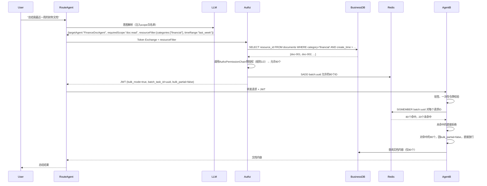
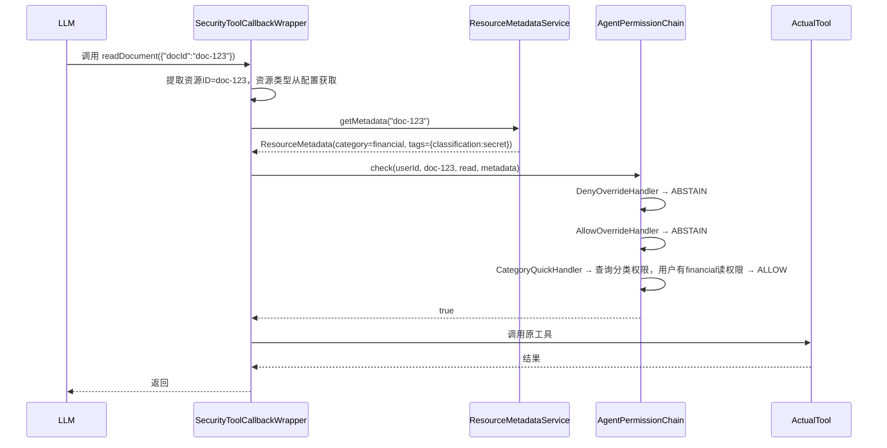

> **技术栈**  
> - JDK 21（开启虚拟线程）  
> - Spring Boot 3.5.3（Spring MVC + Tomcat）  
> - Spring Cloud Alibaba 2025.0.0.0  
> - Spring Authorization Server 1.8.3  
> - Spring AI Alibaba 1.1.2.0（Spring AI BOM 1.1.2）  
> - Nacos 3.0.3、MySQL 8.0、Redis 7.x  
> - jCasbin 1.81.0 + casbin-spring-boot-starter 1.8.0  
> - Caffeine、Lettuce（同步Redis客户端）  
> - Logback + Logstash Encoder（JSON Lines审计日志）  
>
> **包名**：`io.github.latcn.a2a.security`  
> **模块**：  
> - `a2a-authorization-server`  
> - `a2a-common-permission`  
> - `a2a-security-starter`

---
## 目录
1. [背景与目标](#1-背景与目标)
2. [核心设计理念](#2-核心设计理念)
3. [总体架构与模块划分](#3-总体架构与模块划分)
4. [模块间依赖关系](#4-模块间依赖关系)
5. [核心接口与组件（同步版·责任链模式）](#5-核心接口与组件同步版责任链模式)
6. [数据模型设计（协同优化版）](#6-数据模型设计协同优化版)
7. [jCasbin策略引擎集成与策略同步](#7-jcasbin策略引擎集成与策略同步)
8. [授权服务器Token声明与职责划分](#9-授权服务器token声明与职责划分)
   - 8.1 Token声明
   - 8.2 权限判断职责划分规则
   - 8.3 批量场景优化（含资源列表查询）
   - 8.4 核心场景覆盖
   - 8.5 大模型生成权限的保障机制
9. [大模型原生安全防护与平台级管控](#10-大模型原生安全防护与平台级管控)
    - 9.1 MCP Tool 调用统一权限切面
    - 9.2 Human-in-the-Loop确认机制
    - 9.3 凭据保险箱设计
    - 9.4 限流熔断与策略同步
10. [核心权限流程链路详解](#11-核心权限流程链路详解)
11. [配置与部署](#12-配置与部署)
12. [审计日志设计](#13-审计日志设计)
13. [安全加固矩阵](#14-安全加固矩阵)
14. [扩展点设计](#15-扩展点设计)
---
## 1. 背景与目标

在封闭内网环境中，AI Agent 之间的交互（Agent-to-Agent, A2A）面临间接提示词注入、权限越权、爆炸半径失控等严重挑战。本架构旨在构建一套高并发、强一致、防幻觉的 A2A 权限控制系统，确保 Agent 在多跳委托和工具调用场景下的绝对安全。

**核心目标**：
- **身份认证**：Agent间认证、用户身份透传、防冒充。
- **最小权限**：Scope细粒度、资源实例级控制、行级过滤。
- **性能优化**：虚拟线程、批量令牌Redis化、三级缓存。
- **可审计性**：全链路追溯、零丢失审计日志。
- **高可用性**：本地验签、Redis Streams可靠广播。
- **大模型安全**：Tool Calling拦截、动态限流、HITL。

---
## 2. 核心设计理念

- **同步编码，异步性能**：全面拥抱 JDK 21 虚拟线程，摒弃复杂的响应式编程，以极低的心智负担支撑高并发。
- **分类保底，标签微调**：构建“资源分类（刚性骨架）+ 资源标签（柔性血肉）”的双层 ABAC 模型，兼顾批量授权性能与细粒度动态拦截。
- **大模型原生安全**：权限校验下沉至 Spring AI 的 Tool Calling 层，防御大模型幻觉与提示词注入。
- **责任链可扩展**：权限校验采用责任链模式，每个校验器独立，支持热插拔。

---
## 3. 总体架构与模块划分

**四个独立部署单元**：
1. **授权服务器**（Authorization Server）— 基于 Spring Authorization Server。
2. **Agent**（既是 OAuth2 客户端，又是资源服务器）— 基于 Spring AI Alibaba A2A。
3. **Nacos** — A2A 注册中心与 AgentCard 存储。
4. **Redis** — 一次性令牌、批量任务ID、Streams广播、限流计数器。

**Maven父模块**：`io.github.latcn:a2a-security:1.0.0`

```
a2a-security/
├── a2a-authorization-server/         # 授权服务器
│   └── .../authz/
│       ├── token/                    # Token Exchange端点 + 定制器
│       ├── acl/                      # Agent间ACL管理
│       ├── consent/                  # 用户同意管理
│       ├── audit/                    # 审计日志记录
│       └── config/                   # 安全配置
├── a2a-common-permission/            # 独立权限JAR
│   └── .../permission/
│       ├── api/                      # PermissionChecker, ResourceTagService等接口
│       ├── jcasbin/                  # Enforcer配置、策略管理、Watcher
│       ├── tag/                      # 资源标签服务（三级缓存）
│       ├── chain/                    # 责任链处理器（Authz侧和Agent侧）
│       └── config/                   # 自动配置
└── a2a-security-starter/             # Agent安全起步依赖
    └── .../agent/
        ├── client/                   # TokenExchangeService, A2aClientFilter
        ├── server/                   # A2aJwtAuthenticationFilter, OneTimeTokenValidator
        ├── tool/                     # SecurityToolCallbackWrapper, 限流器
        ├── chain/                    # Agent侧责任链实现
        └── config/                   # 自动配置（虚拟线程、过滤器链）
```

---
## 4. 模块间依赖关系

（箭头方向表示“依赖者 → 被依赖者”）

```
┌─────────────────────┐
│ a2a-agent-xxx       │  业务Agent
└──────────┬──────────┘
           │ depends on
           ▼
┌─────────────────────┐      ┌────────────────────────┐
│ a2a-security-starter│─────▶│ a2a-common-permission  │
└──────────┬──────────┘      └────────────────────────┘
           │
           │ depends on
           ▼
┌─────────────────────────────────────────────────────────────────┐
│ 外部依赖：Spring Boot 3.5.3, Spring AI Alibaba 1.1.2.0,        │
│ jCasbin, Redis (Lettuce), MySQL, Caffeine, Logstash Encoder    │
└─────────────────────────────────────────────────────────────────┘
```
---
## 5. 核心接口与组件（同步版·责任链模式）

### 5.1 PermissionCheckHandler（权限校验器接口）

```java
public interface PermissionCheckHandler {
    CheckResult check(PermissionCheckContext context);
    enum CheckResult { ALLOW, DENY, ABSTAIN }
    default int order() { return 0; }
}
```

### 5.2 PermissionCheckContext（校验上下文）

```java
public class PermissionCheckContext {
    private final String userId;
    private final String resourceId;
    private final String operation;
    private final String resourceType;
    private final Map<String, Object> userAttributes;
    private final Map<String, List<String>> resourceTags;
    private final Jwt jwtToken;
    // constructor, getters...
}
```

### 5.3 内置处理器

| 处理器 | 顺序 | 职责 |
|--------|------|------|
| `DenyOverrideHandler` | `Integer.MIN_VALUE` | 特例拒绝优先 |
| `AllowOverrideHandler` | `-1000` | 特例允许 |
| `CategoryQuickHandler` | `100` | 分类快速通道 |
| `AbacJCasbinHandler` | `200` | 标签+ABAC动态评估 |

### 5.4 双重责任链实现

- **`AuthzPermissionChain`**（授权服务器侧）：仅包含 `OverrideHandler` 和 `CategoryHandler`，用于批量预授权。方法签名：`Set<String> preAuthorize(String userId, List<String> resourceIds, String operation)`，返回静态允许的资源ID集合。
- **`AgentPermissionChain`**（Agent侧）：包含所有处理器，用于最终运行时决策。

```java
@Component
public class AgentPermissionChain {
    private final List<PermissionCheckHandler> handlers;
    public boolean check(PermissionCheckContext ctx) {
        for (PermissionCheckHandler h : handlers) {
            CheckResult r = h.check(ctx);
            if (r == ALLOW) return true;
            if (r == DENY) return false;
        }
        return false;
    }
}
```

### 5.5 Spring Security PermissionEvaluator 集成

```java
@Component
public class A2aPermissionEvaluator implements PermissionEvaluator {
    private final AgentPermissionChain chain;
    @Override
    public boolean hasPermission(Authentication auth, Object targetId, String targetType, Object permission) {
        // 构建上下文并调用 chain.check()
    }
}
```
---
## 6. 数据模型设计（协同优化版）

### 6.1 核心表概览

| 表名 | 作用 |
|------|------|
| `resource_category` | 资源分类（含`path`物化路径） |
| `resource` | 资源实例，关联分类 |
| `user_category_permission` | 用户对分类的批量授权 |
| `user_resource_permission` | 用户对资源实例的特例授权（`revoked_at` BIGINT） |
| `resource_tag_definition` | 标签定义（支持分组） |
| `resource_tag_mapping` | 资源-标签关联 |
| `casbin_rule` | jCasbin策略表 |
| `a2a_acl` | Agent间调用ACL |
| `user_consent` | 用户委派授权 |
| `oauth2_client_settings` | 客户端安全配置 |
| `credential_vault` | 凭据保险箱（A2E） |

### 6.2 关键DDL示例

```sql
CREATE TABLE resource_category (
    id BIGINT AUTO_INCREMENT PRIMARY KEY,
    name VARCHAR(64) NOT NULL,
    resource_type VARCHAR(64) NOT NULL,
    parent_id BIGINT DEFAULT 0,
    path VARCHAR(512) NOT NULL,
    created_at TIMESTAMP(6) NOT NULL DEFAULT CURRENT_TIMESTAMP(6),
    created_by VARCHAR(64),
    UNIQUE KEY uk_category_type (name, resource_type),
    INDEX idx_path (path)
);

CREATE TABLE user_resource_permission (
    id BIGINT AUTO_INCREMENT PRIMARY KEY,
    user_id VARCHAR(64) NOT NULL,
    resource_type VARCHAR(64) NOT NULL,
    resource_id VARCHAR(128) NOT NULL,
    operation VARCHAR(32) NOT NULL,
    effect VARCHAR(8) CHECK (effect IN ('ALLOW','DENY')),
    granted_at TIMESTAMP(6) NOT NULL DEFAULT CURRENT_TIMESTAMP(6),
    revoked_at BIGINT NOT NULL DEFAULT 0,
    expires_at TIMESTAMP(6) NULL,
    UNIQUE KEY uk_active (user_id, resource_type, resource_id, operation, revoked_at)
);

CREATE TABLE credential_vault (
    id BIGINT AUTO_INCREMENT PRIMARY KEY,
    credential_ref VARCHAR(64) UNIQUE NOT NULL,
    client_id VARCHAR(64) NOT NULL,
    external_system VARCHAR(64) NOT NULL,
    credential_type VARCHAR(16) NOT NULL,
    encrypted_secret TEXT NOT NULL,
    scope VARCHAR(256),
    expires_at TIMESTAMP(6),
    created_at TIMESTAMP(6) DEFAULT CURRENT_TIMESTAMP(6)
);
```

### 6.3 数据一致性原则

- 不使用外键约束，应用层维护一致性。
- 删除资源时同步删除 `resource_tag_mapping` 和 `user_resource_permission` 中关联记录。
- 删除分类时，需先将引用该分类的资源的 `category_id` 置为 NULL 或拒绝删除。
- 权限决策优先级：DENY特例 > ALLOW特例 > 分类授权 > ABAC标签 > 默认拒绝。

---
## 7. jCasbin策略引擎集成与策略同步

### 7.1 模型配置 `model.conf`

```ini
[request_definition]
r = sub_attr, obj, act

[policy_definition]
p = sub_rule, obj, act

[policy_effect]
e = some(where (p.eft == allow))

[matchers]
m = eval(p.sub_rule) && r.obj == p.obj && r.act == p.act
```

### 7.2 Spring Boot配置

```yaml
casbin:
  enableCasbin: true
  useSyncedEnforcer: true
  storeType: jdbc
  tableName: casbin_rule
  model: classpath:casbin/model.conf
```

### 7.3 Enforcer配置与策略同步

- 使用 `SyncedEnforcer` 保证并发安全。
- 策略变更时通过 **Redis Streams** 广播 `policy:stream` 消息，所有 Agent 实例消费后调用 `enforcer.loadPolicy()` 或精确清除本地缓存。

```java
// 策略变更发布
redisTemplate.opsForStream().add("policy:stream", Map.of("policyId", id, "timestamp", now));

// Agent端消费者
@StreamListener(target = "policy:stream")
public void onPolicyChange(MapRecord<String, String, String> msg) {
    enforcer.loadPolicy();  // 或增量更新
}
```
---
## 8. 授权服务器Token声明与职责划分

### 8.1 Token包含的声明

| 声明 | 说明 |
|------|------|
| `iss`, `sub`, `aud`, `exp`, `iat`, `jti` | 标准JWT字段 |
| `scope` | 授权范围 |
| `act` | 最终用户信息（`sub`, `department`, `clearance`等） |
| `delegation_chain`, `delegation_remaining` | 多跳委托信息 |
| `single_use` | 一次性令牌 |
| `resource_instance` | 单资源ID |
| `bulk_mode`, `batch_task_id`, `bulk_partial` | 批量模式 |
| `credential_ref` | 凭据引用 |

### 8.2 权限判断职责划分规则

| 规则 | 判断依据 | 执行者 |
|------|----------|--------|
| 1. 分类授权 | `resource.category_id` + `user_category_permission` | 授权服务器 |
| 2. 特例授权 | `user_resource_permission` | 授权服务器 |
| 3. 资源标签 | `resource_tag_mapping` | Agent |
| 4. ABAC组合 | 用户属性 + 资源标签 | Agent |
| 5. 请求上下文 | 时间、IP等 | Agent |
| 6. Scope粗粒度 | `user_consent` / 客户端白名单 | 授权服务器 |
| 7. 批量优化 | 仅适用于规则1/2 | 混合 |

**核心原则**：授权服务器负责静态可预判的权限，Agent负责动态（标签、上下文）权限。

### 8.3 批量场景优化（含资源列表查询）

- **开启条件**：`resource_instances` 长度 ≥ 10 或显式 `bulk=true`。
- **实现步骤**：
  1. 授权服务器接收 `resourceFilter`（如 `{categories:["financial"], timeRange:"last_week"}`）。
  2. 授权服务器**查询业务资源表**（只读）获取符合条件的资源ID列表。
  3. 对每个资源ID，调用 `AuthzPermissionChain.preAuthorize` 判断是否属于静态允许（规则1/2）。
  4. 静态允许的ID存入 Redis Set：`batch:{batchId}`，TTL=5分钟。
  5. 若存在需要动态判断的资源（规则3/4/5），设置 `bulk_partial=true`。
  6. JWT中携带 `bulk_mode=true, batch_task_id=batchId, bulk_partial`。
- **Agent处理**：
  - 对请求中的每个资源ID，执行 `SISMEMBER batch:{batchId} id`。
  - 如果返回1且 `bulk_partial=false`，直接允许。
  - 如果返回1且 `bulk_partial=true`，仍需调用 `AgentPermissionChain` 进行动态检查。
  - 如果返回0，直接拒绝或调用 `AgentPermissionChain` 进行完整评估。

### 8.4 核心场景覆盖

本架构聚焦以下6类场景：

1. **A2A调用合法性**：Token Exchange + ACL + 多跳委托。
2. **MCP工具使用合法性**：ToolCallback包装器 + 限流 + HITL。
3. **资源读写合法性**：分类/特例 + 标签ABAC。
4. **知识库检索权限（RAG）**：使用 `filterAllowed` 注入检索条件。
5. **临时权限与即时审批**：增量scope申请 + 审批队列（扩展设计）。
6. **审计与行为基线**：JSON Lines审计日志 + 限流告警。

### 8.5 大模型生成权限的保障机制

- **四层防护**：scope白名单、合法性校验、用户同意、动态裁剪。
- **结构化输出**：使用JSON Schema约束大模型输出（例如：枚举可选scope、时间常量等）。
- **核心原则**：大模型输出仅作为提示（hint），授权服务器独立校验。

---
## 9. 大模型原生安全防护与平台级管控

### 9.1 MCP Tool 调用统一权限切面

**核心设计**：统一切面拦截所有Tool调用，自动提取资源ID、查询元数据、执行权限校验。

```java
@Component
public class SecurityToolCallbackWrapper implements ToolCallback {
    private final ToolCallback delegate;
    private final AgentPermissionChain permissionChain;
    private final ResourceMetadataService metadataService;
    private final ToolResourceExtractor extractor;

    @Override
    public String call(String toolInput) {
        // 1. 提取资源ID列表（支持JSONPath或自定义）
        List<ResourceRef> resources = extractor.extract(toolInput, delegate.getToolDefinition());
        
        // 2. 批量获取资源元数据（三级缓存）
        Map<String, ResourceMetadata> metaMap = metadataService.batchGetMetadata(
            resources.stream().map(ResourceRef::getResourceId).collect(Collectors.toList())
        );
        
        // 3. 批量权限校验
        for (ResourceRef ref : resources) {
            PermissionCheckContext ctx = buildContext(ref, metaMap.get(ref.getResourceId()));
            if (!permissionChain.check(ctx)) {
                throw new AccessDeniedException("无权通过工具 " + toolName + " 访问 " + ref.getResourceId());
            }
        }
        
        // 4. 执行原工具
        return delegate.call(toolInput);
    }
}
```

- **资源类型解析**：`ToolResourceExtractor` 从工具定义或输入参数中获取资源类型（例如通过约定：参数名包含`Id`后缀，或工具配置中声明`resourceType`）。
- **批量优化**：对于一次调用涉及多个资源（如批量删除），使用批量元数据查询和批量权限检查，避免N次单独调用。

### 9.2 Human-in-the-Loop确认机制

- 使用 `@RequireHumanConfirm` 注解标记高风险工具。
- 执行前通过WebSocket推送确认请求，阻塞等待用户响应（虚拟线程不消耗OS线程）。

### 9.3 凭据保险箱设计

- 表 `credential_vault` 存储加密后的API Key / OAuth Token。
- Agent持有 `credential_ref`，平台在调用外部系统时动态解析注入。
- 支持OAuth On-Behalf-Of流程。

### 9.4 限流熔断与策略同步

- 基于Redis滑动窗口，按 Agent ID、User ID、Tool Name 三维度独立限流。
- 策略变更通过Redis Streams广播，保证所有实例最终一致。

---

## 10. 核心权限流程链路详解

### 10.1 链路一：用户对话驱动 + 批量预授权（完整时序）



### 10.2 链路二：多跳委托

（时序图略，描述同前）

### 10.3 链路三：MCP Tool调用（含切面拦截）



### 10.4 链路四：HITL确认

（时序图略，描述同前）

---
## 11. 配置与部署

```yaml
spring:
  threads:
    virtual:
      enabled: true
  datasource:
    url: jdbc:mysql://...
  redis:
    host: ...

casbin:
  enableCasbin: true
  useSyncedEnforcer: true

a2a:
  security:
    bulk:
      enabled: true
      max-batch-size: 300
    hitl:
      enabled: true
      default-timeout: 60s
    credential-vault:
      enabled: true
    audit:
      never-block: false   # 队列满时阻塞，保证不丢失
```

**Logback配置（审计）**：

```xml
<appender name="ASYNC_AUDIT" class="ch.qos.logback.classic.AsyncAppender">
    <queueSize>10240</queueSize>
    <discardingThreshold>0</discardingThreshold>
    <neverBlock>false</neverBlock>
    <appender-ref ref="AUDIT_FILE"/>
</appender>
```

---
## 12. 审计日志设计

- **输出**：JSON Lines 文件，由ELK/Loki采集。
- **可靠性**：`AsyncAppender` + `neverBlock=false`，队列满时阻塞虚拟线程。
- **内容**：包含 `trace_id`, `jti`, `decision`, `caller_agent_id`, `user_id`, `scope`, `details`。
- **轮转**：每天轮转，保留30天。

---
## 13. 安全加固矩阵

| 安全机制 | 实现位置 | 必须 |
|---------|----------|------|
| OAuth2 Token Exchange | 授权服务器+Agent | ✅ |
| 一次性令牌防重放 | Agent+Redis | ✅ |
| ACL前缀匹配 | 授权服务器 | ✅ |
| 分类快速通道 | 授权服务器+Agent | ✅ |
| 标签ABAC + jCasbin | Agent | ✅ |
| 多跳委托限制 | 授权服务器 | ✅ |
| 批量预授权 | 授权服务器+Redis | ✅ |
| Tool Calling统一权限切面 | Agent | ✅ |
| 滑动窗口限流 | Agent | ✅ |
| HITL人工确认 | Agent | 可选 |
| 凭据保险箱 | 授权服务器+Agent | ✅ |
| 审计日志阻塞写入 | Logback | ✅ |
| 策略同步(Redis Streams) | Agent+Redis | ✅ |

---
## 14. 扩展点设计

- **自定义 `PermissionCheckHandler`**：实现接口并注册为Bean，自动加入责任链。
- **自定义 `ToolResourceExtractor`**：支持复杂工具参数解析。
- **自定义限流策略**：实现 `RateLimitStrategy`。
- **自定义凭据解析器**：实现 `CredentialResolver`。
