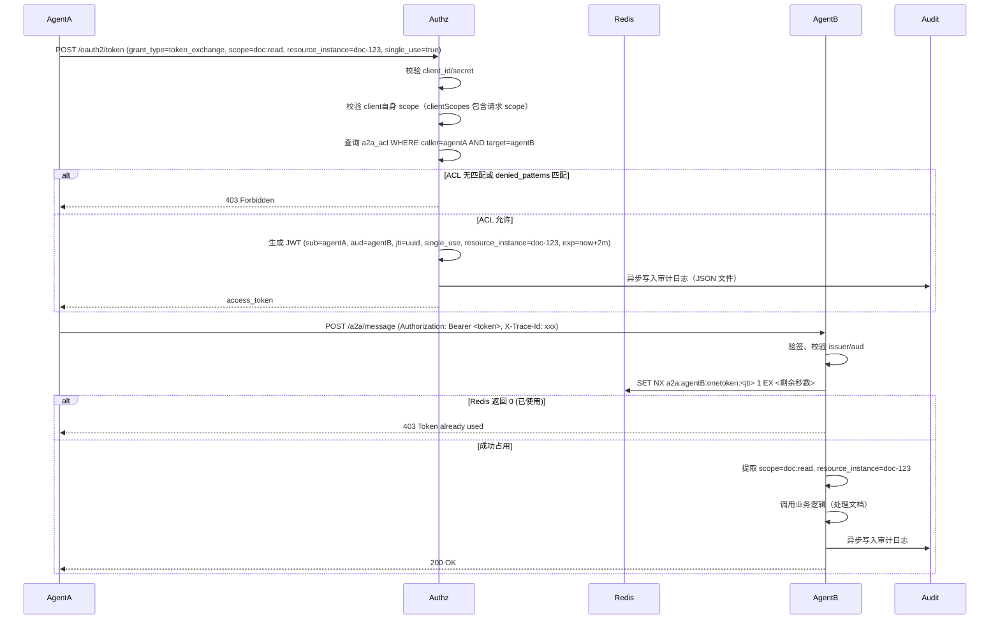
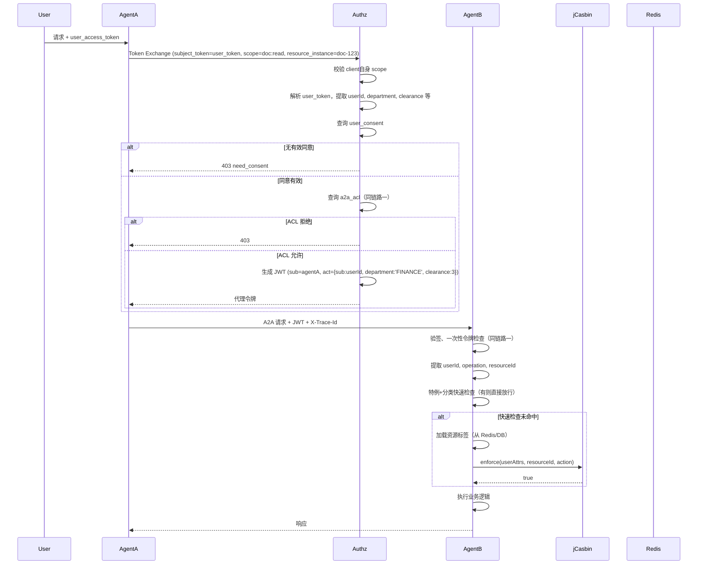
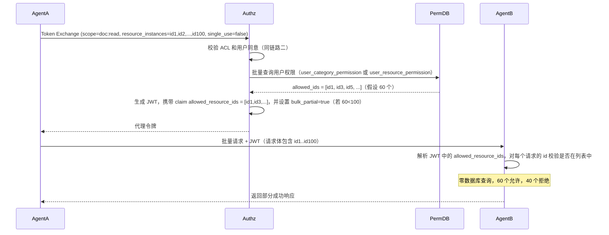
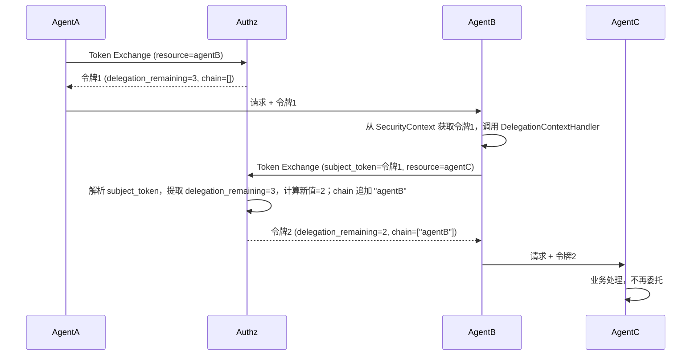

> **技术栈**：Spring AI Alibaba A2A 1.1.2.2 + Spring Boot 3.5.14 + Spring Cloud Alibaba 2025.0.0.0 + Spring Authorization Server 1.8.3 + Nacos 3.0.3 + MySQL 8.0 + Redis 7.x + jCasbin 1.81.0 + casbin-spring-boot-starter 1.8.0  
> **审计日志**：JSON Lines 文件输出，由 ELK/Loki 采集（当前版本不落库）  
> **包名**：`io.github.latcn.a2a.security`  
> **模块**：`a2a-security` 父模块，包含 `a2a-authorization-server`、`a2a-common-permission`、`a2a-security-starter`

---
## 目录

1. [封闭内网中 AI Agent 权限体系的必要性](#1-封闭内网中-ai-agent-权限体系的必要性)
2. [核心目标](#2-核心目标)
3. [总体架构与模块划分](#3-总体架构与模块划分)
4. [模块间依赖关系](#4-模块间依赖关系)
5. [核心接口与组件](#5-核心接口与组件)
6. [数据模型设计](#6-数据模型设计)
7. [jCasbin 策略引擎集成](#7-jcasbin-策略引擎集成)
8. [自定义 PermissionEvaluator 实现 ABAC](#8-自定义-permissionevaluator-实现-abac)
9. [核心权限流程链路](#9-核心权限流程链路)
10. [配置与部署](#10-配置与部署)
11. [审计日志设计](#11-审计日志设计)
12. [安全加固矩阵](#12-安全加固矩阵)
13. [扩展点设计](#13-扩展点设计)
14. [总结与修正记录](#14-总结与修正记录)

---
## 1. 封闭内网中 AI Agent 权限体系的必要性

在政企、军工或大型金融机构的封闭内网中，存在一个致命误区：“系统部署在物理隔离的内网，外面黑客进不来，里面都是‘自己人’，AI Agent 之间互相调用不需要复杂的权限系统。” 这一理念在 AI Agent 时代已经彻底破产。

**五大必要性**：

1. **应对 AI 原生风险**  
   间接提示词注入可使 Agent 执行恶意指令；大模型幻觉可能调用核心 API。权限系统是最后的物理防线。

2. **控制爆炸半径**  
   内网隔离防不住内部威胁。最小特权原则强制实施零信任，将安全事件的横向移动限制在最小范围。

3. **数据密级隔离与行级管控**  
   内网数据有严格密级划分，Agent 必须以用户权限为边界，防止数据聚合泄露。

4. **合规审计与防抵赖**  
   审计要求追溯完整调用链（用户→Agent→工具），权限系统记录不可篡改的决策日志。

5. **高可用性防雪崩**  
   权限系统通过限流和配额管理，防止失控 Agent 耗尽内网核心资源。

> **结论**：在封闭内网中，AI Agent 权限体系不是可选项，而是 Day 1 必须建设的核心基础设施。

---
## 2. 核心目标

A2A 权限系统的设计围绕以下 **七大核心目标** 展开：

| 目标维度 | 子目标 | 关键设计 |
|---------|--------|---------|
| **身份认证** | Agent 间认证、用户身份透传、防冒充 | OAuth2 Token Exchange、独立 client_id、JWT 本地验签、delegation_chain |
| **最小权限** | Scope 细粒度、资源实例级控制、行级过滤 | 三层权限（特例/分类/标签+ABAC）、ACL 前缀匹配、user_consent、批量预授权 |
| **性能优化** | 高并发、低延迟、批量任务高效 | 本地 JWT 验签、三级缓存（Caffeine+Redis+DB）、批量 Token、极简 Filter Chain |
| **可审计性** | 全链路追溯、合规日志 | JSON Lines 审计日志（含 jti、trace_id、delegation_chain），异步写入 |
| **高可用性** | 故障隔离、降级、防雪崩 | 本地验签不依赖授权服务器、缓存降级、一次性令牌 Redis 故障可配置 fail-open |
| **动态策略** | 热更新、快速变更 | 数据库存储标签和 jCasbin 规则，Redis Pub/Sub 广播变更，配置开关 |
| **联邦互操作** | 跨组织 Agent 调用 | 信任的 issuer 列表、mTLS/DPoP、act.iss 追溯 |

---
## 3. 总体架构与模块划分

本系统分为**四个独立的部署单元**：

1. **授权服务器**（Authorization Server）— 基于 Spring Authorization Server  
2. **每个 Agent**（既是 OAuth2 客户端，又是资源服务器）— 基于 Spring AI Alibaba A2A  
3. **Nacos** — A2A 注册中心与 AgentCard 存储  
4. **Redis** — 一次性令牌防重放存储 & 分布式缓存

**Maven 父模块**：`io.github.latcn:a2a-security:1.0.0`

```
a2a-security/                         # 父 POM (groupId=io.github.latcn, artifactId=a2a-security)
├── a2a-authorization-server/         # 授权服务器 (artifactId=a2a-authorization-server)
│   └── src/main/java/io/github/latcn/a2a/security/authz/
│       ├── token/                    # Token Exchange 端点 + 定制器
│       ├── acl/                      # ACL 管理
│       ├── consent/                  # 用户同意管理
│       ├── audit/                    # 审计日志记录
│       └── config/                   # 安全配置
│
├── a2a-common-permission/            # 独立权限 JAR (artifactId=a2a-common-permission)
│   └── src/main/java/io/github/latcn/a2a/security/permission/
│       ├── api/                      # PermissionChecker, ResourceTagService, UserAttributeService 接口
│       ├── jcasbin/                  # Enforcer 配置、策略管理、Watcher
│       ├── tag/                      # 资源标签服务实现（三级缓存）
│       └── config/                   # 自动配置
│
├── a2a-security-starter/             # Agent 安全起步依赖 (artifactId=a2a-security-starter)
│   └── src/main/java/io/github/latcn/a2a/security/agent/
│       ├── client/                   # TokenExchangeService, A2aClientFilter
│       ├── server/                   # A2AJwtAuthenticationFilter, OneTimeTokenValidator
│       ├── registry/                 # Nacos AgentCard 发布与发现
│       ├── delegation/               # 多跳委托支持
│       └── config/                   # 自动配置
│
└── a2a-agent-xxx/                    # 具体业务 Agent（客户项目）
```

---
## 4. 模块间依赖关系

**编译时依赖**（箭头方向表示“依赖者 → 被依赖者”）：

```
┌─────────────────────┐
│ a2a-agent-xxx       │  业务 Agent
└──────────┬──────────┘
           │ depends on
           ▼
┌─────────────────────┐      ┌────────────────────────┐
│ a2a-security-starter│─────▶│ a2a-common-permission  │
└──────────┬──────────┘      └────────────────────────┘
           │
           │ depends on
           ▼
┌─────────────────────────────────────────────────────────────────┐
│ 外部依赖：                                                       │
│ - Spring AI Alibaba A2A (1.1.2.2+)                             │
│ - Spring Cloud Alibaba Nacos Discovery (2025.0.0.0)            │
│ - Spring Security OAuth2 Resource Server / Client              │
│ - Spring Boot Starter Data Redis Reactive                      │
│ - Caffeine + R2DBC (for permission)                            │
│ - jCasbin 1.81.0 + casbin-spring-boot-starter 1.8.0            │
│ - Reactor Core                                                 │
└─────────────────────────────────────────────────────────────────┘
```

**运行期服务调用关系**：

```
┌──────────────┐   Token Exchange   ┌──────────────────────┐
│   Agent A    │ ─────────────────▶ │ Authorization Server │
│  (客户端)    │ ◀───────────────── │ (ACL+Consent+JWT)    │
└──────┬───────┘   (颁发代理令牌)     └──────────────────────┘
       │
       │ A2A + Bearer Token + X-Trace-Id
       ▼
┌──────────────┐   权限判断（JAR调用）  ┌─────────────────────────┐
│   Agent B    │ ────────────────────▶ │ common-permission       │
│ (资源服务器) │                        │ (分类检查 → 标签+ABAC)   │
└──────┬───────┘                        └───────────┬─────────────┘
       │                                            │
       │ 一次性令牌防重放                            │ jCasbin 评估
       ▼                                            ▼
   ┌───────┐                                  ┌──────────┐
   │ Redis │                                  │ 策略表   │
   └───────┘                                  └──────────┘
```

---
## 5. 核心接口与组件

### 5.1 PermissionChecker（权限检查核心接口）

```java
package io.github.latcn.a2a.security.permission.api;

import reactor.core.publisher.Mono;
import java.util.List;
import java.util.Map;
import java.util.Set;

public interface PermissionChecker {
    /**
     * 检查用户是否有权对特定资源执行特定操作。
     * 实现必须使用三级缓存（Caffeine + Redis + DB）。
     */
    Mono<Boolean> hasPermission(String userId, String resourceId, String operation);
    
    /**
     * 批量查询多个资源的权限。返回 Map 包含所有请求的资源 ID，value 为是否有权限。
     */
    Mono<Map<String, Boolean>> hasPermissions(String userId, List<String> resourceIds, String operation);
    
    /**
     * 批量过滤：返回用户有权操作的资源 ID 列表（子集）。
     */
    Mono<Set<String>> filterAllowed(String userId, List<String> resourceIds, String operation);
    
    /**
     * 主动清除本地权限缓存（仅清除当前实例）。
     * 跨实例广播需通过 Redis Pub/Sub 单独实现。
     */
    Mono<Void> evictPermissionCache(String userId, String resourceId, String operation);
}
```

### 5.2 ResourceTagService（资源标签服务）

```java
package io.github.latcn.a2a.security.permission.api;

import reactor.core.publisher.Mono;
import java.util.List;
import java.util.Map;

public interface ResourceTagService {
    /**
     * 获取资源的所有标签。
     * @return Map<标签名, List<标签值>>，支持同一标签名多个值
     */
    Mono<Map<String, List<String>>> getResourceTags(String resourceType, String resourceId);
    
    /**
     * 为资源设置标签值（覆盖已有值）。
     */
    Mono<Void> setTag(String resourceType, String resourceId, String tagName, String tagValue);
    
    /**
     * 删除资源的某个标签值。
     */
    Mono<Void> removeTag(String resourceType, String resourceId, String tagName, String tagValue);
}
```

### 5.3 UserAttributeService（用户属性服务）

```java
package io.github.latcn.a2a.security.permission.api;

import reactor.core.publisher.Mono;
import java.util.Map;

public interface UserAttributeService {
    /**
     * 获取当前用户的属性（部门、密级、角色等）。
     * 属性来源：JWT 中的 act 声明，或从身份源（LDAP/OIDC）获取。
     */
    Mono<Map<String, Object>> getUserAttributes(String userId);
}
```

### 5.4 PolicyEnforcer（jCasbin 策略执行器）

```java
package io.github.latcn.a2a.security.permission.api;

import reactor.core.publisher.Mono;
import java.util.Map;

public interface PolicyEnforcer {
    /**
     * 执行 ABAC 权限评估。
     * @param subjectAttrs 主体属性 Map（包含用户属性，可能还包含资源属性）
     * @param resource 资源 ID（字符串模式）
     * @param action 操作
     * @return true 允许，false 拒绝
     */
    Mono<Boolean> enforce(Map<String, Object> subjectAttrs, String resource, String action);
    
    /**
     * 添加策略（用于管理）。
     * @param subRule 表达式，如 "r.sub_attr.department == 'FINANCE'"
     * @param obj 资源模式，如 "doc:*"
     * @param act 操作，如 "read"
     */
    Mono<Void> addPolicy(String subRule, String obj, String act);
    
    /**
     * 删除策略。
     */
    Mono<Void> removePolicy(String subRule, String obj, String act);
}
```

### 5.5 A2aPermissionEvaluator（Spring Security 集成）

该类实现 Spring Security 的 `PermissionEvaluator` 接口，在 `@PreAuthorize` 注解中自动调用，完成分类快速通道和 ABAC 动态评估。

```java
@Component
public class A2aPermissionEvaluator implements PermissionEvaluator {
    private final PermissionChecker classificationChecker;
    private final ResourceTagService tagService;
    private final UserAttributeService userAttrService;
    private final PolicyEnforcer policyEnforcer;
    
    // 构造函数注入...
    
    @Override
    public boolean hasPermission(Authentication auth, Object targetId, String targetType, Object permission) {
        // 实现见第8章
    }
    
    @Override
    public boolean hasPermission(Authentication auth, Serializable targetId, String targetType, Object permission) {
        return hasPermission(auth, (Object) targetId, targetType, permission);
    }
}
```

---
## 6. 数据模型设计

### 6.1 设计原则

- **最小权限**：支持资源实例级、操作级、分类级、标签级、ABAC 动态授权。
- **高性能**：通过分类批量授权减少数据库查询，使用三级缓存，策略过滤加载。
- **可审计**：所有权限决策记录 JSON 审计日志。
- **可扩展**：支持特例覆盖（ALLOW/DENY）、分类、标签、动态规则混合。
- **无外键约束**：应用层维护一致性，避免数据库级联锁定。

### 6.2 核心表作用概览

| 表名 | 作用 |
|------|------|
| `resource_category` | 定义资源分类（如财务文档、技术文档），支持树形结构 |
| `resource` | 资源实例表，记录每个资源所属的分类和所有者 |
| `user_category_permission` | 用户对资源分类的批量授权（支持操作粒度和通配符） |
| `user_resource_permission` | 用户对特定资源实例的特例授权（覆盖分类权限），支持 ALLOW/DENY，DENY 优先级高于 ALLOW |
| `resource_tag_definition` | 标签定义表，定义可用的标签名称和值类型 |
| `resource_tag` | 资源标签关联表，支持多值标签 |
| `casbin_rule` | jCasbin 策略表，存储 ABAC 表达式规则 |
| `a2a_acl` | Agent 间调用访问控制，定义调用方 Agent 对目标 Agent 的 Scope 权限 |
| `user_consent` | 用户委派授权，记录用户同意 Agent 代表自己执行某类操作 |
| `oauth2_client_settings` | Agent（OAuth2 客户端）的安全配置（信任级别、令牌类型白名单） |

> **审计日志**：不再有数据库表，改为 JSON Lines 文件输出（详见第 11 章）。

### 6.3 表结构详细定义（MySQL 8.0）

#### 6.3.1 `resource_category` — 资源分类定义

```sql
CREATE TABLE resource_category (
    id CHAR(36) PRIMARY KEY,
    category_name VARCHAR(128) NOT NULL,
    resource_type VARCHAR(64) NOT NULL,
    parent_id CHAR(36) NULL,
    description TEXT,
    created_at TIMESTAMP(6) NOT NULL DEFAULT CURRENT_TIMESTAMP(6),
    created_by VARCHAR(64),
    UNIQUE KEY uk_category_type (category_name, resource_type),
    INDEX idx_type_parent (resource_type, parent_id)
) ENGINE=InnoDB DEFAULT CHARSET=utf8mb4 COLLATE=utf8mb4_unicode_ci;
```

#### 6.3.2 `resource` — 资源实例表

```sql
CREATE TABLE resource (
    id CHAR(36) PRIMARY KEY,
    resource_type VARCHAR(64) NOT NULL,
    resource_id VARCHAR(128) NOT NULL,
    category_id CHAR(36) NULL,          -- 所属分类，可为空
    owner VARCHAR(64) NULL,             -- 资源所有者用户ID
    created_at TIMESTAMP(6) NOT NULL DEFAULT CURRENT_TIMESTAMP(6),
    UNIQUE KEY uk_type_id (resource_type, resource_id),
    INDEX idx_category (category_id),
    INDEX idx_owner (owner)
) ENGINE=InnoDB DEFAULT CHARSET=utf8mb4 COLLATE=utf8mb4_unicode_ci;
```

#### 6.3.3 `user_category_permission` — 用户对分类的批量授权

```sql
CREATE TABLE user_category_permission (
    id CHAR(36) PRIMARY KEY,
    user_id VARCHAR(64) NOT NULL,
    category_id CHAR(36) NOT NULL,
    operation VARCHAR(32) NOT NULL,     -- 如 'read', 'write', '*'
    granted_at TIMESTAMP(6) NOT NULL DEFAULT CURRENT_TIMESTAMP(6),
    expires_at TIMESTAMP(6) NULL,
    UNIQUE KEY uk_user_category_op (user_id, category_id, operation),
    INDEX idx_user_category (user_id, category_id),
    INDEX idx_category_user (category_id, user_id)
) ENGINE=InnoDB DEFAULT CHARSET=utf8mb4 COLLATE=utf8mb4_unicode_ci;
```

#### 6.3.4 `user_resource_permission` — 用户对特定资源实例的特例授权

> **优先级说明**：`effect='DENY'` 的优先级高于 `effect='ALLOW'`。若同时存在针对同一用户、同一资源、同一操作的有效 DENY 和 ALLOW 记录，DENY 生效。

```sql
CREATE TABLE user_resource_permission (
    id CHAR(36) PRIMARY KEY,
    user_id VARCHAR(64) NOT NULL,
    resource_type VARCHAR(64) NOT NULL,
    resource_id VARCHAR(128) NOT NULL,
    operation VARCHAR(32) NOT NULL,
    effect VARCHAR(8) NOT NULL CHECK (effect IN ('ALLOW', 'DENY')),
    granted_at TIMESTAMP(6) NOT NULL DEFAULT CURRENT_TIMESTAMP(6),
    revoked_at TIMESTAMP(6) NULL,
    expires_at TIMESTAMP(6) NULL,
    UNIQUE KEY uk_user_resource_op_revoked (user_id, resource_type, resource_id, operation, revoked_at),
    INDEX idx_permission_resource (resource_type, resource_id)
) ENGINE=InnoDB DEFAULT CHARSET=utf8mb4 COLLATE=utf8mb4_unicode_ci;

-- 保证最多一条有效特例（部分唯一索引，MySQL 8.0 支持）
CREATE UNIQUE INDEX idx_permission_active ON user_resource_permission (user_id, resource_type, resource_id, operation) WHERE revoked_at IS NULL;
```

#### 6.3.5 `resource_tag_definition` — 标签定义表

```sql
CREATE TABLE resource_tag_definition (
    id CHAR(36) PRIMARY KEY,
    tag_name VARCHAR(64) NOT NULL UNIQUE,
    tag_value_type VARCHAR(16) NOT NULL,   -- STRING, NUMBER, DATE, BOOLEAN
    created_at TIMESTAMP(6) NOT NULL DEFAULT CURRENT_TIMESTAMP(6)
) ENGINE=InnoDB DEFAULT CHARSET=utf8mb4 COLLATE=utf8mb4_unicode_ci;
```

#### 6.3.6 `resource_tag` — 资源标签关联表

```sql
CREATE TABLE resource_tag (
    resource_type VARCHAR(64) NOT NULL,
    resource_id VARCHAR(128) NOT NULL,
    tag_id CHAR(36) NOT NULL,
    tag_value VARCHAR(256) NOT NULL,
    PRIMARY KEY (resource_type, resource_id, tag_id),
    INDEX idx_tag (tag_id, tag_value)
) ENGINE=InnoDB DEFAULT CHARSET=utf8mb4 COLLATE=utf8mb4_unicode_ci;
```

#### 6.3.7 `casbin_rule` — jCasbin 策略表

```sql
CREATE TABLE casbin_rule (
    id BIGINT AUTO_INCREMENT PRIMARY KEY,
    ptype VARCHAR(100),
    v0 VARCHAR(100),   -- sub_rule（表达式）
    v1 VARCHAR(100),   -- obj（资源模式）
    v2 VARCHAR(100),   -- act（操作）
    v3 VARCHAR(100),   -- 租户 ID（多租户隔离）
    v4 VARCHAR(100),
    v5 VARCHAR(100)
) ENGINE=InnoDB DEFAULT CHARSET=utf8mb4 COLLATE=utf8mb4_unicode_ci;
```

#### 6.3.8 `a2a_acl` — Agent 间调用访问控制

```sql
CREATE TABLE a2a_acl (
    id CHAR(36) PRIMARY KEY,
    caller_client_id VARCHAR(64) NOT NULL,
    target_client_id VARCHAR(64) NOT NULL,
    allowed_scope_patterns TEXT NOT NULL,   -- 逗号分隔的 scope 模式
    denied_scope_patterns TEXT,
    created_at TIMESTAMP(6) NOT NULL DEFAULT CURRENT_TIMESTAMP(6),
    updated_at TIMESTAMP(6) NOT NULL DEFAULT CURRENT_TIMESTAMP(6) ON UPDATE CURRENT_TIMESTAMP(6),
    UNIQUE KEY uk_caller_target (caller_client_id, target_client_id)
) ENGINE=InnoDB DEFAULT CHARSET=utf8mb4 COLLATE=utf8mb4_unicode_ci;
```

#### 6.3.9 `user_consent` — 用户委派授权

```sql
CREATE TABLE user_consent (
    id CHAR(36) PRIMARY KEY,
    user_id VARCHAR(64) NOT NULL,
    client_id VARCHAR(64) NOT NULL,
    scope_prefix VARCHAR(512) NOT NULL,    -- 授权的 scope 前缀，如 'doc:read'
    granted_at TIMESTAMP(6) NOT NULL DEFAULT CURRENT_TIMESTAMP(6),
    revoked_at TIMESTAMP(6) NULL,
    expires_at TIMESTAMP(6) NULL,
    consent_context JSON,                  -- 环境上下文：IP, User-Agent 等
    UNIQUE KEY uk_user_client_scope_revoked (user_id, client_id, scope_prefix, revoked_at),
    INDEX idx_consent_user (user_id, revoked_at),
    INDEX idx_consent_client (client_id, revoked_at)
) ENGINE=InnoDB DEFAULT CHARSET=utf8mb4 COLLATE=utf8mb4_unicode_ci;

CREATE UNIQUE INDEX idx_consent_active ON user_consent (user_id, client_id, scope_prefix) WHERE revoked_at IS NULL;
```

#### 6.3.10 `oauth2_client_settings` — 客户端安全配置

```sql
CREATE TABLE oauth2_client_settings (
    client_id VARCHAR(64) PRIMARY KEY,
    allowed_subject_token_types TEXT,     -- JSON 数组，如 '["access_token","jwt"]'
    trust_level VARCHAR(16) DEFAULT 'INTERNAL',
    created_at TIMESTAMP(6) NOT NULL DEFAULT CURRENT_TIMESTAMP(6),
    updated_at TIMESTAMP(6) NOT NULL DEFAULT CURRENT_TIMESTAMP(6) ON UPDATE CURRENT_TIMESTAMP(6)
) ENGINE=InnoDB DEFAULT CHARSET=utf8mb4 COLLATE=utf8mb4_unicode_ci;
```

### 6.4 权限优先级规则（应用层实现）

权限决策严格按照以下顺序执行，命中即返回：

1. **特例检查**（`user_resource_permission`）  
   - 先查询 `effect='DENY'` 的有效记录，存在则 **拒绝**。  
   - 再查询 `effect='ALLOW'` 的有效记录，存在则 **允许**。

2. **分类批量授权**（`user_category_permission`）  
   - 获取资源所属分类（`resource.category_id`）。  
   - 检查用户是否有该分类的匹配操作（精确匹配或 `*` 通配符），且未过期。  
   - 任一匹配则 **允许**。

3. **标签 + ABAC 动态规则**（`resource_tag` + `casbin_rule`）  
   - 加载资源标签和用户属性，提交给 jCasbin 策略引擎评估。  
   - 若匹配到允许规则则 **允许**，匹配到拒绝规则则 **拒绝**（规则中的 effect 字段决定）。  
   - 若无任何规则匹配，则进入下一步。

4. **默认拒绝**。

### 6.5 数据一致性保障

- 不使用数据库外键约束，应用层在同⼀事务中维护跨表⼀致性。
- 删除资源时，需同时删除 `resource_tag` 中的关联记录和 `user_resource_permission` 中的特例。
- 删除分类时，需确保没有资源引用该分类（检查 `resource.category_id`），否则不允许删除或级联置为 NULL。
- 更新 `updated_at` 字段时，应用层应显式设置 `NOW()`（或使用数据库触发器）。

---
## 7. jCasbin 策略引擎集成

### 7.1 Maven 依赖（BOM 管理）

```xml
<properties>
    <java.version>17</java.version>
    <spring-boot.version>3.5.14</spring-boot.version>
    <spring-cloud-alibaba.version>2025.0.0.0</spring-cloud-alibaba.version>
    <spring-ai-alibaba.version>1.1.2.2</spring-ai-alibaba.version>
    <jcasbin.version>1.81.0</jcasbin.version>
    <casbin-starter.version>1.8.0</casbin-starter.version>
</properties>

<dependencyManagement>
    <dependencies>
        <dependency>
            <groupId>org.springframework.boot</groupId>
            <artifactId>spring-boot-dependencies</artifactId>
            <version>${spring-boot.version}</version>
            <type>pom</type>
            <scope>import</scope>
        </dependency>
        <dependency>
            <groupId>com.alibaba.cloud</groupId>
            <artifactId>spring-cloud-alibaba-dependencies</artifactId>
            <version>${spring-cloud-alibaba.version}</version>
            <type>pom</type>
            <scope>import</scope>
        </dependency>
    </dependencies>
</dependencyManagement>

<dependencies>
    <!-- Spring AI Alibaba A2A -->
    <dependency>
        <groupId>com.alibaba.cloud.ai</groupId>
        <artifactId>spring-ai-alibaba-starter</artifactId>
        <version>${spring-ai-alibaba.version}</version>
    </dependency>
    <!-- jCasbin 核心库 -->
    <dependency>
        <groupId>org.casbin</groupId>
        <artifactId>jcasbin</artifactId>
        <version>${jcasbin.version}</version>
    </dependency>
    <!-- jCasbin Spring Boot Starter（官方稳定版） -->
    <dependency>
        <groupId>org.casbin</groupId>
        <artifactId>casbin-spring-boot-starter</artifactId>
        <version>${casbin-starter.version}</version>
    </dependency>
    <!-- JDBC Adapter（策略持久化） -->
    <dependency>
        <groupId>org.casbin</groupId>
        <artifactId>jdbc-adapter</artifactId>
        <version>2.3.2</version>
    </dependency>
    <!-- Redis Watcher（多实例策略同步，可选） -->
    <dependency>
        <groupId>org.casbin</groupId>
        <artifactId>casbin-redis-watcher</artifactId>
        <version>2.1.0</version>
    </dependency>
    <!-- Spring Boot Starter Data Redis Reactive -->
    <dependency>
        <groupId>org.springframework.boot</groupId>
        <artifactId>spring-boot-starter-data-redis-reactive</artifactId>
    </dependency>
    <!-- MySQL Driver + R2DBC -->
    <dependency>
        <groupId>com.mysql</groupId>
        <artifactId>mysql-connector-j</artifactId>
        <scope>runtime</scope>
    </dependency>
    <dependency>
        <groupId>io.asyncer</groupId>
        <artifactId>r2dbc-mysql</artifactId>
        <version>1.3.1</version>
    </dependency>
</dependencies>
```

> **版本说明**：jCasbin 核心库当前最新版本为 1.81.0（2026 年 5 月发布）。`casbin-spring-boot-starter` 当前最新官方版本为 1.8.0。两者均未达到 2.0 版本。

### 7.2 模型配置 `model.conf`（存放于 `src/main/resources/casbin/`）

```ini
# 请求定义：主体属性(map), 资源ID, 操作
[request_definition]
r = sub_attr, obj, act

# 策略定义：表达式, 资源模式, 操作
[policy_definition]
p = sub_rule, obj, act

# 策略效果：任意一条允许规则即允许
[policy_effect]
e = some(where (p.eft == allow))

# 匹配器：执行表达式并匹配资源与操作
[matchers]
m = eval(p.sub_rule) && r.obj == p.obj && r.act == p.act
```

**策略表达式示例**（存储在 `casbin_rule` 表中）：

| sub_rule (v0) | obj (v1) | act (v2) |
|---------------|----------|----------|
| `r.sub_attr.department == 'FINANCE'` | `doc:*` | `read` |
| `r.sub_attr.clearance >= 3` | `sensitive-doc:*` | `read` |
| `r.sub_attr.id == r.sub_attr.owner` | `private:*` | `write` |
| `r.sub_attr.roles.contains('admin')` | `*` | `*` |

### 7.3 Spring Boot 配置（`application.yml`）

```yaml
casbin:
  enableCasbin: true
  useSyncedEnforcer: true      # 高并发场景使用同步 Enforcer
  autoSave: true
  storeType: jdbc
  tableName: casbin_rule
  initializeSchema: create      # 自动建表（生产环境可改为 never）
  model: classpath:casbin/model.conf
  # 可选：Redis Watcher 配置（多实例策略同步）
  enableWatcher: false
  watcherType: redis
  # 当 enableWatcher: true 时，需要配置 spring.redis.host 和 port
```

### 7.4 Enforcer 配置类（自动配置）

使用 `casbin-spring-boot-starter` 会自动配置 `Enforcer`，无需手动编写。如有定制需求，可覆盖：

```java
@Configuration
@ConditionalOnProperty(name = "casbin.enableCasbin", havingValue = "true")
public class CustomCasbinConfig {
    
    @Bean
    @Primary
    public Enforcer enforcer(@Value("${casbin.model}") String modelPath,
                              DataSource dataSource) {
        JdbcAdapter adapter = new JdbcAdapter(dataSource);
        Enforcer enforcer = new SyncedEnforcer(modelPath, adapter);
        enforcer.enableAutoSave(true);
        return enforcer;
    }
    
    @Bean
    public PolicyEnforcer policyEnforcer(Enforcer enforcer) {
        return new CasbinPolicyEnforcer(enforcer);
    }
}
```

### 7.5 PolicyEnforcer 实现

```java
public class CasbinPolicyEnforcer implements PolicyEnforcer {
    private final Enforcer enforcer;
    
    public CasbinPolicyEnforcer(Enforcer enforcer) {
        this.enforcer = enforcer;
    }
    
    @Override
    public Mono<Boolean> enforce(Map<String, Object> subjectAttrs, String resource, String action) {
        // 将 subjectAttrs 作为第一个参数传入，jCasbin 内部会作为 r.sub_attr 在表达式中使用
        return Mono.fromCallable(() -> enforcer.enforce(subjectAttrs, resource, action))
            .subscribeOn(Schedulers.boundedElastic());
    }
    
    @Override
    public Mono<Void> addPolicy(String subRule, String obj, String act) {
        return Mono.fromRunnable(() -> enforcer.addPolicy(subRule, obj, act))
            .subscribeOn(Schedulers.boundedElastic());
    }
    
    @Override
    public Mono<Void> removePolicy(String subRule, String obj, String act) {
        return Mono.fromRunnable(() -> enforcer.removePolicy(subRule, obj, act))
            .subscribeOn(Schedulers.boundedElastic());
    }
}
```

### 7.6 多租户策略加载（可选）

```java
@Service
public class TenantPolicyService {
    private final Enforcer enforcer;
    
    public TenantPolicyService(Enforcer enforcer) {
        this.enforcer = enforcer;
    }
    
    public void loadPoliciesForTenant(String tenantId) {
        // 使用过滤加载，仅加载 v3 字段等于 tenantId 的策略
        Filter filter = new Filter();
        filter.setP(new String[]{"", "", "", tenantId});
        enforcer.loadFilteredPolicy(filter);
    }
}
```
---
## 8. 自定义 PermissionEvaluator 实现 ABAC

### 8.1 核心实现类 `A2aPermissionEvaluator`

```java
package io.github.latcn.a2a.security.permission;

import org.springframework.security.core.Authentication;
import org.springframework.security.core.context.ReactiveSecurityContextHolder;
import org.springframework.security.oauth2.jwt.Jwt;
import reactor.core.publisher.Mono;

@Component
public class A2aPermissionEvaluator implements PermissionEvaluator {
    
    private final PermissionChecker classificationChecker;
    private final ResourceTagService tagService;
    private final UserAttributeService userAttrService;
    private final PolicyEnforcer policyEnforcer;
    
    public A2aPermissionEvaluator(PermissionChecker classificationChecker,
                                   ResourceTagService tagService,
                                   UserAttributeService userAttrService,
                                   PolicyEnforcer policyEnforcer) {
        this.classificationChecker = classificationChecker;
        this.tagService = tagService;
        this.userAttrService = userAttrService;
        this.policyEnforcer = policyEnforcer;
    }
    
    @Override
    public boolean hasPermission(Authentication authentication, Object targetDomainObject, Object permission) {
        // 方法级权限：targetDomainObject 通常是资源ID
        if (targetDomainObject == null) return false;
        String resourceId = targetDomainObject.toString();
        String operation = permission.toString();
        return evaluate(authentication, resourceId, "default", operation).block();
    }
    
    @Override
    public boolean hasPermission(Authentication authentication, Serializable targetId, String targetType, Object permission) {
        String resourceId = targetId.toString();
        String operation = permission.toString();
        return evaluate(authentication, resourceId, targetType, operation).block();
    }
    
    private Mono<Boolean> evaluate(Authentication auth, String resourceId, String resourceType, String operation) {
        String userId = auth.getName();
        
        // 1. 快速通道：特例 + 分类检查
        return classificationChecker.hasPermission(userId, resourceId, operation)
            .flatMap(classified -> {
                if (classified) return Mono.just(true);
                
                // 2. 获取用户属性
                return userAttrService.getUserAttributes(userId)
                    .flatMap(userAttrs -> {
                        // 3. 获取资源标签
                        return tagService.getResourceTags(resourceType, resourceId)
                            .map(tags -> {
                                // 将资源属性合并到 subjectAttrs 中，便于规则中使用 r.sub_attr.resource.tags
                                Map<String, Object> subjectAttrs = new HashMap<>(userAttrs);
                                subjectAttrs.put("resource", Map.of(
                                    "id", resourceId,
                                    "type", resourceType,
                                    "tags", tags
                                ));
                                // 4. 调用 jCasbin 评估
                                return policyEnforcer.enforce(subjectAttrs, resourceId, operation).block();
                            });
                    });
            });
    }
}
```

### 8.2 用户属性服务实现（从 JWT 提取）

```java
@Component
public class JwtUserAttributeService implements UserAttributeService {
    
    @Override
    public Mono<Map<String, Object>> getUserAttributes(String userId) {
        return ReactiveSecurityContextHolder.getContext()
            .map(ctx -> ctx.getAuthentication())
            .filter(auth -> auth.getPrincipal() instanceof Jwt)
            .map(auth -> (Jwt) auth.getPrincipal())
            .map(jwt -> {
                Map<String, Object> attrs = new HashMap<>();
                attrs.put("id", jwt.getSubject());
                // 从 act 声明中提取用户属性（部门、密级等）
                Map<String, Object> act = jwt.getClaim("act");
                if (act != null) {
                    attrs.putAll(act);
                }
                // 也可从数据库或缓存补充其他属性
                return attrs;
            })
            .switchIfEmpty(Mono.error(new IllegalStateException("No JWT found in security context")));
    }
}
```

### 8.3 启用方法级安全

```java
@Configuration
@EnableMethodSecurity(prePostEnabled = true)
public class MethodSecurityConfig {
    
    @Bean
    public MethodSecurityExpressionHandler expressionHandler(PermissionEvaluator evaluator) {
        DefaultMethodSecurityExpressionHandler handler = new DefaultMethodSecurityExpressionHandler();
        handler.setPermissionEvaluator(evaluator);
        return handler;
    }
}
```

### 8.4 在 Controller 中使用

```java
@RestController
@RequestMapping("/a2a/message")
public class DocumentAgentController {
    
    @PreAuthorize("hasPermission(#documentId, 'document', 'read')")
    @GetMapping("/{documentId}")
    public Mono<Document> readDocument(@PathVariable String documentId) {
        return documentService.load(documentId);
    }
    
    @PreAuthorize("hasPermission(#documentId, 'document', 'delete')")
    @DeleteMapping("/{documentId}")
    public Mono<Void> deleteDocument(@PathVariable String documentId) {
        return documentService.delete(documentId);
    }
}
```

---
## 9. 核心权限流程链路

### 9.1 链路一：纯 Agent 直连（无用户委派）



### 9.2 链路二：用户委派流程 + ABAC 动态决策



### 9.3 链路三：批量任务优化流程



### 9.4 链路四：多跳委托



---
## 10. 配置与部署

### 10.1 授权服务器配置（`application.yml`）

```yaml
spring:
  security:
    oauth2:
      authorizationserver:
        issuer: https://auth.internal.example.com
      resourceserver:
        jwt:
          jwk-set-uri: https://auth.internal.example.com/oauth2/jwks
  datasource:
    url: jdbc:mysql://db.internal:3306/a2a_authz?useSSL=true&serverTimezone=UTC
    username: ${DB_USER}
    password: ${DB_PASS}
    hikari:
      minimum-idle: 5
      maximum-pool-size: 20
      connection-timeout: 30000
  redis:
    host: redis.internal
    port: 6379
    timeout: 2s
    lettuce:
      pool:
        max-active: 10
        max-idle: 5
        min-idle: 2

casbin:
  enableCasbin: true
  storeType: jdbc
  tableName: casbin_rule
  model: classpath:casbin/model.conf

a2a:
  authz:
    acl:
      enabled: true
    consent:
      enabled: true
    token:
      one-time-ttl: 2m
      delegation-max: 3
      bulk-allowed-max: 300
      bulk-enabled: true
    audit:
      enabled: true
```

### 10.2 Agent 配置（完整示例）

```yaml
spring:
  application:
    name: agent-b
  cloud:
    nacos:
      discovery:
        server-addr: nacos.internal:8848
        username: nacos
        password: ${NACOS_PASSWORD}
        metadata:
          a2a.security.oauth2.token-url: https://auth.internal.example.com/oauth2/token
  data:
    redis:
      host: redis.internal
      port: 6379
      timeout: 2s
      lettuce:
        pool:
          max-active: 10
  security:
    oauth2:
      resourceserver:
        jwt:
          issuer-uri: https://auth.internal.example.com
  ai:
    alibaba:
      a2a:
        server:
          base-path: /a2a
          agent-id: agent-b
        client:
          web-client:
            filter-chain:
              - io.github.latcn.a2a.security.agent.client.A2aClientFilter
        nacos:
          enabled: true

a2a:
  security:
    enabled: true
    client-id: agent-b
    client-secret: ${AGENT_B_SECRET}
    auth-server-url: https://auth.internal.example.com
    resource-id: agent-b
    agent-endpoint: https://agent-b.internal.example.com
    trusted-issuers:
      - https://auth.internal.example.com
    one-time-token:
      enabled: true
      clock-skew-allowance: 5s
      redis:
        fail-open: false          # Redis 故障时拒绝（安全模式）
    delegation:
      enabled: true
      max-depth: 3
    scope-matcher: prefix
    a2a-path-pattern: "/a2a/message"
    jwt:
      local-verification: true
      jwks-cache-ttl: 12h
    permission:
      classification:
        enabled: true
      tags:
        enabled: true
      dynamic-rules:
        enabled: true
        engine: jcasbin
      cache:
        l1-ttl: 5m
        l1-max-size: 10000
        l2-ttl: 30m
  client:
    prefer-user-token: true

casbin:
  enableCasbin: true
  useSyncedEnforcer: true
  autoSave: true
  storeType: jdbc
  tableName: casbin_rule
  model: classpath:casbin/model.conf
```

### 10.3 Nacos 服务端认证配置

在 Nacos 服务端 `conf/application.properties` 中启用：

```properties
nacos.core.auth.enabled=true
nacos.core.auth.server.identity.key=serverIdentity
nacos.core.auth.server.identity.value=mySecret
nacos.core.auth.plugin.nacos.token.secret.key=SecretKey0123456789012345678901234567890123456789
```

客户端配置：

```yaml
nacos:
  auth:
    enabled: true
    username: nacos
    password: ${NACOS_PASSWORD}
```

### 10.4 Docker Compose 部署示例

```yaml
version: '3.8'
services:
  mysql:
    image: mysql:8.0
    environment:
      MYSQL_ROOT_PASSWORD: root
      MYSQL_DATABASE: a2a_authz
    ports:
      - "3306:3306"
    volumes:
      - mysql_data:/var/lib/mysql
  redis:
    image: redis:7-alpine
    ports:
      - "6379:6379"
  nacos:
    image: nacos/nacos-server:v3.0.3
    environment:
      MODE: standalone
      NACOS_AUTH_ENABLE: "true"
    ports:
      - "8848:8848"
  auth-server:
    build: ./a2a-authorization-server
    depends_on:
      - mysql
      - redis
      - nacos
    environment:
      SPRING_DATASOURCE_URL: jdbc:mysql://mysql:3306/a2a_authz
      SPRING_REDIS_HOST: redis
      SPRING_CLOUD_NACOS_DISCOVERY_SERVER_ADDR: nacos:8848
    ports:
      - "9000:9000"
  agent-a:
    build: ./a2a-agent-xxx
    depends_on:
      - nacos
      - redis
      - auth-server
    environment:
      A2A_SECURITY_AUTH_SERVER_URL: http://auth-server:9000
      SPRING_CLOUD_NACOS_DISCOVERY_SERVER_ADDR: nacos:8848
volumes:
  mysql_data:
```

---
## 11. 审计日志设计

### 11.1 设计原则

- **不落关系库**：审计日志写入 JSON Lines 格式文件，避免对主业务数据库造成压力。
- **异步非阻塞**：使用 Logback 异步 Appender，主线程不等待日志写入。
- **结构化 JSON**：便于后续通过 ELK/Loki 采集、检索、分析。
- **可配置采样**：支持按比例采样（如健康检查等低风险操作仅记录 1%）。

### 11.2 Logback 配置（`logback-spring.xml`）

需要添加依赖：

```xml
<dependency>
    <groupId>net.logstash.logback</groupId>
    <artifactId>logstash-logback-encoder</artifactId>
    <version>7.4</version>
</dependency>
```

配置文件：

```xml
<?xml version="1.0" encoding="UTF-8"?>
<configuration>
    <!-- 异步 Appender 配置 -->
    <appender name="AUDIT_ASYNC" class="ch.qos.logback.classic.AsyncAppender">
        <appender-ref ref="AUDIT_FILE"/>
        <queueSize>10000</queueSize>
        <discardingThreshold>0</discardingThreshold>
        <neverBlock>true</neverBlock>
    </appender>

    <!-- 文件 Appender，JSON 格式 -->
    <appender name="AUDIT_FILE" class="ch.qos.logback.core.rolling.RollingFileAppender">
        <file>/var/log/a2a/audit.log</file>
        <encoder class="net.logstash.logback.encoder.LogstashEncoder">
            <!-- 可选：自定义字段映射 -->
            <includeCallerData>false</includeCallerData>
            <includeMdc>true</includeMdc>
        </encoder>
        <rollingPolicy class="ch.qos.logback.core.rolling.TimeBasedRollingPolicy">
            <fileNamePattern>/var/log/a2a/audit-%d{yyyy-MM-dd}.log</fileNamePattern>
            <maxHistory>30</maxHistory>
        </rollingPolicy>
    </appender>

    <!-- 审计日志专用 Logger -->
    <logger name="A2A_AUDIT" level="INFO" additivity="false">
        <appender-ref ref="AUDIT_ASYNC"/>
    </logger>

    <root level="INFO">
        <appender-ref ref="CONSOLE"/>
    </root>
</configuration>
```

### 11.3 审计日志 JSON 格式

每条审计日志为一个 JSON 对象，包含以下字段：

```json
{
  "@timestamp": "2026-06-09T10:00:00.123Z",
  "service_type": "AGENT",
  "trace_id": "abc-123-def-456",
  "jti": "jwt-id-xxx",
  "decision": "ALLOW",
  "bulk_mode": false,
  "bulk_partial": false,
  "caller_agent_id": "agent-a",
  "target_agent_id": "agent-b",
  "user_id": "user-123",
  "scope": "doc:read",
  "deny_reason": null,
  "http_status": 200,
  "details": {
    "resource_id": "doc-001",
    "eval_duration_ms": 12,
    "rule_hit": "doc_finance_read",
    "client_ip": "10.0.0.1"
  }
}
```

字段说明：

| 字段 | 类型 | 描述 |
|------|------|------|
| `@timestamp` | ISO 8601 | 日志记录时间（UTC） |
| `service_type` | string | `AUTHZ` 或 `AGENT` |
| `trace_id` | string | 全链路追踪 ID |
| `jti` | string | JWT ID（一次性令牌） |
| `decision` | string | `ALLOW` 或 `DENY` |
| `bulk_mode` | boolean | 是否为批量请求 |
| `bulk_partial` | boolean | 批量模式下是否部分拒绝 |
| `caller_agent_id` | string | 调用方 Agent ID |
| `target_agent_id` | string | 目标 Agent ID |
| `user_id` | string | 最终用户 ID（委派场景） |
| `scope` | string | 请求的 scope |
| `deny_reason` | string | 拒绝原因（如 `ACL_DENIED`, `TOKEN_EXPIRED`） |
| `http_status` | int | HTTP 响应码 |
| `details` | object | 附加信息（如资源ID、评估耗时、命中规则等） |

### 11.4 在代码中记录审计日志

```java
@Component
public class AuditLogger {
    private static final Logger log = LoggerFactory.getLogger("A2A_AUDIT");
    
    public void logDecision(AuditEvent event) {
        // 使用结构化日志（LogstashEncoder 会自动序列化为 JSON）
        log.info("audit_event: {}", event);
    }
}

// AuditEvent 为 POJO，字段与 JSON 对应
```

### 11.5 审计日志可靠性保障

- **异步写入**：使用 Logback `AsyncAppender`，队列容量 10000，`neverBlock=true`（队列满时丢弃日志，不阻塞业务）。
- **日志轮转**：每天轮转，保留 30 天，自动压缩。
- **防篡改**：建议将审计日志文件存储到只追加的文件系统或对象存储（如 AWS S3 Object Lock），定期计算哈希并归档。
- **采样策略**：对于健康检查等高频低风险操作，可按 1% 比例采样，减少日志量。

---
## 12. 安全加固矩阵

| 安全机制 | 实现位置 | 必须 | 说明 |
|---------|----------|------|------|
| OAuth2 Token Exchange | 授权服务器 + Agent | ✅ | RFC 8693，支持批量资源 ID |
| 一次性令牌防重放 | Agent + Redis | ✅ | 原子 SET NX EX，动态 TTL+时钟偏差容忍 |
| ACL 前缀匹配 | 授权服务器 | ✅ | 支持 `*` 通配符和 DENY 优先 |
| 用户资源权限（分类+标签+ABAC） | `common-permission` + jCasbin | ✅ | 三级缓存 + 表达式引擎 |
| 多跳委托限制 | 授权服务器 | ✅ | 从 subject_token 提取链，扣减剩余深度 |
| 全链路追踪 | 授权服务器 + Agent | ✅ | `X-Trace-Id` 头 + JWT 声明 |
| HTTPS | 所有通信 | ✅ | TLS 1.2+ |
| 审计日志文件 | JSON Lines | ✅ | 异步写入，可配置采样 |
| Nacos 认证 | Nacos | ✅ | 生产必须开启 |
| subject_token 验证 | 授权服务器 | ✅ | JWT 验签/内省 + 白名单 |
| 客户端自身 scope 检查 | 授权服务器 | ✅ | 自定义 Provider |
| `resource_instance` 长度限制 | 授权服务器 | ✅ | ≤256 字符，超长拒绝 |
| 批量资源 ID 数量限制 | 授权服务器 | ✅ | ≤300 个，超限拒绝 |
| clock-skew 容忍 | Agent | ✅ | 可配置允许偏差（默认 5s） |
| 一次性令牌 Redis 降级 | Agent | ✅ | `fail-open=false`（默认拒绝） |
| mTLS / DPoP | 可选扩展 | ❌ | 按需开启 |

---
## 13. 扩展点设计

### 13.1 自定义 Scope 匹配策略

```java
public interface ScopeMatcher {
    boolean matches(String requestedScope, List<String> allowedPatterns);
}

@Component
@ConditionalOnProperty(name = "a2a.security.scope-matcher", havingValue = "prefix", matchIfMissing = true)
public class PrefixScopeMatcher implements ScopeMatcher { ... }

@Component
@ConditionalOnProperty(name = "a2a.security.scope-matcher", havingValue = "regex")
public class RegexScopeMatcher implements ScopeMatcher { ... }
```

### 13.2 自定义用户身份提取

```java
public interface UserIdentityExtractor {
    Optional<String> extractUserId(Jwt jwt);
}

@Component
@ConditionalOnMissingBean
public class DefaultUserIdentityExtractor implements UserIdentityExtractor { ... }
```

### 13.3 自定义标签值解析（从资源属性动态生成）

```java
public interface TagValueResolver {
    Mono<List<String>> resolveTags(String resourceType, String resourceId, String tagName);
}
```

### 13.4 自定义 ABAC 函数（jCasbin）

jCasbin 支持在表达式中注册自定义函数，例如：

```java
Enforcer enforcer = ...;
enforcer.addFunction("hasRole", new Function() {
    @Override
    public Object call(Object... args) {
        // 实现角色判断逻辑
    }
});
```

然后在策略中使用 `hasRole(r.sub_attr, 'admin')`。

### 13.5 策略热加载与广播

```java
@Component
public class PolicyChangeNotifier {
    private final RedisPubSub pubSub;
    
    public void notifyChange() {
        pubSub.publish("casbin:policy:reload", "reload");
    }
}
```

接收端监听并调用 `enforcer.loadPolicy()`。

---