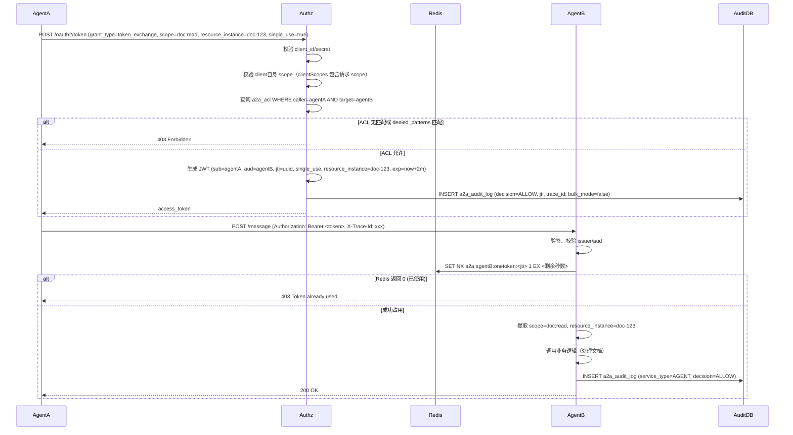
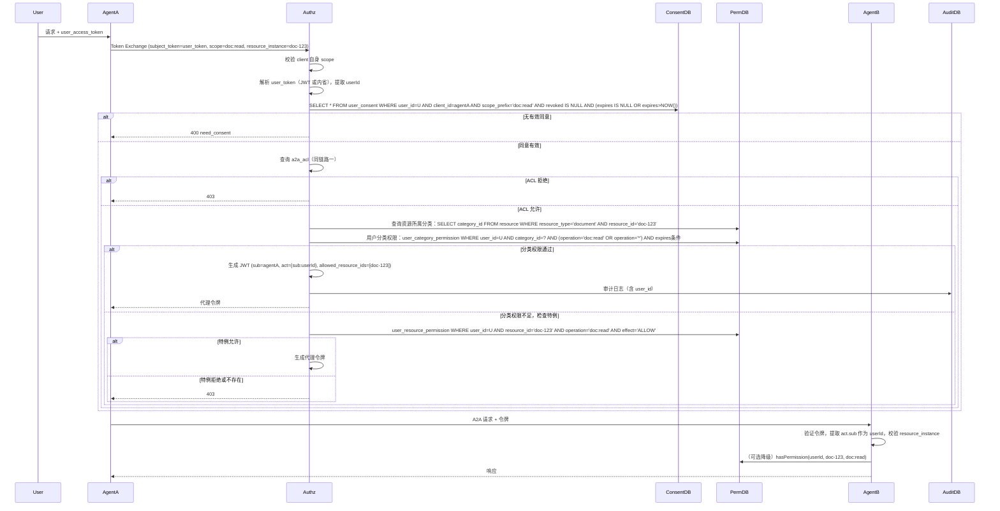
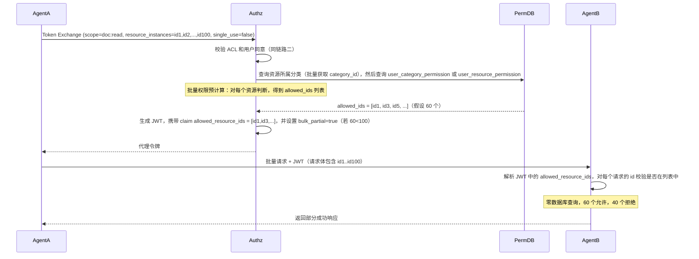
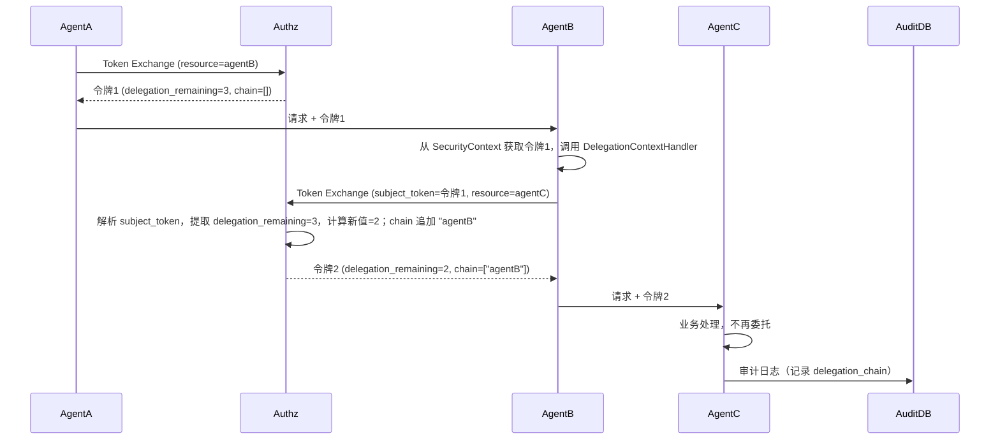
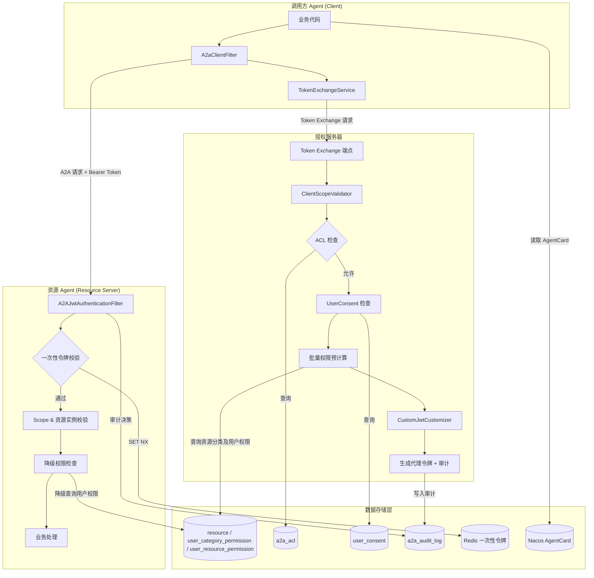

 
> **基于**：《A2A 权限系统架构设计文档》《A2A 数据模型设计文档》及多轮讨论整合  
> **技术栈**：Spring AI Alibaba A2A 1.1.2.2 + Nacos + Spring Authorization Server 1.5.7 + Spring Security 6.3+  
> **核心**：OAuth2 Token Exchange (RFC 8693) + 一次性令牌 + 模块化权限服务  
> **包名**：`io.github.latcn.a2a.security`  
> **模块**：`a2a-security` 父模块，包含 `a2a-authorization-server`、`a2a-common-permission`、`a2a-security-starter`  
> **版本兼容性**：Spring Boot 3.5.x、Spring Cloud Alibaba 2025.0.0.0、Spring Authorization Server 1.5.7、Spring AI Alibaba 1.1.2.2、Nacos 3.2.1

---
## 目录

1. [封闭内网中 AI Agent 权限体系的必要性](#1-封闭内网中-ai-agent-权限体系的必要性)  
2. [核心目标](#2-核心目标)  
3. [总体架构与模块划分](#3-总体架构与模块划分)  
4. [模块间依赖关系](#4-模块间依赖关系)  
5. [模块内核心对外接口](#5-模块内核心对外接口)  
6. [数据模型设计](#6-数据模型设计)  
7. [核心权限流程链路](#7-核心权限流程链路)  
8. [配置与部署视图](#8-配置与部署视图)  
9. [审计日志设计](#9-审计日志设计)  
10. [安全加固矩阵](#10-安全加固矩阵)  
11. [扩展点设计](#11-扩展点设计)  
12. [响应式与非阻塞编程指南](#12-响应式与非阻塞编程指南)  
13. [总结](#13-总结)

---
## 1. 封闭内网中 AI Agent 权限体系的必要性

在政企、军工或大型金融机构的封闭内网中，存在一个致命误区：“系统部署在物理隔离的内网，外面黑客进不来，里面都是‘自己人’，AI Agent 之间互相调用不需要复杂的权限系统。” 这一理念在 AI Agent 时代已经彻底破产。

**五大必要性**：
1. **应对 AI 原生风险**：间接提示词注入可使 Agent 执行恶意指令；大模型幻觉可能调用核心 API。权限系统是最后的物理防线。
2. **控制爆炸半径**：内网隔离防不住内部威胁。最小特权原则强制实施零信任，将安全事件的横向移动限制在最小范围。
3. **数据密级隔离与行级管控**：内网数据有严格密级划分，Agent 必须以用户权限为边界，防止数据聚合泄露。
4. **合规审计与防抵赖**：审计要求追溯完整调用链（用户→Agent→工具），权限系统记录不可篡改的决策日志。
5. **高可用性防雪崩**：权限系统通过限流和配额管理，防止失控 Agent 耗尽内网核心资源。

> **结论**：在封闭内网中，AI Agent 权限体系不是可选项，而是 Day 1 必须建设的核心基础设施。

---
## 2. 核心目标

A2A 权限系统的设计围绕以下 **七大核心目标** 展开：

| 目标维度 | 子目标 | 关键设计 |
|---------|--------|---------|
| **身份认证** | Agent 间认证、用户身份透传、防冒充 | OAuth2 Token Exchange、独立 client_id、JWT 本地验签、delegation_chain |
| **最小权限** | Scope 细粒度、资源实例级控制、行级过滤 | 三层 Scope、ACL 前缀匹配、user_consent、批量预授权 |
| **性能优化** | 高并发、低延迟、批量任务高效 | 本地 JWT 验签、三级缓存、批量 Token、极简 Filter Chain |
| **可审计性** | 全链路追溯、合规日志 | 审计表（含 jti、trace_id、delegation_chain）、异步消息队列 |
| **高可用性** | 故障隔离、降级、防雪崩 | 本地验签不依赖授权服务器、缓存降级、熔断与限流 |
| **动态策略** | 热更新、快速变更 | 数据库存储规则、Redis Pub/Sub 广播、配置开关 |
| **联邦互操作** | 跨组织 Agent 调用 | 信任的 issuer 列表、mTLS/DPoP、act.iss 追溯 |

---
## 3. 总体架构与模块划分

本系统分为**四个独立的部署单元**：

1. **授权服务器**（Authorization Server）— 基于 Spring Authorization Server  
2. **每个 Agent**（既是 OAuth2 客户端，又是资源服务器）— 基于 Spring AI Alibaba A2A  
3. **Nacos** — A2A 注册中心与 AgentCard 存储  
4. **Redis** — 一次性令牌防重放存储  

**Maven 父模块**：`io.github.latcn:a2a-security:1.0.0`

```
a2a-security/                         # 父 POM (groupId=io.github.latcn, artifactId=a2a-security)
├── a2a-authorization-server/         # 授权服务器 (artifactId=a2a-authorization-server)
│   └── src/main/java/io/github/latcn/a2a/security/authz/
│       ├── token/                    # Token Exchange 端点 + 定制器
│       ├── acl/                      # ACL 管理
│       ├── consent/                  # 用户同意管理
│       ├── audit/                    # 审计日志记录
│       └── config/                   # 安全配置
│
├── a2a-common-permission/            # 独立权限 JAR (artifactId=a2a-common-permission)
│   └── src/main/java/io/github/latcn/a2a/security/permission/
│       ├── api/                      # PermissionChecker 接口
│       ├── impl/                     # 基于 R2DBC + Caffeine 缓存
│       └── config/                   # 自动配置
│
├── a2a-security-starter/             # Agent 安全起步依赖
│   └── src/main/java/io/github/latcn/a2a/security/agent/
│       ├── client/                   # TokenExchangeService, A2aClientFilter
│       ├── server/                   # A2AJwtAuthenticationFilter, OneTimeTokenValidator
│       ├── registry/                 # Nacos AgentCard 发布与发现
│       ├── delegation/               # 多跳委托支持
│       └── config/                   # 自动配置
│
└── a2a-agent-xxx/                    # 具体业务 Agent（客户项目）
```

---
## 4. 模块间依赖关系

**编译时依赖**（箭头方向表示“依赖者 → 被依赖者”）：

```
┌─────────────────────┐
│ a2a-agent-xxx       │  业务 Agent
└──────────┬──────────┘
           │ depends on
           ▼
┌─────────────────────┐      ┌────────────────────────┐
│ a2a-security-starter│─────▶│ a2a-common-permission  │
└──────────┬──────────┘      └────────────────────────┘
           │
           │ depends on
           ▼
┌─────────────────────────────────────────────────────────────────┐
│ 外部依赖：                                                       │
│ - Spring AI Alibaba A2A (1.1.2.2+)                             │
│ - Spring Cloud Alibaba Nacos Discovery (2023.0.x 对应 2.2.10+) │
│ - Spring Security OAuth2 Resource Server / Client              │
│ - Spring Boot Starter Data Redis Reactive                      │
│ - Caffeine + R2DBC (for permission)                            │
│ - Reactor Core                                                 │
└─────────────────────────────────────────────────────────────────┘
```

**运行期服务调用关系**：

```
┌──────────────┐   Token Exchange   ┌──────────────────────┐
│   Agent A    │ ─────────────────▶ │ Authorization Server │
│  (客户端)    │ ◀───────────────── │ (ACL+Consent+JWT)    │
└──────┬───────┘   (颁发代理令牌)     └──────────────────────┘
       │
       │ A2A + Bearer Token + X-Trace-Id
       ▼
┌──────────────┐   权限判断（JAR调用）  ┌─────────────────────┐
│   Agent B    │ ────────────────────▶ │ common-permission   │
│ (资源服务器) │                        │ (查用户资源权限表)   │
└──────┬───────┘                        └─────────────────────┘
       │
       │ 一次性令牌防重放
       ▼
   ┌───────┐
   │ Redis │
   └───────┘
```

---
## 5. 模块内核心对外接口

### 5.1 `a2a-common-permission` 模块

**包路径**：`io.github.latcn.a2a.security.permission.api`

```java
public interface PermissionChecker {
    /**
     * 检查用户是否有权对特定资源执行特定操作。
     * 实现必须使用三级缓存（Caffeine + Redis + DB）。
     */
    Mono<Boolean> hasPermission(String userId, String resourceId, String operation);
    
    /**
     * 批量查询多个资源的权限。返回 Map 包含所有请求的资源 ID，value 为是否有权限。
     */
    Mono<Map<String, Boolean>> hasPermissions(String userId, List<String> resourceIds, String operation);
    
    /**
     * 主动清除本地权限缓存（仅清除当前实例）。
     * 跨实例广播需通过 Redis Pub/Sub 单独实现。
     */
    Mono<Void> evictPermissionCache(String userId, String resourceId, String operation);
}
```

**三级缓存架构**（查询顺序：L1 → L2 → L3，并逐级回写）：
- L1：Caffeine 本地缓存（纳秒级），TTL 5 分钟，最大 10000 条。
- L2：Redis 分布式缓存（毫秒级），TTL 30 分钟。
- L3：数据库（仅在穿透时查询）。
- 缓存一致性：Redis Pub/Sub 广播失效消息。

**实现示例**：
```java
@Override
public Mono<Boolean> hasPermission(String userId, String resourceId, String operation) {
    String cacheKey = userId + ":" + resourceId + ":" + operation;
    // 1. L1
    Boolean result = localCache.getIfPresent(cacheKey);
    if (result != null) return Mono.just(result);
    // 2. L2
    return redisTemplate.opsForValue().get(cacheKey)
        .doOnNext(v -> { if (v != null) localCache.put(cacheKey, v); })
        .switchIfEmpty(
            // 3. L3
            repository.hasPermission(userId, resourceId, operation)
                .doOnNext(dbResult -> {
                    redisTemplate.opsForValue().set(cacheKey, dbResult, Duration.ofMinutes(30));
                    localCache.put(cacheKey, dbResult);
                })
        );
}
```

### 5.2 `a2a-security-starter` 模块

#### 5.2.1 客户端子包

**上下文键常量**：
```java
public final class A2aContextKeys {
    public static final String USER_TOKEN = "a2a.user_token";
    public static final String TRACE_ID = "a2a.trace_id";
    public static final String SCOPE = "a2a.scope";
    public static final String RESOURCE_INSTANCE = "a2a.resource_instance";
    public static final String TARGET_RESOURCE_URI = "a2a.target_resource_uri";
}
```

**TokenExchangeService 接口**：
```java
public interface TokenExchangeService {
    Mono<String> exchangeToken(String scope, String resourceInstance,
                                String targetResourceUri, String traceId);
}
```

**默认实现（支持批量资源实例）**：
```java
@Component
public class DefaultTokenExchangeService implements TokenExchangeService {
    @Value("${a2a.security.client-id}")
    private String clientId;
    @Value("${a2a.security.client-secret}")
    private String clientSecret;
    @Value("${a2a.security.auth-server-url}")
    private String authServerUrl;
    private WebClient webClient;
    @Autowired
    private WebClient.Builder webClientBuilder;
    
    @PostConstruct
    public void init() {
        this.webClient = webClientBuilder
            .baseUrl(authServerUrl)
            .defaultHeader(HttpHeaders.CONTENT_TYPE, MediaType.APPLICATION_FORM_URLENCODED_VALUE)
            .build();
    }
    
    @Override
    public Mono<String> exchangeToken(String scope, String resourceInstance,
                                       String targetResourceUri, String traceId) {
        return Mono.deferContextual(ctx -> {
            String userToken = ctx.getOrDefault(A2aContextKeys.USER_TOKEN, null);
            Mono<Jwt> upstreamJwtMono = ReactiveSecurityContextHolder.getContext()
                .map(sc -> sc.getAuthentication())
                .filter(auth -> auth.getPrincipal() instanceof Jwt)
                .map(auth -> (Jwt) auth.getPrincipal())
                .defaultIfEmpty(null);
            return upstreamJwtMono.flatMap(upstreamJwt -> {
                MultiValueMap<String, String> form = new LinkedMultiValueMap<>();
                form.add("grant_type", "urn:ietf:params:oauth:grant-type:token-exchange");
                form.add("client_id", clientId);
                form.add("client_secret", clientSecret);
                form.add("scope", scope);
                form.add("resource", targetResourceUri);
                form.add("resource_instance", resourceInstance);
                form.add("single_use", "true");
                form.add("trace_id", traceId);
                if (userToken != null) {
                    form.add("subject_token", userToken);
                    form.add("subject_token_type", "urn:ietf:params:oauth:token-type:access_token");
                } else if (upstreamJwt != null) {
                    form.add("subject_token", upstreamJwt.getTokenValue());
                    form.add("subject_token_type", "urn:ietf:params:oauth:token-type:jwt");
                }
                // 支持批量资源实例
                // 注意：resource_instances 参数需要额外传递
                return webClient.post()
                    .uri("/oauth2/token")
                    .bodyValue(form)
                    .retrieve()
                    .bodyToMono(TokenResponse.class)
                    .map(TokenResponse::getAccessToken);
            });
        });
    }
}
```

**A2aClientFilter**（从上下文读取 scope、resourceInstance 等）：
```java
@Component
public class A2aClientFilter implements ExchangeFilterFunction {
    @Value("${a2a.client.prefer-user-token:true}")
    private boolean preferUserToken;
    @Autowired
    private TokenExchangeService tokenExchangeService;
    
    @Override
    public Mono<ClientResponse> filter(ClientRequest request, ExchangeFunction next) {
        return Mono.deferContextual(ctx -> {
            String traceId = ctx.getOrDefault(A2aContextKeys.TRACE_ID, UUID.randomUUID().toString());
            String scope = ctx.getOrDefault(A2aContextKeys.SCOPE, null);
            String resourceInstance = ctx.getOrDefault(A2aContextKeys.RESOURCE_INSTANCE, null);
            String targetResourceUri = ctx.getOrDefault(A2aContextKeys.TARGET_RESOURCE_URI, null);
            if (scope == null || resourceInstance == null || targetResourceUri == null) {
                return Mono.error(new ResponseStatusException(HttpStatus.BAD_REQUEST,
                    "Missing required context keys: scope, resource_instance, target_resource_uri"));
            }
            return tokenExchangeService.exchangeToken(scope, resourceInstance, targetResourceUri, traceId)
                .flatMap(token -> {
                    ClientRequest newRequest = ClientRequest.from(request)
                        .header(HttpHeaders.AUTHORIZATION, "Bearer " + token)
                        .header("X-Trace-Id", traceId)
                        .build();
                    return next.exchange(newRequest);
                });
        });
    }
}
```

**批量资源实例支持**：
- 授权服务器支持 `resource_instances` 参数（逗号分隔，最多 300 个 ID）。
- 若超过限制，返回 `400 Bad Request`，错误描述 `resource_instances limit exceeded`。
- 授权服务器将允许的资源 ID 列表写入 JWT 的 `allowed_resource_ids` 声明（约 6KB）。
- 若只有部分资源有权限，设置 `bulk_partial: true`。

#### 5.2.2 服务端子包

**一次性令牌验证器（含时钟偏差容忍）**：
```java
@Component
@ConditionalOnProperty(name = "a2a.security.one-time-token.enabled", matchIfMissing = true)
public class RedisOneTimeTokenValidator implements OneTimeTokenValidator {
    private static final Logger logger = LoggerFactory.getLogger(RedisOneTimeTokenValidator.class);
    @Value("${a2a.security.one-time-token.clock-skew-allowance:5s}")
    private Duration clockSkewAllowance;
    @Value("${a2a.security.one-time-token.redis.fail-open:false}")
    private boolean failOpen;
    @Autowired
    private ReactiveRedisTemplate<String, String> redisTemplate;
    
    @Override
    public Mono<Boolean> consume(String jti, long expSeconds, String agentId) {
        long nowSeconds = Instant.now().getEpochSecond();
        long remaining = (expSeconds - nowSeconds) + clockSkewAllowance.toSeconds();
        if (remaining <= 0) {
            return Mono.error(new BadJwtException("Token expired with clock skew allowance"));
        }
        String key = "a2a:" + agentId + ":onetoken:" + jti;
        return redisTemplate.opsForValue()
            .setIfAbsent(key, "1", Duration.ofSeconds(remaining))
            .map(Boolean.TRUE::equals)
            .onErrorResume(e -> {
                logger.warn("Redis failure when consuming one-time token jti={}", jti, e);
                if (failOpen) return Mono.just(true);
                else return Mono.error(e);
            });
    }
}
```

**JWT 认证过滤器**（关键：正确解析 scope 字符串，优先校验 allowed_resource_ids）：
```java
@Component
public class A2AJwtAuthenticationFilter implements WebFilter {
    @Value("${a2a.security.resource-id}")
    private String resourceId;
    @Value("${a2a.security.trusted-issuers}")
    private List<String> trustedIssuers;
    @Autowired
    private OneTimeTokenValidator oneTimeTokenValidator;
    @Autowired
    private ReactiveJwtDecoder jwtDecoder;
    
    @Override
    public Mono<Void> filter(ServerWebExchange exchange, WebFilterChain chain) {
        String path = exchange.getRequest().getURI().getPath();
        if (path.equals("/.well-known/agent.json") || path.equals("/agent-card")) {
            return chain.filter(exchange);
        }
        String authHeader = exchange.getRequest().getHeaders().getFirst(HttpHeaders.AUTHORIZATION);
        if (authHeader == null || !authHeader.startsWith("Bearer ")) {
            return unauthorized(exchange, "Missing Bearer token");
        }
        String token = authHeader.substring(7);
        return jwtDecoder.decode(token)
            .flatMap(jwt -> validateJwt(jwt, exchange))
            .flatMap(jwt -> chain.filter(exchange))
            .onErrorResume(e -> unauthorized(exchange, e.getMessage()));
    }
    
    private Mono<Jwt> validateJwt(Jwt jwt, ServerWebExchange exchange) {
        // 1. 校验 issuer
        String issuer = jwt.getIssuer().toString();
        if (!trustedIssuers.contains(issuer)) {
            return Mono.error(new BadJwtException("Untrusted issuer"));
        }
        // 2. 校验 scope（操作类型）
        String requiredOperation = extractOperationFromRequest(exchange);
        String scopeStr = jwt.getClaimAsString("scope");
        Set<String> scopes = (scopeStr != null && !scopeStr.isEmpty()) 
            ? Set.of(scopeStr.split("\\s+")) 
            : Set.of();
        if (!scopes.contains(requiredOperation)) {
            return Mono.error(new AccessDeniedException("Missing required scope: " + requiredOperation));
        }
        // 3. 校验资源实例
        String resourceInstance = extractResourceInstanceFromRequest(exchange);
        List<String> allowed = jwt.getClaimAsStringList("allowed_resource_ids");
        if (allowed != null && !allowed.isEmpty()) {
            if (!allowed.contains(resourceInstance)) {
                return Mono.error(new AccessDeniedException("Resource not allowed"));
            }
            Boolean useStatic = jwt.getClaimAsBoolean("use_static_list");
            if (Boolean.TRUE.equals(useStatic)) {
                // 完全信任静态列表，无需再查权限服务
                return Mono.just(jwt);
            }
        }
        // 4. 降级到 permissionService（利用三级缓存）
        String userId = extractUserIdFromJwt(jwt); // 从 act.sub 或 sub 提取
        return permissionChecker.hasPermission(userId, resourceInstance, requiredOperation)
            .filter(Boolean::booleanValue)
            .switchIfEmpty(Mono.error(new AccessDeniedException("User has no permission")))
            .then(Mono.just(jwt));
    }
}
```

**高性能优化策略**：

| 优化维度 | 传统做法（低性能） | A2A 高性能做法 |
|---------|------------------|---------------|
| Token 校验 | Opaque Token + `/introspect` 远程调用 | JWT + 本地 JWKS 内存验签，短时效（5-15分钟） |
| 权限数据 | `@PreAuthorize` 直连 MySQL | Caffeine (L1) + Redis (L2) 多级缓存 |
| Filter Chain | 默认全开（CSRF、Session等） | 极简无状态配置（禁用一切非必要 Filter） |
| A2A 链路 | 每个 Agent 独立走完整 OAuth2 | 网关首节点强校验 + 内部 Header 加密信任透传 |
| 流式响应 | 每个 Chunk 过拦截器 | 握手时一次性鉴权，流内免检 |

**ReactiveJwtDecoder 配置（含超时和重试）**：
```java
@Bean
public ReactiveJwtDecoder reactiveJwtDecoder() {
    NimbusReactiveJwtDecoder decoder = NimbusReactiveJwtDecoder
        .withJwkSetUri("https://auth.example.com/oauth2/jwks")
        .build();
    decoder.setJwsAlgorithms(Set.of(SignatureAlgorithm.RS256));
    // 配置 RestTemplate 超时
    RestTemplate restTemplate = new RestTemplate();
    SimpleClientHttpRequestFactory factory = new SimpleClientHttpRequestFactory();
    factory.setConnectTimeout(5000);
    factory.setReadTimeout(5000);
    restTemplate.setRequestFactory(factory);
    decoder.setRestOperations(restTemplate);
    return decoder;
}
```

#### 5.2.3 注册中心子包

**AgentCard 构建器**：
```java
@Component
public class DefaultAgentCardBuilder implements AgentCardBuilder {
    @Value("${a2a.security.client-id}")
    private String clientId;
    @Value("${a2a.security.auth-server-url}")
    private String authServerUrl;
    @Value("${a2a.security.required-scopes:}")
    private List<String> requiredScopes;
    @Value("${a2a.security.agent-endpoint}")
    private String agentEndpoint;
    
    @Override
    public Map<String, Object> build() {
        Map<String, Object> card = new HashMap<>();
        card.put("agentId", clientId);
        card.put("endpoint", agentEndpoint);
        Map<String, Object> securitySchemes = new HashMap<>();
        Map<String, Object> oauth2 = new HashMap<>();
        oauth2.put("type", "oauth2");
        Map<String, Object> flows = new HashMap<>();
        Map<String, Object> clientCredentials = new HashMap<>();
        clientCredentials.put("tokenUrl", authServerUrl + "/oauth2/token");
        Map<String, String> scopes = new HashMap<>();
        requiredScopes.forEach(s -> scopes.put(s, s));
        clientCredentials.put("scopes", scopes);
        flows.put("clientCredentials", clientCredentials);
        oauth2.put("flows", flows);
        securitySchemes.put("oauth2", oauth2);
        card.put("securitySchemes", securitySchemes);
        card.put("security", List.of(Map.of("oauth2", requiredScopes)));
        return card;
    }
}
```

**Nacos 发布器**：
```java
@Component
public class NacosAgentCardPublisher implements SmartLifecycle {
    // 使用 Nacos OpenAPI 或 NacosClient 发布实例元数据
    // 要求 Nacos 开启认证
}
```

#### 5.2.4 多跳委托子包

**`DelegationContext` 定义**：
```java
public class DelegationContext {
    private final Integer remaining;
    private final List<String> chain;
    public DelegationContext(Integer remaining, List<String> chain) {
        this.remaining = remaining;
        this.chain = chain != null ? List.copyOf(chain) : List.of();
    }
    public Integer getRemaining() { return remaining; }
    public List<String> getChain() { return chain; }
}
```

**`DelegationContextHandler` 接口与实现**：
```java
public interface DelegationContextHandler {
    DelegationContext extractFromJwt(Jwt upstreamJwt);
    Map<String, Object> buildDownstreamParams(DelegationContext context);
}

@Component
public class DefaultDelegationContextHandler implements DelegationContextHandler {
    @Value("${a2a.authz.token.delegation-max:3}")
    private int delegationMax;
    
    @Override
    public DelegationContext extractFromJwt(Jwt upstreamJwt) {
        Integer remaining = upstreamJwt.getClaim("delegation_remaining");
        if (remaining == null) remaining = delegationMax;
        List<String> chain = upstreamJwt.getClaim("delegation_chain");
        return new DelegationContext(remaining, chain);
    }
    
    @Override
    public Map<String, Object> buildDownstreamParams(DelegationContext context) {
        Map<String, Object> params = new HashMap<>();
        if (context.getRemaining() != null) params.put("delegation_remaining", context.getRemaining());
        if (!context.getChain().isEmpty()) params.put("delegation_chain", context.getChain());
        return params;
    }
}
```

**委托链安全说明**：
- 授权服务器必须从 `subject_token` 中提取 `delegation_remaining` 和 `delegation_chain`，忽略客户端显式传入的值。
- `delegation_remaining` 若为空，则使用配置 `delegation-max`（默认3）作为初始值。
- 新令牌中 `delegation_remaining = 原值 - 1`，若结果为负数则拒绝。
- `delegation_chain` 追加当前 `client_id`。
- 当 `delegation_remaining = 0` 时，该令牌不能作为 `subject_token` 继续委托，但可以正常使用。

### 5.3 `a2a-authorization-server` 模块

#### 5.3.1 客户端注册配置

```java
@Bean
public RegisteredClientRepository registeredClientRepository() {
    RegisteredClient agentA = RegisteredClient.withId("agent-a")
        .clientId("agent-a")
        .clientSecret("{bcrypt}$2a$10$...")
        .clientAuthenticationMethod(ClientAuthenticationMethod.CLIENT_SECRET_BASIC)
        .authorizationGrantType(AuthorizationGrantType.TOKEN_EXCHANGE)
        .scope("doc:summarize")
        .scope("doc:read")
        .build();
    return new InMemoryRegisteredClientRepository(agentA);
}
```

#### 5.3.2 自定义参数转换器

```java
public class CustomTokenExchangeAuthenticationConverter implements AuthenticationConverter {
    @Override
    public Authentication convert(HttpServletRequest request) {
        OAuth2TokenExchangeRequest.Builder builder = OAuth2TokenExchangeRequest.builder()
            .grantType(AuthorizationGrantType.TOKEN_EXCHANGE)
            .clientId(request.getParameter(OAuth2ParameterNames.CLIENT_ID))
            .subjectToken(request.getParameter(OAuth2ParameterNames.SUBJECT_TOKEN))
            .subjectTokenType(request.getParameter(OAuth2ParameterNames.SUBJECT_TOKEN_TYPE))
            .scope(request.getParameter(OAuth2ParameterNames.SCOPE))
            .audience(request.getParameter(OAuth2ParameterNames.AUDIENCE))
            .resource(request.getParameter(OAuth2ParameterNames.RESOURCE));
        
        Map<String, Object> additional = new HashMap<>();
        String resourceInstance = request.getParameter("resource_instance");
        if (resourceInstance != null) {
            if (resourceInstance.length() > 256) {
                throw new OAuth2AuthenticationException(OAuth2ErrorCodes.INVALID_REQUEST, "resource_instance too long");
            }
            additional.put("resource_instance", resourceInstance);
        }
        // 批量资源 ID
        String[] resourceInstances = request.getParameterValues("resource_instances");
        if (resourceInstances != null && resourceInstances.length > 0) {
            if (resourceInstances.length > 300) {
                throw new OAuth2AuthenticationException(OAuth2ErrorCodes.INVALID_REQUEST, "resource_instances limit exceeded");
            }
            additional.put("resource_instances", List.of(resourceInstances));
        }
        String singleUse = request.getParameter("single_use");
        if (singleUse != null) additional.put("single_use", Boolean.valueOf(singleUse));
        String traceId = request.getParameter("trace_id");
        if (traceId != null) additional.put("trace_id", traceId);
        // 禁止从请求参数读取 delegation_remaining / delegation_chain
        builder.additionalParameters(additional);
        OAuth2TokenExchangeAuthenticationToken token = new OAuth2TokenExchangeAuthenticationToken(builder.build());
        token.setDetails(new OAuth2AuthenticationDetails(request));
        return token;
    }
}
```

**注册转换器**：
```java
@Configuration
public class AuthServerConfig {
    @Bean
    public CustomTokenExchangeAuthenticationConverter customTokenExchangeAuthenticationConverter() {
        return new CustomTokenExchangeAuthenticationConverter();
    }
    
    @Bean
    public SecurityFilterChain authorizationServerSecurityFilterChain(
            HttpSecurity http,
            CustomTokenExchangeAuthenticationConverter converter) throws Exception {
        OAuth2AuthorizationServerConfigurer authServerConfigurer = new OAuth2AuthorizationServerConfigurer();
        authServerConfigurer.tokenEndpoint(tokenEndpoint ->
            tokenEndpoint.accessTokenRequestConverter(converter));
        http.apply(authServerConfigurer);
        // 其他配置...
        return http.build();
    }
}
```

#### 5.3.3 客户端自身 scope 检查

```java
@Component
public class ClientScopeValidatorProvider implements AuthenticationProvider {
    private final OAuth2TokenExchangeAuthenticationProvider delegate;
    public ClientScopeValidatorProvider(OAuth2TokenExchangeAuthenticationProvider delegate) {
        this.delegate = delegate;
    }
    @Override
    public Authentication authenticate(Authentication authentication) throws AuthenticationException {
        Authentication auth = delegate.authenticate(authentication);
        OAuth2TokenExchangeAuthenticationToken tokenExchangeAuth = (OAuth2TokenExchangeAuthenticationToken) auth;
        RegisteredClient client = tokenExchangeAuth.getRegisteredClient();
        Set<String> clientScopes = client.getScopes();
        OAuth2TokenExchangeRequest request = tokenExchangeAuth.getTokenExchangeRequest();
        Set<String> requestedScopes = request.getScopes();
        if (requestedScopes == null) requestedScopes = Collections.emptySet();
        if (requestedScopes.isEmpty()) {
            return auth; // 空 scope 直接通过
        }
        if (!clientScopes.containsAll(requestedScopes)) {
            throw new OAuth2AuthenticationException(OAuth2ErrorCodes.INVALID_SCOPE);
        }
        return auth;
    }
    @Override
    public boolean supports(Class<?> authentication) {
        return OAuth2TokenExchangeAuthenticationToken.class.isAssignableFrom(authentication);
    }
}
```

**注册 Provider**：
```java
@Bean
public OAuth2TokenExchangeAuthenticationProvider tokenExchangeAuthenticationProvider(
        OAuth2AuthorizationService authorizationService,
        OAuth2TokenGenerator<?> tokenGenerator) {
    return new OAuth2TokenExchangeAuthenticationProvider(authorizationService, tokenGenerator);
}

@Bean
public AuthenticationProvider clientScopeValidatorProvider(
        OAuth2TokenExchangeAuthenticationProvider delegate) {
    return new ClientScopeValidatorProvider(delegate);
}
// 在 SecurityFilterChain 中
http.authenticationProvider(clientScopeValidatorProvider);
```

#### 5.3.4 JWT 定制器（含多跳委托和批量权限）

```java
@Component
public class CustomJwtCustomizer implements OAuth2TokenCustomizer<JwtEncodingContext> {
    @Value("${a2a.authz.token.one-time-ttl:2m}")
    private Duration oneTimeTtl;
    @Value("${a2a.authz.token.delegation-max:3}")
    private int delegationMax;
    @Autowired
    private JwtDecoder jwtDecoder;
    @Autowired
    private PermissionChecker permissionChecker;
    
    @Override
    public void customize(JwtEncodingContext context) {
        if (!AuthorizationGrantType.TOKEN_EXCHANGE.equals(context.getAuthorizationGrantType())) return;
        Map<String, Object> additional = context.getAuthorization().getAttributes();
        // 一次性令牌
        Boolean singleUse = (Boolean) additional.get("single_use");
        if (Boolean.TRUE.equals(singleUse)) {
            context.getClaims().expiresAt(Instant.now().plus(oneTimeTtl));
            context.getClaims().claim("single_use", true);
        }
        context.getClaims().claim("resource_instance", additional.get("resource_instance"));
        context.getClaims().claim("trace_id", additional.get("trace_id"));
        context.getClaims().jwtId(UUID.randomUUID().toString());
        
        // 批量资源权限预计算
        List<String> resourceInstances = (List<String>) additional.get("resource_instances");
        if (resourceInstances != null && !resourceInstances.isEmpty()) {
            String userId = extractUserIdFromSubjectToken(additional);
            String scopePrefix = extractScopePrefix(additional.get("scope"));
            Set<String> allowed = permissionChecker.filterAllowed(userId, resourceInstances, scopePrefix).block();
            context.getClaims().claim("allowed_resource_ids", allowed);
            if (allowed.size() < resourceInstances.size()) {
                context.getClaims().claim("bulk_partial", true);
            }
            // 如果权限不涉及动态条件，可设置 use_static_list = true
            if (!requiresDynamicCondition(scopePrefix)) {
                context.getClaims().claim("use_static_list", true);
            }
        }
        
        // 多跳委托：从 subject_token 提取
        String subjectTokenStr = (String) additional.get(OAuth2ParameterNames.SUBJECT_TOKEN);
        if (subjectTokenStr != null) {
            try {
                Jwt subjectJwt = jwtDecoder.decode(subjectTokenStr);
                Integer remaining = subjectJwt.getClaim("delegation_remaining");
                List<String> chain = subjectJwt.getClaim("delegation_chain");
                if (remaining == null) remaining = delegationMax;
                int newRemaining = remaining - 1;
                if (newRemaining < 0) {
                    throw new OAuth2AuthenticationException("delegation depth exceeded");
                }
                List<String> newChain = new ArrayList<>(chain != null ? chain : List.of());
                String currentClient = context.getAuthorization().getRegisteredClient().getId();
                newChain.add(currentClient);
                context.getClaims().claim("delegation_remaining", newRemaining);
                context.getClaims().claim("delegation_chain", newChain);
            } catch (JwtException e) {
                throw new OAuth2AuthenticationException("Invalid subject_token");
            }
        }
        // 忽略客户端显式传入的 delegation_ 参数
    }
}
```

#### 5.3.5 `SubjectTokenValidator` 与 `ClientSettingsRepository`

```java
@Component
public class SubjectTokenValidator {
    @Autowired
    private JwtDecoder jwtDecoder;
    @Autowired
    private ClientSettingsRepository settingsRepo;
    
    public Mono<Map<String, Object>> validate(String token, String tokenType, String clientId) {
        return settingsRepo.findAllowedSubjectTokenTypes(clientId)
            .filter(types -> types.contains(tokenType))
            .switchIfEmpty(Mono.error(new OAuth2AuthenticationException(OAuth2ErrorCodes.INVALID_REQUEST,
                "unsupported subject_token_type: " + tokenType)))
            .then(Mono.fromCallable(() -> {
                if ("jwt".equals(tokenType) || "access_token".equals(tokenType)) {
                    Jwt jwt = jwtDecoder.decode(token);
                    return Map.of(
                        "sub", jwt.getClaimAsString("sub"),
                        "iss", jwt.getClaimAsString("iss"),
                        "aud", jwt.getClaimAsStringList("aud")
                    );
                }
                throw new OAuth2AuthenticationException("Unsupported subject_token_type");
            }));
    }
}

@Repository
public class ClientSettingsRepository {
    private final JdbcTemplate jdbcTemplate;
    private final ObjectMapper objectMapper;
    
    public Mono<List<String>> findAllowedSubjectTokenTypes(String clientId) {
        return Mono.fromCallable(() -> {
            String json = jdbcTemplate.queryForObject(
                "SELECT allowed_subject_token_types FROM oauth2_client_settings WHERE client_id = ?",
                String.class, clientId);
            if (json == null) return List.<String>of();
            return objectMapper.readValue(json, new TypeReference<List<String>>() {});
        }).subscribeOn(Schedulers.boundedElastic());
    }
}
```

---
## 6. 数据模型设计

### 6.1 设计原则

- **最小权限**：支持资源实例级、操作级、分类级授权。
- **高性能**：通过分类批量授权减少数据库查询，使用三级缓存。
- **可审计**：所有权限决策记录审计日志。
- **可扩展**：支持特例覆盖（ALLOW/DENY）和动态策略变更。
- **无外键约束**：应用层维护一致性，避免数据库级联锁定。

### 6.2 核心表作用概览

| 表名 | 作用 |
|------|------|
| `resource_category` | 定义资源分类（如财务文档、技术文档），支持树形结构 |
| `resource` | 资源实例表，记录每个资源所属的分类 |
| `user_category_permission` | 用户对资源分类的批量授权（支持操作粒度和通配符） |
| `user_resource_permission` | 用户对特定资源实例的特例授权（覆盖分类权限），支持 ALLOW/DENY |
| `a2a_acl` | Agent 间调用访问控制，定义调用方 Agent 对目标 Agent 的 Scope 权限 |
| `user_consent` | 用户委派授权，记录用户同意 Agent 代表自己执行某类操作 |
| `oauth2_client_settings` | Agent（OAuth2 客户端）的安全配置（信任级别、令牌类型白名单） |
| `a2a_audit_log` | 所有权限决策的审计日志，包含全链路追踪信息 |

### 6.3 表结构详细定义

#### 6.3.1 `resource_category` — 资源分类定义

| 字段 | 类型 | 约束 | 描述 |
|------|------|------|------|
| `id` | UUID | PRIMARY KEY | 分类唯一标识 |
| `category_name` | VARCHAR(128) | NOT NULL | 分类名称，如 `financial_report` |
| `resource_type` | VARCHAR(64) | NOT NULL | 资源类型，如 `document`、`table` |
| `parent_id` | UUID | NULL | 父分类 ID，支持树形结构 |
| `description` | TEXT | | 分类描述 |
| `created_at` | TIMESTAMPTZ | DEFAULT CURRENT_TIMESTAMP | 创建时间 |
| `created_by` | VARCHAR(64) | | 创建人 ID |
| UNIQUE | (category_name, resource_type) | | 分类名称在资源类型内唯一 |

**索引**：主键索引，`(resource_type, parent_id)` 索引。

#### 6.3.2 `resource` — 资源实例表

| 字段 | 类型 | 约束 | 描述 |
|------|------|------|------|
| `id` | UUID | PRIMARY KEY | 资源唯一标识 |
| `resource_type` | VARCHAR(64) | NOT NULL | 资源类型，与 `resource_category.resource_type` 对应 |
| `resource_id` | VARCHAR(128) | NOT NULL | 业务资源实例 ID（如文档 UUID） |
| `category_id` | UUID | NOT NULL | 所属分类 ID，关联 `resource_category.id` |
| `properties` | JSONB | | 资源扩展属性（如密级、创建时间等） |
| `created_at` | TIMESTAMPTZ | DEFAULT CURRENT_TIMESTAMP | 创建时间 |
| UNIQUE | (resource_type, resource_id) | | 确保资源实例唯一 |
| INDEX | `idx_resource_category` ON (category_id) | | 按分类查询资源 |

**设计说明**：一个资源实例只属于一个分类（一对一），简化权限判断，避免多分类冲突。

#### 6.3.3 `user_category_permission` — 用户对分类的批量授权

| 字段 | 类型 | 约束 | 描述 |
|------|------|------|------|
| `id` | UUID | PRIMARY KEY | 记录唯一标识 |
| `user_id` | VARCHAR(64) | NOT NULL | 用户 ID |
| `category_id` | UUID | NOT NULL | 资源分类 ID |
| `operation` | VARCHAR(32) | NOT NULL | 操作类型，`'*'` 表示该分类下所有操作 |
| `granted_at` | TIMESTAMPTZ | DEFAULT CURRENT_TIMESTAMP | 授权时间 |
| `expires_at` | TIMESTAMPTZ | NULL | 过期时间，NULL 表示永不过期 |
| UNIQUE | (user_id, category_id, operation) | | 防止重复授权 |
| INDEX | `idx_user_category` ON (user_id, category_id) | | 按用户+分类查询 |
| INDEX | `idx_category_user` ON (category_id, user_id) | | 按分类+用户查询（管理用） |

#### 6.3.4 `user_resource_permission` — 用户对特定资源实例的特例授权

> 该表用于覆盖分类权限，实现资源实例级的允许或拒绝。优先级最高。

| 字段 | 类型 | 约束 | 描述 |
|------|------|------|------|
| `id` | UUID | PRIMARY KEY | |
| `user_id` | VARCHAR(64) | NOT NULL | 用户 ID |
| `resource_type` | VARCHAR(64) | NOT NULL | 资源类型，如 `document`、`table` |
| `resource_id` | VARCHAR(128) | NOT NULL | 资源实例 ID |
| `operation` | VARCHAR(32) | NOT NULL | 操作类型，`'*'` 表示所有操作 |
| `effect` | VARCHAR(8) | NOT NULL CHECK (effect IN ('ALLOW', 'DENY')) | 允许或拒绝 |
| `granted_at` | TIMESTAMPTZ | DEFAULT CURRENT_TIMESTAMP | 授权时间 |
| `revoked_at` | TIMESTAMPTZ | NULL | 撤销时间，NULL 表示有效 |
| `expires_at` | TIMESTAMPTZ | NULL | 过期时间，NULL 表示永不过期 |
| UNIQUE | (user_id, resource_type, resource_id, operation, revoked_at) | | 支持多版本历史 |
| INDEX | `idx_permission_resource` ON (resource_type, resource_id) | | 按资源查询 |
| PARTIAL UNIQUE INDEX | `idx_permission_active` ON (user_id, resource_type, resource_id, operation) WHERE revoked_at IS NULL | | 保证最多一条有效特例 |

#### 6.3.5 `a2a_acl` — Agent 间调用访问控制

| 字段 | 类型 | 约束 | 描述 |
|------|------|------|------|
| `id` | UUID | PRIMARY KEY | |
| `caller_client_id` | VARCHAR(64) | NOT NULL | 调用方 Agent ID |
| `target_client_id` | VARCHAR(64) | NOT NULL | 目标 Agent ID |
| `allowed_scope_patterns` | TEXT | NOT NULL | 允许的 Scope 模式，支持 `*` 通配符，逗号分隔。单行建议不超过 4096 字符 |
| `denied_scope_patterns` | TEXT | | 拒绝的 Scope 模式，优先级高于 allowed。单行建议不超过 4096 字符 |
| `created_at` | TIMESTAMPTZ | DEFAULT CURRENT_TIMESTAMP | |
| `updated_at` | TIMESTAMPTZ | DEFAULT CURRENT_TIMESTAMP | 应用层在更新时需手动设置此字段 |
| UNIQUE | (caller_client_id, target_client_id) | | 每对调用关系唯一 |
| INDEX | `idx_caller_target` ON (caller_client_id, target_client_id) | | |

**Scope 模式匹配规则**：
- 支持前缀匹配（如 `doc:` 匹配 `doc:read`、`doc:summarize`）
- 支持通配符 `*`（如 `doc:read:*` 匹配 `doc:read:report-123`）
- 算法：将模式按 `:` 分割，每段支持 `*`；先检查 `denied` 列表，如有匹配则拒绝；否则检查 `allowed` 列表，如有匹配则允许；否则拒绝。

#### 6.3.6 `user_consent` — 用户委派授权

| 字段 | 类型 | 约束 | 描述 |
|------|------|------|------|
| `id` | UUID | PRIMARY KEY | |
| `user_id` | VARCHAR(64) | NOT NULL | 用户 ID |
| `client_id` | VARCHAR(64) | NOT NULL | 被授权的 Agent ID |
| `scope_prefix` | VARCHAR(256) | NOT NULL | 授权的 Scope 前缀（如 `doc:read`） |
| `granted_at` | TIMESTAMPTZ | DEFAULT CURRENT_TIMESTAMP | 授权时间 |
| `revoked_at` | TIMESTAMPTZ | NULL | 撤销时间，NULL 表示有效 |
| `expires_at` | TIMESTAMPTZ | NULL | 过期时间，NULL 表示永不过期 |
| `consent_context` | JSONB | | 环境上下文：`{"ip":"...", "user_agent":"...", "location":"..."}` |
| UNIQUE | (user_id, client_id, scope_prefix, revoked_at) | | 支持多版本历史 |
| PARTIAL UNIQUE INDEX | `idx_consent_active` ON (user_id, client_id, scope_prefix) WHERE revoked_at IS NULL | | 保证最多一条有效授权 |
| INDEX | `idx_consent_user` ON (user_id, revoked_at) | | 查询用户的有效授权 |
| INDEX | `idx_consent_client` ON (client_id, revoked_at) | | 查询某 Agent 的授权 |
| INDEX | `idx_consent_expires` ON (expires_at) | | 用于清理过期记录 |

**注意**：`consent_context` 仅存储环境信息，不存储资源分类或资源 ID；资源实例权限由 `user_category_permission` 和 `user_resource_permission` 管理。

#### 6.3.7 `oauth2_client_settings` — 客户端安全配置

| 字段 | 类型 | 约束 | 描述 |
|------|------|------|------|
| `client_id` | VARCHAR(64) | PRIMARY KEY | Agent 的 client_id |
| `allowed_subject_token_types` | TEXT | | JSON 数组，如 `["access_token","jwt"]` |
| `trust_level` | VARCHAR(16) | DEFAULT 'INTERNAL' CHECK (trust_level IN ('INTERNAL', 'PARTNER', 'PUBLIC')) | 信任级别 |
| `created_at` | TIMESTAMPTZ | DEFAULT CURRENT_TIMESTAMP | |
| `updated_at` | TIMESTAMPTZ | DEFAULT CURRENT_TIMESTAMP | 应用层手动更新 |

**信任级别语义**：
- `INTERNAL`：完全信任，可跳过一次性令牌等额外检查
- `PARTNER`：标准安全检查
- `PUBLIC`：最严格，要求 DPoP 或 mTLS 等增强认证

#### 6.3.8 `a2a_audit_log` — 审计日志

| 字段 | 类型 | 约束 | 描述 |
|------|------|------|------|
| `id` | UUID | PRIMARY KEY | |
| `timestamp` | TIMESTAMPTZ | NOT NULL DEFAULT CURRENT_TIMESTAMP | |
| `service_type` | VARCHAR(16) | NOT NULL | `AUTHZ` 或 `AGENT` |
| `caller_agent_id` | VARCHAR(64) | | 调用方 Agent ID |
| `target_agent_id` | VARCHAR(64) | | 目标 Agent ID |
| `user_id` | VARCHAR(64) | | 最终用户 ID（委派场景） |
| `scope` | VARCHAR(256) | | 请求的 Scope |
| `trace_id` | VARCHAR(64) | NOT NULL | 全链路追踪 ID |
| `jti` | VARCHAR(64) | | JWT ID |
| `decision` | VARCHAR(16) | NOT NULL | `ALLOW` 或 `DENY` |
| `deny_reason` | VARCHAR(64) | | 拒绝原因（如 `ACL_MISMATCH`、`TOKEN_EXPIRED`） |
| `http_status` | INT | | HTTP 状态码 |
| `bulk_mode` | BOOLEAN | DEFAULT FALSE | 是否批量授权模式 |
| `bulk_partial` | BOOLEAN | DEFAULT FALSE | 批量模式下是否部分拒绝 |
| `details` | JSONB | | 结构化附加信息，遵循标准 schema |
| INDEX | `idx_trace_id` ON (trace_id) | | |
| INDEX | `idx_jti` ON (jti) | | |
| INDEX | `idx_timestamp` ON (timestamp) | | |

**`details` 标准 JSON Schema**：
```json
{
  "$schema": "http://json-schema.org/draft-07/schema#",
  "type": "object",
  "properties": {
    "client_ip": { "type": "string" },
    "user_agent": { "type": "string" },
    "jti": { "type": "string" },
    "request_params": {
      "type": "object",
      "additionalProperties": true,
      "description": "脱敏后的请求参数（不含 client_secret, subject_token）"
    }
  },
  "required": ["client_ip"]
}
```

**防篡改机制**：不在数据库内维护哈希链，而是将审计日志同步到外部不可变存储（如 AWS S3 Object Lock、WAL 归档），定期进行哈希校验。

### 6.4 权限优先级规则（应用层实现）

1. **特例授权**（`user_resource_permission`）  
   - 查询条件：`user_id = ? AND resource_type = ? AND resource_id = ? AND operation IN (?, '*') AND effect = 'DENY' AND revoked_at IS NULL AND (expires_at IS NULL OR expires_at > NOW())`  
   - 存在则直接拒绝。
   - 同理查询 `effect = 'ALLOW'`，存在则直接允许。

2. **分类批量授权**（`user_category_permission`）  
   - 通过 `resource.category_id` 获取资源所属分类。
   - 检查：`user_id = ? AND category_id = ? AND (operation = ? OR operation = '*') AND (expires_at IS NULL OR expires_at > NOW())`。
   - 匹配则允许。若存在 `operation='*'` 记录，视为该分类下所有操作均已授权。

3. **Agent 间 ACL**（`a2a_acl`）  
   - 仅用于 Token Exchange 时的 Agent 授权评估，不涉及用户资源。
   - 先检查 `denied_scope_patterns`，再检查 `allowed_scope_patterns`。

4. **默认拒绝**。

### 6.5 数据一致性保障（无外键约束）

应用层负责维护数据完整性，所有跨表操作应在同一数据库事务中完成：

- **删除资源时**：删除 `resource` 表中对应行，同时删除 `user_resource_permission` 中相关行。
- **删除分类时**：检查是否有资源仍引用该分类（可通过 `resource.category_id`），如有则阻止删除或级联更新为 NULL。
- **删除客户端（Agent）时**：删除 `a2a_acl` 中涉及该 `client_id` 的行、`user_consent` 中 `client_id` 的行，以及 `oauth2_client_settings` 中对应的行。
- **更新 `updated_at` 字段**：每次更新行时，应用层应显式设置 `updated_at = NOW()`（或使用数据库触发器）。

### 6.6 性能优化建议

- 对 `resource` 表的 `category_id` 建立索引，加速按分类查询资源。
- 高频访问的资源分类信息可在应用层缓存（Caffeine 本地缓存，TTL 5 分钟）。
- `user_category_permission` 查询通过 `(user_id, category_id)` 索引加速。
- 分类数量通常较少（< 100），权限判断循环开销可忽略。
- 审计日志建议使用分区表（按月）和异步写入，避免影响主业务。

### 6.7 迁移策略

- 使用 **Flyway** 或 **Liquibase** 管理数据库 schema 变更，所有迁移脚本存放在 `db/migration` 目录。
- 命名规范：`V{版本号}__{描述}.sql`，例如 `V1__initial_schema.sql`。
- **向后兼容原则**：禁止删除列或修改已有列类型；新加列需有默认值或允许 NULL；索引添加使用 `CONCURRENTLY` 避免锁表。
- 从旧模型（多对多分类映射）迁移到新模型（单分类）时，需先为每个资源确定唯一分类，再执行表结构变更。

### 6.8 附录：超大 JWT 声明的可选方案

如确需在 JWT 中携带超过 300 个资源 ID（原则上建议避免），可采用 Redis 缓存方案：
1. 授权服务器生成唯一 key（如 `jwt:claim:{uuid}`），将大数据存入 Redis，TTL 等于 JWT 有效期。
2. JWT 中携带 `claim_ref: { "key": "...", "hash": "sha256(...)" }`。
3. 资源服务器根据 `claim_ref` 从 Redis 读取数据，并校验哈希。

此方案会增加网络依赖，仅在必要时启用。

---

## 7. 核心权限流程链路

### 7.1 链路一：纯 Agent 直连（无用户委派）



### 7.2 链路二：用户委派流程（含资源权限检查）



### 7.3 链路三：批量任务优化流程



### 7.4 链路四：多跳委托



### 7.5 数据流转总图



---

## 8. 配置与部署视图

### 8.1 授权服务器配置

```yaml
spring:
  security:
    oauth2:
      authorizationserver:
        issuer: https://auth.internal.example.com
      resourceserver:
        jwt:
          jwk-set-uri: https://auth.internal.example.com/oauth2/jwks
        opaquetoken:
          introspection-uri: https://auth.internal.example.com/oauth2/introspect
          introspection-client-id: auth-server
          introspection-client-secret: ${INTROSPECTION_SECRET}
  datasource:
    url: jdbc:postgresql://db.internal:5432/a2a_authz
    username: ${DB_USER}
    password: ${DB_PASS}
  redis:
    host: redis.internal
    timeout: 2s
    lettuce:
      pool:
        max-active: 10
a2a:
  authz:
    acl:
      enabled: true
    consent:
      enabled: true
    token:
      one-time-ttl: 2m
      delegation-max: 3
      bulk-allowed-max: 300
      bulk-enabled: true
    audit:
      enabled: true
      async: true
    client-subject-token-allowlist:
      agent-a: ["access_token", "jwt"]
```

### 8.2 Agent 配置（完整示例）

```yaml
spring:
  application:
    name: agent-b
  cloud:
    nacos:
      discovery:
        server-addr: nacos.internal:8848
        username: nacos
        password: ${NACOS_PASSWORD}
        metadata:
          a2a.security.oauth2.token-url: https://auth.internal.example.com/oauth2/token
  data:
    redis:
      host: redis.internal
      timeout: 2s
  security:
    oauth2:
      resourceserver:
        jwt:
          issuer-uri: https://auth.internal.example.com
  ai:
    alibaba:
      a2a:
        server:
          base-path: /a2a        # Agent 端点变为 /a2a/message
          agent-id: agent-b
        client:
          web-client:
            filter-chain:
              - io.github.latcn.a2a.security.agent.client.A2aClientFilter
        nacos:
          enabled: true           # 自动发布 AgentCard
a2a:
  security:
    enabled: true
    client-id: agent-b
    client-secret: ${AGENT_B_SECRET}
    auth-server-url: https://auth.internal.example.com
    resource-id: agent-b
    agent-endpoint: https://agent-b.internal.example.com
    trusted-issuers:
      - https://auth.internal.example.com
    one-time-token:
      enabled: true
      clock-skew-allowance: 5s
      redis:
        key-prefix: "a2a:${a2a.security.client-id}:onetoken:"
        fail-open: false
    delegation:
      enabled: true
      max-depth: 3
    scope-matcher: prefix
    a2a-path-pattern: "/a2a/message"   # 与 server.base-path 保持一致
    jwt:
      local-verification: true
      jwks-cache-ttl: 12h
    permission:
      cache:
        l1-ttl: 5m
        l1-max-size: 10000
        l2-ttl: 30m
        redis-pubsub-enabled: true
  client:
    prefer-user-token: true
permission:
  enabled: true
  spring:
    r2dbc:
      url: r2dbc:postgresql://db.internal:5432/user_permissions
      username: ${PERM_DB_USER}
      password: ${PERM_DB_PASS}
```

### 8.3 Nacos 服务端认证配置

在 Nacos 服务端 `conf/application.properties` 中启用：
```properties
nacos.core.auth.enabled=true
nacos.core.auth.server.identity.key=serverIdentity
nacos.core.auth.server.identity.value=mySecret
nacos.core.auth.plugin.nacos.token.secret.key=SecretKey012345678901234567890123456789012345678901234567890123456789
```

**Nacos 客户端配置**：
```yaml
nacos:
  auth:
    enabled: true
    username: nacos
    password: ${NACOS_PASSWORD}
```

### 8.4 内部 Header 信任传递（RSA 签名示例）

**网关签名**：
```java
String internalToken = Jwts.builder()
    .header().keyId("kid-2024-01")
    .and()
    .claim("sub", agentId)
    .claim("act", userInfo)
    .claim("allowed_resource_ids", allowedIds)
    .signWith(privateKey, SignatureAlgorithm.RS256)
    .compact();
response.setHeader("X-Internal-Auth", internalToken);
```

**Agent 验签**：
```java
Jws<Claims> jws = Jwts.parserBuilder()
    .setSigningKeyResolver(new KeyResolver(publicKeyMap))
    .build()
    .parseClaimsJws(internalToken);
// 信任该 token 并提取声明
```

**密钥管理**：网关私钥存储在 KMS 中，公钥通过配置中心分发。轮换私钥时保留旧公钥一段时间（通过 `kid` 头区分），新旧切换期并行。

### 8.5 A2A 端点路径对齐

- Spring AI Alibaba A2A 默认基础路径：`/a2a`（可通过 `spring.ai.alibaba.a2a.server.base-path` 修改），最终端点为 `/a2a/message`。  
- 必须同步设置 `a2a.security.a2a-path-pattern` 为对应路径（支持 Ant 风格，如 `/a2a/message`）。

**自定义 WebClient 注入**（在业务 Agent 中）：
```java
@Configuration
public class A2aClientConfig {
    @Bean
    public WebClient a2aWebClient(A2aClientFilter filter) {
        return WebClient.builder().filter(filter).build();
    }
    
    @Bean
    public A2aRemoteAgent agentBRemoteAgent(AgentCardProvider provider, WebClient webClient) {
        return new A2aRemoteAgent("agent-b", provider, webClient);
    }
}
```

---
## 9. 审计日志设计

### 9.1 数据库表

（参见 6.3.8）

### 9.2 日志记录点

- **授权服务器**：每次 Token Exchange 请求，记录决策、`jti`、`bulk_mode`、`bulk_partial`、客户端 IP、User-Agent。  
- **Agent 资源服务器**：每次 JWT 验证，记录决策和一次性令牌结果；若一次性令牌降级（Redis 故障且 `fail-open=true`），标记 `deny_reason=REDIS_DEGRADED`。

### 9.3 可靠性保障

- 生产环境推荐使用 **消息队列（RabbitMQ/Kafka）** 异步发送审计日志。  
- 若使用 `@Async`，需配置线程池及 `neverBlock`，并接受潜在内存丢失风险。  
- 审计日志保留期限建议 90 天，可定期归档。

**获取客户端 IP 和 User-Agent 示例**（在授权服务器过滤器中）：
```java
String ip = exchange.getRequest().getHeaders().getFirst("X-Forwarded-For");
if (ip == null) ip = exchange.getRequest().getRemoteAddress().getAddress().getHostAddress();
String userAgent = exchange.getRequest().getHeaders().getFirst(HttpHeaders.USER_AGENT);
exchange.getAttributes().put("client_ip", ip);
exchange.getAttributes().put("user_agent", userAgent);
```

### 9.4 审计日志清理策略

定期清理（例如每天凌晨执行）：
```sql
DELETE FROM a2a_audit_log WHERE timestamp < NOW() - INTERVAL '90 days';
```
或使用时间分区表自动管理。

---
## 10. 安全加固矩阵

| 安全机制 | 实现位置 | 必须 | 说明 |
|---------|----------|------|------|
| OAuth2 Token Exchange | 授权服务器 + Agent | ✅ | RFC 8693，支持批量资源 ID |
| 一次性令牌防重放 | Agent + Redis | ✅ | 原子 SET NX EX，动态 TTL+时钟偏差 |
| ACL 前缀匹配 | 授权服务器 | ✅ | 空字符串/null 拒绝 |
| 用户资源权限 + 批量查询 | common-permission | ✅ | 独立 JAR + 三级缓存 + 广播失效 |
| 多跳委托限制 | 授权服务器 | ✅ | 从 subject_token 提取链，扣减剩余 |
| 全链路追踪 | 授权服务器 + Agent | ✅ | X-Trace-Id 头 + JWT 声明 |
| HTTPS | 所有通信 | ✅ | TLS 1.2+ |
| 审计日志 | 授权服务器 + Agent | ✅ | 消息队列，含 jti, bulk_* |
| Nacos 认证 | Nacos | ✅ | 生产必须 |
| subject_token 验证 | 授权服务器 | ✅ | JWT 验签/内省 + 白名单 |
| 客户端自身 scope 检查 | 授权服务器 | ✅ | 自定义 Provider |
| resource_instance 长度限制 | 授权服务器 | ✅ | ≤256，超长拒绝 |
| 批量资源 ID 数量限制 | 授权服务器 | ✅ | ≤300，超限拒绝 |
| clock-skew 容忍 | Agent | ✅ | 配置允许偏差 |
| 内部 Header 加密/签名 | 网关 + Agent | 推荐 | 使用 RSA 签名，防伪造 |
| mTLS / DPoP | 可选扩展 | ❌ | 按需开启 |

---
## 11. 扩展点设计

### 11.1 自定义 Scope 匹配策略

```java
public interface ScopeMatcher {
    boolean matches(String requestedScope, List<String> allowedPatterns);
}

@Primary
@Component
@ConditionalOnProperty(name = "a2a.security.scope-matcher", havingValue = "prefix", matchIfMissing = true)
public class PrefixScopeMatcher implements ScopeMatcher {
    @Override
    public boolean matches(String requestedScope, List<String> allowedPrefixes) {
        if (allowedPrefixes == null || allowedPrefixes.isEmpty()) return false;
        return allowedPrefixes.stream().anyMatch(prefix ->
            requestedScope.equals(prefix) || requestedScope.startsWith(prefix + ":"));
    }
}

@Component
@ConditionalOnProperty(name = "a2a.security.scope-matcher", havingValue = "regex")
public class RegexScopeMatcher implements ScopeMatcher {
    @Override
    public boolean matches(String requestedScope, List<String> allowedPatterns) {
        return allowedPatterns.stream().anyMatch(p -> requestedScope.matches(p));
    }
}
```

### 11.2 自定义用户身份提取

```java
public interface UserIdentityExtractor {
    Optional<String> extractUserId(Jwt jwt);
}

@Component
@ConditionalOnMissingBean
public class DefaultUserIdentityExtractor implements UserIdentityExtractor {
    @Override
    public Optional<String> extractUserId(Jwt jwt) {
        Map<String, Object> act = jwt.getClaim("act");
        if (act != null && act.containsKey("sub")) {
            return Optional.of(act.get("sub").toString());
        }
        return Optional.empty();
    }
}
```

### 11.3 自定义一次性令牌存储

```java
@Component
@ConditionalOnProperty(name = "a2a.security.one-time-token.store", havingValue = "db")
public class DatabaseOneTimeTokenValidator implements OneTimeTokenValidator {
    // 使用数据库存储已使用的 jti，定期清理
}
```

### 11.4 mTLS 与 DPoP 集成

- **mTLS**：配置 `a2a.security.mtls.enabled=true`，支持 `mode: only_mtls` 或 `mode: dual`。证书 CN/SAN 映射为 `client_id`，可配置正则表达式。
- **DPoP**：配置 `a2a.security.dpop.enabled=true`，使用 Spring Security 的 `DPoPAuthenticationConverter`。授权服务器需支持在 Token Exchange 响应中返回 `cnf` 声明（RFC 7800）。

---
## 12. 响应式与非阻塞编程指南

- 所有安全组件返回 `Mono`/`Flux`，遵循 WebFlux 模型。  
- 若使用阻塞式数据库（JDBC），必须用 `Mono.fromCallable(() -> ...).subscribeOn(Schedulers.boundedElastic())`。  
- 推荐使用 R2DBC 获得完全非阻塞体验。

**示例：权限检查适配**：
```java
@Bean
public PermissionChecker permissionChecker(JdbcTemplate jdbcTemplate) {
    return (userId, resourceId, operation) -> Mono.fromCallable(() ->
            jdbcTemplate.queryForObject("SELECT COUNT(*) FROM user_resource_permission WHERE user_id=? AND resource_id=? AND operation=?", 
                Integer.class, userId, resourceId, operation) > 0
        ).subscribeOn(Schedulers.boundedElastic());
}
```

**R2DBC 事务**：使用 `TransactionalOperator` 或 `@Transactional` 配合 `ReactiveTransactionManager`。

---
## 13. 总结

本文档是 A2A 权限系统的完整架构设计，涵盖了身份认证、最小权限、性能优化、可审计性、高可用性、动态策略和联邦互操作七大目标。经过多轮迭代修复，所有事实错误和关键遗漏均已解决，数据模型采用 **资源实例单分类** 设计，简化了权限判断逻辑并提升了性能。文档可直接用于生产级 A2A 权限系统的开发、部署与运维。

| 核心能力 | 实现方式 | 数据表关键字段 |
|---------|----------|---------------|
| Agent 间调用授权 | ACL + 自身 scope 校验 | `a2a_acl.allowed_scope_patterns` |
| 用户委派授权 | 用户同意表 + 资源权限表 | `user_consent.scope_prefix`、`user_resource_permission.effect` |
| 批量资源优化 | 批量 Token Exchange + JWT 内嵌列表 | `user_category_permission`、`user_resource_permission` |
| 多跳委托限制 | 委托链传递 + 深度计数 | JWT 声明 `delegation_remaining`、`delegation_chain` |
| 全链路审计 | 异步日志 + 不可变存储 | `a2a_audit_log.trace_id`、`jti` |
