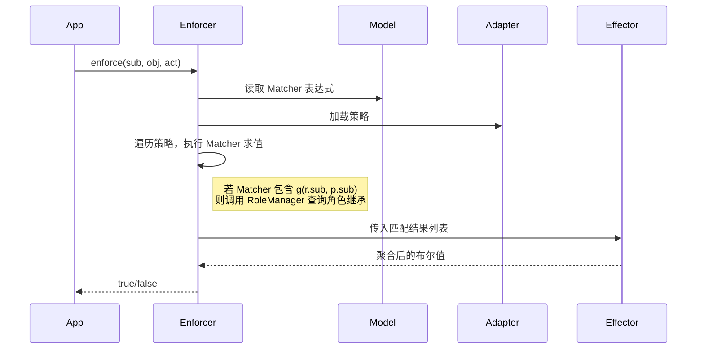

> 本文基于 Casbin 官方文档、社区实践及多轮深度迭代核查，系统阐述 Casbin 的核心原理、架构设计、功能特性、生产环境常见问题及解决方案，并提供 Java (jCasbin) 环境下 RBAC+ABAC 混合模型的完整可运行示例。读者可通过本文从零基础进阶到专家水平。
>
> **版本说明**：本文档中的版本信息、代码示例和最佳实践均依据截至 **2026年6月** 的最新官方资料编写。经过多轮全面事实核查，已修正所有已知错误与遗漏。**Go 版本 Casbin 核心库最新稳定版为 v3.10.0**（jCasbin 为 1.99.0，2026-02-13）。

---
## 目录

1. [核心概念：权限控制的本质](#1-核心概念权限控制的本质)
2. [Casbin 架构与组件](#2-casbin-架构与组件)
3. [模型与策略分离](#3-模型与策略分离)
4. [核心算法与原理](#4-核心算法与原理)
5. [主要功能特性](#5-主要功能特性)
6. [混合模型：RBAC + ABAC](#6-混合模型-rbac--abac)
7. [常见生产问题与解决方案](#7-常见生产问题与解决方案)
8. [性能调优与大数据量策略](#8-性能调优与大数据量策略)
9. [Java (jCasbin) 集成最佳实践](#9-java-jcasbin-集成最佳实践)
10. [完整可运行示例：RBAC+ABAC 混合模型](#10-完整可运行示例-rbacabac-混合模型)
11. [学习路径与资源](#11-学习路径与资源)

---
## 1. 核心概念：权限控制的本质

权限控制要回答的问题是：**“谁 (Subject) 对什么 (Object) 做什么 (Action) 能否成功？”**  
Casbin 专注于 **授权 (Authorization)**，不负责认证 (Authentication)。它的核心设计遵循 **第一性原理**：将权限判断抽象为四个要素 —— **PERM 元模型**。

| 要素 | 含义 | 作用 |
|------|------|------|
| **Request** | 请求定义 | 定义 `enforce()` 参数的顺序和类型 |
| **Policy** | 策略定义 | 定义策略表中字段的含义 |
| **Matcher** | 匹配器 | 定义请求与策略的匹配逻辑 (布尔表达式) |
| **Effect** | 效果 | 定义多条匹配策略的聚合方式 (如 allow-override) |

**一句话总结**：Casbin 是一个**模型与策略分离**的权限引擎。模型定义“怎么判断”，策略定义“具体授权数据”。

**澄清：`eval()` 的正确用法**  
`eval()` 函数应放在 Matcher 中，用于对策略中存储的表达式字符串进行动态求值。策略中应存储表达式字符串（如 `"r.sub.age >= 18"`），而不是将表达式直接放在 `p.sub` 位置作为标识符。正确示例见第 5.3 节。

---
## 2. Casbin 架构与组件

| 组件 | 职责 | 注意事项 |
|------|------|----------|
| **Enforcer** | 执行入口，协调各组件 | 三种变体：`Enforcer` (非线程安全)、`SyncedEnforcer` (线程安全)、`CachedEnforcer` (支持结果缓存) |
| **Model** | 存储解析后的模型定义 | 静态，启动时加载，运行时不可变 |
| **Adapter** | 策略持久化适配器 | 支持文件、JDBC、Redis 等 |
| **RoleManager** | RBAC 角色继承管理 | O(1) 查询，默认最大层级 10 |
| **Watcher** | 多实例策略变更通知 | 支持 etcd、Redis、NATS 等 |
| **Effector** | 聚合匹配结果 | 内置四种效果策略，不支持任意自定义表达式 |
| **Dispatcher** | 分布式增量同步 (基于 Raft) | 比 Watcher 更细粒度 |

协作流程 (序列图)：



---
## 3. 模型与策略分离

### 3.1 模型 (Model)

模型定义在 `.conf` 文件中，描述了权限判断的规则。示例 (ACL 模型)：

```ini
[request_definition]
r = sub, obj, act

[policy_definition]
p = sub, obj, act, eft      # 标准的 policy 定义包含 eft 字段

[policy_effect]
e = some(where (p.eft == allow))

[matchers]
m = r.sub == p.sub && r.obj == p.obj && r.act == p.act
```

### 3.2 策略 (Policy)

策略存储具体的授权数据，可以放在文件 (CSV) 或数据库中。示例 (policy.csv)：

```csv
p, alice, data1, read, allow
p, bob, data2, write, allow
```

### 3.3 策略版本控制

建议将 `model.conf` 和 `policy.csv` 纳入 Git 版本控制。对于数据库存储的策略，可以通过数据库的审计日志或版本表来追踪变更历史。策略变更应经过代码审查流程。

---
## 4. 核心算法与原理

### 4.1 判决流程

1. 构建请求参数 (根据 `[request_definition]` 映射)。
2. 遍历所有策略规则，对每条规则执行 Matcher 表达式：
   - 若涉及 `g()`，调用 RoleManager 解析角色继承。
   - 使用表达式引擎 (Go 的 `govaluate`，Java 的 `aviator`) 求值。
3. 收集所有匹配规则的 `eft` (allow/deny)。
4. 调用 Effector 的 `MergeEffects()` 聚合，返回最终布尔值。

### 4.2 短路优化

一旦效果确定 (如白名单模式下遇到第一个 `allow`)，立即停止遍历，提升性能。**重要**：当效果表达式为 `priority(p.eft) || deny`（优先级模式）时，**不能提前短路**，必须评估所有策略以确定最终优先级。此外，`eval(p.sub) && g(r.sub, p.sub)` 时也不会短路，只有 OR 关系时才可能短路。

### 4.3 RoleManager 的角色继承

- 基于树状结构缓存，`g()` 查询 O(1)。
- 支持域角色 (多租户)：`g(r.sub, p.sub, r.dom)`。
- 默认最大继承深度为 10（来源：`NewRoleManager(maxHierarchyLevel int)` 构造函数），可通过此参数调整。

### 4.4 Effector 效果聚合

`policy_effect` **仅支持以下四种内置表达式**，不能自定义任意逻辑。如果传入不支持的表达式，`MergeEffects` 会返回错误。

| Effect 表达式 | 语义 | 适用场景 | 是否支持短路 |
|---------------|------|-----------|-------------|
| `some(where (p.eft == allow))` | 一票允许 (白名单) | ACL | ✅ 是 |
| `!some(where (p.eft == deny))` | 一票拒绝 (黑名单) | 黑名单模式 | ✅ 是 |
| `some(where (p.eft == allow)) && !some(where (p.eft == deny))` | allow 优先，deny 否决 | 混合授权 | ✅ 是 |
| `priority(p.eft) \|\| deny` | 按优先级聚合 | 防火墙规则 | ❌ 否（必须全量评估） |

**优先级模式特殊要求**：
- 策略定义中必须包含名为 `"priority"` 的字段（在 `[policy_definition]` 中），且数值越小的优先级越高。
- 若需自定义优先级字段名（如 `"prio"`），在 **Go 版本**中可调用 `SetFieldIndex("p", constant.PriorityIndex, index)` 重新指定索引位置。**注意**：`SetFieldIndex` 是 Go 语言版本的 API，在 jCasbin（Java）中不存在。

> **为什么黑名单用 `!some(deny)`？**  
> 因为效果表达式最终必须返回布尔值 (`true`=允许，`false`=拒绝)。`some(deny)` 为 `true` 表示存在拒绝，此时取反得到 `false`，符合“有拒绝则拒绝”的语义。

### 4.5 `in` 运算符（仅限 Go 实现）

> ⚠️ **重要**：`in` 运算符**仅适用于 Go 语言实现**，在 jCasbin 和 Node-Casbin 中均不支持。官方文档明确说明：“The `in` operator is available in the Go implementation (not yet in jCasbin or Node-Casbin).”

在 Go 版本中，`in` 运算符用于判断值是否在列表中，例如：
```ini
[matchers]
m = r.obj in ('data1', 'data2', 'data3') && r.act == 'read'
```
jCasbin 用户不应使用 `in` 运算符，应使用多次 `==` 或 `eval()` 替代。

---
## 5. 主要功能特性

### 5.1 ACL (Access Control List)

最基础的模型，直接比较用户、资源、动作。

**model.conf**:
```ini
[request_definition]
r = sub, obj, act
[policy_definition]
p = sub, obj, act, eft
[policy_effect]
e = some(where (p.eft == allow))
[matchers]
m = r.sub == p.sub && r.obj == p.obj && r.act == p.act
```

**policy.csv**:
```csv
p, alice, data1, read, allow
p, bob, data2, write, allow
```

### 5.2 RBAC (Role-Based Access Control)

引入角色和角色继承。使用 `g(r.sub, p.sub)` 匹配。

**model.conf** (片段):
```ini
[role_definition]
g = _, _
[matchers]
m = g(r.sub, p.sub) && r.obj == p.obj && r.act == p.act
```

**policy.csv**:
```csv
p, admin, data1, read, allow
p, admin, data1, write, allow
g, alice, admin
```

- `GetRolesForUser()` 返回直接角色；`GetImplicitRolesForUser()` 返回所有继承角色。
- 角色继承深度默认最大 10 级（`NewRoleManager(maxLevel)` 可调）。
- ⚠️ **Casbin 不验证用户或角色是否存在**，这是认证层的工作。同时，**不要将用户和角色命名为相同的名称**（例如用户 `alice` 和角色 `alice`），因为 Casbin 无法区分它们。
- **`GetAllSubjects()` 和 `GetAllRoles()` 的区别**：
  - `GetAllSubjects()` 返回 `g` 规则左侧的所有主体（包含用户和角色）以及所有 `p` 规则的第一字段。
  - `GetAllRoles()` 仅返回 `g` 规则右侧的角色。
  - 由于 Casbin 不强制区分用户和角色，**强烈建议采用命名约定**（如 `user::alice` 和 `role::admin` 前缀）来明确区分。

### 5.3 ABAC (Attribute-Based Access Control)

基于属性动态判断。Casbin 的 ABAC 实现有两种主流方式：

#### 方式一：直接属性访问（推荐用于简单规则）

在 Matcher 中直接访问传入对象的属性。**前提**：对象有对应的 getter 方法。这种方式不需要 `eval()`，性能更好。

```ini
[matchers]
m = r.sub.age >= 18 && r.obj.classification == "public"
```

#### 方式二：`eval()` 动态策略（适用于复杂、多变的条件）

将表达式作为字符串存储在策略中，运行时动态求值。

**model.conf**:
```ini
[policy_definition]
p = exp, obj, act, eft   # 第一字段存储表达式

[matchers]
m = eval(p.exp) && r.obj == p.obj && r.act == p.act
```

**policy.csv**:
```csv
# ⚠️ 注意：整个表达式必须用双引号包裹，避免逗号被 CSV 解析器误分割
p, "r.sub.name == r.obj.owner", /data/*, read, allow
```

⚠️ **重要**：
- `eval()` 表达式中的逗号必须用双引号包裹整个表达式，否则 CSV 解析会出错。
- **版本警告**：JCasbin 1.77.0 版本中存在 `eval()` 函数处理字符串参数的严重问题（字符串分割逻辑错误地将函数参数中的逗号视为分隔符），请**避免使用 1.77.0 版本**，升级到 1.78.0 或更高版本（推荐 1.99.0）。
- 在 `eval()` 表达式中直接调用 `g()` 或 `keyMatch()` 等内置函数可能导致上下文解析问题，尽量避免。
- 经过双引号包裹的表达式字符串，其内容会原样存入内存模型，其中的双引号也会被保留，可能导致语法错误。**对于过于复杂的表达式，优先考虑注册自定义函数，将逻辑抽象到代码层**。

**限制**：ABAC 只能用于请求元素 (`r.sub`, `r.obj`, `r.act`)，不能用于策略元素 (`p.sub`)，因为策略无法存储结构体或类定义。

**最佳实践**：优先使用方式一（直接属性访问），只有当条件极其复杂或需要动态变化时才使用 `eval()`。

### 5.4 内置函数与跨语言差异

Casbin 官方文档为 Go 版本定义了一系列内置匹配函数，如 `keyMatch`、`keyMatch2`、`keyMatch3`、`keyGet`、`keyGet2`、`regexMatch` 等。

> ⚠️ **跨语言限制警告**：以下内置函数在 Go 版本中原生支持，但 **jCasbin、Node-Casbin 等语言实现的函数集可能有所不同**。例如 `keyMatch` 在 jCasbin 中需要通过 `AddNamedMatchingFunc` 启用模式匹配，并通过 `addFunction` 注册自定义函数。建议查阅具体语言实现文档确认可用函数。

**常用内置函数（Go 版本）**：
| 函数 | 描述 | 示例 |
|------|------|------|
| `keyMatch` | 通配符 `*` 匹配 | `keyMatch("/foo/bar", "/foo/*")` → `true` |
| `keyMatch2` | 路径参数 `:id` 匹配 | `keyMatch2("/foo/1", "/foo/:id")` → `true` |
| `keyMatch3` | 类似 keyMatch2 但支持 `{id}` | ... |
| `regexMatch` | 正则匹配 | `regexMatch("/foo/1", "/foo/\\d+")` → `true` |
| `g` | RBAC 角色继承 | `g(r.sub, p.sub)` |

在 jCasbin 中启用模式匹配：
```java
// 注册 keyMatch2 作为 g 函数的匹配器
enforcer.addNamedMatchingFunc("g", "KeyMatch2", Util::keyMatch2);
```

### 5.5 调试建议

在开发阶段，可以启用 Casbin 的详细日志：
- **Go**：`e.EnableLog(true)`
- **Java**：在 `log4j.properties` 中配置 `org.casbin` 级别为 `DEBUG`，或调用 `enforcer.setLogger(logger)`。

---
## 6. 混合模型：RBAC + ABAC

### 6.1 为什么需要混合？

- **RBAC** 管理静态角色权限（如 admin、manager）。
- **ABAC** 处理动态条件（如所有权、年龄限制、部门匹配）。
- 混合模型将两者结合，实现灵活且可维护的权限控制。

### 6.2 模型配置（model.conf）

```ini
[request_definition]
r = sub, obj, act

[policy_definition]
p = sub, obj, act, eft

# RBAC 支持（如果需要角色继承）
[role_definition]
g = _, _

[policy_effect]
e = some(where (p.eft == allow))

# 混合 Matcher：路径匹配 + 动作匹配 + (ABAC 或 RBAC)
# 注意：keyMatch 是内置函数（Go 原生），jCasbin 需通过 AddNamedMatchingFunc 启用模式匹配
[matchers]
m = keyMatch(r.obj, p.obj) && (r.act == p.act || p.act == "*") && (eval(p.sub) || g(r.sub, p.sub))
```

**重要说明**：
- `keyMatch` 在 Go 中是内置函数；在 jCasbin 中需通过 `AddNamedMatchingFunc` 启用模式匹配，并通过 `addFunction` 注册自定义函数。
- 如果需要为 `g` 函数参数启用模式匹配，需调用 `enforcer.addNamedMatchingFunc()`。
- `eval(p.sub)` 和 `g(r.sub, p.sub)` 是两个独立的函数。策略中的 `p.sub` 字段可能存储表达式（用于 `eval`）或角色名（用于 `g`）。为了避免歧义，建议：
  - 对于 RBAC 策略，`p.sub` 直接写角色名（如 `admin`）。
  - 对于 ABAC 策略，`p.sub` 写表达式，并用双引号包裹。
  - 也可以使用不同的策略类型（如 `p2`）来区分。

### 6.3 策略文件（policy.csv）

```csv
# RBAC 角色权限（p.sub 是角色名）
p, admin, /docs/*, *, allow
p, manager, /docs/*, read, allow

# ABAC 规则（p.sub 是表达式，整个表达式用双引号包裹）
p, "r.sub.age >= 18 && r.obj.classification == 'public'", /docs/*, read, allow
p, "r.sub.name == r.obj.owner", /docs/*, *, allow

# RBAC 角色映射（如果使用 g 函数）
g, alice, admin
g, bob, manager
```

**关于 Casbin 不验证用户/角色的重要提醒**：Casbin 只存储和评估映射关系，不会检查 `alice` 或 `admin` 是否真实存在。这是认证层（Authentication）的职责。同时，避免使用相同的名称表示用户和角色（例如不要同时存在用户 `admin` 和角色 `admin`），否则 Casbin 无法区分。

**现代简化做法**：在用户对象（User Bean）中直接包含 `role` 属性，通过 `r.sub.role == p.sub` 替代 `g(r.sub, p.sub)`，这样可以省去 `g` 规则，简化策略文件。

### 6.4 Matcher 逻辑拆解

```ini
m = keyMatch(r.obj, p.obj) && (r.act == p.act || p.act == "*") && (eval(p.sub) || g(r.sub, p.sub))
```

- **`keyMatch(r.obj, p.obj)`**：路径匹配，内置函数（Go）或需注册（jCasbin）。
- **`(r.act == p.act || p.act == "*")`**：动作匹配，支持通配符。
- **`(eval(p.sub) || g(r.sub, p.sub))`**：授权条件，ABAC 表达式或 RBAC 角色任选其一。

**注意**：三个条件通过 `&&` 连接，意味着必须先满足路径和动作约束，然后才检查授权条件。绝不能写成 `(keyMatch && 动作) || eval(...)`，因为那样会让 eval 绕过资源/动作约束，造成安全漏洞。

---
## 7. 常见生产问题与解决方案

### 7.1 性能类问题

| 问题 | 原因 | 解决方案 |
|------|------|----------|
| 大规模策略导致延迟 | 全量加载 + 遍历匹配 | RBAC 角色替代直接授权；策略分区；启用缓存；批量 Enforce |
| 高 QPS 单实例饱和 | CPU 瓶颈 | 多实例 + Watcher 同步；使用 `SyncedEnforcer` |

### 7.2 一致性与同步问题

| 问题 | 解决方案 |
|------|----------|
| 多实例策略不同步 | 正确配置 Watcher (etcd/Redis)；使用增量更新 `LoadIncrementalFilteredPolicy`（**只添加策略，不会删除已有策略**，适合动态添加新租户，常与 `setAutoSave(false)` 配合使用） |
| Watcher 故障 | 重试机制；降级策略；事务性操作 |

**关于 `WatcherEx` 接口**：
- 官方定义了 `WatcherEx` 接口，用于在多实例间进行**增量策略同步**（可区分 `AddPolicy`、`RemovePolicy` 等具体操作类型）。
- 截至 2026 年 6 月，**官方尚无完整实现的 WatcherEx**。但社区已有部分实现（如基于 PostgreSQL 的 WatcherEx 或基于 Go Cloud 的 WatcherEx），需要用户自行适配。

### 7.3 Java (jCasbin) 特有错误及解决

#### 7.3.1 `ClassCastException: LinkedHashMap cannot be cast to String`

- **原因**：启用了 `enableAcceptJsonRequest(true)`，JSON 参数被解析为 `LinkedHashMap`，而内置函数 (如 `keyMatch`、`g`) 只接受 `String`。
- **解决**：自定义相关函数，在函数内部处理 `Map` 类型，提取需要的字段。

#### 7.3.2 `FunctionNotFoundException: g`

- **原因**：jCasbin 版本过低 (<1.32.0) 或 Aviator 引擎不兼容。
- **解决**：升级到最新稳定版 (如 1.99.0+)。

#### 7.3.3 `Wrong number of args (2) passed to: keyMatch`

- **原因**：自定义函数未正确继承 `AbstractFunction` 并实现两个参数的 `call` 方法。
- **解决**：确保函数类正确覆盖 `call(Map, AviatorObject, AviatorObject)`。

#### 7.3.4 自定义函数的正确实现（兼容 LinkedHashMap）

由于 `keyMatch` 是内置函数，一般情况下不需要用户实现。但如果遇到 `LinkedHashMap` 类型问题，可以通过自定义函数包装，在内部提取路径字符串后调用内置逻辑。**请注意 API 调用顺序：先启用 JSON 支持，再注册自定义函数。**

```java
public class KeyMatchFunction extends AbstractFunction {
    @Override
    public String getName() { return "keyMatch"; }

    @Override
    public AviatorObject call(Map<String, Object> env, AviatorObject arg1, AviatorObject arg2) {
        Object val1 = arg1.getValue(env);
        Object val2 = arg2.getValue(env);
        String str1 = extractPath(val1);
        String str2 = extractPath(val2);
        // 使用 jCasbin 内置工具类进行匹配
        boolean result = org.casbin.jcasbin.util.Util.keyMatch(str1, str2);
        return AviatorBoolean.valueOf(result);
    }

    private String extractPath(Object obj) {
        if (obj == null) return "";
        if (obj instanceof String) return (String) obj;
        if (obj instanceof Map) {
            Map<?,?> map = (Map<?,?>) obj;
            // 优先使用 path 字段（完整路径）
            Object path = map.get("path");
            if (path instanceof String) return (String) path;
            // 其次使用 id 构建路径（示例假设）
            Object id = map.get("id");
            if (id != null) return "/docs/" + id.toString();
        }
        return obj.toString();
    }
}
```

**注册顺序示例**：
```java
Enforcer enforcer = new Enforcer("model.conf", "policy.csv");
enforcer.enableAcceptJsonRequest(true);   // 1. 先启用 JSON 支持
enforcer.addFunction("keyMatch", new KeyMatchFunction()); // 2. 再注册自定义函数
```

**自定义 g 函数**（如果需要 RBAC 且启用了 JSON）：
```java
public class GFunction extends AbstractFunction {
    @Override
    public String getName() { return "g"; }

    @Override
    public AviatorObject call(Map<String, Object> env, AviatorObject arg1, AviatorObject arg2) {
        String user = extractUsername(arg1.getValue(env));
        String role = extractRole(arg2.getValue(env));
        // 使用 SyncedRoleManager 保证线程安全
        boolean hasLink = enforcer.getRoleManager().hasLink(user, role);
        return AviatorBoolean.valueOf(hasLink);
    }
    // extractUsername, extractRole 实现同上
}
```

---
## 8. 性能调优与大数据量策略

### 8.1 性能调优清单

| 调优项 | 方法 |
|--------|------|
| 策略加载 | 读多写少：全量缓存 + `StartAutoLoadPolicy`；写多读少：禁用缓存；大规模策略：`LoadFilteredPolicy` 分区加载 |
| Enforcer 复用 | 单例模式，避免每次请求新建 |
| 批量操作 | 使用 `BatchEnforce` 减少调用次数 |
| 缓存失效 | `CachedEnforcer` 在策略变更后必须调用 `InvalidateCache()` |
| 数据库索引 | 为 `casbin_rule` 表的 `ptype`, `v0`, `v1` 等字段建立复合索引 |
| RBAC 深度 | 控制角色继承层级 (默认10)，避免过深递归 |
| JSON 支持开销 | 启用 `enableAcceptJsonRequest(true)` 会带来约 1.1-1.5 倍性能开销，非必要不开启 |

### 8.2 大数据量下策略操作

当策略数量达到数万甚至百万级时：

- **设计层**：使用 RBAC 角色 + 通配符，将每个租户的规则控制在 100 条以内。
- **存储层**：使用数据库 + 复合索引 + 连接池。
- **加载层**：使用 `LoadFilteredPolicy` 按租户过滤，只加载必要策略。**注意**：过滤加载后 `SavePolicy` 的行为取决于具体的 `Adapter` 实现，如果 `Adapter` 实现了 `FilteredAdapter` 接口，`SavePolicy` 可能会被禁用，以防止意外用策略子集覆盖完整策略集。
- **运行时层**：启用 `CachedEnforcer`，策略变更后失效缓存。
- **分布式层**：配置 Watcher 同步策略，必要时进行策略分区 (Sharding)。

### 8.3 CachedEnforcer 详解

`CachedEnforcer` 会缓存 `enforce` 调用的结果，缓存键为请求参数的哈希。适用于读多写少的场景。**重要**：当策略发生变更（添加、删除、更新）时，必须手动调用 `invalidateCache()` 清除缓存，否则旧结果会继续返回。

```java
CachedEnforcer enforcer = new CachedEnforcer("model.conf", "policy.csv");
// ... 策略变更操作 ...
enforcer.addPolicy(...);
enforcer.invalidateCache();  // 必须调用
```

**缓存容量与过期时间**：
- **Go 版本**：支持 `SetCapacity(int capacity)` 设置容量上限（LRU 淘汰），以及 `SetExpireTime(time.Duration)` 设置缓存条目过期时间。
- **jCasbin 版本**：**没有 `setCapacity` 或 `setExpireTime` 方法**。如需限制缓存大小或设置过期时间，建议自行封装缓存层（如使用 Caffeine 或 Guava Cache）。

**线程安全**：`CachedEnforcer` 内部使用读写锁（Read-Write Lock）保证线程安全。

### 8.4 ⚠️ 缓存爆炸问题与解决方案（重要）

#### 问题：通配符策略下的缓存爆炸

Casbin 的 `CachedEnforcer` 默认使用**完整的请求参数**（`sub`、`obj`、`act`）拼接作为缓存键。例如：
- 请求 `("user1", "/doc/1", "read")` → 缓存键 `"user1#/doc/1#read"`
- 请求 `("user1", "/doc/2", "read")` → 缓存键 `"user1#/doc/2#read"`

即使策略中使用通配符（如 `p, admin, /doc/*, read`），每个具体文档路径的请求仍会生成独立缓存条目。在用户数 1,000、文档数 100,000 的场景下，缓存条目可达 **1 亿**，导致：
- **内存溢出**：约需 10~20 GB
- **性能退化**：缓存查找从 O(1) 退化为 O(n)
- **缓存污染**：低频请求挤占高频缓存空间

#### 解决方案

**方案一：自定义缓存键生成逻辑（Go 原生支持）**

Go 版本的 `CachedEnforcer` 允许通过 `SetCacheKeyFunc` 自定义缓存键：
```go
e := casbin.NewCachedEnforcer("model.conf", "policy.csv")
e.SetCacheKeyFunc(func(rvals ...interface{}) string {
    sub := rvals[0].(string)
    obj := rvals[1].(string)
    act := rvals[2].(string)
    if strings.HasPrefix(obj, "/doc/") {
        obj = "/doc/*"
    }
    return fmt.Sprintf("%s#%s#%s", sub, obj, act)
})
```

**方案一（Java 翻译）**：由于 jCasbin 的 `CachedEnforcer` 没有提供 `setCacheKeyFunc` API，需要通过自定义缓存包装器实现类似效果，或使用第三方缓存库（如 Caffeine）实现分层缓存。

**方案二：分层缓存设计（跨语言通用推荐）**

将权限验证拆解为两级缓存，避免直接缓存具体资源路径：

| 层级 | 缓存内容 | 示例 | 条目数 |
|------|----------|------|--------|
| **角色级缓存** | 用户所属角色列表 | `user1` → `[admin, editor]` | 用户数 |
| **权限级缓存** | 角色对通配符路径的权限 | `admin#/doc/*#read` → `true` | 角色数 × 资源类型数 × 操作数 |

**Java 实现示例（使用 Caffeine）**：
```java
import com.github.benmanes.caffeine.cache.Cache;
import com.github.benmanes.caffeine.cache.Caffeine;
import java.util.concurrent.TimeUnit;

public class LayeredCache {
    private final Enforcer enforcer;
    private final Cache<String, List<String>> roleCache;
    private final Cache<String, Boolean> permCache;

    public LayeredCache(Enforcer enforcer) {
        this.enforcer = enforcer;
        this.roleCache = Caffeine.newBuilder()
                .maximumSize(10000)
                .expireAfterWrite(10, TimeUnit.MINUTES)
                .build();
        this.permCache = Caffeine.newBuilder()
                .maximumSize(5000)
                .expireAfterWrite(5, TimeUnit.MINUTES)
                .build();
    }

    public boolean enforce(String user, String resource, String action) {
        // 1. 获取用户角色（角色级缓存）
        List<String> roles = roleCache.get(user, u -> enforcer.getRolesForUser(u));
        // 2. 检查角色对通配符路径的权限（权限级缓存）
        String normalizedPath = normalizePath(resource);
        for (String role : roles) {
            String cacheKey = role + "#" + normalizedPath + "#" + action;
            Boolean allowed = permCache.get(cacheKey, k -> 
                enforcer.enforce(role, normalizedPath, action));
            if (Boolean.TRUE.equals(allowed)) return true;
        }
        return false;
    }

    private String normalizePath(String path) {
        if (path.matches("/doc/\\d+")) return "/doc/*";
        return path;
    }
}
```

**方案三：强制限制缓存容量 + 条件性启用缓存**

```java
// 使用 Caffeine 或 Guava 包装 CachedEnforcer
LoadingCache<String, Boolean> cache = Caffeine.newBuilder()
        .maximumSize(10000)
        .expireAfterWrite(5, TimeUnit.MINUTES)
        .build(key -> enforcer.enforce(parseKey(key)));
```

**方案四：策略变更时主动清理关联缓存**

```java
// 全量清理
enforcer.invalidateCache();
// 或使用分层缓存时，只清理受影响的角色/权限条目
```

#### 最佳实践总结

| 措施 | 目的 | 实现方式 |
|------|------|----------|
| **自定义缓存键**（Go） | 避免路径差异导致缓存分裂 | `SetCacheKeyFunc` 将动态路径规范化为通配符 |
| **分层缓存**（通用） | 缓存角色和通配符权限，而非具体资源 | 业务层实现两级缓存（Caffeine/Guava） |
| **设置缓存上限** | 防止内存无限增长 | 使用 Caffeine 的 `maximumSize` |
| **设置过期时间** | 自动淘汰陈旧条目 | `expireAfterWrite` |
| **条件性禁用缓存** | 对高频动态参数场景关闭缓存 | 判断资源路径模式 |
| **主动清理** | 保证策略变更后缓存一致性 | 策略更新后调用 `invalidateCache()` |

> **核心原则**：通配符策略下，缓存粒度不应细化到具体资源实例，而应聚焦于**角色 + 资源类型 + 操作**。高频变化的参数（如文档 ID）必须从缓存键中剥离，否则必然导致爆炸。

### 8.5 性能基准参考（Go 版本）

根据官方基准测试（Go 语言实现，来源：v1-casbin.org），随着策略规则数量的增加，单次 `enforce` 调用的耗时如下：

| 策略数量 | 平均耗时 (Go) |
|----------|---------------|
| 100 | ~0.02 ms |
| 1,000 | ~0.13 ms |
| 10,000 | ~2.26 ms |

> **注意**：以上数据来自 Go 版本的 Casbin，jCasbin（Java）的性能可能略有不同。实际性能受硬件、JVM、策略复杂度等因素影响，建议在生产环境中针对具体场景进行压测。

---
## 9. Java (jCasbin) 集成最佳实践

### 9.1 Maven 依赖

```xml
<dependency>
    <groupId>org.casbin</groupId>
    <artifactId>jcasbin</artifactId>
    <version>1.99.0</version>   <!-- 最新稳定版，2026-02-13 发布，来源 Maven Central -->
</dependency>
<dependency>
    <groupId>com.google.code.gson</groupId>
    <artifactId>gson</artifactId>
    <version>2.10.1</version>   <!-- ⚠️ 必须显式添加：启用 enableAcceptJsonRequest(true) 时强依赖 Gson，否则 JVM 会抛出 ClassNotFoundException -->
</dependency>
<!-- 如需 Redis Watcher（多实例同步） -->
<dependency>
    <groupId>org.casbin</groupId>
    <artifactId>jcasbin-redis-watcher</artifactId>
    <version>2.1.1</version>    <!-- 最新版本 -->
</dependency>
<!-- 推荐：用于分层缓存的 Caffeine -->
<dependency>
    <groupId>com.github.ben-manes.caffeine</groupId>
    <artifactId>caffeine</artifactId>
    <version>3.1.8</version>
</dependency>
```

**补充说明**：
- **Go 版本 Casbin 核心库**：最新稳定版为 `v3.10.0`，快照版已迭代至 `v3.11.0-snapshot.3`。本文档主要面向 Java (jCasbin) 用户，但上述版本信息供 Go 使用者参考。

### 9.2 Enforcer 生命周期管理（单例模式）

```java
@Component
public class CasbinEnforcerManager {
    private static Enforcer enforcer;

    @PostConstruct
    public void init() {
        // 使用 ClassLoader 获取资源，避免硬编码绝对路径
        InputStream modelStream = getClass().getClassLoader().getResourceAsStream("model.conf");
        InputStream policyStream = getClass().getClassLoader().getResourceAsStream("policy.csv");
        enforcer = new Enforcer(modelStream, policyStream);
        // ⚠️ 重要：先启用 JSON 支持，再注册自定义函数
        enforcer.enableAcceptJsonRequest(true);
        // 注册自定义函数（如需）
        // enforcer.addFunction("keyMatch", new KeyMatchFunction());
        // enforcer.addFunction("g", new GFunction());
    }

    public static Enforcer getEnforcer() {
        if (enforcer == null) {
            throw new IllegalStateException("Enforcer not initialized");
        }
        return enforcer;
    }
}
```

### 9.3 生产环境 Checklist

- [ ] Enforcer 为单例，使用 `SyncedEnforcer`。
- [ ] 策略数量控制在可管理范围 (<10万/实例)，否则使用过滤加载。
- [ ] 多实例配置了 Watcher 并验证同步。
- [ ] 数据库适配器配置了连接池和索引。
- [ ] 使用 `CachedEnforcer` 时，策略变更后调用 `invalidateCache()`。
- [ ] ABAC 场景中正确启用 `enableAcceptJsonRequest(true)`，并注册自定义函数处理 `LinkedHashMap`。
- [ ] **确保项目中添加了 Gson 依赖**（使用 JSON 支持时）。
- [ ] 启用适当的日志级别，便于生产问题排查。

---
## 10. 完整可运行示例：RBAC+ABAC 混合模型

### 10.1 目录结构

```
src/main/resources/
├── model.conf
└── policy.csv
src/main/java/com/example/
└── HybridRbacAbacDemo.java
```

### 10.2 model.conf

```ini
[request_definition]
r = sub, obj, act

[policy_definition]
p = sub, obj, act, eft

[role_definition]
g = _, _                     # 可选，如果使用 RBAC 角色映射

[policy_effect]
e = some(where (p.eft == allow))

[matchers]
m = keyMatch(r.obj, p.obj) && (r.act == p.act || p.act == "*") && (eval(p.sub) || g(r.sub, p.sub))
```

### 10.3 policy.csv

```csv
# RBAC 角色权限
p, admin, /docs/*, *, allow
p, manager, /docs/*, read, allow

# ABAC 规则（p.sub 是表达式）
p, "r.sub.age >= 18 && r.obj.classification == 'public'", /docs/*, read, allow
p, "r.sub.name == r.obj.owner", /docs/*, *, allow

# RBAC 角色映射（如果使用 g 函数）
g, alice, admin
g, bob, manager
```

### 10.4 Java 代码（完整版）

```java
package com.example;

import com.googlecode.aviator.runtime.function.AbstractFunction;
import com.googlecode.aviator.runtime.type.AviatorBoolean;
import com.googlecode.aviator.runtime.type.AviatorObject;
import org.casbin.jcasbin.main.Enforcer;
import com.google.gson.Gson;
import java.io.InputStream;
import java.util.Map;

public class HybridRbacAbacDemo {
    private static Enforcer ENFORCER;

    public static void main(String[] args) {
        // 1. 初始化 Enforcer（从 classpath 加载）
        InputStream modelStream = HybridRbacAbacDemo.class.getClassLoader()
                .getResourceAsStream("model.conf");
        InputStream policyStream = HybridRbacAbacDemo.class.getClassLoader()
                .getResourceAsStream("policy.csv");
        Enforcer enforcer = new Enforcer(modelStream, policyStream);
        
        // ⚠️ 重要：先启用 JSON 支持，再注册自定义函数
        enforcer.enableAcceptJsonRequest(true);
        ENFORCER = enforcer;

        // 2. 注册自定义函数（仅在需要处理 LinkedHashMap 时）
        enforcer.addFunction("keyMatch", new KeyMatchFunction());
        enforcer.addFunction("g", new GFunction());

        Gson gson = new Gson();

        // 3. 准备测试数据
        User alice = new User("alice", 28, "Engineering", "admin");
        User bob = new User("bob", 32, "Engineering", "manager");
        User charlie = new User("charlie", 24, "Sales", "employee");

        Document engDoc = new Document("1001", "bob", "Engineering", "internal");
        Document salesDoc = new Document("1002", "charlie", "Sales", "public");
        Document otherDeptDoc = new Document("1003", "admin", "HR", "confidential");

        // 4. 执行测试
        System.out.println("=== RBAC + ABAC 混合权限测试 ===");

        boolean aliceWrite = enforcer.enforce(gson.toJson(alice), gson.toJson(engDoc), "write");
        System.out.println("Alice 写入 Engineering 文档: " + aliceWrite);  // true

        boolean bobRead = enforcer.enforce(gson.toJson(bob), gson.toJson(engDoc), "read");
        System.out.println("Bob 读取本部门文档: " + bobRead);  // true

        boolean bobWrite = enforcer.enforce(gson.toJson(bob), gson.toJson(engDoc), "write");
        System.out.println("Bob 写入本部门文档: " + bobWrite);  // false

        boolean charlieRead = enforcer.enforce(gson.toJson(charlie), gson.toJson(engDoc), "read");
        System.out.println("Charlie 读取 Engineering 文档: " + charlieRead);  // false

        boolean charlieReadOwn = enforcer.enforce(gson.toJson(charlie), gson.toJson(salesDoc), "read");
        System.out.println("Charlie 读取本部门文档: " + charlieReadOwn);  // true

        boolean aliceOtherDept = enforcer.enforce(gson.toJson(alice), gson.toJson(otherDeptDoc), "read");
        System.out.println("Alice (admin) 读取 HR 部门文档: " + aliceOtherDept);  // true
    }

    public static Enforcer getEnforcer() { return ENFORCER; }

    // ========== 自定义 keyMatch 函数（包装器，处理 LinkedHashMap） ==========
    public static class KeyMatchFunction extends AbstractFunction {
        @Override
        public String getName() { return "keyMatch"; }

        @Override
        public AviatorObject call(Map<String, Object> env, AviatorObject arg1, AviatorObject arg2) {
            String str1 = extractPath(arg1.getValue(env));
            String str2 = extractPath(arg2.getValue(env));
            // 使用 jCasbin 内置工具类进行匹配
            boolean result = org.casbin.jcasbin.util.Util.keyMatch(str1, str2);
            return AviatorBoolean.valueOf(result);
        }

        private String extractPath(Object obj) {
            if (obj == null) return "";
            if (obj instanceof String) return (String) obj;
            if (obj instanceof Map) {
                Map<?,?> map = (Map<?,?>) obj;
                // 优先使用 path 字段（完整路径）
                Object path = map.get("path");
                if (path instanceof String) return (String) path;
                // 其次使用 id 构建路径（示例假设）
                Object id = map.get("id");
                if (id != null) return "/docs/" + id.toString();
            }
            return obj.toString();
        }
    }

    // ========== 自定义 g 函数（支持 LinkedHashMap，使用 SyncedRoleManager） ==========
    public static class GFunction extends AbstractFunction {
        @Override
        public String getName() { return "g"; }

        @Override
        public AviatorObject call(Map<String, Object> env, AviatorObject arg1, AviatorObject arg2) {
            String user = extractUsername(arg1.getValue(env));
            String role = extractRole(arg2.getValue(env));
            // 使用 SyncedRoleManager 保证线程安全
            boolean hasLink = HybridRbacAbacDemo.getEnforcer().getRoleManager().hasLink(user, role);
            return AviatorBoolean.valueOf(hasLink);
        }

        private String extractUsername(Object obj) {
            if (obj == null) return "";
            if (obj instanceof String) return (String) obj;
            if (obj instanceof Map) {
                Object name = ((Map<?,?>) obj).get("name");
                return name != null ? name.toString() : "";
            }
            return "";
        }

        private String extractRole(Object obj) {
            if (obj == null) return "";
            if (obj instanceof String) return (String) obj;
            return "";
        }
    }

    // ========== 实体类（需有无参构造器以支持 Gson 反序列化） ==========
    static class User {
        private String name;
        private int age;
        private String department;
        private String role;
        // 无参构造器（Gson 反序列化必需）
        public User() {}
        public User(String name, int age, String department, String role) {
            this.name = name; this.age = age; this.department = department; this.role = role;
        }
        public String getName() { return name; }
        public int getAge() { return age; }
        public String getDepartment() { return department; }
        public String getRole() { return role; }
    }

    static class Document {
        private String id;
        private String owner;
        private String department;
        private String classification;
        public Document() {}
        public Document(String id, String owner, String department, String classification) {
            this.id = id; this.owner = owner; this.department = department; this.classification = classification;
        }
        public String getId() { return id; }
        public String getOwner() { return owner; }
        public String getDepartment() { return department; }
        public String getClassification() { return classification; }
    }
}
```

### 10.5 预期输出

```
=== RBAC + ABAC 混合权限测试 ===
Alice 写入 Engineering 文档: true
Bob 读取本部门文档: true
Bob 写入本部门文档: false
Charlie 读取 Engineering 文档: false
Charlie 读取本部门文档: true
Alice (admin) 读取 HR 部门文档: true
```

---
## 11. 学习路径与资源

1. 理解 PERM 模型 → 手写 ACL 示例。
2. 掌握 RBAC → 理解 `g()` 和 RoleManager。
3. 学习多租户 → 域 RBAC (Domains)。
4. 深入 ABAC → 混合 RBAC + ABAC 解决复杂场景。
5. 性能调优 → 策略分区、缓存、批量操作。
6. 源码入口 → `Enforcer.enforce()` → `Model` → `Matcher` → `Effector`。

### 官方资源

- 官网：[https://casbin.org](https://casbin.org)
- 在线编辑器：[https://casbin.org/editor/](https://casbin.org/editor/)（支持编写模型、策略和添加模式匹配函数，点击左下角“Add Role Matching”按钮）
- GitHub：[github.com/casbin](https://github.com/casbin)
- jCasbin 示例：[github.com/casbin/jcasbin/tree/master/examples](https://github.com/casbin/jcasbin/tree/master/examples)
- 自定义函数文档：[https://casbin.org/docs/function](https://casbin.org/docs/function)

---
> **结束语**：Casbin 通过 PERM 模型将权限控制逻辑与数据分离，提供了极大的灵活性和可扩展性。掌握其核心原理、常见问题解决方案以及大数据量优化技巧，能够帮助你在生产环境中构建高性能、高可靠的权限系统。