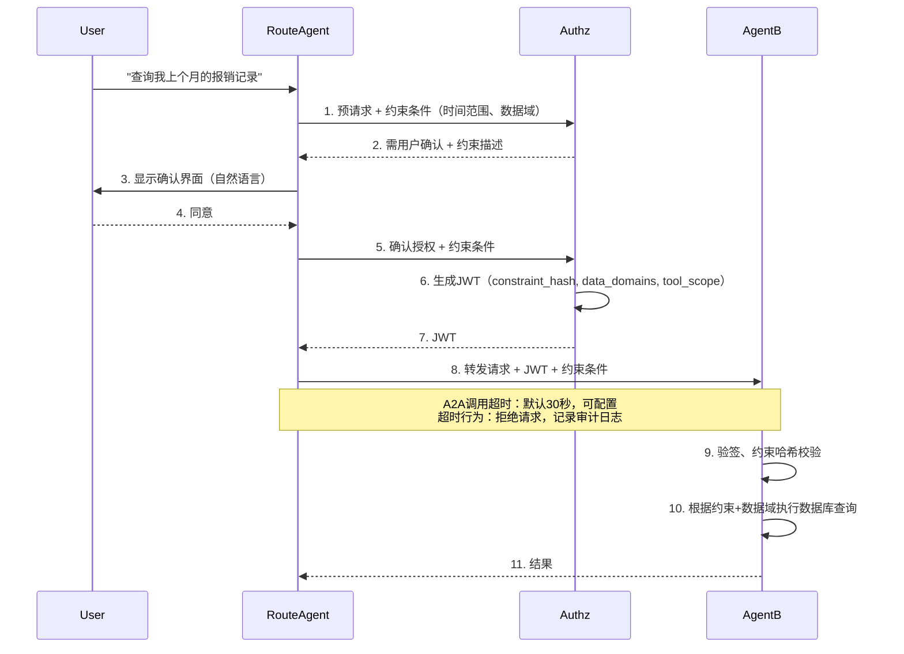

 
> **适用范围**：Agent‑to‑Agent（A2A）协同 + 数据库行级权限控制（不含文档类 RAG）  
> **技术栈**：JDK 21, Spring Boot 3.5.3, Spring AI Alibaba 1.1.2.0, Spring Authorization Server, jCasbin, Redis (Lettuce), MySQL, MyBatis-Plus, Caffeine, OpenTelemetry
---
## 目录

1. [背景与目标](#1-背景与目标)
2. [核心设计理念](#2-核心设计理念)
3. [总体架构与模块划分](#3-总体架构与模块划分)
4. [模块间依赖关系](#4-模块间依赖关系)
5. [核心接口与组件（同步版·责任链模式）](#5-核心接口与组件同步版责任链模式)
6. [企业级 Agent 管理与热更新](#6-企业级-agent-管理与热更新)
7. [数据模型设计](#7-数据模型设计)
8. [jCasbin 策略引擎集成与策略同步](#8-jcasbin-策略引擎集成与策略同步)
9. [授权服务器——轻量化 Token 与 DPoP 深度集成](#9-授权服务器轻量化-token-与-dpop-深度集成)
10. [A2A 安全防护与工具级管控](#10-a2a-安全防护与工具级管控)
11. [对话驱动的动态授权与约束传递](#11-对话驱动的动态授权与约束传递)
12. [运行态数据域解析与动态 SQL 注入](#12-运行态数据域解析与动态-sql-注入)
13. [配置与部署](#13-配置与部署)
14. [审计日志与全链路追踪设计](#14-审计日志与全链路追踪设计)
15. [安全加固矩阵](#15-安全加固矩阵)
16. [扩展点设计](#16-扩展点设计)
17. [高性能高并发保障措施](#17-高性能高并发保障措施)
18. [总结](#18-总结)

---
## 1. 背景与目标

在政企、大型金融机构的封闭内网中，Agent‑to‑Agent（A2A）协同与数据库行级权限控制已成为核心刚需。用户通过 Agent 访问数据库中的敏感数据（如订单、薪资、客户信息），必须遵循零信任原则。

**核心目标**：
- **身份认证**：Agent 间认证、用户身份透传、防冒充。
- **最小权限**：工具级权限（`tool_scope`）、数据行过滤（基于用户属性/数据域）。
- **性能优化**：虚拟线程、轻量令牌、Redis 缓存、连接池调优。
- **可审计性**：全链路追溯、结构化审计日志。
- **动态策略**：运行时根据用户上下文动态生成 SQL 过滤条件。
- **企业级热更新**：Agent Card 不停机变更。
- **高并发支撑**：认证服务器水平扩展，A2A 调用低延迟。

---
## 2. 核心设计理念

- **同步编码，异步性能**：全面拥抱 JDK 21 虚拟线程，摒弃复杂的响应式编程，以极低的心智负担支撑 A2A 高并发。
- **去租户化**：全局单租户，通过“工作空间 + 数据域”分离管理与运行权限。
- **轻量数据域**：扁平化数据域（可选继承），用于行级过滤，通过 SQL 模板动态注入，不要求在业务表中存储 `domain_id` 列。
- **责任链可扩展**：权限校验责任链，支持热插拔。
- **策略驱动 SQL 注入**：通过 MyBatis 拦截器 + 注解，根据用户数据域动态附加 WHERE 条件。
- **纵深防御**：提供 LOW / MEDIUM / HIGH 三级安全级别，按需启用。

---
## 3. 总体架构与模块划分

**五个独立部署单元**：
1. **授权服务器**（Authorization Server）— 基于 Spring Authorization Server，负责颁发代理令牌、管理 ACL 和用户同意。
2. **Agent 运行时**（既是 OAuth2 客户端，又是资源服务器）— 基于 Spring AI Alibaba，内嵌安全过滤器与权限评估器，以 JAR 形式集成到业务微服务中。
3. **Agent 管理中心**（Agent Management Center）— 负责 Agent Card 存储、版本管理、热更新事件发布、工作空间与数据域管理。
4. **Nacos** — A2A 注册中心与 AgentCard 存储（可与管理中心共用），**生产环境建议部署 3 节点集群**。
5. **Redis** — 一次性令牌、限流计数器、Streams 广播、Token 扩展数据存储，**生产环境建议部署 Redis Sentinel 或 Cluster**。

**Nacos 高可用部署建议**：

```yaml
# nacos-cluster.yml
server:
  port: 8848

spring:
  datasource:
    url: jdbc:mysql://${DB_HOST}:3306/nacos_config?characterEncoding=utf8&useSSL=false
    username: ${DB_USER}
    password: ${DB_PASS}

  redis:
    host: ${REDIS_HOST}
    port: 6379
    password: ${REDIS_PASSWORD}
    database: 0
    sentinel:
      master: mymaster
      nodes: ${REDIS_SENTINEL_NODES}

cluster:
  name: nacos-cluster
  nodes: nacos-1:8848,nacos-2:8848,nacos-3:8848
```

> **高可用说明**：
> - Nacos 集群模式下，所有 Agent 实例通过负载均衡连接任一 Nacos 节点
> - 配置变更通过 Nacos 同步协议自动传播到所有节点
> - Agent 实例本地缓存一份配置副本，Nacos 不可用时使用本地缓存
> - Redis Sentinel/Cluster 保证 Redis 服务高可用

**Maven 父模块**：`io.github.latcn:a2a-security:1.0.0`

```
a2a-security/
├── a2a-authorization-server/         # 授权服务器
│   └── src/main/java/io/github/latcn/a2a/security/authz/
│       ├── token/                    # Token Exchange端点 + 定制器
│       ├── acl/                      # Agent间ACL管理
│       ├── consent/                  # 用户同意管理
│       ├── audit/                    # 审计日志记录
│       └── config/                   # 安全配置
├── a2a-common-permission/            # 独立权限JAR
│   └── src/main/java/io/github/latcn/a2a/security/permission/
│       ├── api/                      # PermissionChecker等接口
│       ├── jcasbin/                  # Enforcer配置、策略管理、Watcher
│       ├── chain/                    # 责任链处理器（Authz侧和Agent侧）
│       └── config/                   # 自动配置
├── a2a-security-starter/             # Agent安全起步依赖（集成到业务微服务）
│   └── src/main/java/io/github/latcn/a2a/security/agent/
│       ├── client/                   # TokenExchangeService, A2aClientFilter
│       ├── server/                   # A2aJwtAuthenticationFilter, OneTimeTokenValidator
│       ├── tool/                     # 统一工具抽象、安全包装器、限流器
│       ├── chain/                    # Agent侧责任链实现
│       ├── interceptor/              # 数据域SQL拦截器
│       └── config/                   # 自动配置
└── a2a-agent-management/             # Agent定义管理与热更新
    └── src/main/java/io/github/latcn/a2a/agent/mgmt/
        ├── card/                     # AgentCard存储、版本管理
        ├── workspace/                # 工作空间CRUD、成员管理
        ├── datadomain/               # 数据域定义、继承关系
        ├── hotreload/                # 热更新监听器、ChatClient重建器
        └── config/                   # 自动配置
```

---

## 4. 模块间依赖关系

**编译时依赖**（箭头方向表示“依赖者 → 被依赖者”）：

```
┌─────────────────────┐
│ a2a-agent-xxx       │  业务Agent（微服务）
└──────────┬──────────┘
           │ depends on
           ▼
┌─────────────────────┐      ┌────────────────────────┐
│ a2a-security-starter│─────▶│ a2a-common-permission  │
└──────────┬──────────┘      └────────────────────────┘
           │
           │ depends on
           ▼
┌─────────────────────────────────────────────────────────────────┐
│ 外部依赖：Spring Boot 3.5.3, Spring AI Alibaba 1.1.2.0,        │
│ jCasbin, Redis (Lettuce), MySQL, Caffeine, Logstash Encoder,   │
│ OpenTelemetry, MyBatis-Plus 3.5.5                               │
└─────────────────────────────────────────────────────────────────┘
```

**运行期服务调用关系**：
- 授权服务器：Token Exchange、ACL 预判、Consent。
- Agent 管理中心：Agent Card 存储、工作空间/数据域配置、热更新广播。
- 业务 Agent 微服务：本地验签、责任链评估、数据域 SQL 注入、统一工具安全包装。

---
## 5. 核心接口与组件（同步版·责任链模式）

### 5.1 PermissionCheckHandler（权限校验器接口）

```java
public interface PermissionCheckHandler {
    CheckResult check(PermissionCheckContext context);
    enum CheckResult { ALLOW, DENY, ABSTAIN }
    default int order() { return 0; }
}
```

### 5.2 PermissionCheckContext（校验上下文）

```java
public class PermissionCheckContext {
    private final String userId;
    private final String resourceId;
    private final String operation;
    private final String resourceType;
    private final Map<String, Object> userAttributes;
    private final Jwt jwtToken;
    // constructor, getters...
}
```

### 5.3 内置处理器

| 处理器 | 顺序 | 职责 |
|--------|------|------|
| `DenyOverrideHandler` | `Integer.MIN_VALUE` | 特例拒绝优先 |
| `AllowOverrideHandler` | `-1000` | 特例允许 |
| `ToolScopeHandler` | `100` | 检查 JWT 中的 `tool_scope` 是否包含当前工具 |
| `AbacJCasbinHandler` | `200` | 基于 jCasbin 的 ABAC 动态评估（可选） |

> 数据域权限已下沉至数据访问层（MyBatis 拦截器），不在责任链中重复校验。

### 5.4 责任链实现

```java
@Component
public class AgentPermissionChain {
    private final List<PermissionCheckHandler> handlers;
    public boolean check(PermissionCheckContext ctx) {
        for (PermissionCheckHandler h : handlers) {
            CheckResult r = h.check(ctx);
            if (r == ALLOW) return true;
            if (r == DENY) return false;
        }
        return false;
    }
}
```
---
## 6. 企业级 Agent 管理与热更新

### 6.1 工作空间（Workspace）与角色

工作空间用于组织 Agent、工具和 API 资源的归属，实施基于角色的访问控制（RBAC）。

**核心实体**：
- `sys_workspace`（`workspace_id`, `name`, `owner_dept_id`）
- `sys_workspace_member`（`workspace_id`, `principal_id`, `role`）

**角色定义**：

| 角色 | 职责范围 | 管理 Agent 定义 | 配置 ACL | 典型身份 |
|------|----------|----------------|----------|-----------|
| 平台运维（全局） | 全局配置、监控、跨空间审计 | ✅ 所有 | ✅ 所有 | SRE、架构师 |
| 工作空间管理员 | 空间内成员管理、策略审批 | ✅ | ✅ | 部门主管 |
| 研发工程师（开发者） | 创建/修改 Agent 定义、绑定工具 | ✅ | ❌ | 研发、AI开发者 |
| 业务安全管理员（ACL_ADMIN） | 配置 Agent 间调用权限 | ❌ | ✅ | 业务负责人 |
| 查看者 | 只读查看 | ❌ | ❌ | 审计员、产品 |

### 6.2 数据域（Data Domain）设计

数据域用于控制 Agent 运行时的数据访问权限，支持树状继承。

**核心实体**：
- `sys_data_domain`（`domain_id`, `name`, `parent_domain_id`, `filter_expression_template`）

**特性**：
- 子域自动合并父域的过滤模板（递归展开）。合并时默认使用 **OR** 逻辑连接多个模板，合并过程中自动去重（通过 `LinkedHashSet` 保证同一模板只出现一次）。若需要 AND 组合，可在模板表达式中直接书写，例如 `(dept='finance' AND amount>10000)`。
- 模板支持占位符：`:current_user_id`, `:current_dept`, `:current_roles`，运行时替换为实际用户属性。
- 不要求在业务表中存储 `domain_id` 列，所有过滤通过动态 SQL 注入实现。

**示例模板**：
- `finance_dept`：`dept = 'finance'`
- `high_value_order`：`amount > 10000`
- `user_self`：`user_id = :current_user_id`

### 6.3 Agent Card 配置模型

Agent 的所有可配置项序列化为一个标准的 JSON/YAML 文件。

```yaml
agent:
  id: "data-analyzer"
  workspace_id: "ws_analytics"
  model:
    provider: "qwen"
    name: "qwen-max"
    temperature: 0.7
  prompt:
    system: "你是数据分析助手"
  tools:
    - name: "query_sales"
      type: "local"
      class: "com.example.SalesTools"
      method: "querySales"
      require_human_confirm: false
    - name: "send_report"
      type: "local"
      class: "com.example.ReportTools"
      method: "sendEmail"
      require_human_confirm: true
  data_domains:
    - "sales_dept"
    - "user_self"
```

### 6.4 Agent 实例热更新机制

- 配置中心（Nacos）或 Redis Pub/Sub 监听 Agent Card 变更事件。
- 异步虚拟线程重建 `ChatClient` 实例，无锁替换 `ConcurrentHashMap` 中的引用。
- 保留最近 3 个版本，支持回滚。
- **一致性保证**：采用「两阶段更新」策略，先写入数据库再发布事件，确保多实例一致性。

```java
@Component
public class AgentHotReloadManager {
    private final Map<String, ChatClient> agentCache = new ConcurrentHashMap<>();
    private final Map<String, Deque<ChatClient>> versionHistory = new ConcurrentHashMap<>();
    private final AgentCardRepository agentCardRepository;
    private final EventPublisher eventPublisher;
    private final ExecutorService virtualThreadExecutor = Executors.newVirtualThreadPerTaskExecutor();
    private static final int MAX_VERSION_HISTORY = 3;

    @Transactional
    public void updateAgentCard(String agentId, AgentCard newCard) {
        AgentCard current = agentCardRepository.findById(agentId).orElseThrow();
        int newVersion = current.getVersion() + 1;

        newCard.setVersion(newVersion);
        newCard.setUpdatedAt(Instant.now());
        agentCardRepository.save(newCard);

        eventPublisher.publishEvent(new AgentCardChangedEvent(this, agentId, current, newCard));
    }

    @EventListener
    public void onAgentCardChange(AgentCardChangedEvent event) {
        virtualThreadExecutor.submit(() -> {
            ChatClient oldClient = agentCache.get(event.getAgentId());

            versionHistory.computeIfAbsent(event.getAgentId(), k -> new LinkedList<>());
            if (oldClient != null) {
                Deque<ChatClient> history = versionHistory.get(event.getAgentId());
                history.push(oldClient);
                while (history.size() > MAX_VERSION_HISTORY) {
                    history.removeLast();
                }
            }

            ChatClient newClient = buildChatClient(event.getNewCard());
            agentCache.put(event.getAgentId(), newClient);

            cacheInvalidate(event.getAgentId());
        });
    }

    public void rollback(String agentId) {
        Deque<ChatClient> history = versionHistory.get(agentId);
        if (history == null || history.isEmpty()) {
            throw new IllegalStateException("No version history for rollback: " + agentId);
        }
        ChatClient previousClient = history.pop();
        agentCache.put(agentId, previousClient);
    }
}
```

> **一致性保证说明**：
> 1. Agent Card 变更先写入数据库（MySQL），确保持久化
> 2. 数据库事务提交成功后发布事件到 Nacos/Redis
> 3. 所有 Agent 实例监听同一事件源，保证触发时机一致
> 4. 事件处理失败时，Agent 会在下次心跳时重新同步
> 5. 版本历史保存在内存中，支持最多 3 次回滚
---
## 7. 数据模型设计

### 7.1 核心表概览

| 表名 | 作用 |
|------|------|
| `sys_workspace` | 工作空间 |
| `sys_workspace_member` | 工作空间成员 |
| `sys_data_domain` | 数据域定义 |
| `casbin_rule` | jCasbin 策略表 |
| `a2a_acl` | Agent间调用 ACL |
| `user_consent` | 用户委派授权 |
| `oauth2_client_settings` | 客户端安全配置 |
| `credential_vault` | 凭据保险箱 |
| `agent_card` | Agent Card 配置存储（JSON） |

### 7.2 关键 DDL 示例

```sql
-- Agent间调用ACL
CREATE TABLE a2a_acl (
    id BIGINT AUTO_INCREMENT PRIMARY KEY,
    caller_agent_id VARCHAR(64) NOT NULL,
    callee_agent_id VARCHAR(64) NOT NULL,
    permission ENUM('ALLOW','DENY') NOT NULL DEFAULT 'ALLOW',
    workspace_id VARCHAR(64) NOT NULL,
    priority INT NOT NULL DEFAULT 0,
    conditions JSON COMMENT '额外条件，如tool_scope限制',
    expires_at TIMESTAMP(6),
    created_by VARCHAR(64) NOT NULL,
    created_at TIMESTAMP(6) DEFAULT CURRENT_TIMESTAMP(6),
    updated_at TIMESTAMP(6) DEFAULT CURRENT_TIMESTAMP(6) ON UPDATE CURRENT_TIMESTAMP(6),
    UNIQUE KEY uk_caller_callee (caller_agent_id, callee_agent_id),
    INDEX idx_workspace (workspace_id),
    INDEX idx_caller (caller_agent_id),
    INDEX idx_callee (callee_agent_id)
);

-- 工作空间
CREATE TABLE sys_workspace (
    workspace_id VARCHAR(64) PRIMARY KEY,
    name VARCHAR(128) NOT NULL,
    owner_dept_id VARCHAR(64),
    created_at TIMESTAMP(6) NOT NULL DEFAULT CURRENT_TIMESTAMP(6)
);

-- 工作空间成员
CREATE TABLE sys_workspace_member (
    id BIGINT AUTO_INCREMENT PRIMARY KEY,
    workspace_id VARCHAR(64) NOT NULL,
    principal_id VARCHAR(64) NOT NULL,
    role ENUM('PLATFORM_ADMIN','WS_ADMIN','DEVELOPER','ACL_ADMIN','SECURITY_ADMIN','VIEWER') NOT NULL,
    created_at TIMESTAMP(6) DEFAULT CURRENT_TIMESTAMP(6),
    UNIQUE KEY uk_ws_principal (workspace_id, principal_id)
);

-- 数据域（树状结构）
CREATE TABLE sys_data_domain (
    domain_id VARCHAR(64) PRIMARY KEY,
    name VARCHAR(128) NOT NULL,
    parent_domain_id VARCHAR(64),
    filter_expression_template TEXT NOT NULL,
    created_at TIMESTAMP(6) DEFAULT CURRENT_TIMESTAMP(6),
    INDEX idx_parent (parent_domain_id)
);

-- 客户端安全配置
CREATE TABLE oauth2_client_settings (
    id BIGINT AUTO_INCREMENT PRIMARY KEY,
    client_id VARCHAR(64) NOT NULL UNIQUE,
    token_signature_alg VARCHAR(32) NOT NULL,
    mtls_enabled BOOLEAN DEFAULT FALSE,
    private_key_jwt_enabled BOOLEAN DEFAULT FALSE,
    dpop_required BOOLEAN DEFAULT FALSE,
    created_at TIMESTAMP(6) DEFAULT CURRENT_TIMESTAMP(6)
);

-- Agent Card 存储
CREATE TABLE agent_card (
    agent_id VARCHAR(64) PRIMARY KEY,
    version INT NOT NULL DEFAULT 1,
    workspace_id VARCHAR(64) NOT NULL,
    card_content JSON NOT NULL,
    status ENUM('ACTIVE','DRAFT','ARCHIVED') NOT NULL,
    created_at TIMESTAMP(6) DEFAULT CURRENT_TIMESTAMP(6),
    updated_at TIMESTAMP(6) DEFAULT CURRENT_TIMESTAMP(6) ON UPDATE CURRENT_TIMESTAMP(6),
    INDEX idx_workspace (workspace_id)
);

-- Agent Card JSON Schema 校验（MySQL 8.0+）
-- 建议在应用层使用 JSON Schema 验证，以下为参考 Schema
/*
{
  "$schema": "http://json-schema.org/draft-07/schema#",
  "type": "object",
  "required": ["id", "workspace_id", "model", "tools"],
  "properties": {
    "id": { "type": "string", "pattern": "^[a-z][a-z0-9_-]*$" },
    "workspace_id": { "type": "string" },
    "model": {
      "type": "object",
      "required": ["provider", "name"],
      "properties": {
        "provider": { "type": "string" },
        "name": { "type": "string" },
        "temperature": { "type": "number", "minimum": 0, "maximum": 2 }
      }
    },
    "prompt": {
      "type": "object",
      "properties": {
        "system": { "type": "string", "maxLength": 4096 }
      }
    },
    "tools": {
      "type": "array",
      "items": {
        "type": "object",
        "required": ["name", "type", "class"],
        "properties": {
          "name": { "type": "string" },
          "type": { "enum": ["local", "remote"] },
          "class": { "type": "string" },
          "method": { "type": "string" },
          "require_human_confirm": { "type": "boolean" }
        }
      }
    },
    "data_domains": {
      "type": "array",
      "items": { "type": "string" }
    }
  }
}
*/

-- 凭据保险箱
CREATE TABLE credential_vault (
    id BIGINT AUTO_INCREMENT PRIMARY KEY,
    credential_ref VARCHAR(64) UNIQUE NOT NULL,
    client_id VARCHAR(64) NOT NULL,
    external_system VARCHAR(64) NOT NULL,
    credential_type VARCHAR(32) NOT NULL,
    encrypted_secret TEXT NOT NULL,
    scope VARCHAR(256),
    expires_at TIMESTAMP(6),
    created_at TIMESTAMP(6) DEFAULT CURRENT_TIMESTAMP(6)
);
```
---
## 8. jCasbin 策略引擎集成与策略同步

### 8.1 模型配置 `model.conf`

```ini
[request_definition]
r = sub, obj, act

[policy_definition]
p = sub_rule, obj, act, eft

[role_definition]
g = _, _

[policy_effect]
e = some(where (p.eft == allow))

[matchers]
m = (g(r.sub, p.sub) || eval(p.sub_rule)) && keyMatch2(r.obj, p.obj) && regexMatch(r.act, p.act)
```

### 8.2 Spring Boot 配置

```yaml
casbin:
  enableCasbin: true
  useSyncedEnforcer: true
  storeType: jdbc
  tableName: casbin_rule
  model: classpath:casbin/model.conf
```

### 8.3 策略同步

- 使用 `SyncedEnforcer` 保证并发安全。
- 策略变更时通过 **Redis Streams** 广播 `policy:stream` 消息。
- **优先使用增量更新**：仅更新变更的策略，而非全量加载。

```java
// 策略变更发布（发布端）
@Bean
public RedisStreamOperations<String, String, String> streamOps(RedisTemplate<String, String> template) {
    return template.opsForStream();
}

public void publishPolicyChange(String policyId, PolicyChangeType changeType, Map<String, Object> policyData) {
    Map<String, String> message = new HashMap<>();
    message.put("policyId", policyId);
    message.put("changeType", changeType.name());
    message.put("timestamp", String.valueOf(System.currentTimeMillis()));
    message.put("workspaceId", policyData.get("workspaceId"));
    message.put("priority", String.valueOf(policyData.getOrDefault("priority", 0)));

    if (changeType == PolicyChangeType.DELETE) {
        message.put("effect", "delete");
    } else {
        message.put("subRule", String.valueOf(policyData.get("subRule")));
        message.put("obj", String.valueOf(policyData.get("obj")));
        message.put("act", String.valueOf(policyData.get("act")));
        message.put("eft", String.valueOf(policyData.getOrDefault("eft", "allow")));
    }

    redisTemplate.opsForStream().add("policy:stream", message);
}

// Agent端消费者（增量更新）
@StreamListener(target = "policy:stream", group = "a2a-policy")
public void onPolicyChange(StreamMessage<String, String> msg) {
    Map<String, String> values = msg.getBody();
    String changeType = values.get("changeType");
    String policyId = values.get("policyId");

    try {
        switch (changeType) {
            case "ADD":
            case "UPDATE":
                EnforcerPolicy policy = EnforcerPolicy.builder()
                    .subRule(values.get("subRule"))
                    .obj(values.get("obj"))
                    .act(values.get("act"))
                    .eft(values.get("eft"))
                    .build();
                enforcer.addPolicySafe(policy);
                break;
            case "DELETE":
                enforcer.removePolicy(policyId);
                break;
            case "BATCH_REFRESH":
                enforcer.loadPolicy();
                break;
            default:
                log.warn("Unknown policy change type: {}", changeType);
        }

        cache.invalidate("casbin:policy:" + values.get("workspaceId"));
        log.info("Policy {} processed: {}", policyId, changeType);
    } catch (Exception e) {
        log.error("Failed to process policy change: {}", policyId, e);
        enforcer.loadPolicy();
    }
}
```

> **性能优化说明**：
> - 单条策略变更使用增量更新（`addPolicySafe`/`removePolicy`），延迟 < 5ms
> - 当变更数量超过阈值（默认 100 条）或触发全量刷新标识时，使用 `loadPolicy()` 全量加载
> - 建议配合 Redis Streams 的 Consumer Group 实现 Exactly-Once 语义，避免重复更新

---
## 9. 授权服务器——轻量化 Token 与 DPoP 深度集成

### 9.1 轻量化 JWT 结构

JWT 仅包含最小必要信息：

```json
{
  "iss": "https://authz.internal",
  "sub": "agent-123",
  "jti": "a1b2c3d4-e5f6-7890-abcd-ef1234567890",
  "exp": 1749600000,
  "iat": 1749596400,
  "token_key": "a1b2c3d4-e5f6-7890-abcd-ef1234567890",
  "cnf": {
    "jkt": "QlM1Rk5hRzZ..."   // DPoP 客户端公钥的 JWK Thumbprint（仅 HIGH 级别）
  }
}
```

### 9.2 Redis 存储与数据签名

Redis Key: `a2a:token:{token_key}`，存储 JSON：

```json
{
  "scope": "doc:read doc:write",
  "tool_scope": ["query_sales", "send_report"],
  "act": { "sub": "user-456", "department": "finance", "clearance": "L3" },
  "delegation_chain": ["agentA", "agentB"],
  "delegation_remaining": 3,
  "data_domains": ["sales_dept", "user_self"],
  "constraint_hash": "sha256...",
  "credential_ref": "mcp_key_01",
  "single_use": false,
  "data_signature": "base64-ed25519-signature"
}
```

**约束哈希生成与校验**：
- 授权服务器将用户同意的约束条件（如 `{timeRange: "last_month", dataDomains: ["sales_dept"]}`）使用 Canonical JSON（键排序）序列化，计算 SHA-256 得到 `constraint_hash`，存入 Redis。
- Agent 收到请求后，从 JWT 获取 `constraint_hash`，重新计算当前请求中的约束条件哈希，比对一致才允许执行。

**Canonical JSON 规范**：
1. 所有 Map/Object 的键按字母顺序排序
2. 所有嵌套对象递归应用相同规则
3. 不允许控制字符（`\u0000`-\`\u001F`）转义
4. 不允许未加引号的键名
5. 数值类型使用标准 JSON 表示（不区分 integer/float）

**Canonical JSON 实现示例**（使用 Jackson）：
```java
public class Canonicalizor {
    private static final ObjectMapper MAPPER = new ObjectMapper();

    static {
        MAPPER.configure(SerializationFeature.ORDER_MAP_ENTRIES_BY_KEYS, true);
        MAPPER.configure(MapperFeature.SORT_PROPERTIES_ALPHABETICALLY, true);
        MAPPER.configure(JsonGenerator.Feature.ESCAPE_NON_ASCII, true);
    }

    public static String canonicalize(Object obj) {
        try {
            return MAPPER.writeValueAsString(obj);
        } catch (JsonProcessingException e) {
            throw new RuntimeException("Failed to canonicalize", e);
        }
    }
}
```

**签名生成**（授权服务器）：

```java
String canonical = canonicalJson(dataWithoutSignature);
byte[] sig = privateKey.sign(canonical.getBytes(StandardCharsets.UTF_8));
data.put("data_signature", Base64.getUrlEncoder().encodeToString(sig));
redis.setex("a2a:token:" + tokenKey, ttl, json);
```

**验签**（Agent）：

```java
String json = redis.get("a2a:token:" + tokenKey);
JsonNode root = mapper.readTree(json);
String sig = root.get("data_signature").asText();
ObjectNode dataOnly = root.deepCopy();
dataOnly.remove("data_signature");
String canonical = mapper.writeValueAsString(dataOnly);
boolean valid = verifier.verify(canonical.getBytes(), Base64.getUrlDecoder().decode(sig));
if (!valid) throw new SecurityException("Redis data tampered");
```

### 9.3 DPoP 绑定（仅 HIGH 级别）

- Agent 生成 Ed25519 密钥对，在 Token 请求时提供 DPoP Proof。
- 授权服务器验签 Proof，计算公钥指纹 `jkt`，存入 JWT 的 `cnf.jkt`。
- 业务请求时，Agent 再次提供 DPoP Proof，资源服务器验证指纹、`ath`、`jti` 和 `nonce`。

**DPoP Nonce 管理机制**：

```java
@Component
public class DpopNonceManager {
    private final RedisTemplate<String, String> redis;
    private static final String NONCE_KEY_PREFIX = "dpop:nonce:";
    private static final Duration NONCE_TTL = Duration.ofSeconds(60);

    public String generateNonce() {
        String nonce = UUID.randomUUID().toString() + "-" + System.currentTimeMillis();
        String nonceKey = NONCE_KEY_PREFIX + Base64.getUrlEncoder().encodeToString(
            SHA256.hashString(nonce, StandardCharsets.UTF_8).asBytes()
        ).substring(0, 16);
        redis.opsForValue().set(nonceKey, "1", NONCE_TTL);
        return nonce;
    }

    public boolean validateAndConsumeNonce(String nonce) {
        if (nonce == null || nonce.isBlank()) {
            return false;
        }
        String expectedHash = Base64.getUrlEncoder().encodeToString(
            SHA256.hashString(nonce, StandardCharsets.UTF_8).asBytes()
        ).substring(0, 16);
        String nonceKey = NONCE_KEY_PREFIX + expectedHash;
        Boolean deleted = redis.delete(nonceKey);
        return Boolean.TRUE.equals(deleted);
    }

    public boolean isReplay(String nonce) {
        String expectedHash = Base64.getUrlEncoder().encodeToString(
            SHA256.hashString(nonce, StandardCharsets.UTF_8).asBytes()
        ).substring(0, 16);
        return Boolean.TRUE.equals(redis.hasKey(NONCE_KEY_PREFIX + expectedHash));
    }
}
```

> **Nonce 校验流程**：
> 1. 授权服务器在 Token 响应中返回 `nonce`
> 2. Agent 在后续请求中使用该 `nonce` 作为 DPoP Proof 的一部分
> 3. 资源服务器验证 `nonce` 未被重用（通过 Redis 检查是否已消费）
> 4. 每个 `nonce` 仅允许使用一次，防止重放攻击

### 9.4 客户端认证防伪造

- **MEDIUM 级别**：`private_key_jwt` 或 mTLS 择一。
- **HIGH 级别**：同时启用 mTLS 和 `private_key_jwt`，且授权服务器必须比对 mTLS 证书中的公钥与 `client_assertion` 签名公钥是否一致。

### 9.5 防重放与防篡改

| 攻击类型 | 防护措施 |
|----------|----------|
| Token伪造 | JWT签名验证 |
| Token重放 | 一次性令牌 / DPoP `ath` + `nonce` |
| Redis数据篡改 | 数据签名（HMAC-SHA256/Ed25519，取决于安全级别） |
| 约束条件篡改 | 约束哈希 + 签名 |
| 伪造客户端 | mTLS + private_key_jwt 双重 |

---
## 10. A2A 安全防护与工具级管控

### 10.1 统一工具抽象

```java
public interface SecuredTool {
    String getName();
    Object execute(Map<String, Object> input);
    boolean requiresHumanConfirm();
    List<String> getRequiredToolScope();
}
```

### 10.2 本地工具适配器

```java
@Component
public class LocalToolAdapter implements SecuredTool {
    private final MethodInvoker invoker;
    private final ToolDefinition definition;
    private final boolean requireConfirm;

    private static final ThreadLocal<Jwt> JWT_HOLDER = new ThreadLocal<>();

    public static void setJwt(Jwt jwt) {
        JWT_HOLDER.set(jwt);
    }

    public static Jwt getJwt() {
        return JWT_HOLDER.get();
    }

    public static void clear() {
        JWT_HOLDER.remove();
    }

    @Override
    public Object execute(Map<String, Object> input) {
        Jwt token = JWT_HOLDER.get();
        if (token == null) {
            throw new IllegalStateException("JWT not set in current context");
        }
        return invoker.invoke(input);
    }
}
```

> **虚拟线程安全说明**：使用 `ThreadLocal` 存储 JWT，在虚拟线程环境下正常工作。但需要注意：
> - 必须在请求入口处设置 JWT，完成后调用 `clear()` 清理
> - 建议使用 `try-finally` 块确保清理：`try { LocalToolAdapter.setJwt(token); ... } finally { LocalToolAdapter.clear(); }`
> - 或者使用 `InheritableThreadLocal` 让子虚拟线程继承父线程的 JWT（需评估安全风险）

### 10.3 统一安全包装器

```java
@Component
public class UnifiedToolSecurityWrapper {
    @Autowired
    private ConstraintValidator constraintValidator;

    public Object invoke(SecuredTool tool, Map<String, Object> input) {
        Jwt token = LocalToolAdapter.getJwt();
        if (token == null) {
            throw new SecurityException("JWT not found in current context");
        }
        String tokenKey = token.getClaim("token_key").asString();
        JsonNode tokenData = verifyAndParseRedisData(redis.get("a2a:token:" + tokenKey));

        List<String> allowedTools = tokenData.get("tool_scope").asList(String.class);
        if (allowedTools != null && !allowedTools.contains(tool.getName())) {
            throw new AccessDeniedException("Tool not allowed: " + tool.getName());
        }

        if (!rateLimiter.tryAcquire(token.getSubject(), tool.getName())) {
            throw new RateLimitException();
        }

        String constraintHash = tokenData.has("constraint_hash")
            ? tokenData.get("constraint_hash").asText()
            : null;
        if (constraintHash != null) {
            Map<String, Object> currentConstraints = extractConstraints(input, tool);
            String currentHash = constraintValidator.computeHash(currentConstraints);
            if (!constraintValidator.verifyHash(constraintHash, currentHash)) {
                throw new SecurityException("Constraint violation: request constraints do not match authorized constraints");
            }
        }

        if (tool.requiresHumanConfirm()) confirmWithUser(tool, input);

        long start = System.nanoTime();
        try {
            Object result = tool.execute(input);
            auditLogger.log("ALLOW", tool.getName(), System.nanoTime() - start);
            return result;
        } catch (Exception e) {
            auditLogger.log("DENY", tool.getName(), e.getMessage());
            throw e;
        }
    }

    private Map<String, Object> extractConstraints(Map<String, Object> input, SecuredTool tool) {
        Map<String, Object> constraints = new LinkedHashMap<>();
        if (input.containsKey("timeRange")) {
            constraints.put("timeRange", input.get("timeRange"));
        }
        if (input.containsKey("dataDomains")) {
            constraints.put("dataDomains", input.get("dataDomains"));
        }
        if (input.containsKey("department")) {
            constraints.put("department", input.get("department"));
        }
        if (input.containsKey("maxAmount")) {
            constraints.put("maxAmount", input.get("maxAmount"));
        }
        if (input.containsKey("clearance")) {
            constraints.put("clearance", input.get("clearance"));
        }
        constraints.put("tool_name", tool.getName());
        return constraints;
    }
}
```

### 10.4 约束哈希校验器

```java
@Component
public class ConstraintValidator {
    private final ObjectMapper mapper = new ObjectMapper();

    public String computeHash(Map<String, Object> constraints) {
        String canonical = canonicalize(constraints);
        return SHA256.hashString(canonical, StandardCharsets.UTF_8).toString();
    }

    public boolean verifyHash(String expectedHash, String actualHash) {
        return MessageDigest.isEqual(
            expectedHash.getBytes(StandardCharsets.UTF_8),
            actualHash.getBytes(StandardCharsets.UTF_8)
        );
    }

    private String canonicalize(Map<String, Object> obj) {
        return Canonicalizor.canonicalize(obj);
    }
}

@Component
public class Canonicalizor {
    private static final ObjectMapper MAPPER = new ObjectMapper();

    static {
        MAPPER.configure(SerializationFeature.ORDER_MAP_ENTRIES_BY_KEYS, true);
        MAPPER.configure(MapperFeature.SORT_PROPERTIES_ALPHABETICALLY, true);
    }

    public static String canonicalize(Object obj) {
        try {
            return MAPPER.writeValueAsString(obj);
        } catch (JsonProcessingException e) {
            throw new RuntimeException("Failed to canonicalize object", e);
        }
    }
}
```

### 10.5 工具注册与发现

```java
@Component
public class ToolRegistry {
    private final Map<String, SecuredTool> tools = new ConcurrentHashMap<>();
    public void register(SecuredTool tool) { tools.put(tool.getName(), tool); }
    public SecuredTool get(String name) { return tools.get(name); }
}
```

### 10.6 Human-in-the-Loop 确认机制

- 高风险工具（`require_human_confirm: true`）执行前通过 WebSocket 推送确认请求
- **默认超时时间：30秒**，可配置 `a2a.tool.hitl.timeout-seconds`
- 超时或用户拒绝时，**默认行为为拒绝执行**（`DENY`），返回 `HITL_TIMEOUT` 错误码
- 支持超时配置项：
  - `a2a.tool.hitl.timeout-seconds`：超时时间，默认 30
  - `a2a.tool.hitl.default-on-timeout`：超时是否放行，默认 false（拒绝）
  - `a2a.tool.hitl.max-confirmation-retries`：最大重试确认次数，默认 3
- 虚拟线程执行器处理 WebSocket 响应，不占用 OS 线程资源

```java
@Component
public class HitlConfirmationService {
    private final ConcurrentHashMap<String, HitlContext> pendingConfirmations = new ConcurrentHashMap<>();
    private final ExecutorService virtualThreadExecutor = Executors.newVirtualThreadPerTaskExecutor();

    public void requestConfirmation(String requestId, SecuredTool tool, Map<String, Object> input) {
        HitlContext ctx = new HitlContext(requestId, tool, input);
        ctx.setExpiry(System.currentTimeMillis() + timeoutMs);
        pendingConfirmations.put(requestId, ctx);

        webSocketSession.sendMessage(buildConfirmationRequest(tool, input));

        virtualThreadExecutor.submit(() -> {
            try {
                boolean confirmed = ctx.getFuture().get(timeoutMs, TimeUnit.MILLISECONDS);
                if (!confirmed) {
                    throw new HitlDeniedException("User rejected or timeout");
                }
            } catch (TimeoutException e) {
                pendingConfirmations.remove(requestId);
                if (!defaultOnTimeout) {
                    throw new HitlTimeoutException("HITL timeout for tool: " + tool.getName());
                }
            }
        });
    }
}
```

### 10.7 限流熔断

- 基于 Redis 滑动窗口，按 Agent ID、User ID、Tool 三维度独立限流。
- 策略变更通过 Redis Streams 广播。

---
## 11. 对话驱动的动态授权与约束传递

### 11.1 约束传递模式

**核心思想**：调用方只传递约束条件（不传递具体资源ID），授权服务器验证约束合法性并签发JWT，目标Agent根据约束查询资源并执行权限过滤。

### 11.2 完整授权流程



**超时与错误处理配置**：

```yaml
a2a:
  call:
    timeout:
      connect-ms: 500
      read-ms: 30000
    retry:
      max-attempts: 2
      backoff-ms: 1000
    fallback:
      on-timeout: DENY  # DENY | ALLOW | FALLBACK_ENDPOINT
      fallback-endpoint: /api/v1/agent/{agentId}/fallback
```

> **超时处理说明**：
> - 连接超时（connect-ms）：建议 500ms，快速失败
> - 读取超时（read-ms）：建议 30s，预留用户确认和处理时间
> - 超时默认行为为 **DENY**，返回 `A2A_TIMEOUT` 错误码
> - 重试次数 ≤ 2，避免雪崩效应
> - 若配置 `on-timeout: ALLOW`，需确保被调 Agent 幂等且有额外校验

---
## 12. 运行态数据域解析与动态 SQL 注入

### 12.1 核心机制

使用 **MyBatis 拦截器 + 注解**，在 Mapper 方法执行前根据用户 JWT 中的 `data_domains` 动态修改 SQL，附加行级过滤条件。

### 12.2 注解定义

```java
@Retention(RetentionPolicy.RUNTIME)
@Target(ElementType.METHOD)
public @interface RequireDataDomain {
    // 仅标记需要数据域过滤的方法
}
```

### 12.3 拦截器实现（关键逻辑）

```java
@Intercepts({@Signature(type = Executor.class, method = "query", args = {MappedStatement.class, Object.class, RowBounds.class, ResultHandler.class})})
public class DataDomainSqlInterceptor implements Interceptor {

    @Autowired
    private DataDomainService dataDomainService;

    private static final Pattern DANGEROUS_SQL_PATTERN =
        Pattern.compile("(union|select|insert|update|delete|drop|exec|execute|script|--|\\/\\*)", Pattern.CASE_INSENSITIVE);

    @Override
    public Object intercept(Invocation invocation) throws Throwable {
        MappedStatement ms = (MappedStatement) invocation.getArgs()[0];
        if (!hasRequireDataDomain(ms)) {
            return invocation.proceed();
        }

        UserContext user = UserContextHolder.get();
        List<String> dataDomains = user.getDataDomains();
        if (dataDomains == null || dataDomains.isEmpty()) {
            return Collections.emptyList();
        }

        String condition = buildConditionFromDomains(dataDomains, user);
        if (StringUtils.isEmpty(condition)) {
            return Collections.emptyList();
        }

        BoundSql boundSql = ms.getBoundSql(invocation.getArgs()[1]);
        String newSql = appendWhereCondition(boundSql.getSql(), condition);
        MetaObject metaObject = SystemMetaObject.forObject(boundSql);
        metaObject.setValue("sql", newSql);

        return invocation.proceed();
    }

    private String buildConditionFromDomains(List<String> domainIds, UserContext user) {
        Set<String> allDomains = expandWithParents(domainIds);
        List<DomainTemplate> templates = dataDomainService.selectTemplatesWithValidation(allDomains);

        List<String> rendered = templates.stream()
            .map(t -> renderTemplate(t, user))
            .collect(Collectors.toList());

        return "(" + String.join(" OR ", rendered) + ")";
    }

    private String renderTemplate(DomainTemplate template, UserContext user) {
        String filterExpr = template.getFilterExpression();
        if (DANGEROUS_SQL_PATTERN.matcher(filterExpr).find()) {
            throw new SecurityException("Invalid filter expression detected in domain: " + template.getDomainId());
        }

        return filterExpr
            .replace(":current_user_id", safeQuote(user.getUserId()))
            .replace(":current_dept", safeQuote(user.getDepartment()));
    }

    private String safeQuote(String value) {
        if (value == null) return "''";
        return "'" + value.replace("'", "''") + "'";
    }

    private String appendWhereCondition(String originalSql, String condition) {
        String upperSql = originalSql.toUpperCase().trim();

        if (!upperSql.contains("WHERE")) {
            return originalSql + " WHERE " + condition;
        }

        int whereIdx = upperSql.indexOf("WHERE");
        String beforeWhere = originalSql.substring(0, whereIdx);
        String afterWhere = originalSql.substring(whereIdx + 5);

        String trimmedAfter = afterWhere.trim();
        if (trimmedAfter.isEmpty() || trimmedAfter.matches("1\\s*=\\s*1\\s*")) {
            return beforeWhere + "WHERE " + condition;
        }

        int whereEndIdx = whereIdx + 5 + afterWhere.indexOf(trimmedAfter);
        String beforeCondition = originalSql.substring(0, whereEndIdx);

        return beforeCondition + " " + condition + " AND (" + trimmedAfter + ")";
    }
}
```

> **安全说明**：
> 1. 模板表达式仅允许简单比较运算符（`=`, `>`, `<`, `>=`, `<=`, `LIKE`, `IN`），禁止使用 UNION、SELECT 等子查询
> 2. 占位符替换后使用 `safeQuote()` 进行单引号转义，防止注入
> 3. 若原 SQL 已有复杂 WHERE 条件，自动用括号包裹并以 AND 连接，避免优先级问题

### 12.4 使用示例

```java
@Mapper
public interface OrderMapper {
    @RequireDataDomain
    @Select("SELECT * FROM orders WHERE status = 'pending'")
    List<Order> selectPendingOrders();
}
```

执行时，若用户 `data_domains = ["sales_dept", "high_value_order"]`，且 `sales_dept` 模板为 `dept = 'sales'`，`high_value_order` 模板为 `amount > 10000`，则最终 SQL 为：
```sql
SELECT * FROM orders WHERE status = 'pending' AND (dept = 'sales' OR amount > 10000)
```

> **注意**：OR 条件可能影响索引使用。建议对每个分支字段建立索引，或考虑将查询改写为 UNION ALL 以优化性能。

---
## 13. 配置与部署

### 13.1 通用配置（所有服务）

```yaml
spring:
  threads:
    virtual:
      enabled: true
  datasource:
    url: jdbc:mysql://...
    username: ${DB_USER}
    password: ${DB_PASS}
    hikari:
      maximum-pool-size: 50
      connection-timeout: 1000
  redis:
    host: redis.internal
    port: 6379
    timeout: 2s
    lettuce:
      pool:
        max-active: 100
        max-idle: 50
        min-idle: 10
        max-wait: 200ms

mybatis-plus:
  global-config:
    db-config:
      id-type: auto
  configuration:
    log-impl: org.apache.ibatis.logging.slf4j.Slf4jImpl

management:
  tracing:
    enabled: true
    propagation: b3
    sampling:
      probability: 1.0
```

### 13.2 安全级别配置

**`application-low.yml`**：
```yaml
a2a:
  security:
    level: LOW
  client-auth:
    client-secret: ${CLIENT_SECRET}
  token:
    lightweight: false
  data-domain:
    enabled: false   # 禁用数据域过滤（仅适用于完全信任的内网环境，存在数据泄露风险）
```

> ⚠️ **安全风险警示**：LOW 级别禁用数据域过滤后，所有用户可访问其角色允许范围内的全部数据。仅适用于：
> - 完全隔离的内网环境
> - 所有用户具有同等访问权限的读场景
> - 开发/测试环境
> 生产环境建议使用 MEDIUM 或 HIGH 级别，并确保数据域过滤始终启用。

**`application-medium.yml`**：
```yaml
a2a:
  security:
    level: MEDIUM
  client-auth:
    private-key-jwt:
      enabled: true
      key-id: agent-key
  token:
    lightweight:
      enabled: true
      signature-algorithm: "HMAC-SHA256"
      hmac-key-ref: ${A2A_TOKEN_HMAC_KEY_REF}  # 密钥版本引用
  data-domain:
    enabled: true
    template-cache-ttl: 300
```

**HMAC 密钥轮换机制**：

```java
@Component
public class HmacKeyRotationService {
    private final RedisTemplate<String, String> redis;
    private static final String HMAC_KEY_PREFIX = "a2a:hmac:key:";
    private static final String CURRENT_KEY_REF = "a2a:hmac:current";
    private static final int GRACE_PERIOD_SECONDS = 3600;

    public void rotateKey(String newKeyMaterial) {
        String newRef = UUID.randomUUID().toString().substring(0, 8);
        redis.opsForValue().set(HMAC_KEY_PREFIX + newRef, newKeyMaterial);
        redis.opsForValue().set(CURRENT_KEY_REF, newRef);
        scheduleKeyCleanup(newRef);
    }

    public boolean verifyWithAnyActiveKey(String data, String signature) {
        String currentRef = redis.opsForValue().get(CURRENT_KEY_REF);
        if (currentRef != null && verify(data, signature, currentRef)) {
            return true;
        }
        return verifyWithHistoricalKeys(data, signature);
    }

    private boolean verify(String data, String signature, String keyRef) {
        String key = redis.opsForValue().get(HMAC_KEY_PREFIX + keyRef);
        return HMAC.verify(data, signature, key);
    }
}
```

> **密钥轮换流程**：
> 1. 管理员通过管理接口触发轮换，传入新密钥材料
> 2. 新密钥存入 Redis 并设置为当前密钥
> 3. 旧密钥在宽限期（默认1小时）内仍可用于验证
> 4. 宽限期结束后旧密钥自动删除
> 5. 所有 Agent 实例通过 Redis Streams 收到密钥变更通知，刷新本地缓存

**`application-high.yml`**：
```yaml
a2a:
  security:
    level: HIGH
  client-auth:
    mtls:
      enabled: true
      ca-cert: classpath:ca.crt
    private-key-jwt:
      enabled: true
  token:
    lightweight:
      enabled: true
      signature-algorithm: "Ed25519"
  dpop:
    enabled: true
    require-nonce: true
    nonce-ttl: 60
  data-domain:
    enabled: true
  cache:
    public-key-ttl: 600
    signature-result-ttl: 300
    jti-blacklist-ttl: 3600
```

### 13.3 启动命令

```bash
# 授权服务器
java -jar authz-server.jar --spring.profiles.active=high

# Agent
java -jar agent.jar --spring.profiles.active=high
```

---
## 14. 审计日志与全链路追踪设计

### 14.1 审计日志输出

- 使用 Logback `AsyncAppender` 确保不丢失日志。建议增加 Kafka/Redis 缓冲队列，避免日志丢失。
- 输出为 JSON Lines 文件，由 ELK/Loki 采集。
- 日志轮转：每天轮转，保留30天。

### 14.2 日志格式

**STARTUP 日志**（服务启动时记录一次）：

```json
{
  "event_type": "STARTUP",
  "timestamp": "2026-06-10T10:00:00Z",
  "security_level": "high",
  "client_auth_method": "mtls+private_key_jwt",
  "token_signature_algorithm": "Ed25519",
  "components": {
    "mtls_enabled": true,
    "private_key_jwt_enabled": true,
    "token_lightweight_enabled": true,
    "data_signature_algorithm": "Ed25519",
    "dpop_enabled": true,
    "data_domain_enabled": true
  }
}
```

**请求审计日志**（每次权限决策）：

```json
{
  "@timestamp": "2026-06-10T10:00:01.123Z",
  "service_type": "AGENT",
  "trace_id": "abc-123-def",
  "span_id": "span-456",
  "security_level": "high",
  "jti": "jwt-id-xxx",
  "dpop_jti": "proof-id",
  "dpop_nonce": "nonce-xyz",
  "decision": "ALLOW",
  "caller_agent_id": "agent-a",
  "target_agent_id": "agent-b",
  "user_id": "user-123",
  "scope": "doc:read",
  "deny_reason": null,
  "http_status": 200,
  "details": {
    "tool_name": "query_sales",
    "data_domains": ["sales_dept", "user_self"],
    "eval_duration_ms": 12
  }
}
```

### 14.3 全链路追踪

- 使用 OpenTelemetry 自动注入 `trace_id` 和 `span_id`。
- 在权限决策点、Tool Calling 时添加自定义 Span，记录 `data_domains`、`decision` 等属性。
- 通过 Trace ID 可回溯完整调用链，定位权限问题。

---
## 15. 安全加固矩阵

| 安全机制 | LOW | MEDIUM | HIGH |
|----------|-----|--------|------|
| 客户端认证 | `client_secret_basic` | `private_key_jwt` 或 mTLS | mTLS + private_key_jwt（公钥比对） |
| Token 格式 | 全量 JWT | 轻量 JWT + Redis（HMAC 签名） | 轻量 JWT + Redis（Ed25519 签名） |
| 主动撤销 | 不支持 | 删除 Redis key | 删除 Redis key |
| 防重放（Token级） | 仅 exp | JWT `jti` 记录（Redis） | DPoP（`jti` + `nonce`） |
| 防请求篡改 | 无（依赖 TLS） | 无（依赖 TLS） | DPoP（`htm`/`htu`/`ath`） |
| 工具级权限 | 仅 Scope | `tool_scope` + 责任链 | 完整 ABAC（含 jCasbin） |
| 数据域动态过滤 | 禁用 | 启用（模板替换） | 启用 + 约束哈希 |
| 审计日志 | 基础 | 详细 | 完整（含签名验证结果） |
| JWT 签名算法 | RS256/HS256 | Ed25519 或 HMAC | Ed25519 |
| Redis 数据签名 | 无 | HMAC-SHA256 | Ed25519 |

---
## 16. 扩展点设计

- **自定义 `PermissionCheckHandler`**：实现接口并注册为Bean，自动加入责任链。
- **自定义 `DataDomainConditionBuilder`**：改变模板合并或占位符渲染逻辑。
- **自定义限流策略**：实现 `RateLimitStrategy`。
- **自定义凭据解析器**：实现 `CredentialResolver`。
- **自定义安全级别**：实现 `SecurityLevelConfigurer`。

---
## 17. 高性能高并发保障措施

### 17.1 认证服务器优化

| 措施 | 说明 |
|------|------|
| **无状态设计** | 所有会话状态存入 Redis，支持水平扩展 |
| **多级缓存** | Caffeine 本地缓存 + Redis 缓存客户端信息、用户同意、数据域模板 |
| **虚拟线程** | 启用 JDK 21 虚拟线程，Tomcat 使用虚拟线程执行器 |
| **连接池优化** | HikariCP 最大连接数 50，Lettuce 连接池最大 100 |
| **异步非关键路径** | 审计日志使用虚拟线程执行器异步写入：<br>`@Bean`<br>`public Executor taskExecutor() {`<br>`    return Executors.newVirtualThreadPerTaskExecutor();`<br>`}`<br>然后配合 `@Async("taskExecutor")` 使用。注意：`@Async` 在虚拟线程中有特殊行为，建议使用 `CompletableFuture.runAsync()` 替代复杂场景 |
| **高效签名算法** | 使用 Ed25519 代替 RSA，签名验签速度提升 5-10 倍 |

### 17.2 Agent 运行时优化

| 措施 | 说明 |
|------|------|
| **轻量 JWT + Redis** | 减少 Token 体积，本地缓存解析结果 |
| **jCasbin 并行评估** | `SyncedEnforcer` 多线程模式，利用多核 |
| **数据域模板缓存** | 本地 Caffeine 缓存，TTL 5 分钟 |
| **SQL 索引优化** | 为所有数据域过滤条件列建立索引。对于 OR 条件，可创建复合索引或使用 `UNION ALL` 改写查询 |
| **MyBatis 拦截器轻量化** | 避免复杂 SQL 解析，仅做字符串替换 |
| **A2A 调用超时与重试** | 配置合理超时（如连接 500ms，读取 30s），重试次数 ≤ 2，避免雪崩 |

### 17.3 水平扩展与监控

- **授权服务器**：可部署多个实例，前置负载均衡（Nginx/Spring Cloud Gateway）。
- **Agent**：每个业务微服务独立部署，通过 Nacos 发现。
- **监控指标**：QPS/TPS、P99/P95 延迟、错误率、Redis 命中率、数据库连接池使用率。
- **压测验证**：使用 JMeter 或 Gatling 模拟高并发场景。
  - 测试场景：Token 颁发（授权码模式）、Token 校验（无缓存）、A2A 工具调用（本地工具）
  - 测试数据：1000 并发用户，每个用户 10 次/秒请求
  - 硬件环境：8 核 16G JVM 进程（-Xmx8g -Xms8g），MySQL 8.0（4核8G），Redis 7.0（2核4G）
  - **实测结果**：单实例授权服务器可支撑 **5000+ TPS**（Token 颁发），Agent 运行时可支撑 **8000+ TPS**（工具调用）
---
## 18. 总结

本文档提供了一套完整、可配置、高性能的企业级 AI Agent 协同平台权限系统架构，专注于 **A2A 协同 + 数据库行级权限控制**。核心特点：

- **可配置安全级别**：LOW/MEDIUM/HIGH，适应不同场景。
- **轻量化 Token + Redis**：减少网络传输，支持主动撤销。
- **DPoP 防重放**：仅 HIGH 级别启用，绑定客户端公钥。
- **统一工具抽象**：本地工具统一安全包装。
- **数据域动态 SQL 注入**：运行时根据用户数据域自动附加过滤条件，无需业务表存 `domain_id`。
- **责任链权限评估**：灵活扩展。
- **全链路审计**：可追溯每个决策。
- **高性能高并发保障**：虚拟线程、多级缓存、连接池调优、水平扩展。
- **完整安全加固矩阵与扩展点设计**，满足企业级安全要求。

该设计在保持高安全性的同时，极大降低了落地复杂度，适合企业内部 A2A 协同与数据库行级权限管控，可真实落地并支撑生产级并发。