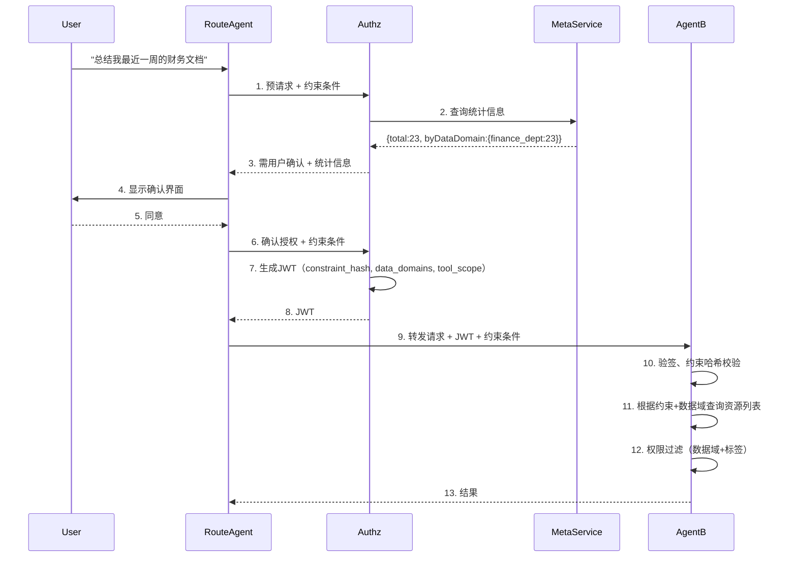

## 目录

1. [背景与目标](#1-背景与目标)
2. [核心设计理念](#2-核心设计理念)
3. [总体架构与模块划分](#3-总体架构与模块划分)
4. [模块间依赖关系](#4-模块间依赖关系)
5. [核心接口与组件（同步版·责任链模式）](#5-核心接口与组件同步版责任链模式)
6. [企业级 Agent 管理与热更新](#6-企业级-agent-管理与热更新)
7. [数据模型设计](#7-数据模型设计)
8. [jCasbin 策略引擎集成与策略同步](#8-jcasbin-策略引擎集成与策略同步)
9. [授权服务器——轻量化 Token 与 DPoP 深度集成](#9-授权服务器轻量化-token-与-dpop-深度集成)
10. [大模型原生安全防护与平台级管控](#10-大模型原生安全防护与平台级管控)
11. [对话驱动的动态授权与资源约束](#11-对话驱动的动态授权与资源约束)
12. [运行态数据域动态解析与约束注入](#12-运行态数据域动态解析与约束注入)
13. [配置与部署](#13-配置与部署)
14. [审计日志与全链路追踪设计](#14-审计日志与全链路追踪设计)
15. [安全加固矩阵](#15-安全加固矩阵)
16. [扩展点设计](#16-扩展点设计)
17. [总结](#17-总结)
---
## 1. 背景与目标

在政企、军工或大型金融机构的封闭内网中，存在一个致命误区：“系统部署在物理隔离的内网，外面黑客进不来，里面都是‘自己人’，AI Agent 之间互相调用不需要复杂的权限系统。”这一理念在 AI Agent 时代已经彻底破产。

**五大必要性**：
1. **应对 AI 原生风险**：间接提示词注入可使 Agent 执行恶意指令；大模型幻觉可能调用核心 API。权限系统是最后的物理防线。
2. **控制爆炸半径**：内网隔离防不住内部威胁。最小特权原则强制实施零信任，将安全事件的横向移动限制在最小范围。
3. **数据密级隔离与行级管控**：内网数据有严格密级划分，Agent 必须以用户权限为边界，防止数据聚合泄露。
4. **合规审计与防抵赖**：审计要求追溯完整调用链（用户→Agent→工具），权限系统记录不可篡改的决策日志。
5. **高可用性防雪崩**：权限系统通过限流和配额管理，防止失控 Agent 耗尽内网核心资源。

**企业内部协同新增挑战**：
- 通用 Agent（如 HR 问答、代码助手）需在多个部门共享同一份定义，但运行时数据必须严格隔离（“千人千面”）。
- 传统多租户（`tenant_id`）会极大增加跨部门 A2A 协同的复杂度，需要更轻量的“去租户化”架构。
- Agent 配置（Prompt、工具绑定、模型参数）需支持不停机热更新，以适应业务快速迭代。
- 需支持多种工具类型（本地 `@Tool` 注解方法、MCP Server 远端工具）的统一安全管控。

**核心目标**：
- **身份认证**：Agent间认证、用户身份透传、防冒充。
- **最小权限**：Scope细粒度、资源实例级控制、行级过滤。
- **性能优化**：虚拟线程、批量令牌Redis化、三级缓存。
- **可审计性**：全链路追溯、零丢失审计日志。
- **高可用性**：本地验签、Redis Streams可靠广播。
- **大模型安全**：Tool Calling拦截、动态限流、HITL。
- **企业级敏捷管理**：工作空间（管理边界）与数据域（运行边界）分离，Agent 定义热更新。
- **工具统一抽象**：本地工具与 MCP 工具使用相同的安全拦截、限流、审计机制。
---
## 2. 核心设计理念

- **同步编码，异步性能**：全面拥抱 JDK 21 虚拟线程，摒弃复杂的响应式编程，以极低的心智负担支撑大模型 SSE 长连接与 A2A 高并发。
- **去租户化，全局单租户**：将整个企业视为一个全局大租户，不使用 `tenant_id` 硬隔离。通过“工作空间 + 数据域”双轨模型分离管理与运行权限，避免跨部门协同的“跨域”灾难。
- **分类保底，标签微调**：构建“资源分类（刚性骨架）+ 资源标签（柔性血肉）”的双层 ABAC 模型，兼顾批量授权性能与细粒度动态拦截。
- **大模型原生安全**：权限校验从 HTTP 接口层下沉至 Spring AI 的 Tool Calling 层，防御大模型幻觉与提示词注入。
- **责任链可扩展**：权限校验采用责任链模式，每个校验器独立，支持热插拔。
- **最小耦合**：授权服务器不直接访问业务数据库，通过约束传递和元数据服务实现解耦。
- **定义共享，上下文隔离**：通用 Agent 全局只维护一份定义（Agent Card），通过运行时动态注入用户上下文实现数据隔离。
- **热更新零停机**：Agent Card 配置变更后异步重建 ChatClient 实例，无锁替换，不中断当前请求。
- **工具统一抽象**：所有工具（本地 Java 方法、MCP 远端工具）均实现相同的安全包装接口，复用权限校验、限流、审计逻辑。
- **纵深防御**：提供多层可选安全机制，不假设内网绝对安全。
- **按需启用**：通过 Spring Profile 选择 LOW/MEDIUM/HIGH 安全级别。
---
## 3. 总体架构与模块划分

**五个独立部署单元**：
1. **授权服务器**（Authorization Server）— 基于 Spring Authorization Server，负责颁发代理令牌、管理 ACL 和用户同意。
2. **Agent 运行时**（既是 OAuth2 客户端，又是资源服务器）— 基于 Spring AI Alibaba，内嵌安全过滤器与权限评估器，以 JAR 形式集成到业务微服务中。
3. **Agent 管理中心**（Agent Management Center）— 负责 Agent Card 存储、版本管理、热更新事件发布、工作空间与数据域管理。
4. **Nacos** — A2A 注册中心与 AgentCard 存储（可与管理中心共用）。
5. **Redis** — 一次性令牌、批量任务ID、Streams广播、限流计数器。

**Maven父模块**：`io.github.latcn:a2a-security:1.0.0`

```
a2a-security/
├── a2a-authorization-server/         # 授权服务器
│   └── src/main/java/io/github/latcn/a2a/security/authz/
│       ├── token/                    # Token Exchange端点 + 定制器
│       ├── acl/                      # Agent间ACL管理
│       ├── consent/                  # 用户同意管理
│       ├── audit/                    # 审计日志记录
│       └── config/                   # 安全配置
├── a2a-common-permission/            # 独立权限JAR
│   └── src/main/java/io/github/latcn/a2a/security/permission/
│       ├── api/                      # PermissionChecker, ResourceTagService等接口
│       ├── jcasbin/                  # Enforcer配置、策略管理、Watcher
│       ├── tag/                      # 资源标签服务（三级缓存）
│       ├── chain/                    # 责任链处理器（Authz侧和Agent侧）
│       └── config/                   # 自动配置
├── a2a-security-starter/             # Agent安全起步依赖（集成到业务微服务）
│   └── src/main/java/io/github/latcn/a2a/security/agent/
│       ├── client/                   # TokenExchangeService, A2aClientFilter
│       ├── server/                   # A2aJwtAuthenticationFilter, OneTimeTokenValidator
│       ├── tool/                     # 统一工具抽象、安全包装器、限流器
│       ├── chain/                    # Agent侧责任链实现
│       ├── domain/                   # 数据域解析与注入拦截器
│       ├── sandbox/                  # 沙箱执行器（可选）
│       └── config/                   # 自动配置
└── a2a-agent-management/             # Agent定义管理与热更新
    └── src/main/java/io/github/latcn/a2a/agent/mgmt/
        ├── card/                     # AgentCard存储、版本管理
        ├── workspace/                # 工作空间CRUD、成员管理
        ├── datadomain/               # 数据域定义、继承关系
        ├── hotreload/                # 热更新监听器、ChatClient重建器
        └── config/                   # 自动配置
```
---
## 4. 模块间依赖关系

**编译时依赖**（箭头方向表示“依赖者 → 被依赖者”）：

```
┌─────────────────────┐
│ a2a-agent-xxx       │  业务Agent（微服务）
└──────────┬──────────┘
           │ depends on
           ▼
┌─────────────────────┐      ┌────────────────────────┐
│ a2a-security-starter│─────▶│ a2a-common-permission  │
└──────────┬──────────┘      └────────────────────────┘
           │
           │ depends on
           ▼
┌─────────────────────────────────────────────────────────────────┐
│ 外部依赖：Spring Boot 3.5.3, Spring AI Alibaba 1.1.2.0,        │
│ jCasbin, Redis (Lettuce), MySQL, Caffeine, Logstash Encoder,   │
│ OpenTelemetry, MyBatis-Plus 3.5.5                               │
└─────────────────────────────────────────────────────────────────┘
```

**运行期服务调用关系**：
- 授权服务器：Token Exchange、ACL 预判、Consent。
- Agent 管理中心：Agent Card 存储、工作空间/数据域配置、热更新广播。
- 业务 Agent 微服务：本地验签、责任链评估、数据域注入、统一工具安全包装。
---
## 5. 核心接口与组件（同步版·责任链模式）

### 5.1 PermissionCheckHandler（权限校验器接口）

```java
public interface PermissionCheckHandler {
    CheckResult check(PermissionCheckContext context);
    enum CheckResult { ALLOW, DENY, ABSTAIN }
    default int order() { return 0; }
}
```

### 5.2 PermissionCheckContext（校验上下文）

```java
public class PermissionCheckContext {
    private final String userId;
    private final String resourceId;
    private final String operation;
    private final String resourceType;
    private final Map<String, Object> userAttributes;
    private final Map<String, List<String>> resourceTags;
    private final Jwt jwtToken;
    // constructor, getters...
}
```

### 5.3 内置处理器

| 处理器 | 顺序 | 职责 |
|--------|------|------|
| `DenyOverrideHandler` | `Integer.MIN_VALUE` | 特例拒绝优先 |
| `AllowOverrideHandler` | `-1000` | 特例允许 |
| `CategoryQuickHandler` | `100` | 分类快速通道 |
| `DataDomainHandler` | `150` | 数据域权限评估（是否允许访问该数据域） |
| `AbacJCasbinHandler` | `200` | 标签+ABAC动态评估 |

### 5.4 双重责任链实现

- **`AuthzPermissionChain`**（授权服务器侧）：仅包含 `OverrideHandler` 和 `CategoryHandler`，用于静态权限预判。方法签名：`Set<String> preAuthorize(String userId, List<String> resourceIds, String operation)`。
- **`AgentPermissionChain`**（Agent侧）：包含所有处理器，用于最终运行时决策。

```java
@Component
public class AgentPermissionChain {
    private final List<PermissionCheckHandler> handlers;
    public boolean check(PermissionCheckContext ctx) {
        for (PermissionCheckHandler h : handlers) {
            CheckResult r = h.check(ctx);
            if (r == ALLOW) return true;
            if (r == DENY) return false;
        }
        return false;
    }
}
```

### 5.5 Spring Security PermissionEvaluator 集成

```java
@Component
public class A2aPermissionEvaluator implements PermissionEvaluator {
    private final AgentPermissionChain chain;
    @Override
    public boolean hasPermission(Authentication auth, Object targetId, String targetType, Object permission) {
        // 构建上下文并调用 chain.check()
    }
}
```
---
## 6. 企业级 Agent 管理与热更新

### 6.1 工作空间（Workspace）与角色细化

工作空间用于组织 Agent、工具和 API 资源的归属，实施基于角色的访问控制（RBAC）。

**核心实体**：
- `sys_workspace`（`workspace_id`, `name`, `owner_dept_id`）
- `sys_workspace_member`（`workspace_id`, `principal_id`, `role`）

**角色定义**：

| 角色 | 职责范围 | 管理 Agent 定义 | 配置 ACL | 典型身份 |
|------|----------|----------------|----------|-----------|
| **平台运维**（全局） | 全局配置、监控、跨空间审计 | ✅ 所有 | ✅ 所有 | SRE、架构师 |
| **工作空间管理员** | 空间内成员管理、策略审批 | ✅ | ✅ | 部门主管 |
| **研发工程师（开发者）** | 创建/修改 Agent 定义、绑定工具 | ✅ | ❌ | 研发、AI开发者 |
| **业务安全管理员（ACL_ADMIN）** | 配置 Agent 间调用权限 | ❌ | ✅ | 业务负责人 |
| **查看者** | 只读查看 | ❌ | ❌ | 审计员、产品 |

### 6.2 数据域（Data Domain）设计

数据域用于控制 Agent 运行时的数据访问权限，支持树状继承。

**核心实体**：
- `sys_data_domain`（`domain_id`, `name`, `parent_domain_id`, `tags`, `filter_expression_template`）
- `sys_domain_resource_mapping`（`domain_id`, `resource_type`, `resource_identifier`）

**继承规则**：
- 子数据域自动继承父数据域的所有资源映射。
- 支持标签继承：`tags` 字段可用于动态组合（如 `security_level <= 'L2'`）。

### 6.3 Agent Card 配置模型

Agent 的所有可配置项序列化为一个标准的 JSON/YAML 文件，作为 Agent 实例化的唯一真相源。

```yaml
agent:
  id: "hr-assistant"
  workspace_id: "ws_hr"
  model:
    provider: "qwen"
    name: "qwen-max"
    temperature: 0.7
    fallback: "qwen-plus"
  prompt:
    system: "你是HR助手，当前用户部门：{{user.department}}"
    few_shot: [...]
  advisors:
    - type: "MessageChatMemoryAdvisor"
      order: 1
      config: { history_size: 10 }
    - type: "InputGuardrailAdvisor"
      order: 2
    - type: "OutputGuardrailAdvisor"
      order: 3
    - type: "QuestionAnswerAdvisor"
      order: 4
      config: { vector_store: "hr_vector_store", top_k: 5 }
  tools:
    - name: "query_salary"
      type: "local"
      class: "com.example.HrTools"
      method: "querySalary"
      require_human_confirm: false
    - name: "search_employee"
      type: "mcp"
      endpoint: "http://mcp-server:8080"
      credential_ref: "mcp_employee_key"
      require_human_confirm: true
  data_domains:
    - "hr_common"
    - "dept_{{user.department}}"
  delegation:
    sub_agents: ["payroll-agent", "leave-agent"]
```

### 6.4 Agent 实例热更新机制

**实现方式**：
- 配置中心（Nacos）或 Redis Pub/Sub 监听 Agent Card 变更事件。
- 异步虚拟线程重建 `ChatClient` 实例，无锁替换 `ConcurrentHashMap` 中的引用。
- 保留最近 3 个版本，支持回滚。

```java
@Component
public class AgentHotReloadManager {
    private final Map<String, ChatClient> agentCache = new ConcurrentHashMap<>();

    @EventListener
    public void onAgentCardChange(AgentCardChangedEvent event) {
        Thread.startVirtualThread(() -> {
            ChatClient newClient = buildChatClient(event.getNewCard());
            agentCache.put(event.getAgentId(), newClient);
        });
    }

    public ChatClient getAgent(String agentId) {
        return agentCache.get(agentId);
    }
}
```
---
## 7. 数据模型设计

### 7.1 核心表概览

| 表名 | 作用 |
|------|------|
| `resource_category` | 资源分类（含`path`物化路径） |
| `resource` | 资源实例，关联分类 |
| `user_category_permission` | 用户对分类的批量授权 |
| `user_resource_permission` | 用户对资源实例的特例授权（`revoked_at` BIGINT） |
| `resource_tag_definition` | 标签定义（支持分组） |
| `resource_tag_mapping` | 资源-标签关联 |
| `casbin_rule` | jCasbin 策略表 |
| `a2a_acl` | Agent间调用 ACL |
| `user_consent` | 用户委派授权 |
| `oauth2_client_settings` | 客户端安全配置 |
| `credential_vault` | 凭据保险箱 |
| `sys_workspace` | 工作空间 |
| `sys_workspace_member` | 工作空间成员 |
| `sys_data_domain` | 数据域定义（支持父域继承） |
| `sys_domain_resource_mapping` | 数据域到资源的映射 |
| `agent_card` | Agent Card 配置存储（JSON） |

### 7.2 关键 DDL 示例

```sql
-- 工作空间
CREATE TABLE sys_workspace (
    workspace_id VARCHAR(64) PRIMARY KEY,
    name VARCHAR(128) NOT NULL,
    owner_dept_id VARCHAR(64),
    created_at TIMESTAMP(6) NOT NULL DEFAULT CURRENT_TIMESTAMP(6)
);

-- 工作空间成员（角色细化）
CREATE TABLE sys_workspace_member (
    id BIGINT AUTO_INCREMENT PRIMARY KEY,
    workspace_id VARCHAR(64) NOT NULL,
    principal_id VARCHAR(64) NOT NULL,
    role ENUM('PLATFORM_ADMIN','WS_ADMIN','DEVELOPER','ACL_ADMIN','VIEWER') NOT NULL,
    created_at TIMESTAMP(6) DEFAULT CURRENT_TIMESTAMP(6),
    UNIQUE KEY uk_ws_principal (workspace_id, principal_id)
);

-- 数据域（树状结构）
CREATE TABLE sys_data_domain (
    domain_id VARCHAR(64) PRIMARY KEY,
    name VARCHAR(128) NOT NULL,
    parent_domain_id VARCHAR(64),
    tags JSON,
    filter_expression_template TEXT,
    created_at TIMESTAMP(6) DEFAULT CURRENT_TIMESTAMP(6),
    INDEX idx_parent (parent_domain_id)
);

-- 数据域资源映射
CREATE TABLE sys_domain_resource_mapping (
    id BIGINT AUTO_INCREMENT PRIMARY KEY,
    domain_id VARCHAR(64) NOT NULL,
    resource_type VARCHAR(64) NOT NULL,
    resource_identifier VARCHAR(256) NOT NULL,
    created_at TIMESTAMP(6) DEFAULT CURRENT_TIMESTAMP(6),
    INDEX idx_domain (domain_id)
);

-- Agent Card 存储
CREATE TABLE agent_card (
    agent_id VARCHAR(64) PRIMARY KEY,
    version INT NOT NULL DEFAULT 1,
    workspace_id VARCHAR(64) NOT NULL,
    card_content JSON NOT NULL,
    status ENUM('ACTIVE','DRAFT','ARCHIVED') NOT NULL,
    created_at TIMESTAMP(6) DEFAULT CURRENT_TIMESTAMP(6),
    updated_at TIMESTAMP(6) DEFAULT CURRENT_TIMESTAMP(6) ON UPDATE CURRENT_TIMESTAMP(6),
    INDEX idx_workspace (workspace_id)
);

-- 凭据保险箱
CREATE TABLE credential_vault (
    id BIGINT AUTO_INCREMENT PRIMARY KEY,
    credential_ref VARCHAR(64) UNIQUE NOT NULL,
    client_id VARCHAR(64) NOT NULL,
    external_system VARCHAR(64) NOT NULL,
    credential_type VARCHAR(16) NOT NULL,
    encrypted_secret TEXT NOT NULL,
    scope VARCHAR(256),
    expires_at TIMESTAMP(6),
    created_at TIMESTAMP(6) DEFAULT CURRENT_TIMESTAMP(6)
);
```

### 7.3 MyBatis-Plus 实体集成

实体类示例：

```java
@Data
@TableName("resource")
public class ResourceEntity {
    @TableId(type = IdType.AUTO)
    private Long id;
    private String resourceId;
    private String resourceType;
    private Long categoryId;
    private String domainId;
}
```

### 7.4 数据一致性原则

- 不使用外键约束，应用层维护一致性。
- 删除资源时同步删除关联的标签映射和特例授权。
- 删除工作空间时级联删除其成员和 Agent Card（软删除）。
- 删除数据域时需先将子数据域的 `parent_domain_id` 置为 NULL 或拒绝删除。
- 权限决策优先级：DENY特例 > ALLOW特例 > 分类授权 > 数据域授权 > ABAC标签 > 默认拒绝。
---
## 8. jCasbin 策略引擎集成与策略同步

### 8.1 模型配置 `model.conf`

```ini
[request_definition]
r = sub, obj, act, ws

[policy_definition]
p = sub_rule, obj, act, ws, eft

[role_definition]
g = _, _, _

[policy_effect]
e = some(where (p.eft == allow))

[matchers]
m = (g(r.sub, p.sub, r.ws) || eval(p.sub_rule)) && 
    keyMatch2(r.obj, p.obj) && 
    regexMatch(r.act, p.act) && 
    r.ws == p.ws
```

### 8.2 Spring Boot 配置

```yaml
casbin:
  enableCasbin: true
  useSyncedEnforcer: true
  storeType: jdbc
  tableName: casbin_rule
  model: classpath:casbin/model.conf
```

### 8.3 Enforcer 配置与策略同步

- 使用 `SyncedEnforcer` 保证并发安全。
- 策略变更时通过 **Redis Streams** 广播 `policy:stream` 消息，所有 Agent 实例消费后调用 `enforcer.loadPolicy()`。

```java
// 策略变更发布
redisTemplate.opsForStream().add("policy:stream", Map.of("policyId", id, "timestamp", now));

// Agent端消费者
@StreamListener(target = "policy:stream", group = "a2a-policy")
public void onPolicyChange(MapRecord<String, String, String> msg) {
    enforcer.loadPolicy();
}
```
---
## 9. 授权服务器——轻量化 Token 与 DPoP 深度集成

### 9.1 轻量化 JWT 结构

JWT 仅包含最小必要信息：

```json
{
  "iss": "https://authz.internal",
  "sub": "agent-123",
  "jti": "a1b2c3d4-e5f6-7890-abcd-ef1234567890",
  "exp": 1749600000,
  "iat": 1749596400,
  "token_key": "a1b2c3d4-e5f6-7890-abcd-ef1234567890",
  "cnf": {
    "jkt": "QlM1Rk5hRzZ..."   // DPoP 客户端公钥的 JWK Thumbprint（仅 HIGH 级别）
  }
}
```

- 使用 **Ed25519** 或 HMAC 签名，算法由客户端注册配置决定。
- `token_key` 与 `jti` 相同（简化设计），用于关联 Redis 扩展数据。

### 9.2 Redis 存储与数据签名

Redis Key: `a2a:token:{token_key}`，存储 JSON：

```json
{
  "scope": "doc:read doc:write",
  "tool_scope": ["query_salary", "search_employee"],
  "act": { "sub": "user-456", "department": "finance", "clearance": "L3" },
  "delegation_chain": ["agentA", "agentB"],
  "delegation_remaining": 3,
  "data_domains": ["finance_dept", "hr_common"],
  "bulk_mode": false,
  "batch_task_id": null,
  "constraint_hash": "sha256...",
  "credential_ref": "mcp_key_01",
  "body_hash": "sha256...",
  "resource_instance": null,
  "single_use": false,
  "data_signature": "base64-ed25519-signature"
}
```

**签名生成**（授权服务器）：

```java
String canonical = canonicalJson(dataWithoutSignature);
byte[] sig = privateKey.sign(canonical.getBytes(StandardCharsets.UTF_8));
data.put("data_signature", Base64.getUrlEncoder().encodeToString(sig));
redis.setex("a2a:token:" + tokenKey, ttl, json);
```

**验签**（Agent）：

```java
String json = redis.get("a2a:token:" + tokenKey);
JsonNode root = mapper.readTree(json);
String sig = root.get("data_signature").asText();
ObjectNode dataOnly = root.deepCopy();
dataOnly.remove("data_signature");
String canonical = mapper.writeValueAsString(dataOnly);
boolean valid = verifier.verify(canonical.getBytes(), Base64.getUrlDecoder().decode(sig));
if (!valid) throw new SecurityException("Redis data tampered");
```

### 9.3 DPoP 绑定与客户端公钥指纹（仅 HIGH）

- Agent 生成 Ed25519 密钥对，在 Token 请求时提供 DPoP Proof（含 `jwk` 公钥）。
- 授权服务器验签 Proof，计算公钥指纹 `jkt`，存入 JWT 的 `cnf.jkt`。
- 业务请求时，Agent 再次提供 DPoP Proof（含 `htm`, `htu`, `ath`, `jti`, 可选 `nonce`）。
- 资源服务器验证：
  - 验签 Proof；
  - 提取公钥，计算指纹与 `cnf.jkt` 比对；
  - 比对 `ath` 与当前 access token 的哈希；
  - 检查 `jti` 是否已使用（Redis）；
  - 验证 `nonce`（若要求）。

**`nonce` 重试流程**：
1. 资源服务器返回 `401` + `DPoP-Nonce: N1`。
2. Agent 使用相同的 access token，生成全新的 DPoP Proof（新 `jti`、新 `iat`，携带 `nonce: "N1"`）。
3. 资源服务器验证 `nonce` 未使用，标记已用（Redis TTL=60s）。

### 9.4 客户端认证防伪造

- **MEDIUM 级别**：`private_key_jwt` 或 mTLS 择一。
- **HIGH 级别**：同时启用 mTLS 和 `private_key_jwt`，且授权服务器必须比对 mTLS 证书中的公钥与 `client_assertion` 签名公钥是否一致。

```java
// 公钥比对实现
byte[] certKeyEncoded = clientCert.getPublicKey().getEncoded();
byte[] jwtKeyEncoded = jwtPublicKey.getEncoded();
if (!Arrays.equals(certKeyEncoded, jwtKeyEncoded)) {
    throw new InvalidClientException("Public key mismatch");
}
```

### 9.5 防重放与防篡改综合设计

| 攻击类型 | 防护措施 | 实现 |
|----------|----------|------|
| Token伪造 | JWT签名验证 | 授权服务器签发，Agent验签 |
| Token重放 | 一次性令牌 / DPoP `ath` + `nonce` | Redis记录已用 `jti` 和 `nonce` |
| 请求体篡改 | 请求体哈希存于 Redis，签名保护 | `body_hash` 字段 + 数据签名 |
| Redis数据篡改 | 数据签名（`data_signature`） | Ed25519 或 HMAC |
| 约束条件篡改 | 约束哈希 + 签名 | `constraint_hash` 字段 |
| 伪造客户端 | mTLS + private_key_jwt 双重 | 授权服务器验证证书和签名 |

---
## 10. 大模型原生安全防护与平台级管控

### 10.1 MCP Tool 与本地 Tool 统一抽象层

#### 10.1.1 统一接口

```java
public interface SecuredTool {
    String getName();
    ToolDefinition getDefinition();
    Object execute(Map<String, Object> input);
    boolean requiresHumanConfirm();
    List<String> getRequiredToolScope();
}
```

#### 10.1.2 本地工具适配器

```java
@Component
public class LocalToolAdapter implements SecuredTool {
    private final MethodInvoker invoker;
    private final ToolDefinition definition;
    private final boolean requireConfirm;
    
    @Override
    public Object execute(Map<String, Object> input) {
        Jwt token = JwtHolder.get();
        return invoker.invoke(input);
    }
}
```

#### 10.1.3 MCP 工具适配器

```java
@Component
public class McpToolAdapter implements SecuredTool {
    private final McpClient client;
    private final String toolName;
    private final String credentialRef;
    
    @Override
    public Object execute(Map<String, Object> input) {
        Jwt token = JwtHolder.get();
        String credential = credentialVault.resolve(credentialRef, token);
        return client.callTool(toolName, input, token, credential);
    }
}
```

#### 10.1.4 统一安全包装器

```java
@Component
public class UnifiedToolSecurityWrapper {
    private final AgentPermissionChain permissionChain;
    private final RateLimiter rateLimiter;
    private final AuditLogger auditLogger;
    private final ToolResourceExtractor resourceExtractor;

    public Object invoke(SecuredTool tool, Map<String, Object> input) {
        Jwt token = JwtHolder.get();
        // 1. 从 Redis 获取扩展数据（含 tool_scope）
        String tokenKey = token.getClaim("token_key").asString();
        String redisJson = redis.get("a2a:token:" + tokenKey);
        // 验签后解析出 toolScope, dataDomains 等
        JsonNode tokenData = verifyAndParseRedisData(redisJson);
        
        // 2. 工具级 scope 校验
        List<String> allowedTools = tokenData.get("tool_scope").asList(String.class);
        if (allowedTools != null && !allowedTools.contains(tool.getName())) {
            throw new AccessDeniedException("Tool not allowed: " + tool.getName());
        }
        
        // 3. 限流
        if (!rateLimiter.tryAcquire(token.getSubject(), tool.getName())) {
            throw new RateLimitException();
        }
        
        // 4. 资源权限校验
        List<ResourceRef> resources = resourceExtractor.extract(tool, input);
        for (ResourceRef ref : resources) {
            PermissionCheckContext ctx = buildContext(token, ref);
            if (!permissionChain.check(ctx)) {
                throw new AccessDeniedException("No permission for resource: " + ref.getResourceId());
            }
        }
        
        // 5. HITL 确认
        if (tool.requiresHumanConfirm()) confirmWithUser(tool, input);
        
        // 6. 执行并审计
        long start = System.nanoTime();
        try {
            Object result = tool.execute(input);
            auditLogger.log("ALLOW", tool.getName(), System.nanoTime() - start);
            return result;
        } catch (Exception e) {
            auditLogger.log("DENY", tool.getName(), e.getMessage());
            throw e;
        }
    }
}
```

#### 10.1.5 工具注册与发现（ToolRegistry）

```java
@Component
public class ToolRegistry {
    private final Map<String, SecuredTool> tools = new ConcurrentHashMap<>();
    public void register(SecuredTool tool) { tools.put(tool.getName(), tool); }
    public SecuredTool get(String name) { return tools.get(name); }
}
```

**与 Spring AI ToolCallback 集成**：

```java
@Component
public class SecuredToolCallback implements ToolCallback {
    private final SecuredTool tool;
    private final UnifiedToolSecurityWrapper wrapper;
    
    @Override
    public String call(String toolInput) {
        Map<String, Object> input = parseInput(toolInput);
        Object result = wrapper.invoke(tool, input);
        return serialize(result);
    }
}
```

### 10.2 工具级 Scope 限制

- 在 JWT 的扩展数据中包含 `tool_scope` 列表，由授权服务器根据用户同意和客户端注册生成。
- `UnifiedToolSecurityWrapper` 在执行前校验工具名称是否在 `tool_scope` 中。

### 10.3 Human-in-the-Loop 确认机制

- 使用 `@RequireHumanConfirm` 注解标记高风险工具。
- 执行前通过 WebSocket 推送确认请求，阻塞等待用户响应（虚拟线程不消耗 OS 线程）。
- 支持超时和取消。

### 10.4 凭据保险箱设计

- 表 `credential_vault` 存储加密后的 API Key / OAuth Token。
- Agent 持有 `credential_ref`，平台在调用外部系统时动态解析并注入。

### 10.5 防篡改与防重放综合设计

（已在 9.5 节详细说明）

### 10.6 限流熔断与策略同步

- 基于 Redis 滑动窗口，按 Agent ID、User ID、Tool Name 三维度独立限流。
- 策略变更通过 Redis Streams 广播。

### 10.7 Spring AI Alibaba Advisor 链集成

自定义 `SecurityAdvisor`，在请求前注入数据域过滤条件：

```java
@Component
public class SecurityAdvisor implements CallAroundAdvisor {
    @Override
    public AdvisedRequest aroundCall(AdvisedRequest request, Metadata metadata) {
        String dataDomainFilter = DataDomainContextHolder.getCurrentFilter();
        request.adviseContext().put("data_domain_filter", dataDomainFilter);
        return request;
    }
}
```

**Advisor 执行顺序**：
1. `MessageChatMemoryAdvisor`
2. `InputGuardrailAdvisor`
3. **`SecurityAdvisor`（权限与数据域注入）**
4. `QuestionAnswerAdvisor`
5. `OutputGuardrailAdvisor`

---
## 11. 对话驱动的动态授权与资源约束

### 11.1 约束传递模式

**核心思想**：调用方只传递约束条件（不传递具体资源ID），授权服务器验证约束合法性并签发JWT，目标Agent根据约束查询资源并执行权限过滤。

**优势**：
- 资源ID不暴露给中间组件，减少泄露风险。
- 授权服务器无需耦合业务数据库。
- 减少一次额外的A2A调用。

### 11.2 用户确认与统计摘要

- 用户确认前只展示统计摘要（如涉及文档数量、分类分布、密级分布），不展示具体资源内容。
- 授权服务器调用元数据服务获取统计信息。

### 11.3 元数据服务设计

**接口定义**：

```
POST /api/metadata/statistics
Request:
{
  "constraint": {
    "categories": ["financial"],
    "timeRange": "last_week",
    "dataDomains": ["finance_dept"]
  }
}
Response:
{
  "total": 23,
  "byCategory": {"financial": 23},
  "byDataDomain": {"finance_dept": 23}
}
```

**部署方式**：
- 每个业务Agent可单独实现元数据服务端点。
- 或企业级统一使用Elasticsearch索引服务。
- 授权服务器通过Nacos服务发现调用目标Agent的元数据接口。

**安全约束**：
- 元数据服务必须验证调用方身份（mTLS或固定IP白名单）。
- 不返回资源ID或内容。

### 11.4 完整授权流程



---
## 12. 运行态数据域动态解析与约束注入

### 12.1 生效域（Effective Domains）计算

```java
Set<String> effectiveDomains = new HashSet<>();
effectiveDomains.addAll(agent.getBoundDomains());          // Agent 静态绑定域
effectiveDomains.addAll(inheritParentDomains(agent.getBoundDomains())); // 父域继承
effectiveDomains.addAll(jwtTokenData.getDataDomains());    // JWT 扩展数据中的数据域
effectiveDomains.addAll(userContext.getDomains());          // 当前用户上下文域
```

### 12.2 MyBatis-Plus 拦截器实现

```java
@Component
@Intercepts({@Signature(type = Executor.class, method = "query", args = {MappedStatement.class, Object.class, RowBounds.class, ResultHandler.class})})
public class DataDomainSqlInterceptor implements Interceptor {
    
    @Override
    public Object intercept(Invocation invocation) throws Throwable {
        MappedStatement ms = (MappedStatement) invocation.getArgs()[0];
        Object parameter = invocation.getArgs()[1];
        BoundSql boundSql = ms.getBoundSql(parameter);
        
        Set<String> domains = DataDomainContextHolder.getEffectiveDomains();
        if (domains == null || domains.isEmpty()) {
            return Collections.emptyList(); // 兜底拒绝
        }
        
        // 过滤空值
        List<String> domainList = domains.stream()
                .filter(StringUtils::hasText)
                .collect(Collectors.toList());
        if (domainList.isEmpty()) {
            return Collections.emptyList();
        }
        
        // 使用 MyBatis-Plus 的 QueryWrapper 方式（需在业务层使用）
        // 或者使用动态 SQL 注入（需谨慎防注入）。这里展示推荐用法：
        if (parameter instanceof QueryWrapper) {
            QueryWrapper<?> wrapper = (QueryWrapper<?>) parameter;
            wrapper.in("domain_id", domainList);
        }
        // 注意：实际拦截器需要更复杂的 SQL 解析，此处仅为示意
        
        return invocation.proceed();
    }
}
```

**更安全的方式**：要求所有数据库查询通过统一的 Service 层，使用 `QueryWrapper` 并手动调用 `wrapper.in()`，而不是在拦截器中解析 SQL。推荐后者。

### 12.3 兜底拒绝与缓存优化

- **兜底拒绝**：若 `effectiveDomains` 为空，直接返回空集合，禁止全表扫描。
- **本地缓存**：计算继承关系的 `effectiveDomains` 结果缓存于 Caffeine（TTL 5分钟），通过监听 `sys_data_domain` 表的变更事件主动失效。

---
## 13. 配置与部署

### 13.1 通用配置（所有服务）

```yaml
spring:
  threads:
    virtual:
      enabled: true           # 启用 JDK 21 虚拟线程
  datasource:
    url: jdbc:mysql://...
    username: ${DB_USER}
    password: ${DB_PASS}
  redis:
    host: redis.internal
    port: 6379
    timeout: 2s
    lettuce:
      pool:
        max-active: 10

mybatis-plus:
  global-config:
    db-config:
      id-type: auto
  configuration:
    log-impl: org.apache.ibatis.logging.slf4j.Slf4jImpl

management:
  tracing:
    enabled: true
    propagation: b3
    sampling:
      probability: 1.0
```

### 13.2 安全级别配置（Profile）

**`application-low.yml`**：

```yaml
a2a:
  security:
    level: LOW
  client-auth:
    client-secret: ${CLIENT_SECRET}
  token:
    lightweight: false
```

**`application-medium.yml`**：

```yaml
a2a:
  security:
    level: MEDIUM
  client-auth:
    private-key-jwt:
      enabled: true
      key-id: agent-key
  token:
    lightweight:
      enabled: true
      signature-algorithm: "HMAC-SHA256"
      hmac-key: ${A2A_TOKEN_HMAC_KEY}
  data-domain:
    enabled: true
```

**`application-high.yml`**：

```yaml
a2a:
  security:
    level: HIGH
  client-auth:
    mtls:
      enabled: true
      ca-cert: classpath:ca.crt
    private-key-jwt:
      enabled: true
  token:
    lightweight:
      enabled: true
      signature-algorithm: "Ed25519"
  dpop:
    enabled: true
    require-nonce: true
    nonce-ttl: 60
  data-domain:
    enabled: true
  cache:
    public-key-ttl: 600
    signature-result-ttl: 300
    jti-blacklist-ttl: 3600
```

### 13.3 启动命令

```bash
# 授权服务器
java -jar authz-server.jar --spring.profiles.active=high

# Agent
java -jar agent.jar --spring.profiles.active=high
```

---
## 14. 审计日志与全链路追踪设计

### 14.1 审计日志输出

- 使用 Logback `AsyncAppender` 确保不丢失日志。
- 输出为 JSON Lines 文件，由 ELK/Loki 采集。
- 日志轮转：每天轮转，保留30天。

### 14.2 日志格式

**STARTUP 日志**（服务启动时记录一次）：

```json
{
  "event_type": "STARTUP",
  "timestamp": "2026-06-10T10:00:00Z",
  "security_level": "high",
  "client_auth_method": "mtls+private_key_jwt",
  "token_signature_algorithm": "Ed25519",
  "components": {
    "mtls_enabled": true,
    "private_key_jwt_enabled": true,
    "token_lightweight_enabled": true,
    "data_signature_algorithm": "Ed25519",
    "dpop_enabled": true,
    "data_domain_enabled": true
  }
}
```

**请求审计日志**（每次权限决策）：

```json
{
  "@timestamp": "2026-06-10T10:00:01.123Z",
  "service_type": "AGENT",
  "trace_id": "abc-123-def",
  "span_id": "span-456",
  "security_level": "high",
  "jti": "jwt-id-xxx",
  "dpop_jti": "proof-id",
  "dpop_nonce": "nonce-xyz",
  "decision": "ALLOW",
  "bulk_mode": false,
  "caller_agent_id": "agent-a",
  "target_agent_id": "agent-b",
  "user_id": "user-123",
  "scope": "doc:read",
  "deny_reason": null,
  "http_status": 200,
  "details": {
    "resource_id": "doc-001",
    "eval_duration_ms": 12,
    "rule_hit": "data_domain",
    "effective_domains": ["finance_dept", "public"],
    "tool_name": "query_salary",
    "tool_type": "local"
  }
}
```

### 14.3 全链路追踪

- 使用 OpenTelemetry 自动注入 `trace_id` 和 `span_id`。
- 在权限决策点、Tool Calling、RAG 检索时添加自定义 Span，记录 `effective_domains`、`decision`、`rule_hit` 等属性。
- 通过 Trace ID 可回溯完整调用链，定位权限问题。

---

## 15. 安全加固矩阵

| 安全机制 | LOW | MEDIUM | HIGH |
|----------|-----|--------|------|
| 客户端认证 | `client_secret_basic` | `private_key_jwt` 或 mTLS | mTLS + private_key_jwt（公钥比对） |
| Token 格式 | 全量 JWT | 轻量 JWT + Redis（HMAC 签名） | 轻量 JWT + Redis（Ed25519 签名） |
| 主动撤销 | 不支持 | 删除 Redis key | 删除 Redis key |
| 防重放（Token级） | 仅 exp | JWT `jti` 记录（资源服务器 Redis，TTL=剩余有效期） | DPoP（`jti` + `nonce`） |
| 防请求篡改 | 无 | 无（依赖 TLS） | DPoP（`htm`/`htu`/`ath`） |
| 工具级权限 | 仅 scope | `tool_scope` + 责任链 | 完整 ABAC（含资源标签、数据域） |
| 数据域注入 | 无 | 启用 | 启用 |
| 审计日志 | 基础 | 详细 | 完整（含签名验证结果） |
| JWT 签名算法 | RS256/HS256 | Ed25519 或 HMAC | Ed25519 |
| Redis 数据签名 | 无 | HMAC-SHA256 | Ed25519 |
| HMAC 密钥轮换 | N/A | 支持双密钥缓冲期 | N/A |
| 会话沙箱 | 无 | 可选 | 推荐（容器隔离） |

---

## 16. 扩展点设计

- **自定义 `PermissionCheckHandler`**：实现接口并注册为Bean，自动加入责任链。
- **自定义 `ToolResourceExtractor`**：支持复杂工具参数中提取资源ID。
- **自定义限流策略**：实现 `RateLimitStrategy`。
- **自定义凭据解析器**：实现 `CredentialResolver`。
- **自定义元数据服务适配器**：实现 `MetadataServiceProvider`。
- **自定义数据域解析器**：实现 `DataDomainResolver`。
- **自定义 Advisor 顺序**：通过 `@Order` 调整安全 Advisor 在链中的位置。
- **自定义安全级别**：通过实现 `SecurityLevelConfigurer` 添加新级别。
- **自定义签名算法**：实现 `DataSigner` 接口。
- **自定义 DPoP 验证器**：扩展标准 DPoP 逻辑。

---

## 17. 总结
本设计文档提供了一套完整、可配置、高性能的企业级 AI Agent 协同平台权限系统架构。核心特点：
- **可配置安全级别**：LOW/MEDIUM/HIGH，适应不同场景。
- **轻量化 Token + Redis**：减少网络传输，支持主动撤销。
- **DPoP 防重放**：仅 HIGH 级别启用，绑定客户端公钥。
- **统一工具抽象**：本地和 MCP 工具使用相同安全包装。
- **数据域动态注入**：运行时自动过滤数据，防止越权。
- **责任链权限评估**：灵活扩展。
- **全链路审计**：可追溯每个决策。
