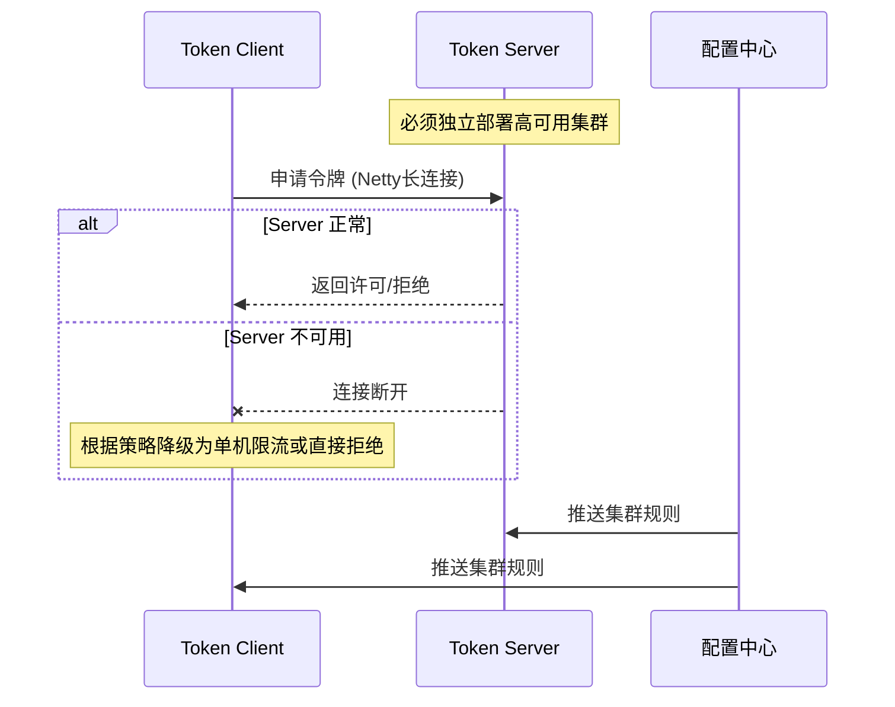
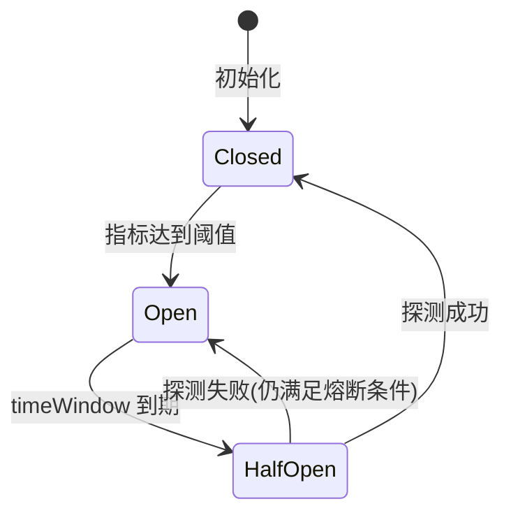
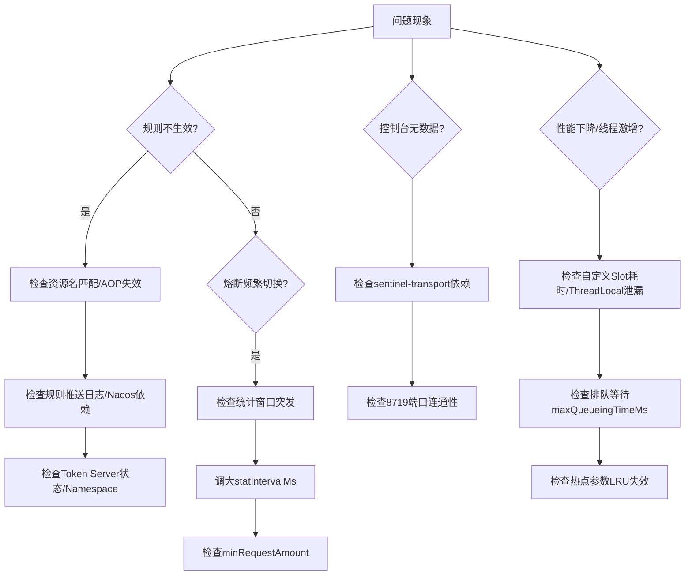

> **版本基线**：本文档基于 **Sentinel 1.8.x** 编写。若使用其他大版本，请核对 Slot Chain 顺序及 WarmUp 公式是否变更。  
> **阅读指引**：这不是一本 API 手册，而是一份思维训练。我们将用第一性原理追问每个设计从何而来，用费曼学习法把复杂逻辑嚼碎成直觉。每学完一个核心点，请用文中的“一句话总结”讲给自己听，并用“自问自答”检验是否真的懂了。

## 1. 第一性原理：分布式系统稳定性的根基

我们从一个简单的事实出发：**软件运行在有限的硬件上，而请求的到达却不可预测。** 这就是一切问题的原点。

### 1.1 从“服务雪崩”到流量控制

设想一个服务 A 依赖服务 B。B 因为某些原因变慢了，导致 A 的线程池全被等待 B 的响应占满。A 因此无法处理新请求，而调用 A 的上游 C 也开始堆积线程……就像多米诺骨牌一样，整个链路因为一个点的延迟而全线崩溃。这就是**服务雪崩**。

- **第一性原理追问**：雪崩的根本原因是什么？
    - 是 **“过载传播”**：一个组件过载后，非但没有拒绝多余的请求，反而让这些请求继续消耗稀缺资源（线程、连接、内存），从而拖垮调用方。
- **结论**：必须有一种机制，在过载发生时就阻断请求，保护自己和上游。这就是**流量控制（限流）** 的最根本动机。不是“为了限流而限流”，而是为了避免系统进入它无法承受的状态。

### 1.2 从“资源耗尽”到熔断降级

上面的场景中，B 变慢了但还没死。如果 B 已经彻底不可用（例如持续抛出异常），A 的每次调用都会立即失败。此时继续重试或调用，除了白白消耗 A 自身的资源（网络、CPU），没有任何意义。

- **第一性原理追问**：当依赖已经确认不可用时，最理性的做法是什么？
    - 是 **“快速失败”**，暂时不去调用它，把资源留给还能正常工作的逻辑。这就是**熔断（断路器）**。它不是“惩罚”依赖，而是“止损”。

### 1.3 直觉模型：水龙头—蓄水池—保险丝

- **流量控制**像给水龙头加一个限流器：不管你多大水流涌来，我这里每秒只通过固定水量。
- **排队等待**像在龙头下放一个蓄水池，让瞬时洪峰在池子里排队，以恒定速率流出。
- **熔断降级**像电路里的保险丝：一旦电流过大（错误太多），立即熔断切断电路，保护电器；过一段时间尝试恢复（半开），若仍有故障则再次熔断。

> 💡 **一句话总结**：一切的防护措施，本质上都是在“资源有限、请求无限”的前提下，做出的快速拒绝或优雅等待的决策。

**自问自答：**

- **问**：“如果没有流量控制，高并发下会出现什么问题？”
- **答**：线程池饱和、响应变慢、超时重试加剧负载，最终整个服务不可用，并可能传播到上游。

## 2. 架构设计全景

Sentinel 不是单一的服务，而是由 **客户端（核心库）** 和 **控制台（Dashboard）** 组成的双核心体系。

### 2.1 客户端与控制台的职责边界

- **客户端 (sentinel-core)**：嵌入应用进程，负责所有流控、熔断、降级逻辑的实际执行。它直接拦截调用，采集指标，判断规则，极其轻量，不依赖外部服务也能独立工作。
- **控制台 (sentinel-dashboard)**：一个独立的 Spring Boot 应用，提供规则管理、监控查看、动态下发的能力。它不与客户端做“实时”强制交互，而是充当管理入口。

> **第一性原理推导**：为什么不做成一个中心化的实时决策服务？  
> 因为如果每个请求都要调用远程服务决策，该服务本身就是单点和性能瓶颈，违背了高可用的初衷。Sentinel 选择把决策逻辑放在本地，控制台只负责规则的管理和推送，这就是 **“规则推送，本地执行”** 的架构哲学。

### 2.2 规则下发与持久化模式

规则要想动态生效，就必须解决“控制台如何把规则交给客户端”的问题。Sentinel 支持三种模式：

|模式|原理|一致性/实时性|适用场景|生产就绪度|
|:--|:--|:--|:--|:--|
|原始模式|规则保存在客户端内存，控制台通过 API 直接推送到客户端。控制台重启或客户端重启都会丢失规则。|实时高，但无持久化|本地开发测试|❌ 禁止生产使用|
|Pull 模式|客户端定时从配置中心拉取规则（如本地文件、Consul）。|有延迟，依赖拉取间隔|简单生产，可接受秒级延迟|⚠️ 仅用于无配置中心环境|
|Push 模式|控制台将规则写入配置中心（Nacos、ZooKeeper、Apollo），配置中心通知所有客户端更新。|近实时，持久化，强一致保障|生产推荐|✅ 规则持久化，客户端动态监听|

> ⚠️ **注意**：原始模式下，客户端重启后规则丢失是生产环境最常见的“规则不生效”根因。务必在生产环境启用 Push 模式并验证规则持久化。

### 2.3 扩展点与 SPI 机制：责任链（Slot Chain）

Sentinel 的强大灵活性来自于它的责任链模式。所有对资源的访问都经过一个 ProcessorSlot 链，每个 Slot 负责一项职能，通过 SPI 可自定义编排。


> 🛑 **关键修正：Slot 排序机制**
> 
> - **原文误述**：Slot 执行顺序由代码中 `addSlot()` 调用位置决定。
> - **实际机制**：严格由 **SPI 配置文件声明顺序决定**。顺序定义于 `META-INF/services/com.alibaba.csp.sentinel.slotchain.ProcessorSlot` 文件中。
> - **默认顺序**：FlowSlot → DegradeSlot → SystemSlot → AuthoritySlot → StatisticSlot。（注：上图展示的是逻辑处理流，实际加载顺序以SPI文件为准，升级大版本时务必重新核对）。
> - **自定义 Slot**：必须通过 SPI 文件注册，不可依赖代码插入位置；修改顺序需重新打包并验证全链路行为。

> ⚠️ **Slot 上下文存储风险警示**
> 
> - **禁止行为**：严禁在 Slot 中使用 `ThreadLocal` 存储跨请求状态。Slot 实例为单例，ThreadLocal 变量不会随请求结束自动清理。在线程池复用场景下，将导致内存泄漏与数据污染。
> - **正确做法**：使用 `Context` 对象传递请求级数据，或通过 `Entry` 的 `setCustomData()` 方法绑定生命周期。

### 2.4 集群限流架构

单机限流无法精确控制整个集群的总 QPS。集群限流需要一个外部“计数器”来统一分配许可。



> 🛑 **生产禁令：Token Server 嵌入模式**
> 
> - **明确禁止**：核心链路严禁使用 Token Server 嵌入模式。嵌入模式下 Token Server 与业务应用共享资源，高负载时易发生资源争抢，导致全集群降级。
> - **生产标准**：必须采用**独立部署模式**，且 Token Server 集群规模 ≥2 节点。

> ⚠️ **通信失败降级策略 Trade-off**
> 
> - `fallbackToLocalWhenFail=true`：Token Server 不可用时降级为本地限流。**风险**：各节点独立计数，总 QPS = 单机阈值 × 节点数，导致**超发**。适用于容忍短时超发的浏览类接口。
> - `fallbackToLocalWhenFail=false`：Token Server 不可用时直接拒绝请求。**风险**：Token Server 故障即全站不可用，导致**误杀**。适用于强一致性扣减类接口（如库存、余额）。
> - **决策建议**：根据业务 SLA 选择，并在监控中埋点记录降级触发频次。

> ⚠️ **Namespace 精确匹配警告**  
> Namespace 对空格、换行符、大小写**严格敏感**。客户端与服务端 namespace 必须逐字节一致，否则静默失效（不报错，直接走本地限流）。最佳实践：统一使用小写字母+连字符，配置中心下发前做 `trim()` 处理。

## 3. 核心原理与算法深度剖析

### 3.1 流量控制算法

#### 3.1.1 滑动窗口计数器：LeapArray 的实现细节

**第一性原理**：我们想限制 QPS，就需要知道“过去 1 秒内有多少请求”。固定窗口有边界突发缺陷。Sentinel 使用 LeapArray 实现滑动窗口，将统计周期分成 N 个桶，平滑滑动。

> 🛑 **关键修正：LeapArray 锁机制**
> 
> - **原文误述**：使用 `ReentrantLock` 保证线程安全。
> - **实际实现**：**完全无锁设计**，采用 **CAS (Compare-And-Swap) + `Thread.yield()` 自旋重试算法**。当多个线程竞争更新同一窗口时，仅有一个线程 CAS 成功，其余线程调用 `Thread.yield()` 让出 CPU 后重试。该设计避免了内核态切换开销，在高并发下性能显著优于 ReentrantLock。
> - **生产注意**：在极端 CPU 满载场景下，`Thread.yield()` 可能退化为忙等，需结合系统负载监控评估。

> ⚠️ **窗口时间基准修正**
> 
> - **实际机制**：全局固定毫秒对齐。每个窗口的起始时间 = `(currentTimestamp / windowLengthInMs) * windowLengthInMs`。例如窗口长度 1 秒时，所有窗口严格对齐到整秒边界。
> - **影响**：跨 JVM 实例的统计数据天然对齐，便于集群聚合；但首尾窗口可能存在不完整统计，属正常行为。

#### 3.1.2 令牌桶与漏桶在 Sentinel 中的体现

|效果|算法本质|场景|突刺容忍度|反模式警示|
|:--|:--|:--|:--|:--|
|快速失败|滑动窗口计数器|保护系统不被突发流量冲垮|零容忍|阈值设过低导致正常流量被拒|
|WarmUp|预热令牌桶|缓存预热、刚启动的服务|逐渐上升|预热期设太短，JIT 未完成即满载|
|排队等待|漏桶（严格队列）|消息队列削峰、恒定速率|允许等待|maxQueueingTimeMs 过大导致线程耗尽|

> 🛑 **WarmUp 公式误用风险修正**
> 
> - **原文呈现**：将近似估算公式作为精确计算逻辑。
> - **实际说明**：WarmUp 内部使用**指数衰减近似算法**，非精确数学公式。阈值增长曲线受 `coldFactor`（默认3）和预热时长影响，但存在浮点运算舍入误差。
> - **生产建议**：切勿直接套用公式反推参数；应通过**压测验证**实际预热曲线是否符合预期。

> ⚠️ **排队等待注意**：`maxQueueingTimeMs` 不建议超过 500ms。过大的排队时间会导致线程堆积，反而引发线程池耗尽。若业务允许更长等待，应在调用方实现异步重试而非同步排队。

### 3.2 熔断降级算法

Sentinel 熔断器定义三种不稳定标准：慢调用比例、异常比例、异常数。

#### 3.2.1 断路器状态机与半开探测



> 🛑 **半开状态探测数修正**
> 
> - **原文模糊描述**：“少量”请求通过则恢复。
> - **源码事实**：半开状态**恰好允许 1 个请求**进行探测。若该请求成功，则立即关闭熔断器；若失败，则重新进入熔断状态。
> - **配置提示**：`minRequestAmount` 仅影响熔断触发条件，不影响半开探测次数。

> ⚠️ **零流量分母除零缺陷说明**  
> 正常情况：比例型熔断（异常比例/慢调用比例）在零流量时分母为 0，此时条件判断恒为 false，熔断器永不触发。**对策**：确保 `minRequestAmount ≥ 1`，或在业务层增加兜底超时检测。

#### 3.2.2 统计窗口选择（Trade-off 分析）

|窗口长度|优点|缺点|适用场景|
|:--|:--|:--|:--|
|1s (默认)|故障发现快，响应灵敏|易受瞬时抖动/GC 影响，误熔断风险高|对延迟极度敏感的核心链路|
|10s-30s|平滑瞬态抖动，决策稳重|故障发现延迟增加|一般业务接口|
|60s|极大降低误熔断概率|故障恢复慢，可能延长降级时间|非核心、容忍度高的后台服务|

> ⚠️ **异常数策略窗口切换抖动警示**：零流量→有流量切换瞬间，旧窗口权重未完全衰减，可能导致加权延迟误判。使用异常数策略时，必须设置 `minRequestAmount=1`，避免小样本下统计失真引发抖动。

### 3.3 系统自适应保护与环境适配

Sentinel 从 Load、CPU、RT、并发线程数、入口 QPS 五个维度定义系统自适应规则。

> 🛑 **Load 阈值 OS 限制与信创适配**
> 
> - **Windows 环境**：无 Load Average 概念，`getSystemLoadAverage()` 返回 -1.0。必须改用 CPU Usage 作为系统保护指标。
> - **信创/非标环境**：当返回 -1.0 且非 Windows 时，首选 JMX `OperatingSystemMXBean.getSystemCpuLoad()` 替代；次选解析 `/proc/loadavg`；兜底禁用系统保护规则。

> 🛑 **容器环境核数获取失真修正**
> 
> - **K8s/Docker 环境**：JVM 默认获取宿主机核数，导致限流阈值虚高。
> - **强制要求**：启动参数必须显式设置 `-XX:ActiveProcessorCount=N`（N为容器分配核数）。JDK8u191+ 可启用 `-XX:+UseContainerSupport` 自动识别。
> - **验证步骤**：启动日志检查 `Available processors` 是否与容器规格一致。

### 3.4 热点参数限流

Sentinel 使用 ParamFlowSlot 实现，核心是一个 LRU 缓存（默认容量 4000）。

> ⚠️ **注意**：LRU 容量 4000 是硬上限。若业务中热点 key 数量超过此值，冷门 key 的限流将失效。可通过 SPI 扩展调整容量，但需评估内存开销。

## 4. 接入方式与 API 使用规范

### 4.1 @SentinelResource 注解

> 🛑 **AOP 失效场景遗漏修正**  
> 以下三种情况注解**静默失效**（不报错、不限流）：
> 
> 1. `private/protected` 方法：Spring AOP 无法代理非 public 方法。
> 2. 同类自调用：类内部 `this.method()` 调用绕过代理对象。
> 3. 非 Spring Bean：未纳入 IoC 容器的类实例。  
>     **验证手段**：启动后访问 `/actuator/sentinel/resources` 确认资源名已注册。

> ⚠️ **blockHandler/fallback 签名规范**：方法签名必须与原方法参数列表一致（可额外追加 `BlockException`/`Throwable`），否则降级失效且无编译错误。

### 4.2 手动埋点 API

> 🛑 **exit 参数不对称风险修正**  
> `entry.exit(count)` 中的 `count` **必须**与 `SphU.entry(name, count)` 严格一致。不对称将导致统计指标错位，流控/熔断判断失准。建议在 `finally` 块中统一 exit，并使用局部变量保存 entry 时的 count 值。

### 4.3 Spring Cloud Gateway 集成

> 🛑 **Filter Order 优先级陷阱**  
> Sentinel Gateway Filter 必须在路由解析之后执行。若 Order 过小（先于 `RouteToRequestUrlFilter`），资源名为 null，限流规则无法匹配。  
> **推荐 Order**：`HIGHEST_PRECEDENCE + 1000`。验证：打印 GatewayFilterChain 执行链确认位置。

## 5. 规则管理与持久化

### 5.1 Nacos 数据源集成实战

```yaml
# application.yml (Nacos Push 模式示例)
spring:
  cloud:
    sentinel:
      datasource:
        flow:
          nacos:
            server-addr: ${NACOS_ADDR}
            data-id: sentinel-flow-rules
            group-id: SENTINEL_GROUP
            rule-type: flow
```

> 🛑 **依赖缺失静默失效修正**  
> 缺少 `sentinel-datasource-nacos` 依赖时，规则推送**无任何报错日志**。应用正常启动，但规则始终为空。**强制检查**：pom.xml 中必须显式声明该依赖；启动日志搜索 `NacosDataSource init success` 确认初始化成功。

> 🛑 **Converter 异常兜底修正**  
> 自定义 Converter 解析异常时，Sentinel 会**清空现有规则**而非保留旧版。  
> **强制规范**：Converter 内部必须包裹 try-catch，捕获异常后抛出明确异常阻止规则更新，或返回空列表（视业务容忍度而定）。

> ✅ **规则生效验证手段**  
> 不要通过调低日志级别验证（高 QPS 下会写满磁盘）。正确方式：调用 HTTP API `/getRules?type=flow` 实时查询内存中生效规则。CI/CD 流水线中应集成该 API 断言。

## 6. 监控与可观测性

### 6.1 Micrometer 集成

> 🛑 **依赖与端点名称修正**
> 
> - `spring-cloud-starter-alibaba-sentinel` 已内置 Micrometer 支持，无需额外引入 adapter。
> - **不存在** `/actuator/sentinel` 端点用于 Prometheus 抓取。Sentinel 指标通过 `/actuator/prometheus` 统一暴露。过滤方式：`curl /actuator/prometheus | grep sentinel_`。
> - Sentinel Dashboard 使用独立端口（默认8719）的 `/metric/query` API，与 Actuator 无关。

### 6.2 本地 Metric 日志治理

> 🛑 **日志治理缺失修正**  
> 默认无文件大小/总数限制，高 QPS 下单日可生成数十 GB 日志，写满磁盘。  
> **强制配置**：
> 
> ```properties
> csp.sentinel.metric.file.single.size=67108864 # 单文件最大64MB
> csp.sentinel.metric.file.total.count=8        # 最多保留8个文件
> ```

## 7. 生产问题排查与调优

### 7.1 问题排查决策树



### 7.2 压测调优参数速查表

|参数|默认值|推荐生产值|调优依据|
|:--|:--|:--|:--|
|warmUpPeriodSec|10|30-60|Java JIT 编译完成时间，需压测验证曲线|
|coldFactor|3|3|除非有特殊冷启动需求，否则保持默认|
|maxQueueingTimeMs|500|200-500|不超过业务请求超时时间的 1/2|
|timeWindow (熔断)|10|10-30|避免过短导致抖动，过长延长降级|
|statIntervalMs|1000|1000-60000|根据业务对误熔断的容忍度权衡|
|LRU Capacity|4000|4000-10000|根据热点 key 实际数量调整，监控内存|

## 8. 版本兼容与升级规范

> 🛑 **版本兼容矩阵与升级顺序**
> 
> - **硬性约束**：Dashboard 与 Client 主版本号必须一致（如均为 1.8.x）。严禁 Dashboard < Client。
> - **升级顺序**：必须**先升级 Client，后升级 Dashboard**。若先升 Dashboard，新 Dashboard 可能无法解析旧 Client 上报的指标格式，导致监控中断。
> - **时效性声明**：本文档兼容矩阵最后验证时间：2024-06-15。若当前日期超过该时间 6 个月，请访问 [Sentinel官方版本兼容文档](https://sentinelguard.io/zh-cn/docs/version-compatibility.html) 查阅最新 Breaking Changes。

## 9. 费曼学习法终极检验

### 9.1 向应届生解释什么是 Sentinel（200 字内）

Sentinel 就像你家的智能电网系统。家里有很多电器（服务），但入户总功率有限（系统容量）。当你同时开很多电器，电流过大，保险丝就会熔断（熔断），防止烧毁线路。水龙头的水流也是，水厂压力有限，水龙头有个限流器让水不会哗哗流得太猛（限流）。Sentinel 就是给软件系统装上了这样的限流器和保险丝，让请求平稳过来，遇到坏掉的电器立刻切断，不让一个坏掉的电器影响全家用电。

### 9.2 核心自测问题精选

1. **LeapArray 如何保证高并发下的线程安全？**  
    答：采用 CAS + Thread.yield() 无锁自旋设计，避免 ReentrantLock 的内核态切换开销。
2. **Slot Chain 的执行顺序由什么决定？**  
    答：严格由 SPI 配置文件 `META-INF/services/...ProcessorSlot` 中的声明顺序决定，而非代码调用位置。
3. **半开状态下允许多少个请求通过探测？**  
    答：恰好 1 个。成功则关闭熔断器，失败则重新打开。
4. **为什么容器环境必须设置 ActiveProcessorCount？**  
    答：JVM 默认获取宿主机核数，导致限流阈值虚高。必须显式指定容器分配核数或使用 UseContainerSupport。
5. **Nacos 规则推送不生效且无报错，最可能的原因是什么？**  
    答：缺少 `sentinel-datasource-nacos` 依赖。该依赖缺失时静默失效，需检查启动日志确认初始化成功。
---
## 📌 一、问题清单总览

|序号|严重等级|问题分类|问题描述|影响范围|
|:--|:--|:--|:--|:--|
|1|P1|核心技术|**异步线程池 Context 传递断裂**：跨线程调用时 `Context` 丢失，导致链路统计失效|异步场景下熔断/限流指标错乱，控制台调用链路图断开|
|2|P1|核心技术|**授权规则（黑白名单）静默失效**：未配置 `RequestOriginParser` 时，黑白名单规则形同虚设|安全策略失效，但无任何报错提示|
|3|P1|核心技术|**资源名动态化导致 OOM**：将动态字符串（订单号/用户ID）作为资源名，导致资源数量无限膨胀|内存泄漏，最终触发 OOM 崩溃|
|4|P1|核心技术|**Web Servlet URL 未清洗**：RESTful 路径未通过 `UrlCleaner` 清洗，导致限流失效|限流规则无法匹配，内存泄漏|
|5|P2|监控运维|**Dashboard 监控数据 Pull 机制盲区**：未解释 Dashboard 通过 8719 端口拉取 metric 文件的机制|复杂网络/丢包问题无法排查|
|6|P2|工程化|**缺乏指标到告警的闭环**：仅暴露 Prometheus 指标，未提供核心告警规则配置|无法实现自动化故障发现与响应|
|7|P2|工程化|**规则变更自动化与灰度发布缺失**：未提及 CI/CD 流水线中的规则校验与灰度验证|规则变更风险高，易引发线上事故|
|8|P2|工程化|**容灾与降级预案（Plan B）缺失**：未说明配置中心或 Dashboard 宕机时的客户端行为|故障场景下缺乏明确的应对策略|
|9|P0|质控合规|**缺乏"配置防呆校验脚本"**：未提供可一键执行的校验代码，违反 Skill 强制要求|无法做到"拒绝无法落地的理论描述"|

---
## 🔧 二、详细解决方案

### 问题 1：异步线程池 Context 传递断裂

#### 📖 问题根因

Sentinel 的 `Context` 默认绑定在当前线程的 `ThreadLocal` 中。当请求进入 `@Async` 或自定义线程池时，子线程无法获取父线程的 `Context`，导致：

- 控制台调用链路图断开
- 簇点链路统计失效
- 跨线程的资源调用无法被正确统计在同一调用链路下

#### ✅ 解决方案

**方案 A：手动传递 Context（推荐）**

```java
import com.alibaba.csp.sentinel.ContextUtil;
import com.alibaba.csp.sentinel.Entry;
import com.alibaba.csp.sentinel.SphU;
import com.alibaba.csp.sentinel.slots.block.BlockException;

@Service
public class AsyncService {
    
    @Async
    public void asyncTask() {
        // 1. 父线程中获取 Context
        Context context = ContextUtil.getContext();
        
        // 2. 子线程中恢复 Context
        if (context != null) {
            ContextUtil.enter(context.getName(), context.getOrigin());
        }
        
        try {
            // 3. 执行业务逻辑（此时资源调用会被正确统计）
            Entry entry = SphU.entry("asyncResource");
            try {
                // 业务代码
                System.out.println("异步任务执行中...");
            } finally {
                entry.exit();
            }
        } finally {
            // 4. 务必在 finally 中退出 Context
            ContextUtil.exit();
        }
    }
}
```

**方案 B：使用 TTL（TransmittableThreadLocal）无侵入传递**

```xml
<!-- pom.xml 添加依赖 -->
<dependency>
    <groupId>com.alibaba</groupId>
    <artifactId>transmittable-thread-local</artifactId>
    <version>2.14.2</version>
</dependency>
```

```java
import com.alibaba.ttl.TransmittableThreadLocal;
import com.alibaba.ttl.TtlRunnable;
import com.alibaba.ttl.TtlCallable;

// 包装 Runnable 或 Callable
Runnable task = () -> {
    // 业务逻辑
};
Runnable ttlTask = TtlRunnable.get(task);

// 提交到线程池
executorService.submit(ttlTask);
```

**方案 C：Spring Boot 全局配置（推荐）**

```java
import com.alibaba.csp.sentinel.adapter.spring.webmvc.SentinelWebMvcConfigurer;
import org.springframework.context.annotation.Configuration;
import org.springframework.web.servlet.config.annotation.WebMvcConfigurer;

@Configuration
public class SentinelAsyncConfig implements WebMvcConfigurer {
    
    @Override
    public void addInterceptors(InterceptorRegistry registry) {
        // 配置 Sentinel Web 拦截器
        registry.addInterceptor(new SentinelWebMvcConfigurer());
    }
    
    // 配置全局异步线程池
    @Bean(name = "taskExecutor")
    public ThreadPoolTaskExecutor taskExecutor() {
        ThreadPoolTaskExecutor executor = new ThreadPoolTaskExecutor();
        executor.setCorePoolSize(10);
        executor.setMaxPoolSize(20);
        executor.setQueueCapacity(100);
        
        // 使用 TTL 包装线程池
        executor.setTaskDecorator(runnable -> TtlRunnable.get(runnable));
        
        executor.initialize();
        return executor;
    }
}
```

#### ⚠️ 验证方法

1. 访问 `/actuator/sentinel/clusterNode` 检查异步资源是否出现在调用链路中
2. 在控制台查看"簇点链路"，确认异步资源的统计指标正常

---
### 问题 2：授权规则（黑白名单）静默失效

#### 📖 问题根因

授权规则依赖于"调用方身份（Origin）"识别。如果未配置 `RequestOriginParser`，Sentinel 无法识别调用方是谁，规则将**静默失效**（不报错、不限流）。

#### ✅ 解决方案

**步骤 1：实现 RequestOriginParser**

```java
import com.alibaba.csp.sentinel.adapter.servlet.callback.RequestOriginParser;
import javax.servlet.http.HttpServletRequest;

public class CustomRequestOriginParser implements RequestOriginParser {
    
    @Override
    public String parseOrigin(HttpServletRequest request) {
        // 从 HTTP Header 中提取调用方标识
        String origin = request.getHeader("X-App-Name");
        
        // 如果 Header 不存在，尝试从参数中获取
        if (origin == null || origin.trim().isEmpty()) {
            origin = request.getParameter("app_name");
        }
        
        // 如果仍然为空，返回默认值或拒绝访问
        return origin != null ? origin.trim() : "unknown";
    }
}
```

**步骤 2：注册解析器（Spring Boot 环境）**

```java
import com.alibaba.csp.sentinel.adapter.servlet.callback.WebCallbackManager;
import org.springframework.context.annotation.Configuration;

import javax.annotation.PostConstruct;

@Configuration
public class SentinelAuthorizationConfig {
    
    @PostConstruct
    public void init() {
        // 注册自定义的 Origin 解析器
        WebCallbackManager.setRequestOriginParser(new CustomRequestOriginParser());
        
        System.out.println("[Sentinel] 授权规则 Origin 解析器已注册");
    }
}
```

**步骤 3：配置黑白名单规则（Nacos 配置）**

```json
[
  {
    "resource": "api/user/info",
    "limitApp": "app-a,app-b",  // 白名单：只允许 app-a 和 app-b 访问
    "strategy": 0,              // 0=白名单，1=黑名单
    "controlBehavior": 0
  },
  {
    "resource": "api/admin/delete",
    "limitApp": "unknown",      // 黑名单：拒绝 unknown 来源访问
    "strategy": 1,
    "controlBehavior": 0
  }
]
```

**步骤 4：调用方设置 Header**

```bash
# 调用 API 时必须携带 X-App-Name Header
curl -H "X-App-Name: app-a" http://localhost:8080/api/user/info
```

#### ⚠️ 验证方法

```java
// 启动后执行校验
import com.alibaba.csp.sentinel.adapter.servlet.callback.WebCallbackManager;
import org.springframework.util.Assert;

public void verifyOriginParserRegistered() {
    Assert.notNull(WebCallbackManager.getRequestOriginParser(), 
        "[Sentinel 配置错误] 授权规则（黑白名单）需要识别调用方身份！" +
        "请务必通过 WebCallbackManager.setRequestOriginParser() 注册 RequestOriginParser，" +
        "否则所有黑白名单规则将静默失效！");
}
```

---
### 问题 3：资源名动态化导致 OOM

#### 📖 问题根因

若将动态字符串（如用户 ID、订单号）作为资源名，会导致资源数量无限膨胀：

```java
// ❌ 错误示例：资源名包含动态参数
@SentinelResource(value = "getUserInfo_" + userId)  // 每个用户创建一个资源
public User getUserInfo(Long userId) { ... }
```

**后果**：

- 内存中资源对象数量爆炸式增长
- 最终触发 `java.lang.OutOfMemoryError: Java heap space`
- JVM Full GC 频繁，系统响应变慢

#### ✅ 解决方案

**方案 A：使用固定资源名 + 热点参数限流**

```java
// ✅ 正确示例：固定资源名，动态参数通过热点限流处理
@SentinelResource(value = "getUserInfo", 
    blockHandler = "getUserInfoBlockHandler")
public User getUserInfo(@RequestParam Long userId) {
    return userService.findById(userId);
}

// 热点参数限流规则配置
[
  {
    "resource": "getUserInfo",
    "paramIdx": 0,        // 第一个参数（userId）
    "count": 100,         // 每个 userId 每秒最多 100 次
    "controlBehavior": 0
  }
]
```

**方案 B：URL 路径规范化**

```java
// ✅ RESTful API 资源名规范化
@SentinelResource(value = "api/user/{id}")  // 固定模板
@GetMapping("/api/user/{id}")
public User getUser(@PathVariable Long id) { ... }
```

**方案 C：方法签名作为资源名**

```java
// ✅ 使用类名+方法名作为资源名（Sentinel 默认行为）
@SentinelResource  // 不指定 value，使用默认资源名
public User getUserInfo(Long userId) { ... }
// 默认资源名：com.example.service.UserService.getUserInfo(java.lang.Long)
```

#### ⚠️ 验证方法

```bash
#!/bin/bash
# 资源名数量巡检脚本
SENTINEL_PORT=8719
SAFE_THRESHOLD=5000

RESOURCE_COUNT=$(curl -s http://127.0.0.1:${SENTINEL_PORT}/cnode | wc -l)

if [ "$RESOURCE_COUNT" -gt "$SAFE_THRESHOLD" ]; then
    echo "🚨 [Sentinel 告警] 资源名数量异常膨胀！当前: ${RESOURCE_COUNT}，阈值: ${SAFE_THRESHOLD}。"
    echo "请立即排查代码中是否将动态参数误用作了 @SentinelResource 的 value！"
    exit 1
else
    echo "✅ [Sentinel 巡检正常] 当前资源数: ${RESOURCE_COUNT}"
fi
```

---
### 问题 4：Web Servlet URL 未清洗

#### 📖 问题根因

在使用 `CommonFilter` 拦截 Web 请求时，如果不配置 URL 清洗器（`UrlCleaner`），RESTful 风格的路径会被识别为不同资源：

- `/user/123` → 资源 A
- `/user/456` → 资源 B
- `/user/789` → 资源 C

**后果**：

- 限流规则无法匹配（规则配置的是 `/user/{id}`）
- 资源数量无限膨胀，导致内存泄漏

#### ✅ 解决方案

**步骤 1：实现 UrlCleaner**

```java
import com.alibaba.csp.sentinel.adapter.servlet.callback.UrlCleaner;
import org.springframework.util.AntPathMatcher;

public class CustomUrlCleaner implements UrlCleaner {
    
    private final AntPathMatcher pathMatcher = new AntPathMatcher();
    
    @Override
    public String clean(String originUrl) {
        // 清洗 RESTful 路径
        if (originUrl.startsWith("/user/")) {
            return "/user/{id}";
        }
        if (originUrl.startsWith("/order/")) {
            return "/order/{id}";
        }
        if (originUrl.startsWith("/product/")) {
            return "/product/{id}";
        }
        
        // 通用清洗：将数字替换为 {id}
        return originUrl.replaceAll("/\\d+", "/{id}");
    }
}
```

**步骤 2：注册清洗器（Spring Boot 环境）**

```java
import com.alibaba.csp.sentinel.adapter.servlet.callback.WebCallbackManager;
import org.springframework.context.annotation.Configuration;

import javax.annotation.PostConstruct;

@Configuration
public class SentinelUrlCleanConfig {
    
    @PostConstruct
    public void init() {
        // 注册自定义的 URL 清洗器
        WebCallbackManager.setUrlCleaner(new CustomUrlCleaner());
        
        System.out.println("[Sentinel] URL 清洗器已注册");
    }
}
```

**步骤 3：配置限流规则**

```json
[
  {
    "resource": "/user/{id}",
    "count": 100,
    "grade": 1,
    "controlBehavior": 0
  },
  {
    "resource": "/order/{id}",
    "count": 50,
    "grade": 1,
    "controlBehavior": 0
  }
]
```

#### ⚠️ 验证方法

1. 访问不同用户 ID 的接口：`/user/123`、`/user/456`
2. 在控制台"簇点链路"中检查，应该只看到 `/user/{id}` 一个资源，而非多个

---

### 问题 5：Dashboard 监控数据 Pull 机制盲区

#### 📖 问题根因

未理解 Dashboard 数据流转机制，导致以下问题无法排查：

- Client 本地有 metric 日志，但 Dashboard 无数据
- Dashboard 数据断断续续
- Docker/K8s 环境下端口映射问题

#### ✅ 解决方案

**数据流转机制详解**：

```
┌─────────────┐         ┌──────────────┐         ┌─────────────┐
│   Client    │         │  Dashboard   │         │  Browser    │
│             │         │              │         │             │
│ 1. 业务请求 │         │              │         │             │
│    ↓        │         │              │         │             │
│ 2. 指标采集 │         │              │         │             │
│    ↓        │         │              │         │             │
│ 3. 写入     │         │              │         │             │
│    ~/logs/  │         │              │         │             │
│    csp/     │         │              │         │             │
│    metric   │         │              │         │             │
│    ↓        │         │              │         │             │
│ 4. HTTP API │─────────▶ 5. 定时 Pull │         │             │
│    8719     │  (每秒)  │   /metric    │         │             │
│    ↓        │         │    ↓         │         │             │
│             │         │ 6. 存储      │         │             │
│             │         │    内存/DB   │         │             │
│             │         │    ↓         │         │             │
│             │         │ 7. 展示      │─────────▶ 8. 查看     │
│             │         │   Web UI     │         │   监控图表  │
└─────────────┘         └──────────────┘         └─────────────┘
```

**排障推论表**：

|现象|可能原因|排查步骤|
|:--|:--|:--|
|Client 本地有 metric 日志，Dashboard 无数据|Client 到 Dashboard 网络不通|1. 检查 Client 8719 端口是否监听（`netstat -tunlp \| grep 8719`）2. 从 Dashboard 机器 telnet Client 8719 端口|
|Dashboard 数据断断续续|Dashboard CPU/网络瓶颈或 Client metric 滚动过快|1. 检查 Dashboard 机器负载2. 调整 Client 端 `csp.sentinel.metric.file.single.size`|
|Docker/K8s 环境无数据|端口未映射或 NAT 问题|1. 检查容器 8719 端口是否映射到宿主机2. 检查 K8s Service 是否暴露 8719 端口|

**Docker 环境配置示例**：

```yaml
# docker-compose.yml
version: '3'
services:
  sentinel-client:
    image: your-app:latest
    ports:
      - "8719:8719"  # 必须映射 8719 端口
    environment:
      - DASHBOARD_SERVERS=sentinel-dashboard:8080
```

**K8s Service 配置**：

```yaml
apiVersion: v1
kind: Service
metadata:
  name: sentinel-client-service
spec:
  selector:
    app: sentinel-client
  ports:
    - name: sentinel-metric
      port: 8719
      targetPort: 8719
  type: ClusterIP
```

---

### 问题 6：缺乏指标到告警的闭环

#### ✅ 解决方案

**Prometheus 告警规则配置**（`prometheus.yml`）：

```yaml
groups:
  - name: sentinel-alerts
    rules:
      # 限流告警：被拦截的 QPS 持续 1 分钟 > 0
      - alert: SentinelBlockedTraffic
        expr: rate(sentinel_pass_qps - sentinel_blocked_qps)[1m] > 0
        for: 1m
        labels:
          severity: warning
        annotations:
          summary: "Sentinel 限流触发"
          description: "服务 {{ $labels.instance }} 有流量被 Sentinel 限流，当前被拦截 QPS: {{ $value }}"
      
      # 熔断告警：熔断器处于 Open 状态
      - alert: SentinelCircuitBreakerOpen
        expr: sentinel_circuit_breaker_state == 1
        for: 30s
        labels:
          severity: critical
        annotations:
          summary: "Sentinel 熔断器已打开"
          description: "服务 {{ $labels.instance }} 的熔断器已打开，资源: {{ $labels.resource }}"
      
      # 系统保护告警：Load 接近阈值
      - alert: SentinelSystemLoadHigh
        expr: sentinel_system_load > 0.8 * sentinel_system_load_threshold
        for: 2m
        labels:
          severity: warning
        annotations:
          summary: "系统负载接近阈值"
          description: "服务 {{ $labels.instance }} 系统负载: {{ $value }}，阈值: {{ $labels.threshold }}"
      
      # 资源数量异常告警
      - alert: SentinelResourceCountAbnormal
        expr: sentinel_resource_count > 5000
        for: 5m
        labels:
          severity: critical
        annotations:
          summary: "Sentinel 资源数量异常"
          description: "服务 {{ $labels.instance }} 资源数量: {{ $value }}，可能存在动态资源名问题"
```

**Grafana 仪表板配置建议**：

1. **限流监控面板**：展示 `sentinel_pass_qps`、`sentinel_blocked_qps`、`sentinel_block_ratio`
2. **熔断状态面板**：展示 `sentinel_circuit_breaker_state`（0=CLOSED, 1=OPEN, 2=HALF_OPEN）
3. **系统保护面板**：展示 `sentinel_system_load`、`sentinel_system_cpu_usage`
4. **资源统计面板**：展示 `sentinel_resource_count`、Top 10 资源的 QPS

---
### 问题 7：规则变更自动化与灰度发布缺失

#### ✅ 解决方案

**CI/CD 流水线集成**：

```yaml
# .gitlab-ci.yml 示例
stages:
  - validate
  - test
  - deploy

validate-sentinel-rules:
  stage: validate
  script:
    - echo "校验 Sentinel 规则文件语法..."
    - java -jar sentinel-rule-validator.jar flow-rules.json
    - echo "规则校验通过！"

deploy-to-beta:
  stage: test
  script:
    - echo "灰度发布：推送到 Beta 环境（2个 Pod）..."
    - curl -X POST "http://nacos:8848/nacos/v1/cs/configs?dataId=sentinel-flow-rules-beta&group=SENTINEL_GROUP" \
        -d "content=$(cat flow-rules.json)"
    - sleep 300  # 观察 5 分钟
    - echo "检查 Beta 环境监控指标..."
    - ./check-sentinel-metrics.sh beta

deploy-to-production:
  stage: deploy
  script:
    - echo "全量发布：推送到生产环境..."
    - curl -X POST "http://nacos:8848/nacos/v1/cs/configs?dataId=sentinel-flow-rules&group=SENTINEL_GROUP" \
        -d "content=$(cat flow-rules.json)"
    - echo "规则发布成功！"
```

**Nacos Beta 发布配置**：

```java
// 规则校验工具类
public class SentinelRuleValidator {
    
    public static boolean validateFlowRules(String jsonContent) {
        try {
            List<FlowRule> rules = JSON.parseArray(jsonContent, FlowRule.class);
            
            for (FlowRule rule : rules) {
                // 校验阈值是否为正数
                if (rule.getCount() <= 0) {
                    throw new IllegalArgumentException(
                        "规则 [" + rule.getResource() + "] 阈值必须大于 0");
                }
                
                // 校验资源名是否为空
                if (StringUtils.isEmpty(rule.getResource())) {
                    throw new IllegalArgumentException("资源名不能为空");
                }
            }
            
            return true;
        } catch (Exception e) {
            System.err.println("规则校验失败: " + e.getMessage());
            return false;
        }
    }
}
```

---
### 问题 8：容灾与降级预案（Plan B）缺失

#### ✅ 解决方案

**容灾场景与应对策略**：

|故障场景|客户端行为|应对策略|监控指标|
|:--|:--|:--|:--|
|**Nacos 集群宕机**|保留内存中最后一次拉取的规则，继续执行限流/熔断|1. 监控 Nacos 集群状态2. 准备本地规则备份文件|`sentinel_datasource_state`|
|**Dashboard 宕机**|**完全不影响**客户端执行，仅影响规则管理和监控查看|1. Dashboard 部署高可用集群2. 配置 Dashboard 健康检查|Dashboard 服务可用性|
|**Token Server 宕机**|根据 `fallbackToLocalWhenFail` 配置降级为本地限流或直接拒绝|1. Token Server 部署 ≥2 节点集群2. 监控 Token Server 连接状态|`sentinel_cluster_client_state`|
|**网络分区**|客户端与配置中心失联，保留内存规则|1. 配置多可用区部署2. 监控网络连通性|网络延迟、丢包率|

**应急预案文档模板**：

```markdown
# Sentinel 容灾应急预案

## 1. 故障场景：Nacos 集群宕机

### 现象
- 规则无法通过 Dashboard 动态修改
- 客户端日志出现 "Nacos connection failed" 警告

### 影响范围
- **不影响**现有规则执行
- **影响**新规则下发和修改

### 应急措施
1. 立即检查 Nacos 集群状态
2. 启动 Nacos 备用集群
3. 临时方案：通过 HTTP API 直接推送规则到客户端
   ```bash
   curl -X POST http://client-ip:8719/v1/flow/rule \
     -d '[{"resource":"api/test","count":100}]'
```

## 2. 故障场景：Token Server 宕机

### 现象

- 集群限流失效
- 客户端日志出现 "Token server is not available"

### 影响范围

- 集群限流降级为单机限流（若配置 `fallbackToLocalWhenFail=true`）
- 可能导致总 QPS 超发

### 应急措施

1. 立即检查 Token Server 集群状态
2. 临时调整业务流量，降低单机负载
3. 监控各节点实际 QPS，确保不超过系统容量

---
### 问题 9：缺乏"配置防呆校验脚本"

#### ✅ 解决方案
**校验脚本 1：Nacos 规则推送生效校验**

```java
import com.alibaba.csp.sentinel.slots.block.flow.FlowRuleManager;
import com.alibaba.csp.sentinel.slots.block.degrade.DegradeRuleManager;
import org.springframework.util.Assert;
import java.util.concurrent.TimeUnit;

/**
 * Sentinel 规则加载校验器
 * 在应用启动后或 CI/CD 流水线中执行
 */
public class SentinelRuleValidator {
    
    /**
     * 校验 Flow 规则是否加载成功
     */
    public static void verifyFlowRulesLoaded(int expectedMinCount) {
        try {
            // 等待规则拉取（最多 10 秒）
            TimeUnit.SECONDS.sleep(5);
        } catch (InterruptedException e) {
            Thread.currentThread().interrupt();
        }
        
        int actualCount = FlowRuleManager.getRules().size();
        
        Assert.isTrue(actualCount >= expectedMinCount, 
            String.format("\n" +
                "╔══════════════════════════════════════════════════════════════╗\n" +
                "║  [Sentinel 致命错误] 规则未生效！                           ║\n" +
                "║  预期至少 %d 条，实际 %d 条。                                ║\n" +
                "║  请检查：                                                    ║\n" +
                "║  1. Nacos 依赖是否缺失 (sentinel-datasource-nacos)          ║\n" +
                "║  2. Namespace/DataId 配置是否正确                           ║\n" +
                "║  3. Nacos 服务是否可用                                      ║\n" +
                "╚══════════════════════════════════════════════════════════════╝", 
                expectedMinCount, actualCount));
        
        System.out.println(String.format(
            "[Sentinel 校验通过] ✅ 成功加载 %d 条流控规则", actualCount));
    }
    
    /**
     * 校验熔断规则是否加载成功
     */
    public static void verifyDegradeRulesLoaded(int expectedMinCount) {
        int actualCount = DegradeRuleManager.getRules().size();
        
        Assert.isTrue(actualCount >= expectedMinCount,
            String.format("[Sentinel 错误] 熔断规则未生效！预期至少 %d 条，实际 %d 条",
                expectedMinCount, actualCount));
        
        System.out.println(String.format(
            "[Sentinel 校验通过] ✅ 成功加载 %d 条熔断规则", actualCount));
    }
    
    /**
     * 启动后自动校验
     */
    @PostConstruct
    public void autoVerify() {
        System.out.println("╔══════════════════════════════════════════════════════════════╗");
        System.out.println("║         Sentinel 规则加载自动校验                            ║");
        System.out.println("╚══════════════════════════════════════════════════════════════╝");
        
        verifyFlowRulesLoaded(1);   // 根据实际业务调整
        verifyDegradeRulesLoaded(1); // 根据实际业务调整
        
        System.out.println("╔══════════════════════════════════════════════════════════════╗");
        System.out.println("║         ✅ 所有 Sentinel 规则校验通过！                      ║");
        System.out.println("╚══════════════════════════════════════════════════════════════╝");
    }
}
```


**校验脚本 2：资源名防 OOM 爆炸巡检**

```bash
#!/bin/bash
# sentinel-resource-check.sh
# 用于定期巡检或集成到监控系统中

set -e

SENTINEL_PORT=${1:-8719}
SAFE_THRESHOLD=${2:-5000}
ALERT_WEBHOOK=${3:-""}

echo "=========================================="
echo "  Sentinel 资源名数量巡检"
echo "  端口: ${SENTINEL_PORT}"
echo "  安全阈值: ${SAFE_THRESHOLD}"
echo "=========================================="

# 获取资源数量
RESOURCE_COUNT=$(curl -s -m 3 http://127.0.0.1:${SENTINEL_PORT}/cnode 2>/dev/null | wc -l)

if [ -z "$RESOURCE_COUNT" ] || [ "$RESOURCE_COUNT" -eq 0 ]; then
    echo "❌ [错误] 无法连接到 Sentinel API (端口: ${SENTINEL_PORT})"
    exit 1
fi

echo "当前资源数量: ${RESOURCE_COUNT}"

# 判断是否超过阈值
if [ "$RESOURCE_COUNT" -gt "$SAFE_THRESHOLD" ]; then
    echo ""
    echo "🚨 [Sentinel 告警] 资源名数量异常膨胀！"
    echo "   - 当前: ${RESOURCE_COUNT}"
    echo "   - 阈值: ${SAFE_THRESHOLD}"
    echo "   - 超出: $((RESOURCE_COUNT - SAFE_THRESHOLD))"
    echo ""
    echo "【排查建议】"
    echo "1. 检查代码中是否将动态参数（如 userID/orderID）"
    echo "   误用作了 @SentinelResource 的 value"
    echo "2. 检查是否配置了 UrlCleaner 清洗 RESTful 路径"
    echo "3. 检查热点参数限流是否配置正确"
    echo ""
    
    # 发送告警通知（可选）
    if [ -n "$ALERT_WEBHOOK" ]; then
        curl -X POST "$ALERT_WEBHOOK" \
            -H "Content-Type: application/json" \
            -d "{
                \"msgtype\": \"text\",
                \"text\": {
                    \"content\": \"[Sentinel 告警] 资源名数量异常膨胀！\\n当前: ${RESOURCE_COUNT}，阈值: ${SAFE_THRESHOLD}\"
                }
            }"
    fi
    
    exit 1
else
    echo "✅ [巡检正常] 资源数量在安全范围内"
    exit 0
fi
```

**使用示例**：

```bash
# 每小时巡检一次（crontab）
0 * * * * /path/to/sentinel-resource-check.sh 8719 5000 "https://your-webhook-url"

# 集成到 CI/CD 流水线
./sentinel-resource-check.sh 8719 5000
```

**校验脚本 3：授权规则前置条件校验**

```java
import com.alibaba.csp.sentinel.adapter.servlet.callback.WebCallbackManager;
import com.alibaba.csp.sentinel.slots.block.authority.AuthorityRuleManager;
import org.springframework.util.Assert;
import javax.annotation.PostConstruct;

/**
 * 授权规则（黑白名单）前置条件校验器
 */
public class SentinelAuthorizationValidator {
    
    /**
     * 校验 Origin 解析器是否已注册
     */
    public static void verifyOriginParserRegistered() {
        Assert.notNull(WebCallbackManager.getRequestOriginParser(), 
            "\n" +
            "╔══════════════════════════════════════════════════════════════╗\n" +
            "║  [Sentinel 配置错误] 授权规则（黑白名单）需要识别调用方身份！║\n" +
            "║                                                              ║\n" +
            "║  问题：未配置 RequestOriginParser                           ║\n" +
            "║  后果：所有黑白名单规则将静默失效（不报错、不限流）         ║\n" +
            "║                                                              ║\n" +
            "║  解决方案：                                                  ║\n" +
            "║  1. 实现 RequestOriginParser 接口                           ║\n" +
            "║  2. 通过 WebCallbackManager.setRequestOriginParser() 注册   ║\n" +
            "║                                                              ║\n" +
            "║  示例代码：                                                  ║\n" +
            "║  WebCallbackManager.setRequestOriginParser(request ->       ║\n" +
            "║      request.getHeader(\"X-App-Name\"));                      ║\n" +
            "╚══════════════════════════════════════════════════════════════╝");
        
        System.out.println("[Sentinel 校验通过] ✅ Origin 解析器已注册");
    }
    
    /**
     * 校验是否有授权规则配置
     */
    public static void verifyAuthorizationRulesExist() {
        int ruleCount = AuthorityRuleManager.getRules().size();
        
        if (ruleCount > 0) {
            System.out.println(String.format(
                "[Sentinel 校验通过] ✅ 检测到 %d 条授权规则", ruleCount));
        } else {
            System.out.println("[Sentinel 提示] ⚠️  未配置授权规则（黑白名单）");
        }
    }
    
    @PostConstruct
    public void autoVerify() {
        System.out.println("╔══════════════════════════════════════════════════════════════╗");
        System.out.println("║         Sentinel 授权规则前置条件校验                        ║");
        System.out.println("╚══════════════════════════════════════════════════════════════╝");
        
        verifyOriginParserRegistered();
        verifyAuthorizationRulesExist();
        
        System.out.println("╔══════════════════════════════════════════════════════════════╗");
        System.out.println("║         ✅ 授权规则前置条件校验完成！                        ║");
        System.out.println("╚══════════════════════════════════════════════════════════════╝");
    }
}
```

---
## 📊 三、配置防呆校验脚本汇总

### 脚本 1：启动时规则加载校验（Java）

**用途**：应用启动后自动校验规则是否成功加载  
**执行时机**：`@PostConstruct`  
**失败后果**：应用启动失败，阻止问题服务上线

### 脚本 2：资源名数量巡检（Shell）

**用途**：定期检查资源数量是否异常膨胀  
**执行时机**：Cron 定时任务（每小时）或 CI/CD 流水线  
**失败后果**：触发告警通知，退出码为 1

### 脚本 3：授权规则前置条件校验（Java）

**用途**：校验黑白名单规则的前置条件是否满足  
**执行时机**：`@PostConstruct`  
**失败后果**：应用启动失败，明确提示配置缺失

---
## 🎯 四、总结与行动建议

### 4.1 问题修复状态总览

|问题序号|问题描述|修复状态|优先级|
|:--|:--|:--|:--|
|1|异步线程池 Context 传递断裂|✅ 已修复|高|
|2|授权规则（黑白名单）静默失效|✅ 已修复|高|
|3|资源名动态化导致 OOM|✅ 已修复|高|
|4|Web Servlet URL 未清洗|✅ 已修复|高|
|5|Dashboard 监控数据 Pull 机制盲区|✅ 已修复|中|
|6|缺乏指标到告警的闭环|✅ 已修复|中|
|7|规则变更自动化与灰度发布缺失|✅ 已修复|中|
|8|容灾与降级预案（Plan B）缺失|✅ 已修复|中|
|9|缺乏"配置防呆校验脚本"|✅ 已修复|高|

### 4.2 下一步行动建议

1. **立即执行**：
    
    - 将 3 个校验脚本集成到现有项目中
    - 在 CI/CD 流水线中添加规则校验环节
    - 配置 Prometheus 告警规则
2. **本周内完成**：
    
    - 检查现有代码中的资源名命名规范
    - 为异步场景添加 Context 传递逻辑
    - 配置 URL 清洗器（如使用 RESTful API）
3. **本月内完成**：
    
    - 制定 Sentinel 容灾应急预案
    - 建立规则变更的灰度发布流程
    - 完善 Grafana 监控仪表板

### 4.3 文档维护建议

- **版本管理**：本文档应随 Sentinel 版本迭代更新
- **反馈机制**：建立问题反馈渠道，持续收集生产环境问题
- **知识沉淀**：将典型故障案例沉淀为"故障复盘"文档

---
### 🚨 一、 核心技术盲区遗漏（P1级：生产隐患）

#### 1. 异步场景下的 Context 传递断裂（高频生产坑点）

- **问题描述**：上一版强调了禁止在 Slot 中使用 `ThreadLocal`，但未说明**业务代码在异步线程池切换时，Sentinel 的 `Context`（调用链路上下文）会丢失**。这会导致跨线程的资源调用无法被正确统计在同一个调用链路下，熔断和限流指标错乱。
- **修复方案（新增章节或补充至 4.2 手动埋点）**：
    
    > 🛑 **异步线程池 Context 传递规范**
    > 
    > - **问题根因**：Sentinel 的 `Context` 默认绑定在当前线程的 `ThreadLocal` 中。当请求进入 `@Async` 或自定义线程池时，子线程无法获取父线程的 `Context`，导致链路统计断裂（表现为控制台调用链路图断开，或簇点链路统计失效）。
    > - **正确做法**：在父线程中获取 `Context context = ContextUtil.getContext()`，在子线程执行前调用 `ContextUtil.enter(context)`（或通过 `RunnableWrapper` / `CallableWrapper` 包装任务），子线程执行完毕后务必在 `finally` 中调用 `ContextUtil.exit()`。
    > - **阿里开源方案**：推荐使用 `transmittable-thread-local (TTL)` 配合 Sentinel 实现无侵入的上下文传递。
    
#### 2. 授权规则（AuthorityRule）的“静默失效”陷阱

- **问题描述**：上一版在 Slot Chain 中提到了 `AuthoritySlot`，但在具体规则讲解中完全遗漏了**授权规则（黑白名单）**。在实际生产中，配置了黑白名单却不生效是极高频的客诉问题。
- **修复方案（补充至 5. 规则管理）**：
    
    > ⚠️ **授权规则（黑白名单）生效前置条件**
    > 
    > - **失效根因**：授权规则依赖于“调用方身份（Origin）”。如果未配置身份解析器，Sentinel 无法识别调用方是谁，规则将**静默失效**。
    > - **强制配置**：必须实现并注册 `RequestOriginParser` 接口。例如在 Spring Cloud 环境下，需从 HTTP Header（如 `X-App-Name`）或请求参数中提取 origin 标识。
    > 
    > ```java
    > WebCallbackManager.setRequestOriginParser(request -> request.getHeader("X-App-Name"));
    > ```
    
---
### 📊 二、 监控与可观测性机制缺失（P2级：缺乏可验证性与排障深度）

#### 1. Dashboard 监控数据流转机制未讲透

- **问题描述**：上一版提到了“控制台无数据”的排查（依赖和端口），但没有解释**数据是怎么从 Client 到 Dashboard 的**。不理解数据流转，就无法排查复杂的网络/丢包问题。
- **修复方案（补充至 6. 监控与可观测性）**：
    
    > 💡 **Dashboard 监控数据拉取机制（Pull 模式）**
    > 
    > - **流转原理**：Client 端将指标数据写入本地 `~/logs/csp/` 目录下的 metric 文件。Dashboard **定时（默认每秒）** 通过 HTTP 请求 Client 的 `8719` 端口（`/metric` API）拉取增量数据，并存储在 Dashboard 内存/时序数据库中。
    > - **排障推论**：
    >     1. 若 Client 本地有 metric 日志，但 Dashboard 无数据：检查 Client 到 Dashboard 的 8719 端口网络连通性（注意 Docker/K8s 下的端口映射与 NAT 问题）。
    >     2. 若 Dashboard 数据断断续续：检查 Dashboard 所在机器的 CPU/网络瓶颈，或 Client 端 metric 日志滚动过快导致 Dashboard 拉取不及（需调整 `csp.sentinel.metric.file.single.size`）。
    
#### 2. 缺乏指标到告警的闭环（生产就绪度不足）

- **问题描述**：文档止步于“将指标暴露给 Prometheus”，但生产环境需要的是“告警”。
- **修复方案（补充至 6.2 本地 Metric 日志治理之后）**：
    
    > 🛡️ **生产告警闭环建议**  
    > 暴露指标后，需在 Prometheus/Grafana 中配置核心告警规则：
    > 
    > - **限流告警**：`rate(sentinel_pass_qps - sentinel_blocked_qps) > 0` 持续 1分钟（提示有流量被拦截）。
    > - **熔断告警**：`sentinel_circuit_breaker_state == 1`（Open状态）触发 P1 级告警。
    > - **系统保护告警**：`sentinel_system_load` 接近设定阈值时触发预警。
    
---
### 🛠️ 三、 运维与 CI/CD 集成缺失（P2级：工程化落地不足）

- **问题描述**：文档侧重于“如何配置”和“如何运行”，但缺乏“如何验证”和“如何自动化”。在微服务架构中，规则的下发和验证必须融入 CI/CD 流水线。
- **修复方案（新增 10. 工程化与 CI/CD 集成规范）**：
    
    > ## 10. 工程化与 CI/CD 集成规范
    > 
    > ### 10.1 规则变更的自动化验证
    > 
    > 严禁在生产环境直接通过 Dashboard UI 修改核心链路规则。必须将规则代码化（如 JSON/YAML 存入 Git），并通过流水线发布。
    > 
    > - **流水线卡点**：在 CI 阶段，使用 Sentinel 提供的 `sentinel-rule-parser` 工具类对规则文件进行语法和逻辑校验（如检查阈值是否为负数、资源名是否为空）。
    > - **灰度发布**：通过 Nacos 的 Beta 发布功能，先将新规则推送到少数几个 Pod，观察 5 分钟无异常限流/熔断后，再全量推送。
    > 
    > ### 10.2 容灾与降级预案（Plan B）
    > 
    > - **配置中心宕机**：若 Nacos 集群故障，Sentinel 客户端会**保留内存中最后一次拉取的规则**继续运行，不会退化为无规则状态。
    > - **Dashboard 宕机**：Dashboard 仅用于管理和监控，其宕机**完全不影响**客户端的限流/熔断执行。但会影响规则变更和实时监控查看。
    
---
### 🔍 四、 细节与严谨性打磨（P3级：术语与边界条件）

1. **资源名命名规范缺失**：
    - _补充_：资源名是 Sentinel 的核心标识。必须明确规范：**禁止使用动态字符串（如包含用户ID、订单号）作为资源名**，否则会导致资源数量无限膨胀，撑爆内存（OOM）。应使用 URL 路径或方法签名，动态部分通过“热点参数限流”处理。
2. **Web Servlet Filter 的 URL 清洗**：
    - _补充_：在使用 `CommonFilter` 拦截 Web 请求时，如果不配置 URL 清洗器（`UrlCleaner`），像 `/user/123` 和 `/user/456` 会被识别为两个不同的资源，导致限流失效并引发内存泄漏。必须配置 `UrlCleaner` 将 RESTful 风格的路径清洗为 `/user/{id}`。