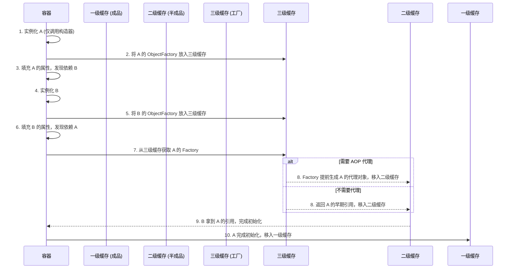

> **版本锚定**：本文档核心原理解析基于 **Spring Framework 6.x / Spring Boot 3.x**（Java 17+ & Jakarta EE 9+ 基线）。跨大版本（如 2.x 到 3.x）的变更已在文中明确标注。
> **阅读指南**：本文档目标是帮助你不仅掌握 Spring"怎么用"，更能洞察"为何这样设计"与"底层如何实现"。我们采用费曼学习法（先类比秒懂，再展开细节）和第一性原理（从最根本的软件需求推导出设计），把 Spring 的核心思想、架构、算法以及微服务扩展讲透。最终，你应能自信地阅读源码、做出架构决策并解决深层次问题。

## 引言：Spring 到底解决了什么问题？

试想你在搭建一个在线商城。业务代码中充斥着对象创建、依赖管理、事务控制、日志记录等非业务操作，它们像藤蔓一样缠绕着核心逻辑。当系统变大，这些藤蔓让代码难以测试、复用和扩展。Spring 的核心使命就是 **"剪断藤蔓"**，通过一套轻量级容器和抽象，让开发者只需专注业务逻辑，其余交予框架。

- **根本问题**：如何在不侵入业务代码的前提下，管理对象的生命周期、依赖装配，并将横切关注点（事务、日志、安全）模块化？
- **Spring 的回答**：一套基于 IoC 容器、DI 和 AOP 的组合拳，并演化出 Boot 与 Cloud 解决应用搭建与分布式系统问题。

---
## 第一部分：第一性原理推导——从零重建 Spring 核心

### 1.1 控制反转（IoC）的本质

- **生活类比**：以前你开 party，要亲自去超市买食物、准备餐具、布置房间（你控制一切）。现在你雇一个活动策划师，你只需告诉他想吃什么、多少人，他负责组织物资并交给你一个准备好的场景——控制权从你反转到了策划师。
- **软件推导**：
  - **传统方式**：对象 A 需要对象 B 时，A 内部直接 `new B()`，A 对 B 的创建和生命周期有完全控制。
  - **问题**：A 和 B 强耦合，更换 B 的实现（如从 `MySQLOrderRepository` 改为 `MongoOrderRepository`）需要修改 A 代码，违背开闭原则。
  - **第一性原理**：对象只应关心使用依赖，而不关心构建依赖。因此需要一个外部实体负责创建与装配对象，这就是 IoC 容器。控制权反转给了容器。
- **概念辨析**：IoC 不等于 DI。IoC 是思想（控制反转），DI（依赖注入）是实现手段之一。Spring 容器通过 DI 将依赖"注入"对象，对象被动接收依赖。

### 1.2 依赖注入（DI）——如何实现解耦

- **生活类比**：你的手机没电了，不需要自己制造充电器，而是通过标准 USB 接口接收"注入"的电流。至于是充电宝、插座还是电脑注入，你都不关心，只要符合接口规范。
- **推导**：我们应该面向接口编程。对象只需声明依赖的接口（如 `OrderRepository`），由容器在运行时将具体实现注入。
- **注入方式**：
  1. **构造器注入**（推荐，必须的依赖）：保证依赖不可变且必须存在。
  2. **Setter 注入**（可选依赖）：适用于非强制依赖。
  3. **字段注入**（方便但不推荐测试）：破坏封装性。

> 🛑 **反模式警告：滥用 `@Autowired` 字段注入**
> 字段注入会导致对象难以进行单元测试（必须依赖容器或反射注入），且会隐藏"依赖过多"的设计腐化问题。**最佳实践**：坚持构造器注入。自 Spring 4.3 起，如果类只有一个构造器，可省略 `@Autowired` 注解。

### 1.3 面向切面编程（AOP）——横切关注点的模块化

- **生活类比**：一栋大厦，每一层都有电力、消防、安保线路。如果每层都自己铺设这些公用设施，混乱且难以统一维护。更好的方式是用纵向的"切面"贯穿各层，集中管理。
- **推导**：横切关注点（事务、日志、安全）散落在各业务方法中，造成代码缠结。我们需要一种机制，在不动业务代码的情况下，将增强逻辑"织入"指定连接点。
- **第一性原理**：利用**代理模式**拦截方法调用。Spring AOP 基于动态代理实现（非编译期织入），牺牲部分功能完整性（如只能拦截 public 方法、自调用失效）换取简单性和与 IoC 容器的深度集成。

---
## 第二部分：核心原理与算法——容器如何工作

### 2.1 Spring 容器的启动流程

想象一个超级工厂（容器）的启动过程：接收设计蓝图（配置）→ 招聘工人修改蓝图 → 制造零件 → 装配依赖 → 功能增强 → 质检出厂。

```mermaid
graph TD
    A[1.加载配置 XML/注解/Java Config] --> B[2.读取 BeanDefinition 到注册表]
    B --> C[3.调用 BeanFactoryPostProcessor<br/>修改/新增 Bean 定义]
    C --> D[4.注册 BeanPostProcessor]
    D --> E[5.实例化所有非懒加载单例 Bean]
    E --> F[6.填充属性 依赖注入]
    F --> G[7.Aware 接口回调]
    G --> H[8.初始化 @PostConstruct / init-method]
    H --> I[9.BeanPostProcessor 后置处理<br/>AOP 代理在此生成]
    I --> J[10.容器就绪 ContextRefreshedEvent]
````

> ⚠️ **注意**：`BeanFactoryPostProcessor` 作用于 **Bean 定义（元数据）** 阶段，而 `BeanPostProcessor` 作用于 **Bean 实例** 阶段。两者绝不可混淆。

**关键伪代码示意（简化的 `getBean` 流程）**：

```java
Object getBean(String name) {
    BeanDefinition bd = registry.get(name);
    if (bd.isSingleton() && singletonCache.containsKey(name)) {
        return singletonCache.get(name); // 已创建返回
    }
    Object instance = createBeanInstance(bd); // 反射实例化
    populateBean(instance, bd); // 注入依赖
    instance = initializeBean(instance, bd); // 初始化 + 后置处理
    singletonCache.put(name, instance);
    return instance;
}
```

### 2.2 Bean 的生命周期与扩展点

将 Bean 视为产品，其"生产流水线"上有众多工位（扩展点）。理解生命周期是诊断问题的关键。

|生命周期阶段|关键扩展点|作用|
|:--|:--|:--|
|**实例化前**|`InstantiationAwareBeanPostProcessor.postProcessBeforeInstantiation`|有机会返回自定义对象（如代理），绕过默认实例化|
|**实例化后（属性注入前）**|`postProcessAfterInstantiation` / `postProcessProperties`|控制属性注入行为，处理 `@Autowired` 等|
|**Aware 回调**|`BeanNameAware`、`ApplicationContextAware` 等|注入容器相关引用|
|**初始化前**|`BeanPostProcessor.postProcessBeforeInitialization`|处理 `@PostConstruct`|
|**初始化**|`InitializingBean.afterPropertiesSet` 或 `init-method`|用户自定义初始化逻辑|
|**初始化后**|`BeanPostProcessor.postProcessAfterInitialization`|**AOP 代理对象生成就在此阶段**|
|**销毁**|`DisposableBean.destroy()` 或 `destroy-method`|资源释放|

> 💡 **第一性原理思考**：为什么需要这么多扩展点？容器只负责通用生命周期，但无法预知所有特殊处理（如 AOP、事务）。开放扩展点让框架具有无限灵活度，这正是**模板方法模式**的体现。多个 `BeanPostProcessor` 的执行顺序可通过实现 `Ordered` 接口控制。

### 2.3 依赖注入与循环依赖的"三级缓存"破局

Spring 的注入是一个递归解析过程。当 A 依赖 B，B 依赖 A 时，Spring 仅能解决**单例 Setter 注入**的循环依赖（构造器注入不行，因为实例化前就需要依赖）。



> 💡 **专家深度穿透：为什么必须是三级？二级不行吗？**  
> 如果只有二级缓存（直接存早期引用），当 A 需要被 AOP 代理时，B 注入的将是 A 的**原始对象**而非**代理对象**，导致 AOP 失效。三级缓存（`ObjectFactory`）的巧妙之处在于**延迟代理对象的创建**，只有在真正发生循环依赖需要早期引用时，才触发代理生成，避免了所有 Bean 都提前生成代理带来的巨大性能浪费。

> 🛑 **Spring 6 官方态度与最佳破局方案**
> 
> 尽管三级缓存能解决单例 Setter 循环依赖，但 Spring 官方在 6.x 文档中明确表示：**循环依赖是设计缺陷的标志，三级缓存只是历史妥协**。
> 
> **重要变更**：自 **Spring Boot 2.6 起**，默认将 `spring.main.allow-circular-references` 设为 `false`，即**默认禁止循环依赖**。启动时若检测到循环依赖将直接报错。
> 
> **专家级破局方案**：不要去修改 `spring.main.allow-circular-references=true`，这会掩盖设计腐化。官方推荐的最佳实践是在注入点使用 **`@Lazy` 注解**（如 `@Autowired @Lazy private ServiceB b;`）。这会注入一个代理对象，只有在真正调用 `b.method()` 时才会去容器获取真实 Bean，从而在架构层面优雅地打破初始化死锁。更根本的方案是重构代码，提取公共逻辑到第三个 Bean 中，消除循环依赖。

### 2.4 AOP 代理的选择与实现

AOP 的核心是"代理对象替换"。

| 比较维度          | JDK 动态代理                                                                                              | CGLIB 代理                |
| :------------ | :---------------------------------------------------------------------------------------------------- | :---------------------- |
| **机制**        | 基于接口，利用 `Proxy.newProxyInstance` 生成实现相同接口的代理类                                                         | 基于继承，直接生成目标类的子类         |
| **优点**        | 无需引入第三方库，创建快                                                                                          | 可代理未实现接口的类，运行时性能较高      |
| **缺点**        | 目标对象必须实现接口                                                                                            | `final` 方法和类无法代理；需要额外依赖 |
| **Spring 选择** | **Spring Boot 2.0+ / 3.x** 默认将 `spring.aop.proxy-target-class` 设为 `true`，强制使用 CGLIB，以避免接口代理带来的类型转换陷阱。 | 可通过配置强制 CGLIB。          |

> 🛑 **反模式警告：AOP 代理失效的隐蔽场景**
> 
> 1. **自调用失效**：同类内部方法调用（`this.method()`）会绕过代理。解法：拆分到不同类，或自我注入，或使用 `AopContext.currentProxy()`。
> 2. **非 Public 方法**：JDK 代理必须是 Public；CGLIB 代理允许 Protected，但**绝对不支持 Private 和 Final 方法**。
> 3. **滥用 AOP**：每次代理方法调用都有反射和拦截链开销（微秒级），不可在高频执行的小方法上堆砌过多切面。
> 4. **异常被切面吞掉**：如果自定义切面在 `@Around` 通知中 `catch` 了异常且没有重新抛出，外层的事务切面（`TransactionInterceptor`）将感知不到异常，导致**事务不会回滚**。这是一个极其隐蔽的"切面顺序 + 异常吞噬"组合陷阱。**最佳实践**：切面中若捕获异常进行日志记录等操作后，务必重新抛出（`throw ex`），或使用 `@AfterThrowing` 替代。

### 2.5 事务拦截器的原理与边界

声明式事务 `@Transactional` 是 AOP 的经典应用。

```java
// 事务拦截器（简化伪代码）
invoke(MethodInvocation invocation) {
    TransactionInfo txInfo = createTransactionIfNecessary(tm, attribute, name);
    try {
        Object retVal = invocation.proceed(); // 执行业务方法
        commitTransactionAfterReturning(txInfo);
        return retVal;
    } catch (Throwable ex) {
        completeTransactionAfterThrowing(txInfo, ex); // 判断是否回滚
        throw ex;
    }
}
```

- **传播行为**：`REQUIRES_NEW` 会挂起当前事务，新起独立事务。底层通过 `TransactionSynchronizationManager` 将数据库连接绑定到当前线程（ThreadLocal）。
- **只读优化**：提示数据库该事务不包含更新操作，在 MySQL InnoDB 等支持该优化的引擎下，可跳过部分锁机制获得性能收益。

> 🛑 **反模式警告：`@Transactional` 意外失效的边界**
> 
> 1. **异常被吞**：业务代码 `try-catch` 捕获了异常且未抛出，事务拦截器感知不到异常，不会回滚。
> 2. **引擎不支持**：如 MySQL 使用了 MyISAM 引擎（不支持事务）。
> 3. **rollbackFor 配置错误**：Spring 事务默认仅对 **Unchecked Exception（`RuntimeException` 及其子类）和 `Error`** 进行回滚。对 **Checked Exception（受检异常，如 `IOException`、`SQLException`）** 默认**不回滚**。若期望受检异常也触发回滚，必须显式指定 `@Transactional(rollbackFor = Exception.class)`。

> 🛑 **专家级排障：`REQUIRES_NEW` 引发的连接池死锁**
> 
> **致命机制**：当外层事务方法使用 `REQUIRES_NEW` 传播行为调用内层事务时，外层事务被"挂起"但**并不释放数据库连接**。内层新事务需要从连接池**申请一个新的连接**。
> 
> **死锁场景**：假设 HikariCP 连接池大小为 10，当 10 个并发请求同时执行到外层事务并调用 `REQUIRES_NEW` 内层方法时，10 个连接全部被外层事务占用且挂起，内层事务申请新连接时将**无限等待**，形成应用级线程死锁——整个服务卡死。
> 
> **架构决策**：
> 
> - **首选方案**：避免在事务方法中使用 `REQUIRES_NEW`。若业务语义是"主事务失败不影响子操作"，请使用 `@TransactionalEventListener(phase = AFTER_COMMIT)` 在主事务提交后异步执行，或直接通过 MQ 消息解耦。
> - **次选方案**：若必须使用 `REQUIRES_NEW`，请确保连接池最大连接数 **≥ 2 × 最大并发线程数**，并设置合理的连接获取超时时间（`spring.datasource.hikari.connection-timeout`）以快速失败而非死锁。

### 2.6 Spring MVC 请求处理流程

将请求比喻为快递，`DispatcherServlet` 是中央分拣中心。

```mermaid
graph LR
    A[HTTP 请求] --> B(DispatcherServlet)
    B --> C{HandlerMapping}
    C -->|返回| D[HandlerExecutionChain<br/>Handler + Interceptors]
    D --> E{HandlerAdapter}
    E -->|调用| F[Controller 处理器]
    F -->|正常返回| G[ModelAndView / HttpMessageConverter]
    F -->|抛出异常| EX{HandlerExceptionResolver<br/>异常解析器}
    EX -->|@ExceptionHandler 处理| G
    EX -->|无法处理| ERR[默认错误页 / RFC 7807 ProblemDetail]
    G --> H{ViewResolver}
    H --> I[视图渲染]
    I --> J[HTTP 响应]
    ERR --> J
```

- **核心扩展点**：拦截器（`HandlerInterceptor`）可以在处理前、处理后、完成后来做横切操作，其实现类似 AOP，但更专精于 Web 层（可访问 `HttpServletRequest`/`Response`，粒度在 Handler 级别）。
- **异常处理链**：当 Controller 抛出异常时，`DispatcherServlet` 将异常委托给 `HandlerExceptionResolver` 链。其中 `ExceptionHandlerExceptionResolver` 负责解析 `@ControllerAdvice` + `@ExceptionHandler` 标注的方法，`ResponseStatusExceptionResolver` 处理 `@ResponseStatus` 注解，`DefaultHandlerExceptionResolver` 处理 Spring MVC 内部异常（如 `MethodArgumentNotValidException`）。

---
## 第三部分：架构设计剖析——模式与分层

### 3.1 分层架构设计

Spring 自身体现了优秀的分层架构，各层通过接口隔离，下层不依赖上层（如核心容器完全不知道 Web 层的存在）：

- **核心容器层**：`spring-core`、`spring-beans`、`spring-context`，提供 IoC 和 DI。
- **AOP 与数据层**：`spring-aop`、`spring-tx`、`spring-orm`。
- **Web 层**：`spring-web`、`spring-webmvc`。
- **Boot 与 Cloud 层**：自动配置与分布式组件。

### 3.2 关键设计模式运用

理解模式，才能读懂源码的"为什么这样写"。

|设计模式|Spring 中的运用|架构获益|
|:--|:--|:--|
|**模板方法**|`AbstractApplicationContext.refresh()` 定义骨架，子类实现特定步骤|统一流程，允许定制|
|**策略模式**|`InstantiationStrategy` 选择实例化方式；`HandlerMapping` 选择处理器|运行时切换算法|
|**观察者模式**|`ApplicationEvent` + `ApplicationListener` / `@EventListener`。**源码真相**：`SimpleApplicationEventMulticaster` 的默认 `TaskExecutor` 为 `null`，这意味着**Spring 6 默认的事件发布依然是同步阻塞的**（在当前线程执行）。若要异步，必须手动定义名为 `applicationEventMulticaster` 的 Bean 并注入异步 `TaskExecutor`，或在 `@EventListener` 方法上叠加 `@Async` 注解。虚拟线程特性（Boot 3.2+）**不会**自动接管事件多播器。|解耦容器内通信|
|**工厂模式**|`BeanFactory` 及各种 `FactoryBean`|复杂对象创建封装|
|**代理模式**|AOP 实现，事务、异步调用等|无侵入增强|
|**适配器模式**|`HandlerAdapter` 适配不同类型的 Handler（处理器），包括 `Controller` 接口实现、`@RequestMapping` 标注方法等多种处理器形式|统一处理入口|
|**装饰器模式**|`TransactionAwareCacheDecorator` 为缓存添加事务感知|动态附加职责|
|**建造者模式**|`SpringApplicationBuilder` 逐步构建应用|逐步构造复杂对象|

> 💡 **为什么用这么多模式？** 为了遵循开闭原则，使框架在面对无限可能的应用场景时，自身代码保持稳定，而扩展可以通过替换策略或添加监听器实现。

---
## 第四部分：Spring Boot 3.x 与架构演进（核心重构）

> 🛑 **版本警告**：Spring Boot 3.0 / Spring Framework 6.0 是 Spring 历史上最具破坏性的更新。基线提升至 **Java 17**，并全面迁移至 **Jakarta EE 9+**（`javax.*` 包名全面替换为 `jakarta.*`）。

### 4.1 自动配置的底层机制

- **加载路径变更**：Spring Boot 2.7 之前读取 `META-INF/spring.factories`。**从 2.7 开始，并在 3.x 中强制要求**，自动配置类必须声明在 `META-INF/spring/org.springframework.boot.autoconfigure.AutoConfiguration.imports` 文件中。
- **条件装配**：`@ConditionalOnClass`、`@ConditionalOnMissingBean` 等注解实现了"约定大于配置"。`Condition` 接口的 `matches` 方法通过反射、类路径检查等手段决定是否装配。

### 4.2 起步依赖（Starter）原理

一个 Starter 本质上是一个空项目，聚合了相关库的依赖和自动配置（如 `spring-boot-starter-web` 引入 MVC、Tomcat、Jackson）。它解决的是依赖版本冲突和传递依赖问题，是 Maven/Gradle 依赖管理机制的巧妙应用。

### 4.3 AOT 与 GraalVM Native Image（专家级架构本质）

Spring Boot 3.x 引入了 **AOT (Ahead-Of-Time) 编译**，彻底改变了 Spring 的运行范式，使其能够编译为 **GraalVM Native Image**。

- **传统 JVM 模式的痛点**：启动时需要扫描类路径（反射）、解析注解、动态生成 CGLIB 代理。这在 Serverless 和容器化场景下启动太慢、内存太大。
- **AOT 架构本质**：
    1. **编译期处理**：在 `mvn package` 阶段，Spring AOT 引擎启动一个特殊的 ApplicationContext，执行 Bean 定义解析、条件评估。
    2. **代码生成**：将原本在运行时通过反射和动态代理完成的工作，**直接生成 Java 源代码**（如 `@Configuration` 类被转换为普通的 `BeanDefinition` 注册代码）。
    3. **Native Image 编译**：生成的代码与业务代码一起，通过 GraalVM 编译为机器码。
- **Trade-off（权衡）**：
    - **优势**：启动极快（毫秒级），内存 footprint 极小，适合 Serverless/K8s 弹性伸缩。
    - **局限性**：构建时间长；**不支持运行时的动态类加载和反射修改**；部分依赖动态代理的老旧第三方库无法兼容（需要编写 `RuntimeHints` 提示文件）。

### 4.4 虚拟线程（Virtual Threads）支持

Spring Boot 3.2+ 引入了对 Java 21 虚拟线程的一等公民支持。只需配置 `spring.threads.virtual.enabled=true`，Tomcat、Jetty 以及 Spring 内部的 `@Async` 任务调度器将全部切换为虚拟线程。

- **架构意义**：以同步的编码风格，获得异步非阻塞 I/O 的吞吐量，彻底解决传统线程池在 I/O 密集型场景下的瓶颈。

> 🛑 **专家级排障：虚拟线程/异步与 `ThreadLocal` 事务的"死亡组合"**
> 
> Spring 的事务管理强依赖 `TransactionSynchronizationManager`（底层是 `ThreadLocal`）来绑定当前线程与数据库连接。在传统平台线程模型下，一个请求从头到尾在同一线程执行，事务上下文不会丢失。
> 
> **致命陷阱**：如果在带有 `@Transactional` 的方法内部，使用了异步编程（如 `CompletableFuture.supplyAsync`、WebFlux 响应式流的 `subscribeOn`、`Schedulers.boundedElastic()`，或手动切换了虚拟线程/线程池），**代码执行所在的线程会发生切换，导致 `ThreadLocal` 中的事务上下文（数据库连接引用）丢失**。
> 
> **后果**：
> 
> - 后续 SQL 执行将**脱离事务控制**（连接不在事务中）。
> - 抛出 `No EntityManager bound to thread` 或 `No Hibernate Session bound to thread` 异常。
> - 数据不一致但无任何报错（最危险的情况）。
> 
> **架构决策**：
> 
> - **严禁**在 `@Transactional` 事务方法内部进行跨线程的异步调用。
> - 若必须异步，请将事务边界缩小：在事务方法外发起异步调用，让异步方法自己声明 `@Transactional`。
> - 对于必须传递上下文的场景，使用 Spring 提供的 `TaskDecorator` 接口在线程切换时手动拷贝 `ThreadLocal` 上下文，或使用 `TransmittableThreadLocal`（阿里开源的 TTL）替代原生 `ThreadLocal`。

### 4.5 破坏性更新警告：RFC 7807 ProblemDetail（Web 异常响应重构）

Spring Boot 3.0 默认开启了 `spring.mvc.problemdetails.enabled=true`，这是从 2.x 升级时**最具破坏性的 Web 层变更**。

- **变更前（Boot 2.x）**：异常响应为 Spring Boot 自定义的简单 Map 结构，如 `{"timestamp":"...","status":500,"error":"Internal Server Error","message":"...","path":"..."}`。
- **变更后（Boot 3.x）**：异常响应遵循 **RFC 7807** 规范，返回 `application/problem+json` 媒体类型的 `ProblemDetail` 结构：

```json
{
  "type": "about:blank",
  "title": "Internal Server Error",
  "status": 500,
  "detail": "具体异常信息",
  "instance": "/api/orders/123"
}
```

- **升级影响**：大量从 2.x 升级到 3.x 的项目，前端若按旧的 `message`、`error` 字段解析异常响应将**全部崩溃**。
- **迁移方案**：
    1. **快速回退**：配置 `spring.mvc.problemdetails.enabled=false` 恢复旧行为（不推荐长期使用）。
    2. **推荐方案**：前端统一适配 RFC 7807 结构，或使用 `@ControllerAdvice` + `@ExceptionHandler` 自定义统一异常响应格式，完全接管默认行为。

### 4.6 HTTP 客户端演进：`RestClient` 的引入（Spring 6.1 / Boot 3.2）

Spring 6.1（Spring Boot 3.2）引入了全新的同步 HTTP 客户端 **`RestClient`**，这是官方目前**最强烈推荐**的 `RestTemplate` 替代方案。

|客户端|定位|编程模型|推荐度|
|:--|:--|:--|:--|
|**`RestTemplate`**|传统同步客户端|模板方法模式|⚠️ 维护模式，不再增加新功能|
|**`WebClient`**|响应式客户端|Flux/Mono 响应式流|✅ 响应式场景首选|
|**`RestClient`** (6.1+)|现代同步客户端|流式 API（类似 WebClient 但同步）|✅✅ **同步场景最强烈推荐**|
|**`HTTP Interface`**|声明式客户端|接口 + 注解（类似 OpenFeign）|✅ 声明式场景首选|

- **`RestClient` 核心优势**：提供了类似 `WebClient` 的流式 API，但无需引入响应式编程（Reactor），学习曲线平缓：

```java
RestClient restClient = RestClient.create();

// 流式 API，优雅且类型安全
String result = restClient.get()
    .uri("/api/users/{id}", 1)
    .accept(MediaType.APPLICATION_JSON)
    .retrieve()
    .body(String.class);

// POST 请求
User user = restClient.post()
    .uri("/api/users")
    .contentType(MediaType.APPLICATION_JSON)
    .body(new User("John"))
    .retrieve()
    .body(User.class);
```

- **架构决策**：新项目优先使用 `RestClient`（同步）或 `WebClient`（响应式），老项目可在维护期逐步从 `RestTemplate` 迁移。

### 4.7 Spring Cloud 核心组件原理

Spring Cloud 利用 Boot 的自动配置，将分布式系统的常见模式包装为简单注解。各组件抽象出可插拔接口（如 `DiscoveryClient`），底层实现可自由替换。

- **服务发现**：Eureka (AP系统，已停更) / Nacos / Consul。
- **配置中心**：Spring Cloud Config / Nacos Config（支持 `@RefreshScope` 动态刷新）。
- **客户端负载均衡**：Spring Cloud LoadBalancer（**注意：Ribbon 已移除**）。
- **声明式 HTTP**：OpenFeign（JDK 动态代理 + 注解解析，集成 Resilience4j 断路器）。

---
## 第五部分：通往专家级——排障、调优与可观测性

### 5.1 原型（Prototype）Bean 的生命周期陷阱

> 🛑 **反模式警告：在单例 Bean 中注入原型 Bean**
> 
> - **现象**：原型 Bean 只被创建了一次，变成了单例效果。
> - **本质**：容器只管理原型 Bean 的初始化和注入，之后不负责销毁。单例 Bean 初始化后，其引用的原型 Bean 实例被固化。
> - **修复**：使用 `@Lookup` 注解，或注入 `ObjectFactory<T>` / `Provider<T>` 延迟获取。长时间存活的原型 Bean 若持有资源需手动释放。

> 🛑 **专家级排障：Prototype Bean + AOP 代理的隐蔽陷阱**
> 
> 当 Prototype Bean 同时被 AOP 增强（如 `@Transactional`、自定义切面）时，会出现两个额外问题：
> 
> 1. **频繁创建代理对象的性能损耗**：每次通过 `ObjectFactory` 或 `@Lookup` 获取 Prototype Bean 时，Spring 不仅需要创建新的目标对象，还需要为其**动态生成新的 CGLIB 代理对象**。在高并发场景下，频繁的代理对象创建会带来显著的 GC 压力和 CPU 开销。
> 2. **`@Lookup` 与 AOP 的类型匹配问题**：在单例 Bean 中使用 `@Lookup` 方法获取 Prototype Bean 时，`@Lookup` 方法的返回类型**必须与 AOP 代理类型兼容**。若 Prototype Bean 实现了接口且 Spring 使用 JDK 动态代理，`@Lookup` 方法的返回类型必须声明为**接口类型**而非具体实现类，否则运行时将抛出 `BeanNotOfRequiredTypeException`。Spring Boot 3.x 默认使用 CGLIB 代理，此问题较少出现，但在显式配置 `proxyTargetClass=false` 时仍需注意。
> 
> **架构决策**：若 Prototype Bean 需要 AOP 增强且创建频率较高，请重新审视设计——考虑使用对象池（如 Apache Commons Pool）或重构为 `@RequestScope` / `@SessionScope`。

### 5.2 性能调优：从"魔法参数"到"瓶颈推导"

拒绝盲目调优，专家级调优必须基于数据推导：

1. **启动慢排查推导**：
    
    - **工具链**：不要靠猜。引入 `spring-boot-startup-analyzer` 第三方工具，或使用 Spring 6 的 `ApplicationStartup` 接口（如 `BufferingApplicationStartup`），在应用启动完成后通过自定义 `ApplicationRunner` 提取启动步骤的 JSON 快照，或使用 Spring Boot Admin 等第三方可视化工具分析启动耗时。**注意**：Spring Boot Actuator **未内置** Startup 端点，`ApplicationStartup` 数据存储在内存中需自行提取。
    - **优化动作**：使用 `@SpringBootApplication(exclude=...)` 排除无关配置；对于非首屏必须的 Bean，使用 `@Lazy` 延迟初始化（需评估首个请求延迟影响）。
2. **类路径扫描优化**：
    
    - 引入 `spring-context-indexer` 依赖（编译期生效），生成 `META-INF/spring.components` 索引，将启动时的 O(N) 目录扫描降为 O(1) 的索引读取。
3. **高并发下的内存抖动**：
    
    - 避免在请求作用域（`@RequestScope`）中创建重型对象。使用 JFR (Java Flight Recorder) 抓取 `ObjectAllocation` 事件，定位高频 GC 的元凶。单例 Bean 中的 Map/List 集合需警惕数据堆积，大容量缓存应使用 `Caffeine`。

### 5.3 生产就绪度：可观测性（Observability）架构

Spring Boot 3.x 彻底重构了可观测性，基于 **Micrometer Observation API** 统一了 Metrics（指标）、Tracing（链路追踪）和 Logging（日志）。

- **架构本质**：在 Spring MVC、WebClient、RestTemplate 等核心组件中埋入了 `Observation` 切面。
- **生产配置指引**：
    - 引入 `micrometer-tracing-bridge-brave` 和 `zipkin-reporter-brave`。
    - 配置 `management.tracing.sampling.probability=1.0`（开发环境全量采样，**生产环境务必调整为 0.1 或更低，防止追踪数据压垮存储**）。

### 5.4 阅读源码的方法指引

达到专家级，必须读源码。按线索切入：

1. **启动流程**：`SpringApplication.run()` → `refresh()`。
2. **Bean 生命周期**：`getBean()` → `doGetBean` → `createBean` → `doCreateBean`。
3. **AOP 代理**：`AbstractAutoProxyCreator` → `postProcessAfterInitialization` → `wrapIfNecessary`。
4. **事务拦截**：`@EnableTransactionManagement` → `TransactionInterceptor.invoke`。
5. **自动配置**：`@SpringBootApplication` → `AutoConfigurationImportSelector` → 具体配置类（如 `DataSourceAutoConfiguration`）。

### 5.5 专家面试题拆解精选

**Q1：Spring 如何解决循环依赖？为什么必须三级缓存？**

- **拆解**：不能仅回答三级缓存。重点在于 AOP 代理创建时机——三级缓存存的是 `ObjectFactory`，以便在注入时能按需生成早期代理引用，而不必等完整初始化。若只有二级缓存，会导致注入原始对象而非代理对象，破坏 AOP 语义。结合 `DefaultSingletonBeanRegistry` 源码解释。同时应提及 Spring Boot 2.6+ 默认禁止循环依赖，以及官方推荐的 `@Lazy` 破局方案。

**Q2：`@Transactional` 失效场景有哪些？原理是什么？**

- **拆解**：至少六种：1. 非 public 方法（CGLIB 限制）；2. 数据库引擎不支持；3. 同类内部调用（绕过代理）；4. 捕获异常未正确抛出（包括自定义切面吞掉异常）；5. `rollbackFor` 配置错误（默认仅回滚 `RuntimeException` 和 `Error`，不回滚 Checked Exception）；6. `REQUIRES_NEW` 连接池死锁导致的隐性失效。需结合代理和事务拦截器实现原理解释。

**Q3：Spring Boot 3.x 的 AOT 机制解决了什么根本问题？有什么代价？**

- **拆解**：解决了 Spring 强依赖运行时反射和动态字节码生成导致的"启动重、内存大"问题。代价是丧失了部分动态性（如无法在运行时动态注册 Bean），且构建链路变长，需要处理第三方库的反射元数据提示（RuntimeHints）。

**Q4：Spring 容器启动过程？**

- **拆解**：顺着 `refresh()` 的核心步骤回答：准备环境、加载 BeanDefinition、执行 BFPP、注册 BPP、实例化所有非懒单例 Bean、发布 `ContextRefreshedEvent`。要体现对扩展点执行顺序的深刻理解。

**Q5：Spring Boot 3.x 升级有哪些关键破坏性变更？**

- **拆解**：1. `javax.*` → `jakarta.*` 包名迁移；2. 自动配置注册路径从 `spring.factories` 改为 `AutoConfiguration.imports`；3. RFC 7807 ProblemDetail 默认开启，异常响应结构变更；4. 默认禁止循环依赖；5. 新增 `RestClient` 替代 `RestTemplate`。需结合具体迁移经验阐述。

---
## 结语

Spring 专家的标志不是记住所有 API，而是能从**容器、代理、扩展点、AOT 编译**这些基本原理出发，推导出上层功能的行为，并快速定位问题。本文档通过第一性原理为你构建了这样的骨架。下一步，请打开源码，带着本节中的问题去跟踪验证，你将会发现 Spring 的设计之美——那些看似繁琐的流程，正是应对万千变化不变的"道"。

**最佳的学习路径**：类比理解 → 源码验证（带着断点看 `refresh()`） → 尝试自己实现一个简易的 IoC/AOP 容器 → 拥抱 Spring Boot 3.x 的 Native Image 范式。如此反复，专家不远。